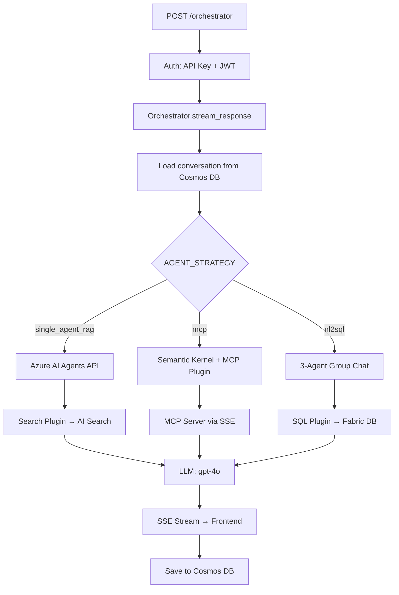
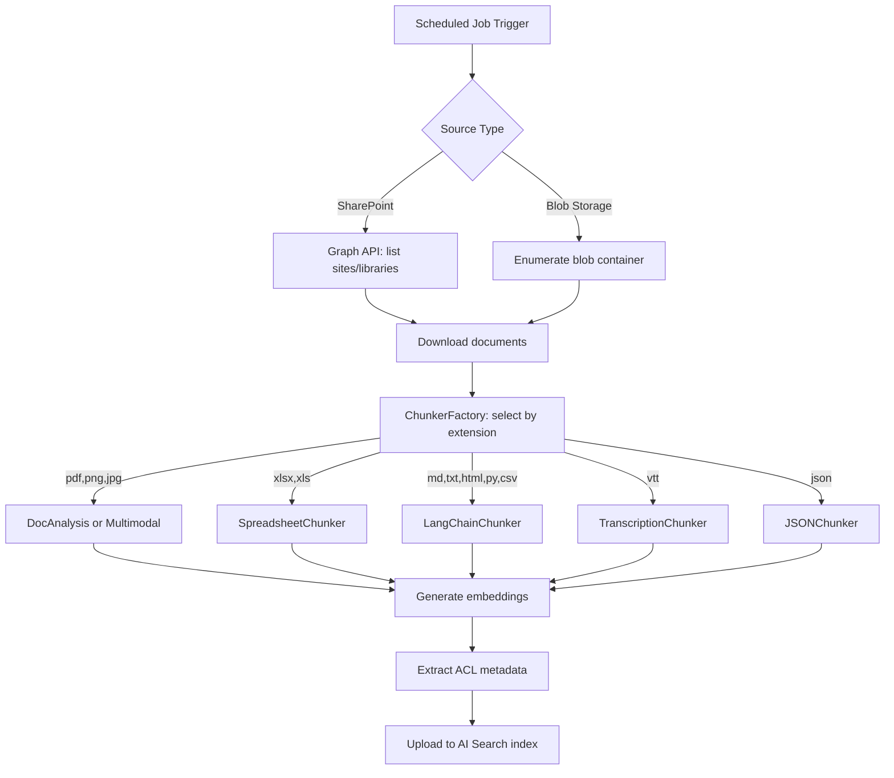
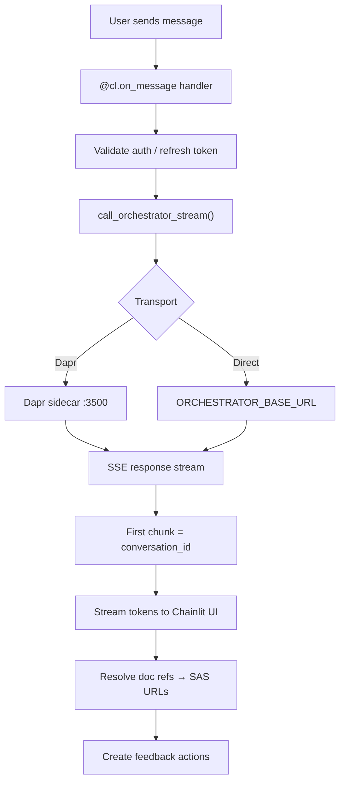
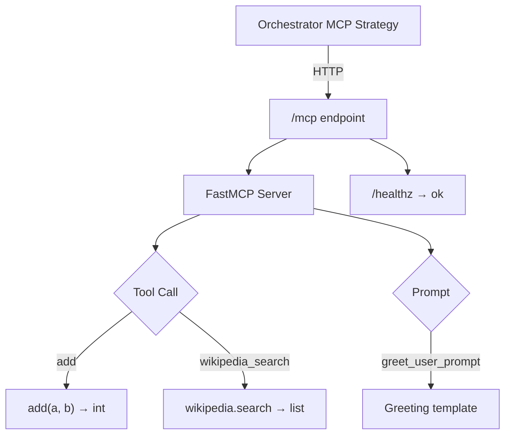

# GPT-RAG — Custom Azure Apps & Identities

> All apps, identities, and registrations created by `azd provision` + `azd deploy`
> **Scope:** Single Agent + SharePoint (initial deployment)

---

## 1. Container Apps (Application Workloads)

GPT-RAG deploys **4 Container Apps** into a shared Container Apps Environment. Each runs as a Python service on port 80 (internal), behind HTTPS ingress. All use the `main` workload profile (D4 SKU, 0–1 instances).

### 1.1 Orchestrator

| Property | Value |
|----------|-------|
| **Service name** | `orchestrator` |
| **Canonical name** | `ORCHESTRATOR_APP` |
| **Repository** | github.com/Azure/gpt-rag-orchestrator (v2.4.1) |
| **Ingress** | External (HTTPS, TLS enforced) |
| **Replicas** | min: 1, max: 1 |
| **Resources** | 0.5 vCPU, 1 GiB RAM |
| **Dapr** | Enabled (appId: `orchestrator`, port 80, HTTP) |
| **Purpose** | Receives queries from the Frontend, loads system prompts from Cosmos DB, executes hybrid search against AI Search with user token propagation, calls OpenAI for grounded answers, saves conversation history |

**What it connects to:**

| Service | How | Why |
|---------|-----|-----|
| App Configuration | Managed identity | Discover all service endpoints at startup |
| Azure OpenAI | Managed identity | Chat completions (gpt-4o/gpt-5-mini) |
| AI Search | Managed identity + user token header | Hybrid search with permission filtering |
| Cosmos DB | Managed identity | Read prompts, read/write conversations |
| Key Vault | Managed identity | Read secrets |
| Application Insights | Connection string | Telemetry, tracing |
| Blob Storage | Managed identity | Read document blobs |

---

### 1.2 Frontend (Web UI)

| Property | Value |
|----------|-------|
| **Service name** | `frontend` |
| **Canonical name** | `FRONTEND_APP` |
| **Repository** | github.com/Azure/gpt-rag-ui (v2.2.1) |
| **Ingress** | External (HTTPS, TLS enforced) |
| **Replicas** | min: 1, max: 1 |
| **Resources** | 0.5 vCPU, 1 GiB RAM |
| **Dapr** | Enabled (appId: `frontend`, port 80, HTTP) |
| **Purpose** | User-facing chat interface. Handles Entra ID authentication, forwards queries + user tokens to the Orchestrator, displays streaming responses, collects user feedback |

**What it connects to:**

| Service | How | Why |
|---------|-----|-----|
| App Configuration | Managed identity | Discover orchestrator URL and settings |
| Orchestrator | HTTPS (internal via Dapr or direct) | Forward user queries + tokens |
| Blob Storage | Managed identity | Read/serve uploaded files, SAS token generation |
| Key Vault | Managed identity | Read secrets (e.g. API keys if enabled) |
| Application Insights | Connection string | User interaction telemetry |

**Important:** The Frontend has **no direct access** to OpenAI, AI Search, or Cosmos DB. It only talks to the Orchestrator.

---

### 1.3 Ingestion (Data Processing)

| Property | Value |
|----------|-------|
| **Service name** | `dataingest` |
| **Canonical name** | `DATA_INGEST_APP` |
| **Repository** | github.com/Azure/gpt-rag-ingestion (v2.2.2) |
| **Ingress** | External (HTTPS, TLS enforced) |
| **Replicas** | min: 1, max: 1 |
| **Resources** | 0.5 vCPU, 1 GiB RAM |
| **Dapr** | Enabled (appId: `dataingest`, port 80, HTTP) |
| **Purpose** | Connects to SharePoint via Graph API, extracts documents, chunks text, generates embeddings, pushes chunks + vectors + ACL metadata to the AI Search index |

**What it connects to:**

| Service | How | Why |
|---------|-----|-----|
| App Configuration | Managed identity | Discover all service endpoints |
| SharePoint Online | Entra app registration (client credentials) | Read documents and permissions via Graph API |
| Azure OpenAI | Managed identity | Generate embeddings (text-embedding-3-large) |
| AI Search | Managed identity | Write chunks + vectors + ACLs to the index |
| Cosmos DB | Managed identity | Read data source configuration |
| Blob Storage | Managed identity | Store extracted documents and images |
| Key Vault | Managed identity | Read secrets |

---

### 1.4 MCP Server (not used in initial scope)

| Property | Value |
|----------|-------|
| **Service name** | `mcp` |
| **Canonical name** | `MCP_APP` |
| **Repository** | github.com/Azure/gpt-rag-mcp (v0.3.5) |
| **Ingress** | External (HTTPS, TLS enforced) |
| **Replicas** | min: 1, max: 1 |
| **Resources** | 0.5 vCPU, 1 GiB RAM |
| **Dapr** | Enabled (appId: `mcp`, port 80, HTTP) |
| **Purpose** | Model Context Protocol server for external tool integration. Not used in Single Agent strategy |

**Note:** Deployed by default (`deployMcp: true`) but inactive until you switch to MCP strategy. Has the broadest RBAC (includes `StorageQueueDataContributor` for async tool processing).

---

## 2. User-Assigned Managed Identities

GPT-RAG creates **8 user-assigned managed identities (UAIs)**. Each identity is scoped to a specific resource or app, following least-privilege principles.

| # | Identity Name Pattern | Assigned To | Purpose |
|---|----------------------|-------------|---------|
| 1 | `id-ca-{token}-orchestrator` | Orchestrator Container App | Service-to-service auth for orchestrator |
| 2 | `id-ca-{token}-frontend` | Frontend Container App | Service-to-service auth for frontend |
| 3 | `id-ca-{token}-dataingest` | Ingestion Container App | Service-to-service auth for ingestion |
| 4 | `id-ca-{token}-mcp` | MCP Container App | Service-to-service auth for MCP server |
| 5 | `id-{cosmosAccountName}` | Cosmos DB account | Cosmos DB data-plane operations |
| 6 | `id-{searchServiceName}` | AI Search service | Search service operations |
| 7 | `id-{containerEnvName}` | Container Apps Environment | Environment-level operations |
| 8 | `id-{acrName}` | Container Registry | ACR image management |

**Additionally created (for infrastructure):**
| # | Identity | Purpose |
|---|----------|---------|
| 9 | `id-{aiFoundryAccountName}` | AI Foundry account operations |
| 10 | `id-{vmName}` (if VM deployed) | Jumpbox VM for admin access |

**How apps use their identity:** Each Container App receives its UAI's `clientId` as the `AZURE_CLIENT_ID` environment variable. Combined with `AZURE_TENANT_ID`, the app SDK uses `DefaultAzureCredential` to authenticate.

---

## 3. RBAC Role Assignments per App

### 3.1 Container App Roles

| RBAC Role | Orch | Front | Ingest | MCP | Purpose |
|-----------|:----:|:-----:|:------:|:---:|---------|
| AppConfigurationDataReader | ✅ | ✅ | ✅ | ✅ | Read App Configuration |
| CognitiveServicesUser | ✅ | — | ✅ | ✅ | AI Foundry services |
| CognitiveServicesOpenAIUser | ✅ | — | ✅ | ✅ | OpenAI model calls |
| CosmosDBBuiltInDataContributor | ✅ | — | ✅ | ✅ | Cosmos DB read/write |
| SearchIndexDataReader | ✅ | — | — | — | Query search index |
| SearchIndexDataContributor | — | — | ✅ | ✅ | Write to search index |
| StorageBlobDataReader | ✅ | ✅ | — | — | Read blobs |
| StorageBlobDataContributor | — | — | ✅ | ✅ | Write blobs |
| StorageBlobDelegator | — | ✅ | — | — | Generate SAS tokens |
| StorageQueueDataContributor | — | — | — | ✅ | Async queue processing |
| KeyVaultSecretsUser | ✅ | ✅ | ✅ | ✅ | Read secrets |
| AcrPull | ✅ | ✅ | ✅ | ✅ | Pull container images |

### 3.2 Deployer Principal Roles (during `azd provision`)

The user running `azd provision` receives these roles temporarily:

| Role | Purpose |
|------|---------|
| CosmosDBBuiltInDataContributor | Populate Cosmos DB containers |
| SearchServiceContributor | Manage search service |
| SearchIndexDataContributor | Create and populate indexes |
| KeyVaultContributor | Manage Key Vault |
| KeyVaultSecretsOfficer | Inject secrets |
| StorageBlobDataContributor | Upload assets |
| CognitiveServicesContributor | Configure AI services |
| CognitiveServicesOpenAIUser | Test model deployments |
| AppConfigurationDataOwner | Populate App Configuration |
| AcrPush | Push container images |
| ContainerAppsContributor | Manage Container Apps |
| ManagedIdentityOperator | Assign managed identities |

### 3.3 Infrastructure Identity Roles

| Identity | Role | Target Resource |
|----------|------|-----------------|
| AI Search UAI | StorageBlobDataReader | Storage Account |
| AI Search UAI | SearchIndexDataReader | AI Search (self) |
| AI Search UAI | SearchServiceContributor | AI Search (self) |
| Container Env UAI | StorageBlobDataReader | Storage Account |

---

## 4. Entra ID App Registration (Manual Prerequisite)

GPT-RAG requires **one Entra ID app registration** that you create **before** deployment. This is the only manual identity step.

### 4.1 Purpose

The app registration serves two functions:
1. **User authentication** — End users sign in to the Frontend via Entra ID
2. **SharePoint access** — The Ingestion component reads documents via Microsoft Graph API

### 4.2 What You Need to Create

| Property | Value |
|----------|-------|
| **Name** | e.g. `gpt-rag-{environment}` |
| **Type** | Single-tenant (your org only) |
| **Redirect URI** | `https://{frontend-app-url}/.auth/login/aad/callback` |
| **Client secret** | Yes — stored in Key Vault after provisioning |

### 4.3 API Permissions Required

| API | Permission | Type | Why |
|-----|-----------|------|-----|
| Microsoft Graph | `User.Read` | Delegated | Basic user profile for authentication |
| Microsoft Graph | `Sites.Read.All` | Application | Read SharePoint site content |
| Microsoft Graph | `Files.Read.All` | Application | Read files from SharePoint document libraries |
| Microsoft Graph | `GroupMember.Read.All` | Application | Read group memberships for ACL synchronization |

**Admin consent required:** Yes — an Azure AD admin must grant consent for the Application permissions.

### 4.4 How It's Used at Runtime

| Component | Uses App Registration For |
|-----------|--------------------------|
| Frontend | Entra ID interactive login (OAuth2 / OIDC) |
| Ingestion | Client credentials flow to read SharePoint via Graph API |
| Orchestrator | Does NOT use the app registration (uses managed identity only) |

### 4.5 Secrets Management

| Secret | Stored In | Populated By |
|--------|-----------|-------------|
| Client ID | App Configuration (`AZURE_CLIENT_ID` for auth) | postprovision script |
| Client Secret | Key Vault | Manual or postprovision script |
| Tenant ID | App Configuration + Container App env var | Bicep (automatic) |

---

## 5. Azure OpenAI Model Deployments

Two model deployments are created inside the AI Foundry account:

### 5.1 Chat Model

| Property | Value |
|----------|-------|
| **Deployment name** | `chat` |
| **Canonical name** | `CHAT_DEPLOYMENT_NAME` |
| **Model** | `gpt-5-mini` (configurable in `main.parameters.json`) |
| **Format** | OpenAI |
| **SKU** | GlobalStandard |
| **Capacity** | 40K TPM |
| **API version** | 2025-01-01-preview |
| **Used by** | Orchestrator (chat completions) |

### 5.2 Embedding Model

| Property | Value |
|----------|-------|
| **Deployment name** | `text-embedding` |
| **Canonical name** | `EMBEDDING_DEPLOYMENT_NAME` |
| **Model** | `text-embedding-3-large` |
| **Format** | OpenAI |
| **SKU** | Standard |
| **Capacity** | 40K TPM |
| **API version** | 2025-01-01-preview |
| **Used by** | Ingestion (generate embeddings at 3072 dimensions) |

---

## 6. Container Apps Environment

| Property | Value |
|----------|-------|
| **Workload profiles** | `Consumption` (serverless) + `main` (D4, 0–1 instances) |
| **Subnet** | `aca-environment-subnet` (/24, 256 IPs) |
| **Service endpoints** | CognitiveServices, AzureCosmosDB |
| **Dapr** | Enabled on all apps (service-to-service invocation) |
| **Private endpoint** | Yes (when network isolation enabled) |
| **Log destination** | Log Analytics via Application Insights |

### Container App Common Settings

All 4 Container Apps share these settings:

| Setting | Value |
|---------|-------|
| **Ingress** | External, HTTPS only, TLS enforced |
| **Target port** | 80 (internal) |
| **Transport** | Auto |
| **Allow insecure** | No |
| **Initial image** | `mcr.microsoft.com/azuredocs/containerapps-helloworld:latest` (replaced at `azd deploy`) |
| **CPU** | 0.5 vCPU |
| **Memory** | 1.0 GiB |

### Environment Variables Injected by Bicep

Every Container App receives these env vars at creation:

| Variable | Value | Purpose |
|----------|-------|---------|
| `APP_CONFIG_ENDPOINT` | `https://{appConfigName}.azconfig.io` | Discover all other services |
| `AZURE_TENANT_ID` | Subscription tenant ID | For DefaultAzureCredential |
| `AZURE_CLIENT_ID` | Container App's UAI client ID | For DefaultAzureCredential |

All other configuration (endpoints, model names, feature flags) is read from **App Configuration** at runtime, not from environment variables.

---

## 7. Storage Containers (Blob)

| Container | Canonical Name | Purpose |
|-----------|---------------|---------|
| `documents` | `DOCUMENTS_STORAGE_CONTAINER` | Extracted SharePoint documents |
| `documents-images` | `DOCUMENTS_IMAGES_STORAGE_CONTAINER` | Extracted images from documents |
| `nl2sql` | `NL2SQL_STORAGE_CONTAINER` | NL2SQL schema files (future use) |

---

## 8. Cosmos DB Containers

| Container | Canonical Name | Purpose |
|-----------|---------------|---------|
| `conversations` | `CONVERSATIONS_DATABASE_CONTAINER` | Chat history per user session |
| `datasources` | `DATASOURCES_DATABASE_CONTAINER` | Data source connection config |
| `prompts` | `PROMPTS_CONTAINER` | System prompts (runtime-editable) |
| `mcp` | `MCP_CONTAINER` | MCP tool definitions (future use) |

---

## 9. Deployment Feature Flags

These flags in `main.parameters.json` control what gets deployed:

| Flag | Default | What It Controls |
|------|---------|-----------------|
| `deployAiFoundry` | true | AI Foundry Hub + Project + model deployments |
| `deployAppConfig` | true | App Configuration store |
| `deployAppInsights` | true | Application Insights + Log Analytics |
| `deployCosmosDb` | true | Cosmos DB account + containers |
| `deployContainerApps` | true | All 4 Container Apps |
| `deployContainerRegistry` | true | Azure Container Registry |
| `deployContainerEnv` | true | Container Apps Environment |
| `deployKeyVault` | true | Azure Key Vault |
| `deploySearchService` | true | Azure AI Search |
| `deployStorageAccount` | true | Azure Storage Account |
| `deployMcp` | true | MCP Container App |
| `deployVM` | true | Jumpbox VM |
| `deployNsgs` | true | Network Security Groups |
| `networkIsolation` | configurable | VNet + private endpoints |
| `useUAI` | configurable | User-assigned (true) vs system-assigned (false) identities |
| `useCAppAPIKey` | configurable | API key auth between Container Apps |
| `enableAgenticRetrieval` | configurable | AI Search agentic retrieval |

---

## 10. Summary: What Each Team Needs to Know

### For the Security / Identity Team

- **1 Entra app registration** needed (manual) with `Sites.Read.All`, `Files.Read.All`, `GroupMember.Read.All` (Application) + admin consent
- **8–10 managed identities** auto-created by Bicep (all user-assigned)
- **~12 RBAC roles** assigned per Container App (all least-privilege, scoped to resource group)
- **No API keys** in environment variables — all auth via DefaultAzureCredential
- **User token propagation** via `x-ms-query-source-authorization` header to AI Search
- **Fail-closed** — no user token = no search results

### For the DevOps / Infrastructure Team

- **`azd provision`** creates ~20 Azure resources via the `bicep-ptn-aiml-landing-zone` submodule
- **`azd deploy`** pushes 4 Container Apps from component repos
- **Deployer needs elevated roles** (listed in section 3.2) — typically Owner or high-privilege Contributor on the resource group
- **VNet with 7+ subnets** and 7+ private endpoints when network isolation is enabled
- **Serialized PE deployment** — expect ~15-20 min for private endpoint creation
- **Feature flags** in `main.parameters.json` control what's deployed — review before first run

### For the Development / Customization Team

- **No application code changes** needed for initial deployment
- **Prompt customization** via Cosmos DB `prompts` container (runtime, no redeploy)
- **Index schema** changes via `config/search/search.j2` (requires `azd provision`)
- **RAI filters** via `config/aifoundry/raiblocklist.json` and `raipolicies.json`
- **Model selection** via `modelDeploymentList` in `main.parameters.json`
- **Agent strategy** set to `single_agent_rag` in App Configuration (changeable at runtime)
- **Dapr enabled** on all apps — service-to-service calls can use Dapr invocation

### For the Architecture Team

- **Multi-repo** model — each component is independently versioned and deployable
- **App Configuration** is the central service registry (no hardcoded endpoints)
- **Two-layer identity** — managed identities (service-to-service) + user tokens (document security)
- **Zero-Trust** — all services behind private endpoints, all auth via RBAC, fail-closed queries
- **Horizontal scaling** — Container Apps can scale 1→N replicas (currently set to 1)
- **Dapr sidecar** — enables service discovery and invocation between Container Apps

---

## 11. Per-App Implementation Architecture

> Details from each component repository — relevant for the implementation/development team.

---

### 11.1 Orchestrator — Internal Architecture

| Property | Value |
|----------|-------|
| **Language** | Python 3.12 |
| **Framework** | FastAPI 0.115.12 + Uvicorn |
| **AI Framework** | Semantic Kernel 1.34.0 (with MCP support) |
| **Docker base** | `python:3.12-slim` |
| **Entry point** | `uvicorn main:app --host 0.0.0.0 --port 8080` |
| **Key deps** | `azure-ai-agents`, `azure-ai-projects`, `openai`, `tiktoken`, `pydantic`, `PyJWT`, `Jinja2`, `pyodbc` |

**Module Structure:**

```
gpt-rag-orchestrator/src/
├── main.py                  # FastAPI app, POST /orchestrator (SSE streaming)
├── orchestration/
│   └── orchestrator.py      # Conversation lifecycle, Cosmos DB persistence
├── strategies/
│   ├── agent_strategy_factory.py   # Factory: selects strategy from AGENT_STRATEGY
│   ├── base_agent_strategy.py      # Abstract base: credentials, prompt loading
│   ├── single_agent_rag_strategy_v2.py  # Azure AI Agents API (default)
│   ├── single_agent_rag_strategy_v1.py  # Legacy implementation
│   ├── mcp_strategy.py             # Semantic Kernel + MCPSsePlugin
│   └── nl2sql_strategy.py          # 3-agent group: Triage → SQL → Synthesizer
├── connectors/
│   ├── appconfig.py         # App Configuration (4-level label precedence)
│   ├── aifoundry.py         # GenAI client (chat + embeddings)
│   ├── search.py            # Azure AI Search (hybrid/vector/BM25)
│   ├── cosmosdb.py          # Cosmos DB client (conversations, prompts)
│   ├── keyvault.py          # Key Vault secrets
│   ├── sqldbs.py            # SQL DB for NL2SQL (pyodbc)
│   └── identity_manager.py  # Singleton: ChainedTokenCredential
├── plugins/
│   ├── retrieval/plugin.py  # SK tool: vector/hybrid search
│   ├── nl2sql/plugin.py     # SK tools: GetAllTables, ExecuteQuery, etc.
│   └── common/plugin.py     # Shared utilities
└── prompts/
    ├── single_agent_rag/    # System prompts for default strategy
    ├── mcp/main.txt         # MCP strategy prompt
    └── nl2sql/              # triage_agent.txt, sqlquery_agent.txt, syntetizer_agent.txt
```

**Request Flow:**



**Key Implementation Details:**

- **Single endpoint:** `POST /orchestrator` returns Server-Sent Events (SSE)
- **Dual auth:** Validates both API key (`dapr-api-token` / `X-API-KEY`) and JWT (Entra ID)
- **App Config label precedence:** `orchestrator` → `gpt-rag-orchestrator` → `gpt-rag` → `<no-label>`
- **Prompt loading:** From filesystem (`prompts/` directory) or Cosmos DB (`prompts` container), configurable via `PROMPT_SOURCE`
- **Jinja2 templates:** Dynamic prompt rendering with runtime context variables
- **Cold-start optimization:** Lifespan hook pre-warms Azure clients, identity manager, and AI agent
- **Token counting:** Uses `tiktoken` to truncate context within model limits (128K tokens for gpt-4o)
- **OBO flow:** On-behalf-of token acquisition for delegated AI Search access with user permissions
- **ODBC Driver 18:** Installed in Docker for SQL Server connectivity (NL2SQL strategy)

**Agent Strategies Comparison:**

| Strategy | API | Agents | Tools | Use Case |
|----------|-----|--------|-------|----------|
| `single_agent_rag` (v2) | Azure AI Agents | 1 persistent | Search, Bing (optional) | Default: RAG over SharePoint |
| `single_agent_rag_v1` | Legacy Agents | 1 | Search | Backward compatibility |
| `mcp` | Semantic Kernel | 1 + MCP tools | Via MCP server | External tool integration |
| `nl2sql` | Semantic Kernel | 3 (Triage, SQL, Synth) | SQL execution, table lookup | Database Q&A |

---

### 11.2 Ingestion — Internal Architecture

| Property | Value |
|----------|-------|
| **Language** | Python 3.12 |
| **Framework** | FastAPI 0.115.12 + Uvicorn |
| **Scheduler** | APScheduler 3.11.0 (cron-based) |
| **Docker base** | `mcr.microsoft.com/devcontainers/python:3.12-bookworm` |
| **Entry point** | `uvicorn main:app --host 0.0.0.0 --port 8080` |
| **Key deps** | `msgraph-sdk`, `langchain-text-splitters`, `openpyxl`, `Pillow`, `webvtt-py`, `tiktoken` |

**Module Structure:**

```
gpt-rag-ingestion/
├── main.py                  # FastAPI app + APScheduler setup
├── dependencies.py          # API key validation
├── chunking/
│   ├── document_chunking.py       # Main entry: DocumentChunker.chunk_documents()
│   ├── chunker_factory.py         # Selects chunker by file extension
│   ├── base_chunker.py            # Base: create_chunk(), embeddings, truncation
│   ├── doc_analysis_chunker.py    # Document Intelligence (PDF, images)
│   ├── multimodal_chunker.py      # Text + figure extraction
│   ├── langchain_chunker.py       # Generic: markdown, text, html, python, csv, xml
│   ├── spreadsheet_chunker.py     # Excel via openpyxl
│   ├── transcription_chunker.py   # WebVTT files
│   ├── json_chunker.py            # JSON documents
│   └── nl2sql_chunker.py          # SQL query/result pairs
├── jobs/
│   ├── sharepoint_indexer.py      # SharePoint → AI Search pipeline
│   ├── sharepoint_purger.py       # Remove deleted SP items from index
│   ├── blob_storage_indexer.py    # Blob Storage → AI Search pipeline
│   └── nl2sql_indexer.py          # NL2SQL data indexing
└── tools/
    ├── aisearch.py          # AI Search async client
    ├── aoai.py              # Azure OpenAI embeddings (with retry/backoff)
    ├── blob.py              # Blob Storage client
    ├── cosmosdb.py          # Cosmos DB (site configs)
    ├── doc_intelligence.py  # Document Intelligence (Form Recognizer)
    ├── keyvault.py          # Key Vault secrets
    └── sharepoint.py        # SharePoint Graph API client
```

**Processing Pipeline:**



**Key Implementation Details:**

- **Cron-based scheduling:** APScheduler runs indexer + purger jobs on configurable cron expressions
- **Default schedule:** Blob indexer hourly (`0 * * * *`), purger 10 min after (`10 * * * *`)
- **SharePoint site config:** Stored in Cosmos DB `datasources` container as JSON documents
- **Graph API auth:** Service principal client credentials (client_id + secret from Key Vault)
- **Chunking defaults:** 2048 tokens max, 100 token overlap, 100 token minimum chunk size
- **Embedding dimensions:** 3072 (text-embedding-3-large)
- **Concurrency:** Configurable per indexer (default: 4 for SharePoint, 8 for blob)
- **Batch size:** 500 documents per AI Search upload batch
- **Rate limiting:** Exponential backoff for OpenAI (max 20 retries, 60s cap, jitter)
- **ACL extraction:** From blob metadata (`metadata_security_user_ids`, `metadata_security_group_ids`) or SharePoint Graph API permissions
- **RBAC scope:** Computed from storage account resource ID for blob-level access control

**Supported Document Formats:**

| Format | Chunker | Notes |
|--------|---------|-------|
| PDF | DocAnalysis / Multimodal | Document Intelligence service |
| PNG, JPEG, BMP, TIFF | DocAnalysis / Multimodal | Image analysis |
| DOCX, PPTX | DocAnalysis (4.0 API only) | Requires `DOC_INTELLIGENCE_API_VERSION >= 2023-10-31-preview` |
| XLSX, XLS | SpreadsheetChunker | openpyxl, by-sheet or by-row |
| MD, TXT | LangChain (Markdown/Recursive) | Standard text splitting |
| HTML | LangChain (HTML) | HTML-aware splitting |
| CSV | LangChain (CSV) | Delimiter-aware |
| XML | LangChain (XML) | Tag-aware splitting |
| Python (.py) | LangChain (Python) | Code-aware splitting |
| JSON | JSONChunker | Structure-aware |
| VTT | TranscriptionChunker | WebVTT captions |

**HTTP Endpoints (besides scheduled jobs):**

| Endpoint | Method | Purpose |
|----------|--------|---------|
| `/` | GET | Health check |
| `/healthz` | GET | Liveness probe |
| `/readyz` | GET | Readiness probe (checks App Config) |
| `/document-chunking` | POST | On-demand chunking (API key protected) |
| `/text-embedding` | POST | On-demand embedding generation |

---

### 11.3 Frontend (Web UI) — Internal Architecture

| Property | Value |
|----------|-------|
| **Language** | Python 3.12 (backend) + React/JSX (frontend) |
| **Framework** | FastAPI + **Chainlit 2.9.4** (chat UI framework) |
| **Docker base** | `mcr.microsoft.com/devcontainers/python:3.12-bookworm` |
| **Entry point** | `uvicorn main:app --host 0.0.0.0 --port 8080` |
| **Key deps** | `chainlit`, `msal`, `httpx`, `azure-storage-blob`, `azure-identity` |
| **Version** | 2.2.2 |

**Module Structure:**

```
gpt-rag-ui/
├── main.py                  # App initialization, auth state evaluation
├── app.py                   # Chainlit event handlers (@cl.on_message, etc.)
├── auth_oauth.py            # MSAL token refresh, JWT inspection
├── orchestrator_client.py   # Async HTTP client for orchestrator (SSE streaming)
├── feedback.py              # Feedback actions (thumbs up/down, star rating)
├── dependencies.py          # Dependency injection
├── constants.py             # UUID regex, constants
├── telemetry.py             # Application Insights tracing
├── connectors/
│   ├── appconfig.py         # Azure App Configuration client
│   └── blob.py              # Blob Storage (SAS URL generation)
├── .chainlit/
│   └── config.toml          # Chainlit config: theme, features, session timeout
└── public/
    ├── theme.json           # CSS variables (light/dark mode)
    ├── custom.css           # Hide watermark, customize UI
    ├── elements/
    │   └── FeedbackForm.jsx # React component: 5-star rating + comments
    ├── logo_light.png
    ├── logo_dark.png
    └── favicon.ico
```

**Chat Flow:**



**Key Implementation Details:**

- **Chainlit 2.9.4:** Provides the full React-based chat UI out of the box — no custom frontend build needed
- **Theme:** Configurable via `theme.json` (primary: blue, secondary: green, fonts: Inter + Source Code Pro)
- **Auth modes:** OAuth (Entra ID via MSAL) or Anonymous (configurable via `ALLOW_ANONYMOUS`)
- **Token refresh:** MSAL automatic refresh 120s before expiry; failed refresh forces re-login
- **Orchestrator communication:** `httpx.AsyncClient.stream("POST", ...)` with 10s connect / 30s write timeout
- **Dapr sidecar:** If Dapr available, routes to `127.0.0.1:3500` (Dapr HTTP proxy); otherwise direct HTTP
- **Headers sent:** `Authorization: Bearer {token}`, `dapr-api-token`, `X-API-KEY`
- **Feedback:** Optional (`ENABLE_USER_FEEDBACK`), supports thumbs up/down + 5-star rating with comments
- **SAS URL generation:** Converts document references to time-limited SAS URLs for secure blob access
- **Chainlit features:** Edit message enabled, file upload disabled, HTML rendering disabled, LaTeX disabled
- **Session timeouts:** 1 hour session, 15-day user session

---

### 11.4 MCP Server — Internal Architecture

| Property | Value |
|----------|-------|
| **Language** | Python 3.12 |
| **Framework** | Starlette (ASGI) + **FastMCP** |
| **Docker base** | `python:3.12-slim` |
| **Entry point** | `uv run uvicorn src.server:app --host 0.0.0.0 --port 8080` |
| **Package manager** | `uv` (not pip) |
| **Key deps** | `mcp[cli] >= 1.21.0`, `fastapi >= 0.121.1`, `wikipedia >= 1.4.0` |
| **Version** | 0.3.5 |

**Module Structure:**

```
gpt-rag-mcp/src/
├── server.py            # Starlette app + FastMCP setup
├── tools/
│   └── wikipedia.py     # Wikipedia search tool (demo)
├── prompts/
│   └── greeting.py      # Greeting prompt template (demo)
└── resources/
    └── __init__.py      # Placeholder (empty)
```

**Architecture:**



**Key Implementation Details:**

- **Starter/Demo app:** Ships with placeholder tools (`add`, `wikipedia_search`) — meant to be extended with custom tools
- **FastMCP:** High-level MCP SDK handles protocol, session management automatically
- **Transport:** Streamable HTTP via `mcp.streamable_http_app()` mounted at `/` and `/mcp`
- **Session tracking:** `mcp-session-id` header exposed via CORS
- **Health check:** `GET /healthz` → `{"status": "ok"}`
- **Package management:** Uses `uv` instead of pip (faster, with lockfile)
- **Orchestrator config:** Set `AGENT_STRATEGY=mcp` and `MCP_SERVER_URL=<container_app_url>/mcp`
- **Testing:** Use MCP Inspector: `npx @modelcontextprotocol/inspector`

**For the implementation team:** This is the component you'll customize most if extending beyond basic RAG. Add custom tools by creating new files in `src/tools/` and decorating functions with `@mcp.tool()`. The orchestrator's MCP strategy automatically discovers registered tools.

---

## 12. Cross-App Technical Summary

### All Apps at a Glance

| | Orchestrator | Ingestion | Frontend | MCP |
|--|-------------|-----------|----------|-----|
| **Python** | 3.12 | 3.12 | 3.12 | 3.12 |
| **Framework** | FastAPI | FastAPI | FastAPI + Chainlit | Starlette + FastMCP |
| **Docker base** | python:3.12-slim | devcontainers/python:3.12 | devcontainers/python:3.12 | python:3.12-slim |
| **Port** | 8080 | 8080 | 8080 | 8080 |
| **API style** | SSE streaming | REST + cron jobs | Chainlit WebSocket | MCP over HTTP |
| **AI framework** | Semantic Kernel | — | — | FastMCP |
| **Auth** | API key + JWT | API key | OAuth (MSAL) | Via orchestrator |
| **Key library** | azure-ai-agents | msgraph-sdk | chainlit | mcp[cli] |
| **Pkg manager** | pip | pip | pip | uv |

### Dependency Versions (pinned across repos)

| Package | Orchestrator | Ingestion | Frontend |
|---------|-------------|-----------|----------|
| fastapi | 0.115.12 | 0.115.12 | >=0.116.1 |
| azure-identity | 1.21.0 | 1.19.0 | 1.23.0 |
| azure-appconfiguration | 1.7.1 | 1.7.1 | 1.7.1 |
| azure-cosmos | 4.5.1 | 4.5.1 | — |
| azure-storage-blob | 12.25.1 | 12.24.1 | 12.25.1 |
| tiktoken | 0.8.0 | 0.7.0 | — |
| aiohttp | 3.13.3 | 3.13.3 | 3.13.3 |

### What the Implementation Team Should Focus On

1. **Orchestrator:** Customize system prompts (Cosmos DB or `/prompts/` files), tune search parameters (`TOP_K`, `SEARCH_APPROACH`), adjust chat model settings (`TEMPERATURE`, `TOP_P`)
2. **Ingestion:** Configure SharePoint sites in Cosmos DB `datasources` container, adjust chunking parameters, set cron schedules, verify Document Intelligence API version for DOCX/PPTX support
3. **Frontend:** Brand the UI via `theme.json` and `custom.css`, configure OAuth settings, enable/disable feedback
4. **MCP:** Add custom tools for your domain (currently ships with demo tools only)
