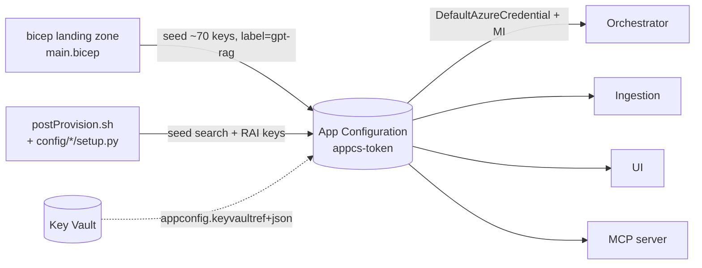

# GPT-RAG — Azure App Configuration Reference

> **Source repos surveyed (June 2026):** `Azure/gpt-rag` v2.7.13, `Azure/gpt-rag-orchestrator` v2.6.11, `Azure/gpt-rag-ingestion` v2.4.2, `Azure/gpt-rag-ui` v2.3.9, `Azure/gpt-rag-mcp` (demo), `Azure/bicep-ptn-aiml-landing-zone` v2.0.8/9.
> **Scope:** every key stored in the centralized Azure App Configuration resource (`appcs-<token>`). Per-component env-only flags and `azd env` deploy-time vars are listed in their own appendices.

---

## 1. How App Configuration is wired up

**Three populators write the store:**

1. `bicep-ptn-aiml-landing-zone/main.bicep` modules `appConfigPopulate`, `cosmosConfigKeyVaultPopulate`, `appConfigKeyVaultPopulate` (lines ≈3775–3917). Ships ~70 keys with label `gpt-rag`.
2. `gpt-rag/scripts/postProvision.sh` invokes three Python setup modules (`config.aifoundry.setup`, `config.containerapps.setup`, `config.search.setup`) which seed additional search settings from `config/search/search.settings.j2` and configure RAI policies.
3. Operators may set per-service overrides under labels `gpt-rag-orchestrator`, `gpt-rag-ingestion`, `gpt-rag-ui` (none ship by default).

**Read-time label precedence (first hit wins):**

| Component | Label order |
|---|---|
| Orchestrator | `orchestrator` → `gpt-rag-orchestrator` → `gpt-rag` → no-label |
| Ingestion | `gpt-rag-ingestion` → `gpt-rag` → no-label |
| UI | `gpt-rag-ui` → `gpt-rag` → no-label |

**Secrets:** any key whose value is `application/vnd.microsoft.appconfig.keyvaultref+json` resolves to a Key Vault secret. The `*_APIKEY` keys are populated as Key Vault refs **only when `USE_CAPP_API_KEY=true`** (a deploy-time flag, not an App Config key).

---

## 2. Azure OpenAI / Models / Embeddings

| Key | Default | Type | Controls | Valid values | When to change | Consumers |
|---|---|---|---|---|---|---|
| `MODEL_DEPLOYMENTS` | JSON array (from `main.parameters.json:modelDeploymentList`) | json | Master list of model deployments: `canonical_name`, `name`, `model`, `version`, `sku`, `apiVersion`, `endpoint`. Drives every other model lookup. | JSON array of deployment objects | Adding/removing models, changing SKU or capacity | shared (orchestrator, ingestion, setup) |
| `CHAT_DEPLOYMENT_NAME` | `chat` | string | AOAI chat deployment name. Derived from `MODEL_DEPLOYMENTS` where `canonical_name=chat`. | any provisioned deployment name | Renaming deployments | orchestrator, ingestion |
| `EMBEDDING_DEPLOYMENT_NAME` | `text-embedding` | string | AOAI embedding deployment name. | any provisioned deployment | Swapping embedding model | orchestrator, ingestion |
| `GPT_MODEL_NAME` | `gpt-5-nano` (legacy `gpt-4o`) | string | Underlying model name used by AI Search agentic retrieval / knowledge agents. | model id supported by Foundry | Upgrading models | search-setup, orchestrator |
| `GPT_MODEL_DEPLOYMENT_NAME` | mirrors `CHAT_DEPLOYMENT_NAME` | string | Deployment for the knowledge agent. | provisioned deployment | If knowledge agent uses different deployment than chat | search-setup |
| `EMBEDDINGS_VECTOR_DIMENSIONS` | `3072` | int | Vector dimensions. Must match the embedding model. | `1536` (3-small), `3072` (3-large) | Switching embedding model size | ingestion, search-setup |
| `OPENAI_API_VERSION` | `2025-04-01-preview` (orch) / `2024-10-21` (ingest) | string | AOAI REST API version. | valid AOAI API version | Adopting newer API features | orchestrator, ingestion |
| `VISION_DEPLOYMENT_NAME` | falls back to `CHAT_DEPLOYMENT_NAME` | string | Vision-capable deployment for multimodal. | provisioned deployment | Separate vision deployment desired | ingestion |
| `CHAT_INPUT_TOKENS` | `128000` | int | Max chat input tokens. | model-supported context window | Switching to a model with different context | orchestrator |
| `EMBEDDING_MODEL_INPUT_TOKENS` | `8192` | int | Max tokens per embedding call. | embedding model's max | Embedding model swap | orchestrator |
| `CHAT_TEMPERATURE` | `0.7` | float | Sampling temperature. | `0.0`–`2.0` | More/less creative answers | orchestrator |
| `CHAT_TOP_P` | `0.95` | float | Top-p nucleus sampling. | `0.0`–`1.0` | Tightening output diversity | orchestrator |
| `CHAT_TOKENIZER_MODEL_NAME` | `gpt-4o` | string | tiktoken model used for token counting. | known tokenizer name | When using a model with a different tokenizer | orchestrator |
| `MAX_COMPLETION_TOKENS` | `4096` | int | Hard cap on output tokens. | model-supported | Longer/shorter answers | orchestrator (all strategies) |
| `REASONING_EFFORT` | `medium` | string | Reasoning effort for gpt-5 family / o-series. | `low`, `medium`, `high` | Trade speed vs reasoning depth | orchestrator |
| `EMBEDDINGS_BACKEND` | `azure_openai` | string | Which client backend for embeddings. | `azure_openai`, `foundry` | Migrating to Foundry inference API | orchestrator |
| `INFERENCE_MAX_RETRIES` | `10` | int | Inference call retries. | `0`+ | Tuning resilience | orchestrator |
| `OPENAI_RETRY_MAX_ATTEMPTS` | `20` | int | Ingestion retry attempts. | `0`+ | Tightening/loosening ingestion resilience | ingestion |
| `OPENAI_RETRY_BASE_SECONDS` | `1` | float | Retry base delay. | `0`+ | Backoff tuning | ingestion |
| `OPENAI_RETRY_MAX_SECONDS` | `60` | float | Retry cap delay. | `0`+ | Backoff tuning | ingestion |
| `OPENAI_RETRY_JITTER_SECONDS` | `0.5` | float | Retry jitter. | `0`+ | Thundering herd mitigation | ingestion |
| `OPENAI_SDK_MAX_RETRIES` | `0` | int | Disables SDK's built-in retries (wrapper owns it). | `0`+ | Letting SDK handle retries | ingestion |
| `AOAI_MAX_CONCURRENCY` | `2` | int | Concurrent AOAI calls during SharePoint indexing. | `1`+ | Higher TPM = increase | ingestion |
| `AOAI_BACKOFF_MAX_SECONDS` | `60` | float | Backoff cap. | `0`+ | Throttling tuning | ingestion |
| `AOAI_MAX_TRANSIENT_ATTEMPTS` | `8` | int | Retry transient errors. | `0`+ | Resilience | ingestion |
| `AOAI_MAX_RATE_LIMIT_ATTEMPTS` | `8` | int | Retry on 429. | `0`+ | Quota pressure | ingestion |

---

## 3. AI Search — index, hybrid/vector, semantic, agentic retrieval

| Key | Default | Type | Controls | Valid values | When to change | Consumers |
|---|---|---|---|---|---|---|
| `SEARCH_SERVICE_NAME` | `srch-<token>` | string | Search service resource name. | resource name | Bring-your-own search service | shared |
| `SEARCH_SERVICE_QUERY_ENDPOINT` | `https://srch-<token>.search.windows.net` | string | Search query endpoint. | https URL | BYO search | orchestrator, ingestion, search-setup |
| `SEARCH_SERVICE_RESOURCE_ID` | full ARM id | string | ARM id of search service. | ARM id | BYO search | shared |
| `SEARCH_SERVICE_PRINCIPAL_ID` | MI principal guid | string | Search MI principal id (for RBAC). | guid | If switching identity | shared |
| `SEARCH_SERVICE_UAI_RESOURCE_ID` | UAI id (when `USE_UAI=true`) | string | User-assigned identity for search. | ARM id | UAI mode | shared |
| `SEARCH_CONNECTION_ID` | Foundry connection ARM id | string | Foundry connection to AI Search (used by agentic retrieval). | ARM id | If recreating connection | orchestrator, search-setup |
| `SEARCH_API_VERSION` | `2025-05-01-preview` | string | REST API version used by setup scripts. | valid API version | New preview features | search-setup |
| `AZURE_SEARCH_API_VERSION` | `2024-07-01` | string | Runtime search API version (orchestrator). | valid API version | Production stability vs preview features | orchestrator |
| `SEARCH_ANALYZER_NAME` | `standard.lucene` | string | Lucene analyzer for index field defs. | analyzer name | Language-specific analyzers | search-setup |
| `SEARCH_RAG_INDEX_NAME` | `ragindex-<token>` | string | Main RAG index name. | any | Multi-index strategy | orchestrator, ingestion, search-setup |
| `AI_SEARCH_INDEX_NAME` | (legacy alias) | string | Older alias; ingestion falls back if `SEARCH_RAG_INDEX_NAME` is empty. | any | Don't — keep for compat | ingestion |
| `SEARCH_QUERIES_INDEX_NAME` | `nl2sql-<token>-queries` | string | NL2SQL queries index. | any | If using NL2SQL with custom names | orchestrator, ingestion, search-setup |
| `SEARCH_TABLES_INDEX_NAME` | `nl2sql-<token>-tables` | string | NL2SQL tables index. | any | NL2SQL | orchestrator, ingestion, search-setup |
| `SEARCH_MEASURES_INDEX_NAME` | `nl2sql-<token>-measures` | string | NL2SQL measures index. | any | NL2SQL | orchestrator, ingestion, search-setup |
| `SEARCH_APPROACH` | `hybrid` | string | Retrieval mode. | `hybrid`, `vector`, `keyword` | A/B testing retrieval quality | orchestrator |
| `SEARCH_USE_SEMANTIC` | `false` | bool | Toggle semantic reranker. | `true`/`false` | Enabling L2 reranker (extra cost) | orchestrator |
| `SEARCH_SEMANTIC_SEARCH_CONFIG` | `my-semantic-config` | string | Name of semantic config in the index. ⚠ `search.j2` creates one named `semantic-config`; verify match before enabling. | name | Custom semantic config | orchestrator |
| `SEARCH_RAGINDEX_TOP_K` | `3` | int | Top-K returned from RAG index. | `1`+ | More/less context vs cost | orchestrator |
| `SEARCH_RETRIEVAL_ENABLED` | `true` | bool | Whether Search is a retrieval tool. | `true`/`false` | Disable for non-RAG flows | orchestrator |
| `SEARCH_EMPTY_CACHE_TTL_SECONDS` | `60` | int | TTL for "index empty" decision cache. | `0`+ | Faster/slower failover | orchestrator |
| `SEARCH_SCAN_PAGE_SIZE` | `1000` | int | Page size scanning the index for purge. | `1`–`1000` | Memory tuning | ingestion |
| `ENABLE_AGENTIC_RETRIEVAL` | `false` | bool | Provisions knowledge sources / knowledge base and enables agentic retrieval (API `2025-11-01-preview`). | `true`/`false` | Adopting agentic retrieval | search-setup, orchestrator |
| `INDEXER_BATCH_SIZE` | `500` | int | Indexer batch size. | `1`+ | Throughput vs memory | ingestion |
| `INDEXER_MAX_CONCURRENCY` | `2` (SP/NL2SQL) / `8` (blob) | int | Concurrent indexer workers. | `1`+ | Throughput | ingestion |
| `INDEXER_ITEM_TIMEOUT_SECONDS` | `600` | int | Per-item indexer timeout. | seconds | Large files | ingestion |
| `BLOB_INDEXER_NAME` | `blob-storage-indexer` | string | Blob indexer name. | name | Multi-indexer setups | ingestion |
| `SP_INDEXER_NAME` / `SP_LISTS_INDEXER_NAME` | `sharepoint-indexer` | string | SharePoint indexer name. | name | Multi-tenant | ingestion |
| `SP_LISTS_PURGER_NAME` | `sharepoint-purger` | string | SharePoint purger name. | name | Multi-tenant | ingestion |
| `BLOB_PREFIX` | `""` | string | Optional prefix filter for blob indexer. | path prefix | Subfolder ingest | ingestion |

---

## 4. Agent strategy — single-agent, MAF, MCP, multimodal, NL2SQL

| Key | Default | Type | Controls | Valid values | When to change | Consumers |
|---|---|---|---|---|---|---|
| `AGENT_STRATEGY` | `maf_lite` | string | Selects orchestration strategy. | `single_agent_rag`, `multiagent`, `mcp`, `maf_agent_service`, `maf_lite`, `multimodal`, `nl2sql` | Switching agent paradigms | orchestrator |
| `AGENT_ID` | `""` | string | Reuse an existing Foundry Agent Service agent. | agent id or empty | Pre-created agents | orchestrator (single-agent, mcp) |
| `BING_RETRIEVAL_ENABLED` | `false` | bool | Enables Bing grounding tool. | `true`/`false` | Web grounding | orchestrator (single-agent) |
| `BING_CONNECTION_ID` | `""` (set if `deployGroundingWithBing=true`) | string | Foundry Bing connection ARM id. | ARM id | Enabling Bing tool | orchestrator |
| `MCP_APP_ENDPOINT` | `http://localhost:80` (set to FQDN by bicep) | string | MCP server URL (SSE adds `/sse`). | URL | BYO MCP server | orchestrator |
| `MCP_APP_APIKEY` | Key Vault ref (when `USE_CAPP_API_KEY=true`) | string (secret) | MCP server API key. | KV ref | Custom auth | orchestrator |
| `MCP_CLIENT_TIMEOUT` | `600` | int | MCP HTTP timeout (s). | seconds | Slow MCP tools | orchestrator |
| `MCP_SERVER_TRANSPORT` | `sse` | string | MCP transport. | `sse`, others | Future transports | orchestrator |

---

## 5. Orchestrator behavior — prompts, history, intent

| Key | Default | Type | Controls | Valid values | When to change | Consumers |
|---|---|---|---|---|---|---|
| `PROMPT_SOURCE` | `file` | string | Where prompt templates load from. | `file`, `blob` | Centralized prompt management via Cosmos `prompts` container | orchestrator |
| `CHAT_HISTORY_MAX_MESSAGES` | `10` (most) / `6` (NL2SQL) | int | Prior messages included in context. | `0`+ | More context vs token cost | orchestrator |
| `MAX_CONTENT_CHARS` | `4000` | int | Max content chars from retrieved docs. | `0`+ | Tighter/wider grounding window | orchestrator (maf_lite) |
| `MULTIMODAL_MAX_CONTENT_CHARS` | `4000` | int | Same, for multimodal. | `0`+ | Same | orchestrator (multimodal) |
| `RETRIEVAL_INTENT_HISTORY_MESSAGES` | `4` | int | Prior messages used to infer retrieval intent. | `0`+ | Tune follow-up detection | orchestrator |
| `RETRIEVAL_INTENT_HISTORY_MAX_CHARS` | `4000` | int | Char budget for intent inference. | `0`+ | Same | orchestrator |
| `NO_RETRIEVAL_FOLLOWUP_DETECTION_ENABLED` | likely `true` ⚠ verify | bool | Skip retrieval on follow-up questions. | `true`/`false` | Force retrieval every turn | orchestrator |
| `ALLOW_ANONYMOUS` | `true` | bool | Permit non-authenticated chat. | `true`/`false` | Public/internal demos vs prod | orchestrator (single-agent), UI |

---

## 6. Ingestion — chunking, OCR, extraction

| Key | Default | Type | Controls | Valid values | When to change | Consumers |
|---|---|---|---|---|---|---|
| `MULTIMODAL` | `false` ⚠ no shipped default — operator-set | bool | Master switch for multimodal ingestion (image extraction + caption indexing). | `true`/`false` | Enabling image-aware RAG | ingestion |
| `CHUNKING_NUM_TOKENS` | `2048` | int | Target chunk size (tokens). | `100`+ | Recall vs precision | ingestion |
| `CHUNKING_MIN_CHUNK_SIZE` | `100` | int | Minimum chunk size. | `1`+ | Filter tiny chunks | ingestion |
| `TOKEN_OVERLAP` | `200` | int | Token overlap between chunks. | `0`+ | Boundary coverage | ingestion |
| `SPREADSHEET_CHUNKING_NUM_TOKENS` | `0` | int | Spreadsheet chunk size (0 = sheet-as-chunk). | `0`+ | Big sheets | ingestion |
| `SPREADSHEET_CHUNKING_BY_ROW` | `false` | bool | Chunk by row instead of by sheet. | `true`/`false` | Tabular Q&A | ingestion |
| `SPREADSHEET_CHUNKING_BY_ROW_INCLUDE_HEADER` | `false` | bool | Repeat header in each row-chunk. | `true`/`false` | Header context per row | ingestion |
| `CHUNKER_INPUT_IS_BASE64` | `false` | bool | Whether blob payload is base64. | `true`/`false` | Encoded sources | ingestion |
| `MAX_PAGES_PER_ANALYSIS` | `300` | int | Doc Intelligence page cap per call. | `1`–`2000` | Large PDFs | ingestion |
| `DOC_INTELLIGENCE_API_VERSION` | class constant ⚠ verify | string | Doc Intelligence API version. | valid version | Newer features | ingestion |
| `CONTENT_UNDERSTANDING_API_VERSION` | ⚠ no shipped default | string | Content Understanding API version. | valid version | When using CU | ingestion |
| `CONTENT_UNDERSTANDING_ANALYZER` | ⚠ no shipped default | string | CU analyzer id. | analyzer id | Custom analyzers | ingestion |
| `USE_DOC_INTELLIGENCE` | ⚠ no shipped default | bool | DI vs Content Understanding. | `true`/`false` | CU/DI choice | ingestion |
| `MINIMUM_FIGURE_AREA_PERCENTAGE` | `4.0` | float | Drop figures smaller than this % of page. | `0.0`–`100.0` | Noise filtering | ingestion |
| `MAX_FILE_PROCESSING_ATTEMPTS` | `3` | int | Retries before blocking a file. | `1`+ | Flaky sources | ingestion |
| `MEMORY_SAFETY_MULTIPLIER` | `4.0` | float | Blob staging memory safety multiplier. | `1.0`+ | Large files | ingestion |
| `MEMORY_SAFETY_THRESHOLD` | `0.85` | float | Memory utilization threshold. | `0.0`–`1.0` | Tighter caps | ingestion |
| `STAGING_CONTAINER` | `long-files-staging` | string | Blob container for staging large files. | container name | Custom layout | ingestion |
| `COST_PER_PAGE_ANALYSIS` | `0.01` | float | Telemetry: $ per DI page. | USD | Local price tracking | ingestion |
| `COST_PER_1K_EMBEDDING_TOKENS` | `0.00013` | float | Telemetry. | USD | Same | ingestion |
| `COST_PER_1K_COMPLETION_INPUT_TOKENS` | `0.0025` | float | Telemetry. | USD | Same | ingestion |
| `COST_PER_1K_COMPLETION_OUTPUT_TOKENS` | `0.01` | float | Telemetry. | USD | Same | ingestion |
| `HTTP_TOTAL_TIMEOUT_SECONDS` | `120.0` | float | Indexer total HTTP timeout. | seconds | Slow services | ingestion |
| `BLOB_OP_TIMEOUT_SECONDS` | `20.0` | float | Blob op timeout. | seconds | Slow storage | ingestion |
| `LIST_GATHER_TIMEOUT_SECONDS` | `7200.0` | float | List enumeration timeout (2 h). | seconds | Huge libraries | ingestion |
| `RUN_SUMMARY_TIMEOUT_SECONDS` | `60.0` | float | Per-summary write timeout. | seconds | Slow writes | ingestion |
| `RUN_SUMMARY_TOTAL_TIMEOUT_SECONDS` | `90.0` | float | Total summary timeout. | seconds | Same | ingestion |
| `DISABLE_STORAGE_LOGS` | `""` | bool | Suppress storage SDK logs. | `true`/`false` | Noise reduction | ingestion |

### Cron schedules (ingestion)

| Key | Default | Purpose |
|---|---|---|
| `CRON_RUN_BLOB_INDEX` | `0 * * * *` | Blob indexer. |
| `CRON_RUN_BLOB_PURGE` | `10 * * * *` | Blob purger. |
| `CRON_RUN_SHAREPOINT_INDEX` | (unset → skip) | SharePoint indexer. |
| `CRON_RUN_SHAREPOINT_PURGE` | (unset → skip) | SharePoint purger. |
| `CRON_RUN_IMAGES_PURGE` | (unset → skip) | Multimodal images purger. |
| `CRON_RUN_NL2SQL_INDEX` | (unset → skip) | NL2SQL indexer. |
| `CRON_RUN_NL2SQL_PURGE` | (unset → skip) | NL2SQL purger. |
| `CRON_RUN_LOG_CLEANUP` | `0 * * * *` | Log cleanup. |
| `RUN_JOBS_ON_STARTUP` | `false` in Azure / `true` locally | Run all jobs once at boot. |
| `SCHEDULER_TIMEZONE` | system default | Cron timezone (env-only). |
| `JOBS_LOG_CONTAINER` | `jobs` | Container for job logs. |

---

## 7. Multimodal (orchestrator)

| Key | Default | Type | Controls | When to change | Consumers |
|---|---|---|---|---|---|
| `MULTIMODAL_MAX_IMAGES` | `10` | int | Max images included per query. | Vision token budgeting | orchestrator |
| `MULTIMODAL_MAX_IMAGES_PER_DOC` | `5` | int | Max images per source doc. | Avoid one-doc dominance | orchestrator |
| `MULTIMODAL_CLASSIFY_IMAGES` | `true` | bool | Run image classification step. | Skip if all images relevant | orchestrator |
| `MULTIMODAL_IMAGE_CLASSIFICATION_TIMEOUT_SECONDS` | `15` | int | Per-image timeout. | Slow vision model | orchestrator |
| `MULTIMODAL_IMAGE_CLASSIFICATION_CONCURRENCY` | `2` | int | Concurrent classifications. | Throughput | orchestrator |
| `MULTIMODAL_VALIDATE_RESPONSE_IMAGES` | `true` | bool | Validate images in answer are relevant. | Hallucination control | orchestrator |
| `MULTIMODAL_IMAGE_VALIDATION_TIMEOUT_SECONDS` | `15` | int | Validation timeout. | Same | orchestrator |

---

## 8. SharePoint connector

| Key | Default | Type | Controls | When to change | Consumers |
|---|---|---|---|---|---|
| `SHAREPOINT_TENANT_ID` | `""` | string | Tenant id for SP app registration. | Always set before SP ingest | ingestion |
| `SHAREPOINT_CLIENT_ID` | `""` | string | Client id of the SP app reg. | Always set before SP ingest | ingestion |
| `SHAREPOINT_CLIENT_SECRET_NAME` | `sharepointClientSecret` | string | KV secret name with client secret. | Custom secret naming | ingestion |
| `SHAREPOINT_FILES_FORMAT` | `pdf,docx,pptx` | csv | File extensions to ingest. | Adding `xlsx`, `txt`, etc. | ingestion |
| `SHAREPOINT_MAX_FILE_COUNT` | `-1` (unlimited) | int | Cap files per run. | Throttling | ingestion |

SP also reuses: `STORAGE_ACCOUNT_NAME`, `SEARCH_SERVICE_QUERY_ENDPOINT`, `SEARCH_RAG_INDEX_NAME`, `INDEXER_BATCH_SIZE`, `INDEXER_MAX_CONCURRENCY`, `JOBS_LOG_CONTAINER`, `MAX_FILE_PROCESSING_ATTEMPTS`.

---

## 9. NL2SQL connector

| Key | Default | Type | Controls | Consumers |
|---|---|---|---|---|
| `NL2SQL_STORAGE_CONTAINER` | `nl2sql` | string | Container with NL2SQL definitions. | ingestion |
| `SEARCH_QUERIES_INDEX_NAME` | (see §3) | string | Queries vector index. | ingestion, orchestrator |
| `SEARCH_TABLES_INDEX_NAME` | (see §3) | string | Tables vector index. | ingestion, orchestrator |
| `SEARCH_MEASURES_INDEX_NAME` | (see §3) | string | Measures vector index. | ingestion, orchestrator |

Datasource credentials live in Key Vault as `<datasource-id>-secret`, referenced by `tools/keyvault.py` and `connectors/sqldbs.py` — not stored as App Config keys.

---

## 10. Document-level security (ACL/RBAC)

App Config holds **no per-doc ACLs**; those are index fields. The keys below participate in identity propagation and the OBO flow:

| Key | Default | Type | Controls | Consumers |
|---|---|---|---|---|
| `OAUTH_AZURE_AD_TENANT_ID` | `""` | string | Tenant id for JWT validation + OBO to AI Search. | all three apps |
| `OAUTH_AZURE_AD_CLIENT_ID` | `""` | string | App registration client id. | all three apps |
| `OAUTH_AZURE_AD_CLIENT_SECRET` | KV secret `authClientSecret` | string (secret) | OBO/MSAL client secret. | UI, orchestrator |
| `OAUTH_AZURE_AD_SCOPES` | `api://<client-id>/user_impersonation openid profile` | csv | Scopes requested at sign-in. | UI |
| `OAUTH_AZURE_AD_ENABLE_SINGLE_TENANT` | ⚠ no shipped default | bool | Restrict OAuth to single tenant. | UI |
| `CLIENT_ID` | (legacy alias of `OAUTH_AZURE_AD_CLIENT_ID`) | string | Backward-compat fallback. | UI, ingestion |
| `authClientSecret` | (KV secret name fallback) | string (secret) | Backward-compat alias. | UI |
| `ALLOWED_USER_NAMES` | `""` | csv | UPN allow-list for UI. | UI |
| `ALLOWED_USER_PRINCIPALS` | `""` | csv | OID/objectId allow-list for UI. | UI |

Index fields that implement security (defined in `config/search/search.j2`, not App Config):

- `metadata_security_group_ids` — Collection<String>, `permissionFilter: groupIds`
- `metadata_security_user_ids` — Collection<String>, `permissionFilter: userIds`
- `metadata_security_rbac_scope` — String, `permissionFilter: rbacScope`
- `permissionFilterOption: disabled` by default — flip to enable Search's native permission filter.

---

## 11. UI / Frontend (Chainlit)

| Key | Default | Type | Controls | Consumers |
|---|---|---|---|---|
| `ENABLE_USER_FEEDBACK` | `false` | bool | Show feedback widget. | UI |
| `USER_FEEDBACK_RATING` | `false` | bool | Show numeric rating alongside thumbs. | UI |
| `SHOW_STATISTICS` | `false` | bool | Show response statistics panel. | UI |
| `SHOW_RELEASE_FOOTER` | `true` | bool | Show release/version footer. | UI |
| `CHAINLIT_AUTH_SECRET` | random per restart | string (secret — should be KV ref) | Chainlit session JWT signing key. | UI |
| `CHAINLIT_URL` | derived | string | Public base URL (OAuth callback). | UI |
| `chainlitUrl` | alias of `CHAINLIT_URL` | string | Legacy alias. | UI |
| `ALLOW_ANONYMOUS` | derived | bool | Default `true` outside Azure or when OAuth not configured. | UI, orchestrator |

---

## 12. Observability (App Insights, logging)

| Key | Default | Type | Controls | Consumers |
|---|---|---|---|---|
| `APPLICATIONINSIGHTS_CONNECTION_STRING` | full conn string | string (secret-ish) | OpenTelemetry export target. | all three apps |
| `APPLICATIONINSIGHTS__INSTRUMENTATIONKEY` | guid | string | Legacy instrumentation key. | shared |
| `APP_INSIGHTS_NAME` | `appi-<token>` | string | Resource name. | shared |
| `APP_INSIGHTS_RESOURCE_ID` | ARM id | string | ARM id. | shared |
| `LOG_LEVEL` | `INFO` (bicep) / `Information` (telemetry) | string | App-wide log level. | all three apps |
| `AZURE_LOG_LEVEL` | `WARNING` | string | Log level for Azure SDK loggers. | all three apps |
| `ENABLE_CONSOLE_LOGGING` | `true` | bool | Echo logs to stdout. | all three apps |
| `LOG_ANALYTICS_RESOURCE_ID` | ARM id | string | Log Analytics workspace. | shared |
| `RELEASE` | manifest tag (e.g. `v2.7.13`) | string | Release surfaced in UI footer + telemetry. | UI, telemetry |

---

## 13. RAI / Content Safety

App Config holds no policy bodies. `config/aifoundry/setup.py` reads:

- `SUBSCRIPTION_ID`, `AZURE_RESOURCE_GROUP` (§15)
- `AI_FOUNDRY_ACCOUNT_NAME` (§14)
- `MODEL_DEPLOYMENTS` (§2)
- `KEY_VAULT_URI` (§15)

…and applies hardcoded constants:

| Constant | Value | Purpose |
|---|---|---|
| `BLOCKLIST_NAME` | `gptragBlocklist` | RAI blocklist resource name. |
| `POLICY_NAME` | `gptragRAIPolicy` | RAI policy resource name. |
| `SECRET_NAME` | `evaluationsModelApiKey` | KV secret for evaluation workflows. |
| `CANONICAL_DEPLOYMENT_NAME` | `CHAT_DEPLOYMENT_NAME` | Which deployment gets the RAI policy attached. |

Policy bodies come from `config/aifoundry/raiblocklist.json` and `raipolicies.json` in the repo — edit there, not in App Config.

---

## 14. AI Foundry — resource identity & endpoints

| Key | Default | Type | Controls | Consumers |
|---|---|---|---|---|
| `AI_FOUNDRY_ACCOUNT_NAME` | `aif-<token>` | string | Foundry account (Cognitive Services) name. | shared |
| `AI_FOUNDRY_ACCOUNT_RESOURCE_ID` | ARM id | string | Foundry account ARM id. | shared |
| `AI_FOUNDRY_ACCOUNT_ENDPOINT` | `https://aif-<token>.cognitiveservices.azure.com/` | string | Foundry account endpoint. | orchestrator, ingestion |
| `AI_FOUNDRY_PROJECT_NAME` | `aifp-<token>` | string | Foundry project name. | shared |
| `AI_FOUNDRY_PROJECT_RESOURCE_ID` | ARM id | string | Foundry project ARM id. | shared |
| `AI_FOUNDRY_PROJECT_ENDPOINT` | `https://aif-<token>.services.ai.azure.com/api/projects/<project>` | string | Foundry project endpoint (Agent Service v2). | orchestrator |
| `AI_FOUNDRY_STORAGE_ACCOUNT_NAME` | `staif<token>` | string | Storage account behind Foundry. | shared |
| `AI_FOUNDRY_PROJECT_WORKSPACE_ID` | ⚠ commented out in bicep — not populated | string | Workspace id (future use). | (none active) |

---

## 15. Storage / Cosmos DB / State

| Key | Default | Type | Controls | Consumers |
|---|---|---|---|---|
| `STORAGE_ACCOUNT_NAME` | `st<token>` | string | Main storage account. | shared |
| `STORAGE_ACCOUNT_RESOURCE_ID` | ARM id | string | Storage ARM id. | shared |
| `STORAGE_BLOB_ENDPOINT` | `https://st<token>.blob.core.windows.net/` | string | Blob endpoint. | shared |
| `DOCUMENTS_STORAGE_CONTAINER` | `documents` | string | Source docs container. | shared |
| `DOCUMENTS_IMAGES_STORAGE_CONTAINER` | `documents-images` | string | Extracted images (multimodal). | ingestion, UI |
| `CONVERSATION_DOCUMENTS_STORAGE_CONTAINER` | `conversation-documents` | string | Per-conversation uploads. | UI, ingestion |
| `CONVERSATION_CACHE_STORAGE_CONTAINER` | `conversation-cache` | string | Conversation cache blobs. | shared |
| `NL2SQL_STORAGE_CONTAINER` | `nl2sql` | string | NL2SQL config blobs. | ingestion |
| `STORAGE_CONTAINER_IMAGES` | `documents-images` | string | Used by multimodal images purger. | ingestion |
| `KEY_VAULT_URI` | `https://kv-<token>.vault.azure.net/` | string | Key Vault URI. | ingestion, orchestrator setup |
| `KEY_VAULT_RESOURCE_ID` | ARM id | string | KV ARM id. | shared |
| `KEY_VAULT_NAME` | `kv-<token>` | string | KV name. | shared |
| `DATABASE_ACCOUNT_NAME` | `cosmos-<token>` | string | Cosmos DB account name. | orchestrator, ingestion |
| `DATABASE_NAME` | `cosmos-db<token>` | string | Cosmos SQL database. | orchestrator, ingestion |
| `COSMOS_DB_ACCOUNT_RESOURCE_ID` | ARM id | string | Cosmos ARM id. | shared |
| `COSMOS_DB_ENDPOINT` | `https://cosmos-<token>.documents.azure.com:443/` | string | Cosmos endpoint. | shared |
| `CONVERSATIONS_DATABASE_CONTAINER` | `conversations` | string | Chat history + user-profile docs (partition: `principal_id`). | orchestrator, UI |
| `DATASOURCES_DATABASE_CONTAINER` | `datasources` | string | NL2SQL/Fabric datasource definitions (partition: `/id`). | ingestion, orchestrator |
| `COSMOS_DATASOURCES_CONTAINER` | `datasources` (alias) | string | Alias used by SharePoint indexer. | ingestion |
| `PROMPTS_CONTAINER` | `prompts` | string | Cosmos container with versioned prompts (when `PROMPT_SOURCE=blob`). | orchestrator |
| `MCP_CONTAINER` | `mcp` | string | Cosmos container for MCP state. | mcp/orchestrator |
| `ENABLE_COSMOS_ANALYTICAL_STORAGE` | `false` | bool | Analytical store toggle (bicep param, not normally an App Config key). | bicep |

---

## 16. Container Apps — endpoints, names, API keys

| Key | Default | Type | Controls | Consumers |
|---|---|---|---|---|
| `CONTAINER_APPS` | JSON list (orchestrator, frontend, dataingest, mcp) with `name`, `serviceName`, `canonical_name`, `principalId`, `fqdn` | json | All container apps inventory. | bicep, ACR setup |
| `CONTAINER_ENV_NAME` | `cae-<token>` | string | Container Apps Environment name. | shared |
| `CONTAINER_ENV_PRINCIPAL_ID` | guid | string | Environment-level MI principal. | shared |
| `CONTAINER_ENV_RESOURCE_ID` | ARM id | string | Environment ARM id. | shared |
| `CONTAINER_REGISTRY_NAME` | `cr<token>` | string | ACR name. | shared |
| `CONTAINER_REGISTRY_LOGIN_SERVER` | `cr<token>.azurecr.io` | string | ACR login server. | shared |
| `ORCHESTRATOR_APP_ENDPOINT` | `https://ca-<token>-orchestrator.<env>.<region>.azurecontainerapps.io` | string | Orchestrator FQDN. | UI, ingestion |
| `ORCHESTRATOR_APP_NAME` | `ca-<token>-orchestrator` | string | Orchestrator app name. | shared |
| `FRONTEND_APP_ENDPOINT` / `FRONTEND_APP_NAME` | analogous | string | Frontend endpoint/name. | shared |
| `DATA_INGEST_APP_ENDPOINT` / `DATA_INGEST_APP_NAME` | analogous | string | Ingestion endpoint/name. | UI, orchestrator |
| `MCP_APP_ENDPOINT` / `MCP_APP_NAME` | analogous | string | MCP endpoint/name. | orchestrator |
| `ORCHESTRATOR_APP_APIKEY` | KV ref to `ORCHESTRATOR-APP-APIKEY` (when `USE_CAPP_API_KEY=true`) | string (secret) | API key for orchestrator. **Initial value = `resourceToken` — rotate after deploy.** | UI |
| `FRONTEND_APP_APIKEY` | KV ref | string (secret) | Frontend API key. | n/a |
| `DATA_INGEST_APP_APIKEY` | KV ref to `DATA-INGEST-APP-APIKEY` | string (secret) | Ingestion API key (canonical, matches `X-API-KEY` header). | UI, ingestion |
| `INGESTION_APP_APIKEY` | (legacy alias) | string (secret) | Backward-compat. | UI, ingestion |
| `MCP_APP_APIKEY` | KV ref | string (secret) | MCP API key. | orchestrator |
| `ORCHESTRATOR_BASE_URL` | derived | string | Override base URL when not using Dapr. | UI |
| `INGESTION_BASE_URL` | derived | string | Override ingestion base URL. | UI |
| `DAPR_HTTP_PORT` | `3500` | string | Dapr local HTTP port. | UI |
| `DAPR_API_TOKEN` | `None` | string (secret) | Dapr API token if locked down. | UI |

---

## 17. Cross-cutting — tenancy, identity, deploy flags

| Key | Default | Type | Controls | Consumers |
|---|---|---|---|---|
| `NETWORK_ISOLATION` | `false` | bool | Zero-trust mode flag (controls PE requirements, post-provision behaviour). | shared |
| `USE_UAI` | `false` | bool | User-Assigned vs System-Assigned MIs. | shared |
| `DEPLOY_APP_CONFIG` / `DEPLOY_KEY_VAULT` / `DEPLOY_LOG_ANALYTICS` / `DEPLOY_APP_INSIGHTS` / `DEPLOY_SEARCH_SERVICE` / `DEPLOY_SPEECH_SERVICE` / `DEPLOY_STORAGE_ACCOUNT` / `DEPLOY_COSMOS_DB` / `DEPLOY_CONTAINER_APPS` / `DEPLOY_CONTAINER_REGISTRY` / `DEPLOY_CONTAINER_ENV` | `true` | bool | What was provisioned (setup scripts skip missing pieces). | shared |
| `TENANT_ID` / `AZURE_TENANT_ID` | tenant guid | string | Azure tenant id. | shared |
| `SUBSCRIPTION_ID` / `AZURE_SUBSCRIPTION_ID` | sub guid | string | Subscription id. | shared |
| `AZURE_RESOURCE_GROUP` | RG name | string | Resource group. | shared |
| `LOCATION` | region | string | Azure region. | shared |
| `ENVIRONMENT_NAME` | azd env name | string | azd environment name. | shared |
| `DEPLOYMENT_NAME` | `${AZURE_ENV_NAME}-<timestamp>` | string | Deployment audit name. | shared |
| `RESOURCE_TOKEN` | 5–12 char suffix | string | Token used in resource names. | search-setup |
| `AZURE_SPEECH_ENDPOINT` / `AZURE_SPEECH_RESOURCE_ID` / `AZURE_SPEECH_REGION` / `AZURE_SPEECH_RESOURCE_NAME` | `""` (when `DEPLOY_SPEECH_SERVICE=false`) | string | Azure AI Speech service info. | shared |
| `ACR_TASK_AGENT_POOL` | `""` | string | ACR Task agent pool name (if `DEPLOY_ACR_TASK_AGENT_POOL=true`). | shared |

---

## Appendix A — Items requiring verification

These were read by code but no shipped default was found in bicep, postprovision, or `search.settings.j2`. Confirm against your specific deployment before relying on documented behaviour:

- `USE_DOC_INTELLIGENCE` — chooses between Doc Intelligence and Content Understanding for analysis chunker.
- `CONTENT_UNDERSTANDING_API_VERSION`, `CONTENT_UNDERSTANDING_ANALYZER` — read via `app_config_client.get()` with no defaults.
- `MULTIMODAL` — master switch read by ingestion; no bicep/setup-script line writes it. Likely operator-supplied.
- `AI_FOUNDRY_PROJECT_WORKSPACE_ID` — present in bicep but commented out; not currently populated.
- `OAUTH_AZURE_AD_ENABLE_SINGLE_TENANT` — read by UI; no code default.
- `NO_RETRIEVAL_FOLLOWUP_DETECTION_ENABLED` — read by orchestrator; default likely `true` but unconfirmed.
- `DOC_INTELLIGENCE_API_VERSION` — pulls from a class constant `DEFAULT_API_VERSION` whose value wasn't captured.

---

## Appendix B — `azd env` variables (NOT in App Config)

These drive bicep at deploy time. They never end up as App Config keys, but they control which keys get populated and how:

`AZURE_ENV_NAME`, `AZURE_LOCATION`, `AZURE_AI_FOUNDRY_LOCATION`, `AZURE_PSQL_LOCATION`, `AZURE_COSMOS_LOCATION`, `AZURE_SEARCH_LOCATION`, `AZURE_SPEECH_LOCATION`, `AZURE_PRINCIPAL_ID`, `AZURE_PE_LOCATION`, `AZURE_PE_RESOURCE_GROUP_NAME`, `DEPLOYMENT_MODE` (default `standalone`), `USE_EXISTING_VNET`, `DEPLOY_SUBNETS`, `SIDE_BY_SIDE`, `EXISTING_VNET_RESOURCE_ID`, `DEPLOY_MCP` (default `true`), `DEPLOY_GROUNDING_WITH_BING` (default `false`), `DEPLOY_VM`, `DEPLOY_SOFTWARE`, `DEPLOY_POSTGRES` (default `false`), `DEPLOY_AZURE_FIREWALL` (default `true`), `DEPLOY_ACR_TASK_AGENT_POOL` (default `false`), `DEPLOY_JUMPBOX`, `DEPLOY_BASTION`, `DEPLOY_NAT_GATEWAY`, `BASTION_SKU_NAME` (default `Standard`), `BASTION_ENABLE_TUNNELING` (default `false`), `ENABLE_ACS_MEDIA_EGRESS` (default `false`), `ENABLE_PRIVATE_LOG_ANALYTICS` (default `true`), `GREEN_FIELD_DEPLOYMENT` (default `true`), `POLICY_MANAGED_PRIVATE_DNS` (default `false`), `VM_SIZE` (default `Standard_D2s_v3`), all `EXISTING_PRIVATE_DNS_ZONE_*_RESOURCE_ID` and `HUB_INTEGRATION_*` entries, `USE_CAPP_API_KEY`, `RUN_FROM_JUMPBOX`, `AZURE_SKIP_NETWORK_ISOLATION_WARNING`.

---

## Appendix C — Files to look at when keys disagree

| File | Role |
|---|---|
| `Azure/gpt-rag/main.parameters.json` | Deployment param shapes (`modelDeploymentList`, `storageAccountContainersList`, `databaseContainersList`). |
| `Azure/gpt-rag/manifest.json` | Pinned component versions. |
| `Azure/gpt-rag/scripts/postProvision.sh` | Orchestrates the three setup scripts after `azd up`. |
| `Azure/gpt-rag/config/aifoundry/setup.py` | RAI blocklist/policy + KV secret seeding. |
| `Azure/gpt-rag/config/containerapps/setup.py` | ACR-identity association from App Config. |
| `Azure/gpt-rag/config/search/setup.py` | Renders Jinja2 templates and seeds search settings into App Config. |
| `Azure/gpt-rag/config/search/search.settings.j2` | **Most important** seeded keys file. |
| `Azure/gpt-rag/config/search/search.j2` | Index/skillset/indexer (security-filter fields live here). |
| `Azure/bicep-ptn-aiml-landing-zone/main.bicep` (≈3775–3917) | The three `keyValues` populate modules. |
| `Azure/bicep-ptn-aiml-landing-zone/modules/app-configuration/app-configuration.bicep` | Helper that writes key/values. |
| `Azure/bicep-ptn-aiml-landing-zone/modules/container-apps/container-apps-list.bicep` | Emits `*_ENDPOINT` and `*_NAME` per container app. |
| `Azure/gpt-rag-orchestrator/src/connectors/appconfig.py` | Runtime loader; labels `orchestrator`, `gpt-rag-orchestrator`, `gpt-rag`, no-label. |
| `Azure/gpt-rag-orchestrator/.env.sample` | Expected env vars (matches App Config keys). |
| `Azure/gpt-rag-orchestrator/src/strategies/*` | Per-strategy key consumers. |
| `Azure/gpt-rag-ingestion/tools/appconfig.py` | Ingestion runtime loader; labels `gpt-rag-ingestion`, `gpt-rag`, no-label. |
| `Azure/gpt-rag-ingestion/jobs/sharepoint_ingestion_config.py`, `blob_storage_indexer.py`, `nl2sql_indexer.py` | Most ingestion key consumers. |
| `Azure/gpt-rag-ui/connectors/appconfig.py` | UI runtime loader; labels `gpt-rag-ui`, `gpt-rag`, no-label. |
| `Azure/gpt-rag-ui/main.py`, `app.py`, `auth_oauth.py` | UI key consumers. |
| `Azure/gpt-rag-mcp/src/server.py` | Demo MCP — does **not** read App Config. MCP wire-up lives on the orchestrator side via `MCP_APP_*` keys. |
| `Azure/GPT-RAG-Agentic/.env.template` | Legacy v1.x env-only config (`AUTOGEN_ORCHESTRATION_STRATEGY`, etc.) — **superseded** by v2.x. Don't reference for v2.5+. |
