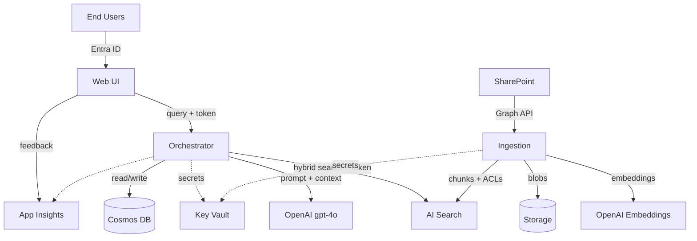
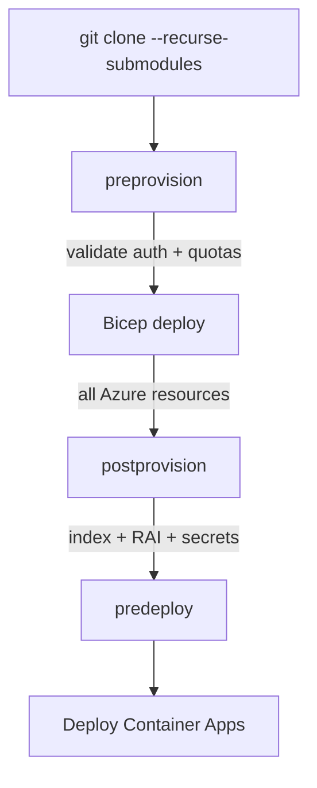
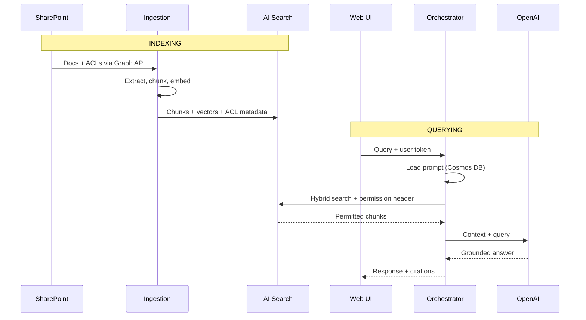
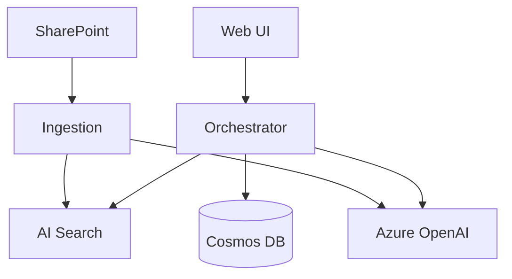
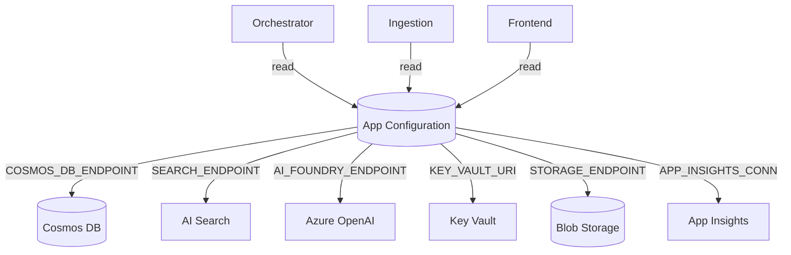
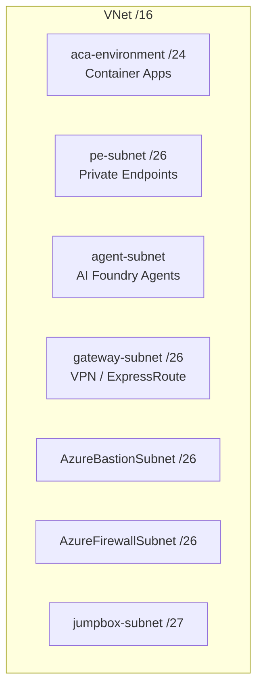
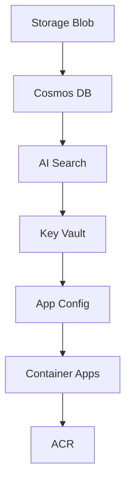
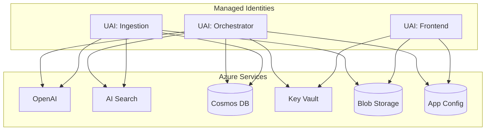
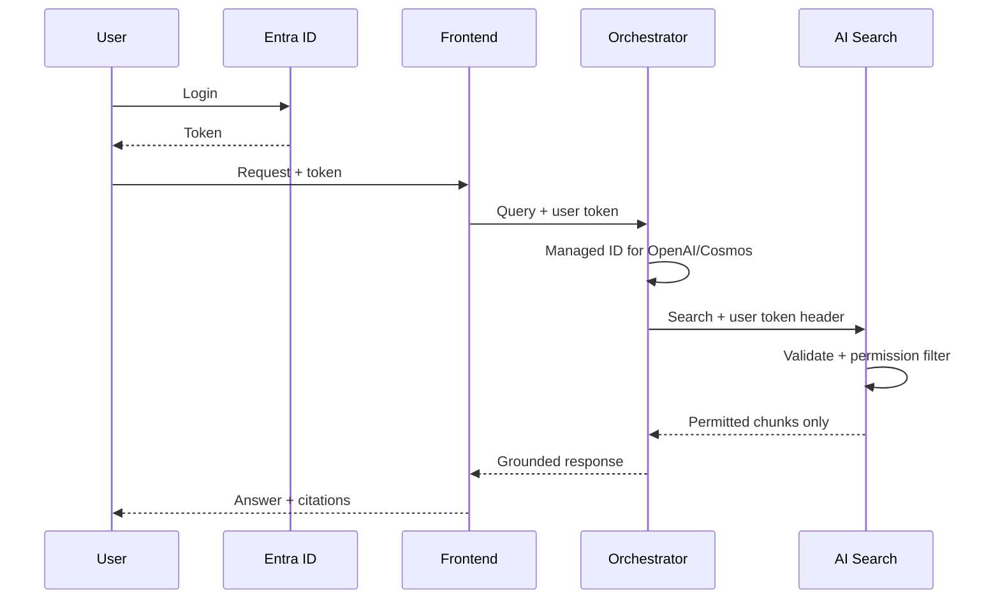

# GPT-RAG Solution Accelerator — Architecture Overview

> **Source:** [github.com/Azure/gpt-rag](https://github.com/Azure/gpt-rag) (v2.5.0)
> **Strategy:** Single Agent + SharePoint only (initial stage)

---

## High-Level Architecture



---

## Deployment Flow with azd



### What each hook does

| Hook | Actions |
|------|---------|
| **preprovision** | Validate Azure CLI auth, check quotas, verify prerequisites |
| **Bicep** | Deploy Hub + Project, OpenAI, AI Search, Cosmos DB, Key Vault, Container Apps Env, VNet, Managed Identities |
| **postprovision** | Create search index from `search.j2`, RAI setup via `setup.py`, Key Vault secrets, Knowledge Base/Source |
| **predeploy** | Dependency checks |
| **Deploy** | Push orchestrator, ingestion, frontend as Container Apps |

---

## Configuration Points

### Files You Edit (in the repo)

| File | Path | What You Configure |
|------|------|--------------------|
| `search.j2` | `config/search/` | Index schema, vector dims, analyzer, security fields, semantic config |
| `search.settings.j2` | `config/search/` | `ENABLE_AGENTIC_RETRIEVAL`, embedding dimensions, toggles |
| `raiblocklist.json` | `config/aifoundry/` | Organization-specific blocked terms |
| `raipolicies.json` | `config/aifoundry/` | Severity thresholds: hate, sexual, violence, self-harm |
| `azure.yaml` | Root | Service definitions, hooks (rarely changed) |

### Azure Portal / CLI Settings

| Setting | Where | What You Configure |
|---------|-------|--------------------|
| OpenAI Quota | Azure Portal | TPM for gpt-4o + embedding model, region |
| Entra ID | Azure Portal | App Registration, API Permissions (Sites.Read.All, Files.Read.All) |
| AI Search Tier | azd env / Bicep | Basic (dev), S1 (small prod), S2 (medium prod) |
| azd env variables | CLI | `AZURE_LOCATION`, model names, feature flags |

### Organizational Decisions

| Decision | Impacts | Options |
|----------|---------|---------|
| SharePoint scope | Ingestion + Entra permissions | Which sites, which libraries, include Lists? |
| Document security | Index schema + identity propagation | All users see all docs vs permission-aware filtering |
| Embedding model | search.j2 dims + cost + quality | large 3072d (recommended) vs small 1536d |
| RAI thresholds | raipolicies.json + raiblocklist.json | Content filter levels + blocked terms |
| Azure region | All resources | Must support gpt-4o + embeddings + AI Search |
| Network mode | Bicep landing zone | Private endpoints (prod) vs public (dev) |

---

## Data Flow: Indexing and Querying



---

## Repository Structure

```
github.com/Azure/gpt-rag (v2.5.0)
│
├── azure.yaml                     ← azd project definition + hooks
├── manifest.json                  ← component versions
│
├── config/
│   ├── search/
│   │   ├── search.j2              ← INDEX SCHEMA (most important config)
│   │   └── search.settings.j2    ← feature toggles
│   └── aifoundry/
│       ├── setup.py               ← RAI automation script
│       ├── raiblocklist.json      ← blocked terms
│       └── raipolicies.json       ← content filter thresholds
│
├── infra/
│   └── (bicep-ptn-aiml-landing-zone)  ← Git submodule, all Bicep here
│
├── scripts/
│   ├── preprovision.sh            ← pre-deploy validation
│   ├── postprovision.sh           ← index + RAI + secrets setup
│   └── predeploy.sh              ← dependency checks
│
└── components/
    ├── gpt-rag-orchestrator/      ← Agent logic (Python)
    ├── gpt-rag-ingestion/         ← Doc processing (Python)
    └── gpt-rag-ui/                ← Chat frontend (Python)
```

---

## Your Initial Scope

**Active now** — what gets deployed and used from day one:



**You configure:**

| What | File / Setting |
|------|----------------|
| Index schema | `search.j2` |
| RAI filters | `raiblocklist.json`, `raipolicies.json` |
| Entra ID | App registration + API permissions |
| SharePoint | Which sites and libraries to index |
| System prompt | Cosmos DB `prompts` container |
| azd env | Region, model names, feature flags |

**Available later** (not deployed in initial scope):

| Component | When to add |
|-----------|-------------|
| gpt-rag-mcp | When you need external API/tool integration |
| NL2SQL Indexes | When you want natural language database queries |
| Agentic Retrieval | When you want AI Search to plan sub-queries autonomously |

---

## Cosmos DB: Prompts and Runtime Data

GPT-RAG provisions a Cosmos DB account automatically during `azd provision`. It contains four containers:

| Container | Purpose | Who manages it |
|-----------|---------|----------------|
| `prompts` | **System prompts** — persona, tone, citation rules, guardrails | Content owner / project lead |
| `conversations` | Chat history per user session | Automatic (orchestrator writes) |
| `datasources` | Data source configuration | Admin during setup |
| `mcp` | MCP tool definitions (not used in Single Agent) | Developer (later) |

### Custom Prompts (no code needed)

The `prompts` container is where you define **how the chatbot behaves**: its persona, language, citation style, and domain-specific guardrails. You manage these via the **GPT-RAG Web UI** or directly in the **Azure Portal Cosmos DB Data Explorer**.

Changes take effect at runtime — no redeployment needed.

**What to configure in prompts:**
- System persona ("You are a helpful assistant for [organization]...")
- Citation behavior (how strictly to cite sources, what to do with no results)
- Tone and language (formal vs conversational, multilingual support)
- Domain guardrails ("only answer questions about X", "never provide legal advice")
- Response format preferences

---

## Preparation Checklist

| # | Category | Item | Status |
|---|----------|------|--------|
| 1 | Decision | Embedding model (recommend: large, 3072d) | ⬜ |
| 2 | Decision | SharePoint sites/libraries to index | ⬜ |
| 3 | Decision | Document-level security yes/no | ⬜ |
| 4 | Decision | RAI blocked terms and severity thresholds | ⬜ |
| 5 | Decision | Azure region | ⬜ |
| 6 | Decision | AI Search tier (S1 for prod) | ⬜ |
| 7 | Azure | Request OpenAI quota (gpt-4o + embeddings) | ⬜ |
| 8 | Azure | Entra ID app registration + API permissions | ⬜ |
| 9 | Azure | Network mode (private endpoints vs public) | ⬜ |
| 10 | Config | Edit raiblocklist.json with org terms | ⬜ |
| 11 | Config | Edit raipolicies.json thresholds | ⬜ |
| 12 | Config | Verify search.j2 defaults | ⬜ |
| 13 | Config | Write custom system prompt for Cosmos DB prompts container | ⬜ |

---

## Deep Dive: Service-to-Service Connections

Every Azure service in GPT-RAG communicates through **Azure App Configuration** as the central service registry. At deployment time, Bicep populates App Configuration with endpoints, resource IDs, and connection strings for every resource. Each Container App reads App Configuration at startup to discover its dependencies — no hardcoded connection strings anywhere.

### How Components Find Each Other



### Per-Component RBAC Roles

Each Container App gets a **user-assigned managed identity** (UAI) with specific RBAC roles — no shared credentials, no secrets in environment variables.

| Role | Orch | Ingest | Front | Purpose |
|------|:---:|:---:|:---:|---------|
| AppConfigDataReader | ✅ | ✅ | ✅ | Read endpoints from App Config |
| CogSvcUser | ✅ | ✅ | — | AI Foundry services |
| CogSvcOpenAIUser | ✅ | ✅ | — | OpenAI models |
| CosmosDBContributor | ✅ | ✅ | — | Cosmos DB read/write |
| SearchIndexReader | ✅ | — | — | Query search index |
| SearchIndexContributor | — | ✅ | — | Write to search index |
| BlobDataReader | ✅ | — | ✅ | Read blobs |
| BlobDataContributor | — | ✅ | — | Write blobs |
| BlobDelegator | — | — | ✅ | SAS token generation |
| KeyVaultSecretsUser | ✅ | ✅ | ✅ | Read secrets |
| AcrPull | ✅ | ✅ | ✅ | Pull container images |

**Key insight:** The orchestrator has **read-only** search access while ingestion has **write** access. Frontend has no AI or search access at all. This is **least privilege** in action.

### Communication Protocols

| From | To | Auth |
|------|-----|------|
| User browser | Frontend | Entra ID login |
| Frontend | Orchestrator | API key / managed identity |
| Orchestrator | OpenAI | Managed identity |
| Orchestrator | AI Search | Managed identity + user token |
| Orchestrator | Cosmos DB | Managed identity |
| Ingestion | SharePoint | Entra app registration |
| Ingestion | OpenAI | Managed identity |
| Ingestion | AI Search | Managed identity |
| Ingestion | Blob Storage | Managed identity |
| All apps | App Config | Managed identity |
| All apps | Key Vault | Managed identity |
| All apps | App Insights | Connection string |

---

## Deep Dive: VNet & Private Endpoint Topology

When `networkIsolation` is enabled (default for production), GPT-RAG creates a VNet with dedicated subnets and private endpoints for every Azure service. No service is publicly accessible.

### VNet Subnet Layout



### Private Endpoints (pe-subnet)

Serialized deployment to avoid race conditions:



### Private DNS Zones

| DNS Zone | Service |
|----------|---------|
| `privatelink.blob.core.windows.net` | Storage Blob |
| `privatelink.documents.azure.com` | Cosmos DB |
| `privatelink.search.windows.net` | AI Search |
| `privatelink.vaultcore.azure.net` | Key Vault |
| `privatelink.azconfig.io` | App Configuration |
| `privatelink.cognitiveservices.azure.com` | Cognitive Services |
| `privatelink.openai.azure.com` | Azure OpenAI |
| `privatelink.services.ai.azure.com` | AI Foundry |
| `privatelink.applicationinsights.io` | Application Insights |
| `privatelink.{region}.azurecontainerapps.io` | Container Apps |
| `privatelink.azurecr.io` | Container Registry |

Each DNS zone is linked to the VNet. Container Apps resolve private IPs — no public traffic between components.

### What This Means in Practice

- **Container Apps** run in `aca-environment-subnet` and reach all services through private DNS
- **All Azure services** sit behind private endpoints on `pe-subnet`
- **No public internet traffic** between components
- **Bastion + Jumpbox** for secure admin access
- **agent-subnet** reserved for AI Foundry Agent Service (future use)

---

## Deep Dive: Identity & Authentication Chain

GPT-RAG uses a **two-layer identity model**: user-assigned managed identities for service-to-service calls, and Entra ID tokens for end-user identity propagation.

### Managed Identity Architecture



### End-User Authentication Flow



### Key Identity Concepts

**Why two layers matter:**

- **Managed identities** (service-to-service): The orchestrator uses its own UAI to call OpenAI, read/write Cosmos DB, and read Key Vault. No passwords, no API keys, no rotation needed. Bicep assigns RBAC roles automatically.

- **User token propagation** (document-level security): The end user's Entra ID token is forwarded from the frontend through the orchestrator to AI Search via the `x-ms-query-source-authorization` HTTP header. AI Search validates the token and applies permission filters (`groupIds`, `userIds`, `rbacScope`). This ensures users only see documents they have access to in SharePoint.

**What happens without a user token:** AI Search returns zero results (fail-closed design). This is intentional — no anonymous access to documents.

**Deployer principal:** During `azd provision`, the deploying user also receives roles like `CosmosDBBuiltInDataContributor`, `SearchServiceContributor`, `KeyVaultSecretsOfficer` so that the postprovision scripts can create indexes, inject secrets, and populate Cosmos DB containers.

### App Configuration as Service Registry

Rather than each app discovering services independently, App Configuration acts as a central registry populated by Bicep at deployment time:

| Config Key | Value | Used By |
|------------|-------|---------|
| `COSMOS_DB_ENDPOINT` | Cosmos DB URI | Orch, Ingest |
| `SEARCH_SERVICE_QUERY_ENDPOINT` | AI Search endpoint | Orch, Ingest |
| `KEY_VAULT_URI` | Key Vault URL | All apps |
| `STORAGE_BLOB_ENDPOINT` | Blob endpoint | Ingest, Front |
| `AI_FOUNDRY_ACCOUNT_ENDPOINT` | OpenAI endpoint | Orch, Ingest |
| `MODEL_DEPLOYMENTS` | Model names + versions | Orch, Ingest |
| `CONTAINER_APPS` | App endpoints + FQDNs | Frontend |
| `AGENT_STRATEGY` | `single_agent_rag` | Orchestrator |
| `APPLICATIONINSIGHTS_CONNECTION_STRING` | App Insights | All apps |
| `NETWORK_ISOLATION` | `true` / `false` | All apps |
| `ENABLE_AGENTIC_RETRIEVAL` | `true` / `false` | Orchestrator |

This means: if you need to change a model deployment or toggle agentic retrieval, you update App Configuration — no redeployment of Container Apps needed.
