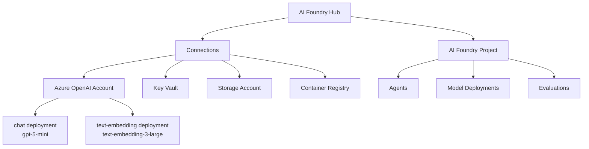
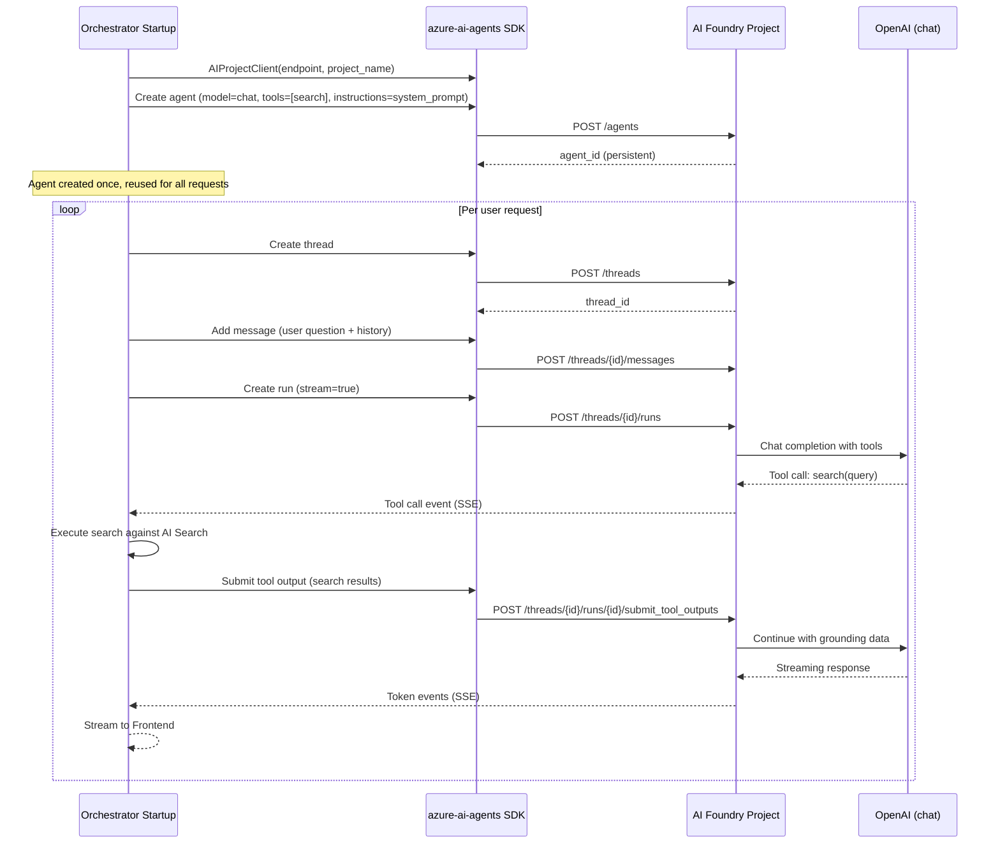
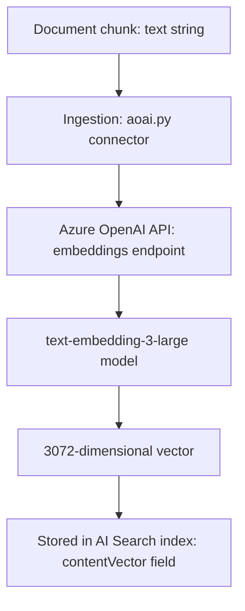
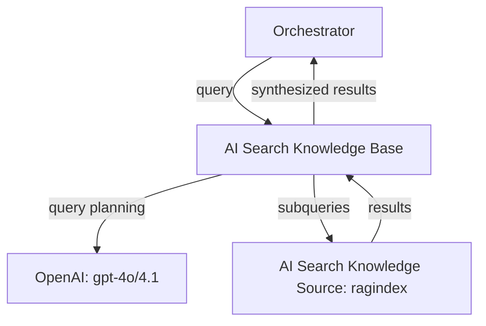

# Azure AI Foundry / OpenAI (in the GPT-RAG Accelerator)

> Everything about the Azure AI Foundry platform and Azure OpenAI models as deployed by the GPT-RAG accelerator: what gets provisioned (hub, project, model deployments), how the orchestrator uses the Agents API, how ingestion uses embeddings, Responsible AI setup, and how to customize it.
> **RAI config:** `config/aifoundry/raiblocklist.json`, `config/aifoundry/raipolicies.json`
> **RAI setup script:** `config/aifoundry/setup.py`

---

## 1. What the Accelerator Provisions

### 1.1 AI Foundry Hub

| Property | Value |
|----------|-------|
| **Resource type** | `Microsoft.MachineLearningServices/workspaces` (kind: `hub`) |
| **Deployment toggle** | `deployAiFoundry` (default: `true`) |
| **Bicep location** | `infra/main.bicep` (via `bicep-ptn-aiml-landing-zone` submodule) |
| **Name pattern** | `hub-{token}` |
| **Purpose** | Top-level container that groups AI projects, connections, and shared resources |

The hub is the organizational parent. It holds connections to dependent Azure services (Key Vault, Storage, Container Registry) and provides the management plane for AI projects underneath it.

### 1.2 AI Foundry Project

| Property | Value |
|----------|-------|
| **Resource type** | `Microsoft.MachineLearningServices/workspaces` (kind: `project`) |
| **Name pattern** | `proj-{token}` |
| **Parent** | The AI Foundry Hub |
| **Purpose** | Workspace where model deployments, agents, and evaluations live |

The project inherits the hub's connections and adds project-specific resources. The GPT-RAG orchestrator connects to the project endpoint when using the Azure AI Agents API.

### 1.3 Azure OpenAI / Cognitive Services Account

| Property | Value |
|----------|-------|
| **Resource type** | `Microsoft.CognitiveServices/accounts` |
| **Name pattern** | `ai-{token}` or `oai-{token}` |
| **Kind** | `OpenAI` |
| **Purpose** | Hosts the model deployments (chat + embeddings) |

This is the underlying Cognitive Services account that provides the OpenAI API surface. It is connected to the AI Foundry Hub and accessible through the project.

### 1.4 Model Deployments

Two model deployments are created inside the AI Foundry account:

**Chat Model:**

| Property | Value |
|----------|-------|
| **Deployment name** | `chat` |
| **Canonical name** | `CHAT_DEPLOYMENT_NAME` |
| **Model** | `gpt-5-mini` (configurable in `main.parameters.json`) |
| **Format** | OpenAI |
| **SKU** | GlobalStandard |
| **Capacity** | 40K TPM (tokens per minute) |
| **API version** | 2025-01-01-preview |
| **Used by** | Orchestrator (chat completions, agent reasoning) |

**Embedding Model:**

| Property | Value |
|----------|-------|
| **Deployment name** | `text-embedding` |
| **Canonical name** | `EMBEDDING_DEPLOYMENT_NAME` |
| **Model** | `text-embedding-3-large` |
| **Format** | OpenAI |
| **SKU** | Standard |
| **Capacity** | 40K TPM |
| **API version** | 2025-01-01-preview |
| **Used by** | Ingestion (generate chunk embeddings at 3072 dimensions), AI Search integrated vectorizer (query-time embeddings) |

### 1.5 Managed Identity

| Property | Value |
|----------|-------|
| **Identity name pattern** | `id-{aiFoundryAccountName}` |
| **Type** | User-assigned (UAI) |
| **Purpose** | AI Foundry account-level operations |

### 1.6 RBAC Roles Granted to Container Apps

| Role | Orchestrator | Ingestion | MCP | Frontend |
|------|:------------:|:---------:|:---:|:--------:|
| `CognitiveServicesUser` | ✅ | ✅ | ✅ | — |
| `CognitiveServicesOpenAIUser` | ✅ | ✅ | ✅ | — |

Frontend has **no** access to AI Foundry or OpenAI. It only communicates with the Orchestrator.

### 1.7 Deployer Principal Roles (during `azd provision`)

| Role | Purpose |
|------|---------|
| `CognitiveServicesContributor` | Create and manage AI services |
| `CognitiveServicesOpenAIUser` | Test model deployments |

### 1.8 Private Endpoints (when networkIsolation = true)

AI Foundry / OpenAI services are accessible only through private endpoints:

| DNS Zone | Purpose |
|----------|---------|
| `privatelink.cognitiveservices.azure.com` | Cognitive Services API |
| `privatelink.openai.azure.com` | OpenAI API |
| `privatelink.services.ai.azure.com` | AI Services |

### 1.9 App Configuration Keys

Bicep populates these keys so apps can discover the AI Foundry endpoint:

| Config Key | Value | Used By |
|------------|-------|---------|
| `AI_FOUNDRY_ACCOUNT_ENDPOINT` | `https://{name}.openai.azure.com` | Orchestrator, Ingestion |
| `CHAT_DEPLOYMENT_NAME` | `chat` | Orchestrator |
| `EMBEDDING_DEPLOYMENT_NAME` | `text-embedding` | Ingestion, Orchestrator |
| `MODEL_DEPLOYMENTS` | JSON array of model names + versions | Orchestrator, Ingestion |

---

## 2. Resource Hierarchy

### 2.1 How Hub, Project, and Account Relate



### 2.2 What Lives Where

| Resource | Level | Notes |
|----------|-------|-------|
| Model deployments | OpenAI Account | Shared across projects in the same hub |
| Agents | Project | Created by orchestrator at startup |
| Connections | Hub | Inherited by all projects |
| RAI policies | OpenAI Account | Applied to model deployments |
| Evaluations | Project | Optional — for quality assessment |

---

## 3. How the Orchestrator Uses AI Foundry

### 3.1 SDK Stack

| Library | Version | Purpose |
|---------|---------|---------|
| `azure-ai-agents` | latest | Azure AI Agents API (create agents, threads, runs) |
| `azure-ai-projects` | latest | AIProjectClient (project-level operations) |
| `openai` | latest | Direct OpenAI API calls (fallback / legacy) |
| `semantic-kernel` | 1.34.0 | MCP and NL2SQL strategy orchestration |
| `tiktoken` | 0.8.0 | Token counting for context window management |

### 3.2 Authentication

The orchestrator authenticates to AI Foundry using its managed identity:

```
DefaultAzureCredential (ManagedIdentityCredential → AzureCLICredential)
  → CognitiveServicesUser role → AI Foundry Account
  → CognitiveServicesOpenAIUser role → OpenAI API
```

No API keys are used. The identity chain is:
1. Container App uses its UAI (`AZURE_CLIENT_ID` env var)
2. `DefaultAzureCredential` acquires a token for the `cognitiveservices.azure.com` audience
3. Token is used in all SDK calls

### 3.3 Agent Lifecycle (Single Agent RAG Strategy)

The default strategy (`single_agent_rag`) uses the Azure AI Agents API:



### 3.4 Agent Configuration

| Property | Value | Source |
|----------|-------|--------|
| **Model** | `chat` deployment (gpt-5-mini) | `CHAT_DEPLOYMENT_NAME` from App Configuration |
| **System prompt** | Loaded from filesystem (`/prompts/single_agent_rag/`) or Cosmos DB | `PROMPT_SOURCE` setting |
| **Tools** | Search plugin (hybrid/vector/BM25) | Registered at agent creation |
| **Temperature** | Configurable | `TEMPERATURE` from App Configuration |
| **Top P** | Configurable | `TOP_P` from App Configuration |
| **Max tokens** | 128K context window (gpt-4o family) | Managed by tiktoken |

### 3.5 Other Strategies and AI Foundry

| Strategy | AI Foundry Usage |
|----------|-----------------|
| `single_agent_rag` (v2) | Azure AI Agents API — full lifecycle (agents, threads, runs, tool calls) |
| `single_agent_rag_v1` | Legacy Azure AI Agents API (older SDK version) |
| `mcp` | Semantic Kernel — uses OpenAI chat completions directly (not Agents API) |
| `nl2sql` | Semantic Kernel Group Chat — uses OpenAI chat completions for 3-agent orchestration |

The MCP and NL2SQL strategies bypass the Agents API and use the OpenAI chat completion endpoint directly through Semantic Kernel. They still connect to the same `AI_FOUNDRY_ACCOUNT_ENDPOINT` and use the same `chat` deployment.

---

## 4. How Ingestion Uses OpenAI

### 4.1 Embedding Generation

The ingestion app uses the embedding model for a single purpose: generating vector embeddings for document chunks.

| Property | Value |
|----------|-------|
| **Model** | `text-embedding-3-large` |
| **Deployment** | `text-embedding` |
| **Dimensions** | 3072 (configurable via `EMBEDDINGS_VECTOR_DIMENSIONS`) |
| **SDK** | Azure OpenAI Python SDK |
| **Auth** | Managed identity (`CognitiveServicesOpenAIUser`) |

### 4.2 Embedding Flow



### 4.3 Rate Limiting and Retry

The ingestion app implements robust retry logic for embedding calls:

| Parameter | Value |
|-----------|-------|
| **Max retries** | 20 |
| **Backoff** | Exponential with jitter |
| **Max wait** | 60 seconds cap |
| **Concurrency** | `AOAI_MAX_CONCURRENCY` (default: 2) |
| **Capacity** | 40K TPM (standard deployment) |

When the embedding endpoint returns HTTP 429 (rate limited), the ingestion app backs off with exponential delays and retries. The jitter prevents thundering herd problems when multiple concurrent items hit the rate limit simultaneously.

### 4.4 Ingestion Does NOT Use Chat Models

The ingestion app has `CognitiveServicesOpenAIUser` access but only uses the embedding model. It does not call chat completions — that's the orchestrator's job.

---

## 5. AI Search Integrated Vectorizer

### 5.1 Query-Time Embedding

The AI Search index includes an integrated Azure OpenAI vectorizer. This means text queries submitted to AI Search are automatically embedded at query time — the orchestrator doesn't need to pre-embed queries before searching.

| Property | Value |
|----------|-------|
| **Vectorizer type** | Azure OpenAI (integrated in index profile) |
| **Model** | `text-embedding-3-large` |
| **Deployment** | `text-embedding` (same as ingestion) |
| **Dimensions** | 3072 |
| **Configured in** | `config/search/search.j2` (index template) |

### 5.2 How It Works

1. Orchestrator sends a text query to AI Search (e.g., via `VectorizableTextQuery`)
2. AI Search internally calls the Azure OpenAI embedding endpoint
3. The query embedding is compared against stored `contentVector` values
4. Results are returned with similarity scores

This means the embedding model serves two consumers: ingestion (at index time, high volume) and AI Search (at query time, per-request).

---

## 6. Responsible AI Setup

### 6.1 Overview

GPT-RAG automates Responsible AI configuration through the postprovision hook. Two config files define the content safety policies, and a Python script applies them to the model deployments.

### 6.2 Configuration Files

**`config/aifoundry/raiblocklist.json`** — Custom content blocklists:
- Define blocked terms and patterns specific to your organization
- Applied to model deployments as hard-block rules
- Terms matching the blocklist are rejected before reaching the model

**`config/aifoundry/raipolicies.json`** — Content filtering policies:
- Severity thresholds for four categories: hate, sexual, violence, self-harm
- Per-category filtering sensitivity (low, medium, high)
- Applied as soft-block rules that can be configured per deployment

### 6.3 Automation Script: `config/aifoundry/setup.py`

The postprovision hook runs this script to:

1. **Create custom blocklists** — Reads `raiblocklist.json`, creates blocklist items via `CognitiveServicesManagementClient`
2. **Create content filtering policies** — Reads `raipolicies.json`, normalizes severity levels, creates filter policies
3. **Associate policies with deployments** — Links content filter policies to Azure OpenAI model deployments (chat models only — not embeddings)
4. **Inject secrets** — Stores evaluation API keys and configuration in Key Vault

### 6.4 Content Safety Categories

| Category | What It Filters |
|----------|----------------|
| **Hate** | Content promoting hatred or discrimination based on protected characteristics |
| **Sexual** | Sexually explicit content |
| **Violence** | Content depicting or promoting violence |
| **Self-harm** | Content related to self-harm or suicide |

Each category has configurable severity thresholds: the policy defines at what severity level content should be blocked.

### 6.5 How to Customize RAI

1. Edit `config/aifoundry/raiblocklist.json` to add organization-specific blocked terms
2. Edit `config/aifoundry/raipolicies.json` to adjust severity thresholds
3. Re-run `azd provision` to apply the updated policies via the postprovision hook

The RAI policies are applied only to chat model deployments, not to the embedding model.

---

## 7. User Feedback Loop (v2.1.0+)

### 7.1 Architecture

The Frontend collects user feedback (thumbs up/down, optional 5-star rating with comments) and sends events to Application Insights. This data can be used to:

- Monitor response quality over time
- Identify problematic queries or topics
- Feed into Azure AI Foundry evaluation workflows
- Track improvement after prompt or model changes

### 7.2 Configuration

| Key | Default | Purpose |
|-----|---------|---------|
| `ENABLE_USER_FEEDBACK` | `false` | Show feedback buttons |
| `USER_FEEDBACK_RATING` | `false` | Enable 5-star rating popup |

### 7.3 Integration with Foundry Evaluations

Azure AI Foundry provides evaluation capabilities that can consume feedback data:

- **Offline evaluations** — Run batch evaluations against stored Q&A pairs with feedback labels
- **Quality metrics** — Groundedness, relevance, coherence, fluency
- **Custom evaluators** — Build domain-specific evaluation criteria

GPT-RAG does not automate this integration out of the box, but the feedback events in Application Insights provide the data needed to build evaluation pipelines.

---

## 8. Compute and Pricing Model

### 8.1 Serverless Inference (Default)

GPT-RAG uses serverless (pay-per-token) model deployments. No compute instances to manage.

| Model | SKU | Capacity | Pricing Model |
|-------|-----|----------|---------------|
| `gpt-5-mini` (chat) | GlobalStandard | 40K TPM | Pay-per-token |
| `text-embedding-3-large` | Standard | 40K TPM | Pay-per-token |

### 8.2 When to Consider Provisioned Throughput

| Factor | Serverless | Provisioned |
|--------|-----------|-------------|
| Cost at low volume | Lower | Higher (fixed cost) |
| Cost at high volume (>1M tokens/day) | Higher | Lower |
| Latency guarantees | Best-effort | Guaranteed |
| Capacity guarantees | Subject to availability | Reserved |
| Management overhead | None | Capacity planning needed |

For most initial deployments, serverless is appropriate. Switch to provisioned throughput when you have sustained high-volume usage and need latency guarantees.

### 8.3 Capacity Planning

**Chat model consumption estimate:**
- Average query: ~2,000 input tokens (system prompt + search results + history) + ~500 output tokens
- At 40K TPM: ~16 requests/minute sustained
- For higher concurrency, increase the TPM capacity in `main.parameters.json`

**Embedding model consumption estimate:**
- Average chunk: ~500 tokens → ~500 tokens per embedding call
- At 40K TPM: ~80 embeddings/minute
- Initial ingestion of 10,000 documents (~50,000 chunks) takes ~10 hours at this rate
- For faster ingestion, increase TPM capacity or use provisioned throughput

---

## 9. Region and Model Availability

### 9.1 Region Considerations

Azure OpenAI models are not available in all regions. Key factors:

| Requirement | Recommended Regions |
|------------|-------------------|
| GPT-4o / GPT-5-mini | East US, East US 2, West US, Sweden Central |
| text-embedding-3-large | Most Azure OpenAI regions |
| AI Search with vector search | Most regions |
| Foundry Agent Service | Check current GA regions |
| Low latency for EU users | Sweden Central, West Europe |

**Recommendation:** Deploy in **East US 2** or **Sweden Central** for broadest model availability.

### 9.2 Model Versioning

Models are deployed with specific versions in `main.parameters.json`. When Azure OpenAI releases new model versions:

1. Update the `modelDeploymentList` in `main.parameters.json`
2. Run `azd provision` to update the deployments
3. No application code changes needed — the deployment name (`chat`, `text-embedding`) stays the same

---

## 10. Configuration Reference

### 10.1 App Configuration Keys

| Key | Type | Default | Used By | Purpose |
|-----|------|---------|---------|---------|
| `AI_FOUNDRY_ACCOUNT_ENDPOINT` | string | (Bicep) | Orchestrator, Ingestion | OpenAI API endpoint |
| `CHAT_DEPLOYMENT_NAME` | string | `chat` | Orchestrator | Chat model deployment |
| `EMBEDDING_DEPLOYMENT_NAME` | string | `text-embedding` | Ingestion, Orchestrator | Embedding model deployment |
| `TEMPERATURE` | float | (model default) | Orchestrator | Chat completion temperature |
| `TOP_P` | float | (model default) | Orchestrator | Nucleus sampling parameter |
| `EMBEDDINGS_VECTOR_DIMENSIONS` | int | `3072` | Ingestion | Embedding dimensions |
| `MODEL_DEPLOYMENTS` | string | JSON array | Orchestrator, Ingestion | Model metadata |

### 10.2 Bicep Parameters (main.parameters.json)

| Parameter | Default | Purpose |
|-----------|---------|---------|
| `deployAiFoundry` | `true` | Deploy AI Foundry Hub + Project |
| `modelDeploymentList` | Array with chat + embedding | Model names, versions, SKUs, capacities |
| Chat model name | `gpt-5-mini` | Configurable |
| Embedding model name | `text-embedding-3-large` | Configurable |
| Chat capacity | `40000` (40K TPM) | Configurable |
| Embedding capacity | `40000` (40K TPM) | Configurable |

### 10.3 RAI Configuration Files

| File | Path | Purpose |
|------|------|---------|
| `raiblocklist.json` | `config/aifoundry/` | Custom content blocklist definitions |
| `raipolicies.json` | `config/aifoundry/` | Content filtering policy definitions |
| `setup.py` | `config/aifoundry/` | RAI automation script (runs in postprovision) |

---

## 11. Network Topology

### 11.1 Private Endpoints

When `networkIsolation = true`, AI Foundry / OpenAI is accessible only through private endpoints on `pe-subnet`:

| DNS Zone | Purpose |
|----------|---------|
| `privatelink.cognitiveservices.azure.com` | Cognitive Services |
| `privatelink.openai.azure.com` | OpenAI API |
| `privatelink.services.ai.azure.com` | AI Services |

### 11.2 Who Connects to AI Foundry / OpenAI

| Component | Direction | RBAC Role | What It Does |
|-----------|-----------|-----------|-------------|
| Orchestrator | Chat completions | `CognitiveServicesUser` + `CognitiveServicesOpenAIUser` | Agent reasoning, chat responses |
| Ingestion | Embeddings | `CognitiveServicesUser` + `CognitiveServicesOpenAIUser` | Generate chunk vectors |
| MCP Server | Chat completions | `CognitiveServicesUser` + `CognitiveServicesOpenAIUser` | Tool-augmented reasoning |
| AI Search | Embeddings (vectorizer) | Service-level connection | Query-time embedding via integrated vectorizer |
| Deployer | Management | `CognitiveServicesContributor` | Create deployments, apply RAI policies |

### 11.3 No Frontend Access

The Frontend has no `CognitiveServicesUser` or `CognitiveServicesOpenAIUser` role. It cannot call OpenAI models directly. All AI interactions go through the Orchestrator.

---

## 12. Agent Subnet (Foundry Agent Service)

### 12.1 Dedicated Subnet

When using the Azure AI Agents API (the default `single_agent_rag` strategy), the Foundry Agent Service requires network connectivity. The Bicep template provisions a dedicated `agent-subnet`:

| Property | Value |
|----------|-------|
| **Subnet name** | `agent-subnet` |
| **CIDR** | Configurable |
| **Service endpoints** | `CognitiveServices`, `AzureCosmosDB` |
| **Purpose** | AI Foundry Agent Service operations |

This subnet is separate from the Container Apps subnet and the private endpoint subnet. It ensures the Agent Service has the network paths it needs to:
- Call OpenAI models for reasoning
- Access connected resources (search, storage) for tool execution
- Store agent state and thread history

---

## 13. Agentic Retrieval Connection

### 13.1 How AI Foundry and AI Search Interact for Agentic Retrieval

When `ENABLE_AGENTIC_RETRIEVAL=true`, the orchestrator sends queries to an AI Search Knowledge Base. The Knowledge Base uses an LLM (from the AI Foundry account) for query planning:



The LLM used for query planning is hosted on the same AI Foundry account but is a separate concern from the orchestrator's chat model. The Knowledge Base's `retrievalReasoningEffort` is set to `minimal` to control costs.

---

## 14. Telemetry

### 14.1 What Gets Logged

AI Foundry / OpenAI calls are traced through Application Insights:

| Metric | Source | What It Tells You |
|--------|--------|-------------------|
| Chat completion latency | Orchestrator | Model response time |
| Token usage (input/output) | Orchestrator | Cost tracking |
| Embedding generation time | Ingestion | Embedding throughput |
| Rate limit events (429) | Ingestion | Capacity saturation |
| Agent run duration | Orchestrator | End-to-end agent execution time |
| Tool call counts | Orchestrator | How often the agent invokes search |

### 14.2 Cost Monitoring

Track OpenAI costs by monitoring:
- `CHAT_DEPLOYMENT_NAME` token usage in Azure Portal → Cognitive Services metrics
- Application Insights custom metrics for per-request token counts
- Rate limit frequency (indicates need for capacity increase)

---

## 15. Troubleshooting

### 15.1 Common Issues

| Issue | Likely Cause | Fix |
|-------|-------------|-----|
| "Model not found" | Deployment name mismatch | Verify `CHAT_DEPLOYMENT_NAME` / `EMBEDDING_DEPLOYMENT_NAME` match actual deployment names |
| HTTP 429 on embeddings | Rate limited | Increase TPM capacity in `main.parameters.json`, or reduce `AOAI_MAX_CONCURRENCY` |
| HTTP 429 on chat | Rate limited | Increase chat model TPM capacity |
| Slow agent responses | Large context window | Reduce conversation history, lower `TOP_K`, shorten system prompt |
| Agent not finding documents | Search tool misconfigured | Check `SEARCH_RAG_INDEX_NAME`, verify index has documents, test search directly |
| RAI content blocked | Content filter too aggressive | Adjust thresholds in `raipolicies.json`, re-run `azd provision` |
| "Endpoint not found" | Wrong `AI_FOUNDRY_ACCOUNT_ENDPOINT` | Verify App Configuration value matches actual Cognitive Services endpoint |
| Auth failure | RBAC not assigned | Verify app's UAI has `CognitiveServicesUser` + `CognitiveServicesOpenAIUser` |
| Embedding dimension mismatch | Config vs model | Ensure `EMBEDDINGS_VECTOR_DIMENSIONS` matches model output (3072 for text-embedding-3-large) |
| Agent creation fails at startup | Project endpoint wrong | Verify AI Foundry project endpoint and project name |

### 15.2 Diagnostic Commands

**List model deployments:**
```bash
az cognitiveservices account deployment list \
  --name {cognitive-services-account-name} \
  --resource-group {rg-name} \
  --output table
```

**Check deployment capacity:**
```bash
az cognitiveservices account deployment show \
  --name {cognitive-services-account-name} \
  --resource-group {rg-name} \
  --deployment-name chat
```

**Test chat completion:**
```bash
az cognitiveservices account deployment invoke \
  --name {cognitive-services-account-name} \
  --resource-group {rg-name} \
  --deployment-name chat \
  --text "Hello, are you working?"
```

**Check RAI policies:**
```bash
az cognitiveservices account list-rai-policies \
  --name {cognitive-services-account-name} \
  --resource-group {rg-name}
```

---

## 16. Version History (AI Foundry–Related Changes)

| Version | Date | AI Foundry–Related Change |
|---------|------|--------------------------|
| **v2.5.2** | 2026-03 | Deployment script improvements (no Foundry changes) |
| **v2.5.1** | 2026-03 | Infra submodule pinned to bicep-ptn-aiml-landing-zone v1.0.1 (no Foundry changes) |
| **v2.5.0** | 2026-03 | IaC migrated to bicep-ptn-aiml-landing-zone (Foundry provisioning now via submodule) |
| **v2.4.0** | 2026-01 | No AI Foundry changes (security changes were in AI Search) |
| **v2.3.0** | 2025-12 | MCP strategy added (uses Semantic Kernel with OpenAI, not Agents API) |
| **v2.2.0** | 2025-10 | Agentic retrieval — Knowledge Base uses Foundry-hosted LLM for query planning |
| **v2.1.0** | 2025-08 | User feedback loop (Application Insights events for future evaluation integration) |
| **v2.0.0** | 2025-07 | Major refactor — introduced Azure AI Agents API as default strategy, AI Foundry Hub/Project structure |

---

## 17. What Each Team Needs to Know

### For the Security / Identity Team

- All model access is via managed identity — no API keys in environment variables or app settings
- Two RBAC roles per app: `CognitiveServicesUser` + `CognitiveServicesOpenAIUser`
- Frontend has zero access to AI models (least privilege)
- RAI policies (content filtering + blocklists) are applied to all chat model deployments
- Private endpoints for three DNS zones when network isolation is enabled
- Dedicated `agent-subnet` for Foundry Agent Service with CognitiveServices + CosmosDB service endpoints

### For the DevOps / Infrastructure Team

- AI Foundry Hub + Project + model deployments are provisioned by Bicep
- Model names, versions, SKUs, and capacities are configurable in `main.parameters.json`
- RAI setup is automated via `config/aifoundry/setup.py` in the postprovision hook
- Three private DNS zones needed for full network isolation
- Monitor TPM usage — increase capacity if 429 errors appear
- Model version upgrades: update `modelDeploymentList` and run `azd provision`

### For the Development / Customization Team

- The default strategy uses the `azure-ai-agents` SDK — agent is created once at startup, reused for all requests
- System prompts live in `/prompts/single_agent_rag/` (default) or Cosmos DB (if `PROMPT_SOURCE=cosmos`)
- `TEMPERATURE` and `TOP_P` are tunable via App Configuration (restart required)
- To change the chat model: update `CHAT_DEPLOYMENT_NAME` in App Configuration to point to a new deployment
- MCP and NL2SQL strategies use Semantic Kernel with direct OpenAI calls (not Agents API)
- Token counting via tiktoken ensures context stays within model limits (128K for gpt-4o family)
- Embedding dimensions (3072) must be consistent between ingestion and search index

### For the Architecture Team

- Two-model architecture: chat (reasoning) + embedding (vector generation)
- The chat model serves three consumers: orchestrator agent, agentic retrieval query planning, and AI Search integrated vectorizer query-time embedding
- The embedding model serves two consumers: ingestion (index time) and AI Search (query time)
- Agent strategies decouple the orchestration pattern from the underlying model — same endpoint, different SDK layers
- Serverless deployment means no idle compute cost — pay only for tokens consumed
- RAI is defense-in-depth: content filters + blocklists + system prompt guardrails + document-level security
