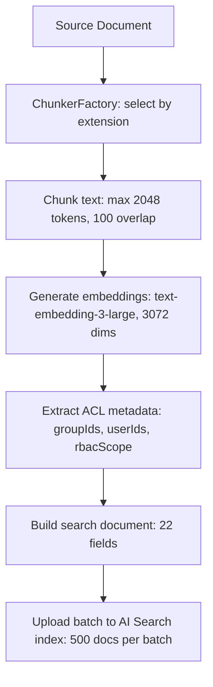
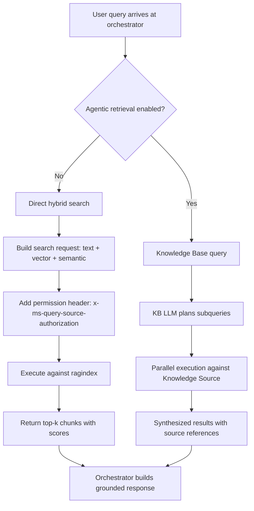
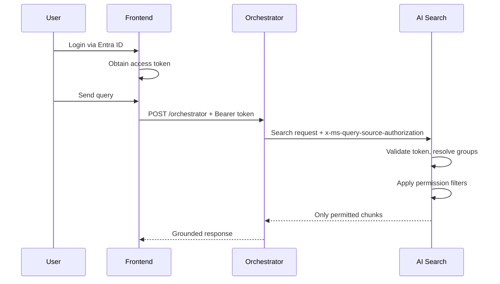

# Azure AI Search (in the GPT-RAG Accelerator)

> Everything about the Azure AI Search service as deployed by the GPT-RAG accelerator: what gets provisioned, how the index is structured, how ingestion writes to it, how the orchestrator queries it, document-level security, agentic retrieval, and how to customize it.
> **Index template:** `config/search/search.j2` (Jinja2)
> **Settings template:** `config/search/search.settings.j2`

---

## 1. What the Accelerator Provisions

### 1.1 Search Service

| Property | Value |
|----------|-------|
| **Resource type** | `Microsoft.Search/searchServices` |
| **Deployment toggle** | `deploySearchService` (default: `true`) |
| **Bicep location** | `infra/main.bicep` (via `bicep-ptn-aiml-landing-zone` submodule) |
| **Name pattern** | `search-{token}` |
| **SKU** | Configurable in `main.parameters.json` (typically `standard`) |
| **Replicas** | 1 (default) |
| **Partitions** | 1 (default) |
| **Hosting mode** | Default |
| **Semantic ranker** | Enabled (required for hybrid search and agentic retrieval) |
| **Public network access** | Disabled when `networkIsolation = true` |

### 1.2 Managed Identity

| Property | Value |
|----------|-------|
| **Identity name pattern** | `id-{searchServiceName}` |
| **Type** | User-assigned (UAI) |
| **RBAC roles on self** | `SearchIndexDataReader`, `SearchServiceContributor` |
| **RBAC roles on Storage** | `StorageBlobDataReader` |

The search service's own managed identity is used for built-in skills (e.g., reading blobs during skillset execution). It does not need OpenAI or Cosmos DB access — those are handled by the Container Apps.

### 1.3 Private Endpoint (when networkIsolation = true)

| Property | Value |
|----------|-------|
| **Subnet** | `pe-subnet` (/26, 64 IPs) |
| **Private DNS zone** | `privatelink.search.windows.net` |
| **Deployment order** | 3rd in serialized PE chain (after Storage Blob and Cosmos DB) |

### 1.4 App Configuration Keys

Bicep populates these keys so other apps can discover the search service:

| Config Key | Value | Used By |
|------------|-------|---------|
| `SEARCH_SERVICE_QUERY_ENDPOINT` | `https://{searchServiceName}.search.windows.net` | Orchestrator, Ingestion |
| `ENABLE_AGENTIC_RETRIEVAL` | `true` / `false` | Orchestrator |

### 1.5 RBAC Roles Granted to Container Apps

| Role | Orchestrator | Ingestion | MCP | Frontend |
|------|:------------:|:---------:|:---:|:--------:|
| `SearchIndexDataReader` | ✅ | — | — | — |
| `SearchIndexDataContributor` | — | ✅ | ✅ | — |

Key design: Orchestrator has **read-only** access (query). Ingestion and MCP have **write** access (index documents). Frontend has **no** search access at all.

### 1.6 Deployer Principal Roles (during `azd provision`)

| Role | Purpose |
|------|---------|
| `SearchServiceContributor` | Create and manage the search service |
| `SearchIndexDataContributor` | Create indexes, upload initial data |

---

## 2. Index Architecture

### 2.1 Index Template (search.j2)

GPT-RAG defines the search index via a Jinja2 template at `config/search/search.j2`. This template is rendered and applied during the `postprovision` hook. The index name follows the pattern `ragindex` (configurable).

The Jinja2 templating allows the index schema to be parameterized — dimensions, analyzer name, and agentic retrieval settings are injected from `search.settings.j2` at provisioning time.

### 2.2 Core Content Fields

| Field | Type | Purpose | Search Config |
|-------|------|---------|---------------|
| `id` | String | Chunk identifier (unique key) | Keyword analyzer |
| `parent_id` | String | Reference to parent document | Filterable |
| `content` | String | Text chunk content | Searchable, configurable analyzer |
| `contentVector` | Vector (Collection(Single)) | Text embedding | 3072 dimensions (configurable) |
| `imageCaptions` | String | Image verbalization text | Searchable |
| `captionVector` | Vector (Collection(Single)) | Image caption embedding | 3072 dimensions |

### 2.3 Security Fields (Permission Filters)

| Field | Type | Permission Filter | Purpose |
|-------|------|-------------------|---------|
| `metadata_security_group_ids` | Collection(String) | `groupIds` | Entra group membership filtering |
| `metadata_security_user_ids` | Collection(String) | `userIds` | Individual user access control |
| `metadata_security_rbac_scope` | String | `rbacScope` | RBAC scope-based access |

These three fields are the foundation of document-level security. At index time, the ingestion component populates them from SharePoint permissions or blob metadata. At query time, AI Search uses the user's Entra token to evaluate access automatically.

### 2.4 Metadata Fields

| Field | Type | Purpose |
|-------|------|---------|
| `title` | String | Document title (semantic title field) |
| `category` | String | Document category (semantic keyword field) |
| `filepath` | String | Source file path |
| `url` | String | Source URL |
| `summary` | String | Chunk/document summary |
| `relatedImages` | Collection(String) | Related image references |
| `relatedFiles` | Collection(String) | Related file references |
| `page` | Int32 | Source page number |
| `offset` | Int32 | Character offset in source |
| `length` | Int32 | Chunk length |
| `chunk_id` | String | Unique chunk identifier |

### 2.5 Total Field Count

The index has approximately 22 fields: 6 content/vector fields, 3 security fields, and ~13 metadata fields. This is the full schema — there is no separate index for images or metadata. Everything goes into one unified index (`ragindex`).

---

## 3. Vector Search Configuration

### 3.1 Algorithm

| Parameter | Value |
|-----------|-------|
| **Algorithm** | HNSW (Hierarchical Navigable Small World) |
| **m** | 4 (bi-directional links per node) |
| **efConstruction** | 400 (index build quality) |
| **efSearch** | 500 (query recall quality) |
| **Metric** | Cosine similarity |

HNSW is an approximate nearest neighbor algorithm. Higher `m` and `efConstruction` produce a better-quality graph but cost more at indexing time. Higher `efSearch` improves recall at query time but adds latency.

### 3.2 Vectorizer

The index profile includes an integrated Azure OpenAI vectorizer, so queries submitted as text are automatically embedded at query time. This means the orchestrator can send a text query and AI Search handles the embedding internally.

| Property | Value |
|----------|-------|
| **Model** | `text-embedding-3-large` |
| **Dimensions** | 3072 (default, configurable in `search.settings.j2`) |
| **Deployment** | `text-embedding` (same deployment used by ingestion) |

### 3.3 Vector Profiles

The index defines vector search profiles that combine the HNSW algorithm with the Azure OpenAI vectorizer. Both `contentVector` and `captionVector` fields use the same profile configuration.

---

## 4. Semantic Configuration

Semantic ranking uses Microsoft's deep learning models (from Bing) to rerank the top results from BM25 or RRF (Reciprocal Rank Fusion).

### 4.1 Semantic Config Fields

| Role | Field(s) |
|------|----------|
| **Content fields** | `content`, `imageCaptions` |
| **Keyword field** | `category` |
| **Title field** | `title` |

### 4.2 How Semantic Ranking Works

1. Input summarization — up to 2,048 tokens per document assembled from title (128 tokens), keywords (128 tokens), and content (remaining)
2. L2 reranking — language model scores each document for semantic relevance
3. Output — `@search.rerankerScore` (0.0–4.0), semantic captions, optional semantic answers

### 4.3 Reranker Score Interpretation

| Score | Meaning |
|-------|---------|
| 4.0 | Highly relevant, answers question completely |
| 3.0 | Relevant but lacks some detail |
| 2.0 | Somewhat relevant, partial answer |
| 1.0 | Related but only answers small part |
| 0.0 | Irrelevant |

### 4.4 Query Rewrite (Preview)

Semantic ranker can generate up to 10 query variants, correcting typos and adding synonyms. The rewritten queries run against the index and results are rescored.

### 4.5 Pricing

Free tier: 1,000 semantic ranker requests/month. Standard: pay-as-you-go after free quota.

---

## 5. Search Approaches

The orchestrator's search connector (`connectors/search.py`) supports three search modes, selectable via the `SEARCH_APPROACH` App Configuration key.

### 5.1 Hybrid Search (Recommended Default)

Combines full-text (BM25) and vector search in a single query, merging results via Reciprocal Rank Fusion (RRF). This is the recommended mode for enterprise RAG.

**How it works:**

1. BM25 scores documents based on term frequency
2. Vector search finds semantically similar chunks via HNSW
3. RRF merges both ranked lists into a single result set
4. Semantic ranker reranks the top 50 results (if enabled)

**Key configuration points:**

- Set `k` to 50 when using semantic ranker (maximizes its input set)
- Use `vectorFilterMode: "postFilter"` when combining with semantic ranker
- Do NOT use `orderby` — it overrides relevance-ranked results
- Filters, facets, and geospatial queries all work alongside hybrid search
- Multiple vector fields can be queried simultaneously (e.g., `contentVector` + `captionVector`)

### 5.2 Vector Search

Pure vector similarity search without BM25. Useful when the query is conceptual and doesn't share exact terms with the target documents.

### 5.3 Term Search (BM25)

Full-text search only. Useful for exact keyword matching (e.g., error codes, product IDs, specific terminology).

### 5.4 Comparison

| Aspect | Hybrid | Vector | Term |
|--------|--------|--------|------|
| Semantic understanding | Yes | Yes | No |
| Exact term matching | Yes | No | Yes |
| Recall quality | Best | Good | Variable |
| Latency | Medium | Low | Low |
| When to use | Default for RAG | Conceptual queries | Exact matches |

---

## 6. How Ingestion Writes to the Index

### 6.1 Write Path Overview

The ingestion app (gpt-rag-ingestion) is the only component that writes to the search index. It uses the `SearchIndexDataContributor` RBAC role and authenticates via its managed identity.

### 6.2 Document Upload Flow



### 6.3 Search Document Structure

Each chunk uploaded to the index includes:

- `id` — Unique chunk ID (format: `{parent_id}-chunk-{n}`)
- `parent_id` — Parent document identifier
- `content` — The text chunk
- `contentVector` — 3072-dimensional embedding
- `imageCaptions` — Verbalized image text (if applicable)
- `captionVector` — Image caption embedding (if applicable)
- `metadata_security_group_ids` — Entra group IDs from SharePoint permissions or blob metadata
- `metadata_security_user_ids` — Individual user object IDs
- `metadata_security_rbac_scope` — RBAC scope identifier (computed from storage account resource ID for blob sources)
- `title`, `category`, `filepath`, `url`, `summary` — Document metadata
- `page`, `offset`, `length`, `chunk_id` — Position tracking

### 6.4 Freshness Check

Before processing a document, the indexer queries AI Search for the existing chunk-0 of that document. If the `lastModified` timestamp in the index matches or is newer than the source, the document is skipped. This prevents unnecessary re-processing and re-embedding.

### 6.5 Delete-Before-Reindex Pattern

When a document needs re-indexing (content changed), the ingestion app first deletes all existing chunks for that `parent_id`, then uploads the new chunks. This ensures no stale chunks remain from a previous version.

### 6.6 Batch Size and Concurrency

| Parameter | Value |
|-----------|-------|
| **Upload batch size** | 500 documents per AI Search request |
| **SharePoint concurrency** | 4 concurrent items (configurable) |
| **Blob concurrency** | 8 concurrent items (configurable) |
| **Embedding retries** | Max 20, exponential backoff, 60s cap, jitter |

---

## 7. How the Orchestrator Queries the Index

### 7.1 Read Path Overview

The orchestrator (gpt-rag-orchestrator) queries the index through its search connector (`connectors/search.py`). It authenticates with its managed identity (`SearchIndexDataReader` role) and optionally forwards the end user's token for permission filtering.

### 7.2 Query Flow



### 7.3 Key Query Parameters

| Parameter | Typical Value | Source |
|-----------|--------------|--------|
| `TOP_K` | 3–5 | App Configuration |
| `SEARCH_APPROACH` | `hybrid` | App Configuration |
| `query_type` | `semantic` | Hardcoded when semantic ranker available |
| `semantic_configuration_name` | `semantic-config` | From index definition |
| `select` | `title, content, url, filepath, page` | Connector code |

### 7.4 OBO (On-Behalf-Of) Token Flow

For document-level security, the orchestrator forwards the user's Entra token to AI Search:

1. Frontend sends the user's access token in the `Authorization` header
2. Orchestrator extracts the token
3. Orchestrator includes it in the search request as the `x-ms-query-source-authorization` header
4. AI Search validates the token against Entra ID
5. AI Search automatically applies permission filters based on the user's group memberships and identity
6. Only chunks where the user has access are returned

Without a valid token, AI Search returns zero results (fail-closed behavior).

---

## 8. Document-Level Security

### 8.1 Architecture (v2.4.0+)

GPT-RAG implements native Azure AI Search ACL/RBAC trimming. This is a two-phase security model:

**Phase 1 — Index Time (Ingestion):**
The ingestion component writes permission metadata into each chunk:
- `metadata_security_group_ids` — populated from SharePoint group permissions or blob metadata ACLs
- `metadata_security_user_ids` — populated from individual user permissions
- `metadata_security_rbac_scope` — computed from the storage account resource ID

**Phase 2 — Query Time (Orchestrator):**
The user's Entra ID token is forwarded via `x-ms-query-source-authorization`. AI Search validates the token and automatically filters results based on the permission fields.

### 8.2 Permission Filter Fields

```
metadata_security_group_ids → permissionFilter: "groupIds"
  - Populated with Entra group IDs the user belongs to
  - Documents visible only to users in matching groups

metadata_security_user_ids → permissionFilter: "userIds"
  - Populated with individual user object IDs
  - For per-user document access

metadata_security_rbac_scope → permissionFilter: "rbacScope"
  - Populated with RBAC scope identifiers
  - For role-based access at broader scope
```

### 8.3 Identity Propagation Chain



### 8.4 Safe-by-Default Behavior

- Requests without a valid user token return **zero results** (fail-closed)
- No fallback to unfiltered search
- Optional elevated-read access available for debugging (must be explicitly enabled)

### 8.5 Security Filters vs Native Permission Filters

| Aspect | Security Filters (GA) | Native Permission Filters (Preview) |
|--------|----------------------|-------------------------------------|
| API version | Any | 2025-11-01-preview+ |
| Identity validation | String comparison (app-managed) | Entra token validation (service-managed) |
| Filter construction | Application builds OData filter | Automatic — pass user token in header |
| Group resolution | Application must resolve groups | Service resolves from Entra token |
| Nested group support | Application must handle | Service handles via Entra |
| Production readiness | GA — production ready | Preview — test thoroughly |

GPT-RAG uses the native permission filter approach (preview) with the `x-ms-query-source-authorization` header.

---

## 9. Agentic Retrieval

### 9.1 Overview (v2.2.0+)

Agentic retrieval is an AI Search feature (preview, 2025-11-01-preview API) that adds an LLM-powered query planning layer on top of the search index. Instead of a single search query, the system breaks complex questions into focused subqueries, executes them in parallel, and synthesizes results.

### 9.2 Knowledge Source Definition

GPT-RAG configures a Knowledge Source that wraps the `ragindex`:

```json
{
  "knowledgeSources": [{
    "name": "ragindex-rag-ks",
    "kind": "searchIndex",
    "searchIndexParameters": {
      "semanticConfigurationName": "semantic-config",
      "sourceDataFields": [
        "metadata_storage_name",
        "filepath",
        "page",
        "title",
        "category",
        "url"
      ]
    }
  }]
}
```

### 9.3 Knowledge Base Definition

The Knowledge Base orchestrates the retrieval pipeline:

```json
{
  "knowledgeBases": [{
    "name": "ragindex-rag-kb",
    "outputMode": "extractiveData",
    "retrievalReasoningEffort": {
      "kind": "minimal"
    }
  }]
}
```

### 9.4 How It Works in GPT-RAG

1. User query arrives at the orchestrator
2. If `ENABLE_AGENTIC_RETRIEVAL=true`, the query is sent to the Knowledge Base
3. The Knowledge Base's LLM (gpt-4o/4.1 series) plans subqueries using chat history
4. Subqueries execute in parallel against the Knowledge Source (ragindex) with hybrid search + semantic reranking
5. Results are synthesized with source references and grounding data
6. Orchestrator uses the grounded data for response generation

### 9.5 Configuration

| Setting | Value | Location |
|---------|-------|----------|
| **Enable toggle** | `ENABLE_AGENTIC_RETRIEVAL=true` | `search.settings.j2` or App Configuration |
| **Reasoning effort** | `minimal` | Knowledge Base definition |
| **Output mode** | `extractiveData` | Knowledge Base definition |
| **Created by** | `postprovision` hook | Automatic during deployment |
| **Semantic ranker** | Required dependency | Must be enabled on the search service |

### 9.6 Cost Considerations

- Azure AI Search: token-based pricing (1M tokens per unit), 50M free tokens/month
- Azure OpenAI: separate pay-as-you-go for query planning (input + output tokens)
- Reasoning effort set to `minimal` in GPT-RAG for cost optimization
- Use faster models (gpt-4o-mini) for query planning to reduce costs
- Summarize chat history before passing to pipeline to reduce token usage

### 9.7 Knowledge Source Types (Beyond GPT-RAG)

AI Search supports additional Knowledge Source types beyond search indexes:

| Type | Description |
|------|-------------|
| Search Index | Existing AI Search index (used by GPT-RAG) |
| Blob | Azure Blob Storage (supports ADLS Gen2) |
| OneLake | Microsoft Fabric OneLake |
| SharePoint (remote) | Direct SharePoint retrieval |
| SharePoint (indexed) | Pre-indexed SharePoint content |
| Web | Public web content |

---

## 10. NL2SQL Indexes

### 10.1 Overview

When using the NL2SQL agent strategy, GPT-RAG provisions three additional indexes (beyond `ragindex`) to support Natural Language to SQL translation.

### 10.2 Queries Index

Stores example natural language questions paired with their SQL translations:
- Natural language question (searchable + vector)
- Corresponding SQL query
- Reasoning/explanation
- Vector search for finding similar question patterns

The NL2SQL agent uses this index for few-shot prompting — finding similar example queries to guide SQL generation.

### 10.3 Tables Index

Database table metadata:
- Table name and description
- Column names and types
- Column descriptions for semantic understanding
- Vector embeddings for schema matching

Used to discover relevant tables and columns via semantic search when the user asks about data.

### 10.4 Measures Index

Business KPIs and metrics:
- Measure name and definition
- Calculation formula
- Business context description
- Vector embeddings for measure discovery

Used to identify business measures that map to user questions (e.g., "what's our monthly revenue?" → find the "monthly revenue" measure definition).

### 10.5 How They Work Together

1. User asks a data question
2. NL2SQL triage agent determines if it's a SQL-type question
3. SQL agent searches the Queries index for similar example queries (few-shot)
4. SQL agent searches the Tables index for relevant schema information
5. SQL agent searches the Measures index for applicable KPIs
6. SQL agent generates a SQL query using the discovered context
7. Synthesizer agent formats the result for the user

---

## 11. Multimodal Search

### 11.1 Image Handling in GPT-RAG

GPT-RAG supports multimodal search through image verbalization. When the ingestion pipeline encounters images in documents:

1. Document Intelligence extracts images and their positions
2. Images are verbalized — converted to natural language descriptions
3. Verbalized text is stored in `imageCaptions` field
4. Caption embeddings are stored in `captionVector` field
5. Original images are stored in Blob Storage (`documents-images` container)
6. Image references are stored in `relatedImages` field

At query time, both `content` and `imageCaptions` are included in the semantic configuration's content fields, so the semantic ranker considers image descriptions alongside text content.

### 11.2 Two Embedding Strategies

- **Image verbalization + text embeddings** — Used by GPT-RAG. Best for diagrams, flowcharts, explanation-rich visuals. Provides captions the LLM can cite.
- **Direct multimodal embeddings** — Not used by GPT-RAG by default. Best for visual similarity search (product photos, artwork). Uses Azure Vision or similar multimodal embedding models.

---

## 12. Configuration Reference

### 12.1 App Configuration Keys (Search-Related)

| Key | Default | Purpose |
|-----|---------|---------|
| `SEARCH_SERVICE_QUERY_ENDPOINT` | `https://{name}.search.windows.net` | Search service endpoint |
| `ENABLE_AGENTIC_RETRIEVAL` | `false` | Toggle agentic retrieval |
| `SEARCH_APPROACH` | `hybrid` | Search mode: `hybrid`, `vector`, or `term` |
| `TOP_K` | `5` | Number of chunks to retrieve |
| `SEARCH_INDEX` | `ragindex` | Index name |

### 12.2 search.settings.j2 Keys

| Setting | Default | Purpose |
|---------|---------|---------|
| `ENABLE_AGENTIC_RETRIEVAL` | Configurable | Toggle agentic retrieval support in the index |
| Embedding dimensions | `3072` | Vector field dimensionality |
| Text analyzer | Configurable per language | Language-specific text analysis |

### 12.3 Bicep Parameters (main.parameters.json)

| Parameter | Default | Purpose |
|-----------|---------|---------|
| `deploySearchService` | `true` | Deploy the search service |
| `enableAgenticRetrieval` | Configurable | Enable agentic retrieval setup in postprovision |
| Search service SKU | Configurable | Service tier (Basic, Standard, Standard2, etc.) |

### 12.4 Index Configuration Files

| File | Path | Purpose |
|------|------|---------|
| `search.j2` | `config/search/` | Jinja2 template for the index schema (fields, vector config, semantic config, permission filters) |
| `search.settings.j2` | `config/search/` | Jinja2 template for search settings (agentic retrieval toggle, dimensions, analyzer) |

---

## 13. Postprovision Hook — Index Setup

The `postprovision` lifecycle hook (defined in `azure.yaml`) runs after `azd provision` and handles all search index setup:

1. **Render templates** — Processes `search.j2` and `search.settings.j2` with configured values
2. **Create/update index** — Applies the rendered schema to the search service (creates if new, updates if existing)
3. **Create Knowledge Source** — If agentic retrieval is enabled, creates the `ragindex-rag-ks` Knowledge Source
4. **Create Knowledge Base** — If agentic retrieval is enabled, creates the `ragindex-rag-kb` Knowledge Base with `extractiveData` output mode and `minimal` reasoning effort
5. **Set up NL2SQL indexes** — If NL2SQL is configured, creates the three additional indexes (queries, tables, measures)

The postprovision hook uses the deployer's elevated roles (`SearchServiceContributor` + `SearchIndexDataContributor`) to perform these operations.

---

## 14. Network Topology

### 14.1 Private Endpoint

When `networkIsolation = true`, AI Search is accessible only through its private endpoint:

| Property | Value |
|----------|-------|
| **Subnet** | `pe-subnet` |
| **Private DNS zone** | `privatelink.search.windows.net` |
| **Public access** | Disabled |

### 14.2 Who Connects to AI Search

| Component | Direction | RBAC Role | Auth Method |
|-----------|-----------|-----------|-------------|
| Orchestrator | Read (query) | `SearchIndexDataReader` | Managed identity + user token |
| Ingestion | Write (index) | `SearchIndexDataContributor` | Managed identity |
| MCP Server | Write (index) | `SearchIndexDataContributor` | Managed identity |
| Deployer | Admin (provision) | `SearchServiceContributor` + `SearchIndexDataContributor` | User principal |
| AI Search → Blob | Read (skills) | `StorageBlobDataReader` (on search UAI) | Managed identity |

### 14.3 No Direct User Access

End users never connect to AI Search directly. All queries go through the Frontend → Orchestrator → AI Search chain. The user's identity is propagated via the token forwarding mechanism, not via direct authentication.

---

## 15. Performance Tuning

### 15.1 Index Optimization

| Parameter | Current Value | Tuning Guidance |
|-----------|--------------|-----------------|
| `efSearch` | 500 | Higher = better recall, slower queries. Reduce to 300 if latency is a concern |
| `efConstruction` | 400 | Higher = better index quality, slower indexing. Set once at index creation |
| `m` | 4 | Bi-directional links. Higher = more memory, better recall |
| Dimensions | 3072 | Reduce to 1536 for good quality/performance balance |
| Semantic ranker | Enabled | Adds ~50ms latency. Disable for latency-sensitive scenarios |

### 15.2 Query Optimization

- Retrieve 3–5 chunks per query (not more) — set via `TOP_K`
- Use pre-filtering with permission fields before vector search for efficiency
- Use `select` to return only needed fields (reduces payload size)
- Cache common queries and their results (application-level)
- Do NOT use `orderby` — it overrides relevance-ranked results

### 15.3 Indexing Performance

- Ingestion uploads in batches of 500 documents
- Freshness check avoids re-processing unchanged documents
- Concurrent processing (4 for SharePoint, 8 for blob) balances throughput vs rate limits
- Exponential backoff on embedding failures prevents cascading failures

---

## 16. Telemetry and Monitoring

### 16.1 What Gets Logged

AI Search itself logs to Azure Monitor (if configured). The GPT-RAG apps log search-related telemetry to Application Insights:

- **Orchestrator:** Logs search queries, result counts, latency, reranker scores, selected approach
- **Ingestion:** Logs index upload counts, embedding generation times, chunk counts per document, errors

### 16.2 Key Metrics to Monitor

| Metric | Where | What It Tells You |
|--------|-------|-------------------|
| Search latency (p50, p99) | Application Insights (orchestrator) | Query performance |
| Document count in index | AI Search portal / REST API | Index health |
| Indexer run success/failure | Ingestion logs | Pipeline health |
| Embedding generation failures | Ingestion logs | OpenAI rate limiting |
| Zero-result queries | Orchestrator logs | Permission issues or poor relevance |
| Reranker scores distribution | Orchestrator logs | Search quality |

---

## 17. Troubleshooting

### 17.1 Common Issues

| Issue | Likely Cause | Fix |
|-------|-------------|-----|
| Empty search results | Index not populated | Check ingestion logs, verify cron job is running, confirm documents exist in source |
| Empty results for specific user | Permission filtering | Verify user's Entra group memberships match the `metadata_security_group_ids` in indexed documents |
| Empty results (all users) | Missing user token | Verify Frontend is forwarding the access token, check `x-ms-query-source-authorization` header |
| Low relevance scores | Wrong search approach | Switch to hybrid search with semantic ranker (`SEARCH_APPROACH=hybrid`) |
| Slow queries | High efSearch or large top_k | Reduce `efSearch` to 300, reduce `TOP_K` to 3 |
| Missing documents in results | Stale index | Trigger a re-index by updating document `lastModified` or deleting the chunk-0 entry |
| Ingestion fails to write | RBAC misconfigured | Verify ingestion app has `SearchIndexDataContributor` role on the search service |
| Agentic retrieval not working | Not enabled | Set `ENABLE_AGENTIC_RETRIEVAL=true` in App Configuration and re-run postprovision |
| Index schema mismatch | Template not rendered | Re-run `azd provision` to re-apply the index template via postprovision hook |
| NL2SQL indexes missing | Not configured | Verify NL2SQL configuration and re-run postprovision |

### 17.2 Diagnostic Commands

**Check index document count:**
```
GET https://{search-service}.search.windows.net/indexes/ragindex/docs/$count?api-version=2025-11-01-preview
```

**Check index schema:**
```
GET https://{search-service}.search.windows.net/indexes/ragindex?api-version=2025-11-01-preview
```

**Test a search query:**
```
POST https://{search-service}.search.windows.net/indexes/ragindex/docs/search?api-version=2025-11-01-preview
{
  "search": "test query",
  "queryType": "semantic",
  "semanticConfiguration": "semantic-config",
  "top": 5,
  "select": "title, content, url, metadata_security_group_ids"
}
```

**Check Knowledge Base (agentic retrieval):**
```
GET https://{search-service}.search.windows.net/knowledgebases/ragindex-rag-kb?api-version=2025-11-01-preview
```

---

## 18. M365 Copilot Retrieval API — Alternative Path

Azure AI Search is not the only retrieval option. The M365 Copilot Retrieval API provides an alternative that retrieves directly from the M365 semantic index without building a separate search index.

| Factor | Azure AI Search (GPT-RAG) | M365 Copilot Retrieval API |
|--------|--------------------------|---------------------------|
| Index management | You build and maintain the index | None — uses M365 semantic index |
| Data sources | Any supported data source | SharePoint, OneDrive, Copilot connectors |
| Customization | Full control (schema, chunking, enrichment) | Limited (KQL filtering) |
| Security | ACLs, RBAC, Purview labels | Native M365 permissions |
| License | Azure AI Search pricing | Copilot license or pay-as-you-go |
| Max results | Configurable (`TOP_K`) | 25 per query |
| Throttling | Service tier dependent | 200 requests/user/hour |

GPT-RAG uses Azure AI Search for full control over the schema, chunking strategy, and enrichment pipeline. The M365 Copilot Retrieval API is an alternative when you want simpler access to M365 content without managing infrastructure.

---

## 19. Version History (Search-Related Changes)

| Version | Date | Search-Related Change |
|---------|------|-----------------------|
| **v2.5.2** | 2026-03 | Deployment script improvements (no search changes) |
| **v2.5.1** | 2026-03 | Infra submodule pinned to bicep-ptn-aiml-landing-zone v1.0.1; ingestion bumped to v2.2.3 (no search schema change) |
| **v2.5.0** | 2026-03 | IaC migrated to bicep-ptn-aiml-landing-zone submodule (no search schema change) |
| **v2.4.0** | 2026-01 | Document-level security: new permission filter fields added to index schema |
| **v2.3.0** | 2025-12 | NL2SQL indexes (queries, tables, measures) added as optional |
| **v2.2.0** | 2025-10 | Agentic retrieval support: Knowledge Sources/Bases, `ENABLE_AGENTIC_RETRIEVAL` toggle |
| **v2.1.0** | 2025-08 | No search schema changes |
| **v2.0.0** | 2025-07 | Major architecture refactor — new Jinja2 index templates, unified ragindex |

### Migration Notes

**v2.3.x → v2.4.0:** New security fields added to index template. Re-run `azd provision` to update the index. Ingestion must re-index all documents to populate permission fields. Set up identity propagation (user token forwarding) in the Frontend.

**v2.1.x → v2.2.0:** Agentic retrieval is opt-in via `ENABLE_AGENTIC_RETRIEVAL`. Knowledge Sources/Bases created during postprovision. Requires semantic ranker to be enabled on the search service.

---

## 20. What Each Team Needs to Know

### For the Security / Identity Team

- AI Search enforces document-level security via three permission filter fields (groupIds, userIds, rbacScope)
- Fail-closed by default — no user token means zero results
- The user's Entra token is validated by AI Search itself (not by the application)
- Permission metadata is written at ingestion time from SharePoint permissions or blob metadata
- The search service has its own managed identity for blob access during skillset execution
- All access is via private endpoint when network isolation is enabled

### For the DevOps / Infrastructure Team

- Search service is provisioned by Bicep with configurable SKU and replica count
- Index schema is Jinja2-templated (`config/search/search.j2`) — rendered and applied in postprovision
- Private endpoint on `pe-subnet`, DNS zone `privatelink.search.windows.net`
- Deployer needs `SearchServiceContributor` + `SearchIndexDataContributor` during provisioning
- Agentic retrieval setup (Knowledge Source/Base) is automated in postprovision
- NL2SQL indexes are created conditionally based on configuration

### For the Development / Customization Team

- Index schema changes go through `search.j2` — modify the template and re-run `azd provision`
- Search approach is configurable at runtime via `SEARCH_APPROACH` in App Configuration
- `TOP_K` controls how many chunks the orchestrator retrieves (tune for quality vs. latency)
- Agentic retrieval is toggled via `ENABLE_AGENTIC_RETRIEVAL` — no code changes needed
- To add new fields to the index, update `search.j2` and ensure ingestion populates them
- Custom analyzers can be configured per language in `search.settings.j2`
- The integrated vectorizer means queries don't need to be pre-embedded — AI Search handles it

### For the Architecture Team

- AI Search is the central knowledge store — both ingestion (write) and orchestrator (read) connect to it
- Single unified index (`ragindex`) for all content types (text, images, metadata, permissions)
- Two-layer query model: direct hybrid search (default) or agentic retrieval (LLM-planned subqueries)
- Document-level security is enforced at the search layer, not the application layer
- Vector search uses HNSW with integrated Azure OpenAI vectorizer (no application-side embedding at query time)
- Semantic ranker adds L2 reranking using Bing's language models
- NL2SQL extends the search surface to structured databases via three additional indexes
