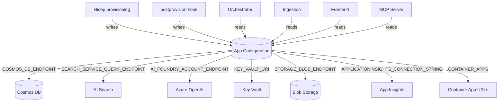
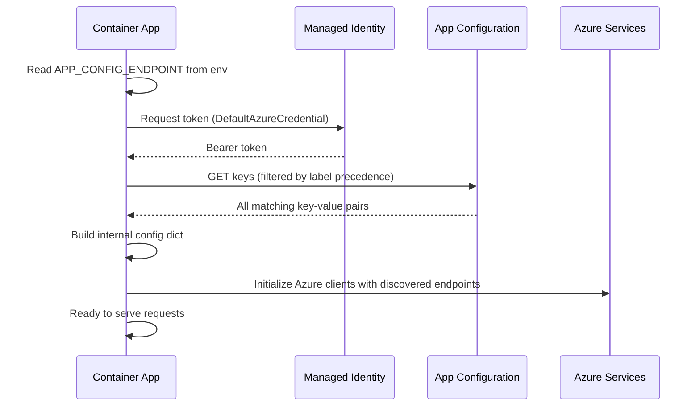

# Azure App Configuration (in the GPT-RAG Accelerator)

> Everything about how the GPT-RAG accelerator uses Azure App Configuration as its central service registry: what gets provisioned, how apps read from it, label precedence, the complete key inventory, runtime vs deploy-time configuration, and how to customize it.
> **SDK:** `azure-appconfiguration==1.7.1` (all apps)

---

## 1. What the Accelerator Provisions

### 1.1 App Configuration Store

| Property | Value |
|----------|-------|
| **Resource type** | `Microsoft.AppConfiguration/configurationStores` |
| **Deployment toggle** | `deployAppConfig` (default: `true`) |
| **Bicep location** | `infra/main.bicep` (via `bicep-ptn-aiml-landing-zone` submodule) |
| **Name pattern** | `appcs-{token}` |
| **SKU** | Standard |
| **Public network access** | Disabled when `networkIsolation = true` |

### 1.2 Private Endpoint (when networkIsolation = true)

| Property | Value |
|----------|-------|
| **Subnet** | `pe-subnet` (/26, 64 IPs) |
| **Private DNS zone** | `privatelink.azconfig.io` |
| **Deployment order** | 5th in serialized PE chain (after Key Vault) |

### 1.3 RBAC Roles

| Role | Granted To | Purpose |
|------|-----------|---------|
| `AppConfigurationDataReader` | All 4 Container Apps (Orchestrator, Frontend, Ingestion, MCP) | Read configuration at runtime |
| `AppConfigurationDataOwner` | Deployer principal (during `azd provision`) | Populate keys during provisioning |

No Container App has write access to App Configuration at runtime. Keys are written only at provisioning time by Bicep and the postprovision hook.

### 1.4 How Apps Discover App Configuration

Every Container App receives exactly three environment variables injected by Bicep at creation:

| Variable | Value | Purpose |
|----------|-------|---------|
| `APP_CONFIG_ENDPOINT` | `https://{appConfigName}.azconfig.io` | Connect to App Configuration |
| `AZURE_TENANT_ID` | Subscription tenant ID | For `DefaultAzureCredential` |
| `AZURE_CLIENT_ID` | Container App's UAI client ID | For `DefaultAzureCredential` |

All other configuration — service endpoints, model names, feature flags, cron schedules, search settings — comes from App Configuration at runtime. The `APP_CONFIG_ENDPOINT` is the single bootstrap value that unlocks everything else.

---

## 2. Role in the Architecture

### 2.1 Central Service Registry

Azure App Configuration is the central nervous system of GPT-RAG. At deployment time, Bicep populates it with the endpoints, resource IDs, and connection metadata for every Azure resource. At runtime, each Container App reads its configuration from App Configuration to discover its dependencies. No service endpoint is hardcoded in application code.



### 2.2 Why This Design

- **No hardcoded endpoints** — if an Azure resource is replaced or relocated, only App Configuration needs updating
- **Runtime reconfiguration** — change an agent strategy, toggle agentic retrieval, or adjust search parameters without redeploying any Container App
- **Environment isolation** — the same application code works across dev/staging/prod by pointing `APP_CONFIG_ENDPOINT` to a different store
- **Audit trail** — App Configuration tracks changes with timestamps and labels

### 2.3 What Happens Without It

If `APP_CONFIG_ENDPOINT` is not set:

- **Orchestrator** — Fails to start. The Orchestrator has no graceful degradation mode; it cannot serve any useful requests without its service registry.
- **Frontend** — Falls back to env-var-only mode. All configuration keys must be provided as environment variables.
- **Ingestion** — Fails to start. Cannot discover AI Search, OpenAI, or Cosmos DB endpoints.

---

## 3. Label Precedence

### 3.1 How Label Precedence Works

Azure App Configuration supports labels on key-value pairs. GPT-RAG uses labels to create a layered configuration hierarchy where app-specific overrides take priority over shared defaults. Each app's `appconfig.py` connector reads keys with a specific label precedence — if the same key exists at multiple label levels, the most specific label wins.

### 3.2 Per-App Label Precedence

**Orchestrator** (4 levels):

| Priority | Label | Purpose |
|----------|-------|---------|
| 1 (highest) | `orchestrator` | Orchestrator-specific overrides |
| 2 | `gpt-rag-orchestrator` | Orchestrator-specific (legacy label) |
| 3 | `gpt-rag` | Shared across all GPT-RAG apps |
| 4 (lowest) | `<no label>` | Global defaults |

**Frontend** (3 levels):

| Priority | Label | Purpose |
|----------|-------|---------|
| 1 (highest) | `gpt-rag-ui` | Frontend-specific overrides |
| 2 | `gpt-rag` | Shared across all GPT-RAG apps |
| 3 (lowest) | `<no label>` | Global defaults |

**Ingestion** (follows the same pattern as other apps):

| Priority | Label | Purpose |
|----------|-------|---------|
| 1 (highest) | `dataingest` or app-specific | Ingestion-specific overrides |
| 2 | `gpt-rag` | Shared across all GPT-RAG apps |
| 3 (lowest) | `<no label>` | Global defaults |

### 3.3 Practical Example

Suppose you want `ALLOW_ANONYMOUS=false` globally but `ALLOW_ANONYMOUS=true` for the Frontend only:

- Set `ALLOW_ANONYMOUS = false` with label `gpt-rag` (shared)
- Set `ALLOW_ANONYMOUS = true` with label `gpt-rag-ui` (Frontend override)

The Orchestrator reads the `gpt-rag` label version (`false`). The Frontend reads both, and the `gpt-rag-ui` version wins (`true`).

---

## 4. How Keys Are Populated

### 4.1 At Provisioning Time (Bicep)

Bicep writes service discovery keys during `azd provision`. These are infrastructure-level settings that map to the actual deployed resources:

- Service endpoints (Cosmos DB, AI Search, OpenAI, Blob Storage, Key Vault)
- Application Insights connection string
- Container App URLs (for inter-app communication)
- Model deployment names
- Storage container names
- Feature flags (e.g., `enableAgenticRetrieval`)

The Bicep section for App Configuration is at approximately line 2922 of `main.bicep`.

### 4.2 At Postprovision Time (Hook Script)

The postprovision lifecycle hook writes additional keys:

- OAuth/Entra ID settings (`OAUTH_AZURE_AD_CLIENT_ID`, `OAUTH_AZURE_AD_TENANT_ID`)
- API keys (if `useCAppAPIKey=true`, a generated key stored as `ORCHESTRATOR_APP_APIKEY`)
- Default feature flags (`PROMPT_SOURCE=file`, `AGENT_STRATEGY=single_agent_rag`)

### 4.3 Manual Configuration

Some keys must be set manually after deployment for specific features:

- SharePoint settings (`SHAREPOINT_CLIENT_ID`, site configurations in Cosmos DB)
- NL2SQL database connection strings
- MCP server URL (when using MCP strategy)
- Custom chunking parameters
- Custom cron schedules for indexers

---

## 5. Complete Key Inventory

### 5.1 Service Endpoints (Bicep-Populated)

These keys are written by Bicep and consumed by all apps that need them:

| Key | Value Pattern | Used By |
|-----|--------------|---------|
| `AI_FOUNDRY_ACCOUNT_ENDPOINT` | `https://{aiFoundryName}.openai.azure.com` | Orchestrator, Ingestion |
| `COSMOS_DB_ENDPOINT` | `https://{cosmosAccountName}.documents.azure.com:443` | Orchestrator, Ingestion |
| `COSMOS_DB_ACCOUNT_RESOURCE_ID` | Full ARM resource ID | Orchestrator, Ingestion |
| `SEARCH_SERVICE_QUERY_ENDPOINT` | `https://{searchServiceName}.search.windows.net` | Orchestrator, Ingestion |
| `KEY_VAULT_URI` | `https://{keyVaultName}.vault.azure.net` | All apps |
| `STORAGE_BLOB_ENDPOINT` | `https://{storageAccountName}.blob.core.windows.net` | Ingestion, Frontend |
| `STORAGE_ACCOUNT_NAME` | `{storageAccountName}` | Frontend, Ingestion |
| `APPLICATIONINSIGHTS_CONNECTION_STRING` | Connection string | All apps |
| `CONTAINER_APPS` | JSON array of app endpoints + FQDNs | Frontend (discovers orchestrator URL) |
| `MODEL_DEPLOYMENTS` | JSON array of model names + versions | Orchestrator, Ingestion |

### 5.2 Model Settings

| Key | Type | Default | Used By | Purpose |
|-----|------|---------|---------|---------|
| `CHAT_DEPLOYMENT_NAME` | string | `chat` | Orchestrator | OpenAI chat model deployment |
| `EMBEDDING_DEPLOYMENT_NAME` | string | `text-embedding` | Ingestion, Orchestrator | Embedding model deployment |
| `EMBEDDINGS_VECTOR_DIMENSIONS` | int | `3072` | Ingestion | Must match model output |
| `TEMPERATURE` | float | (model default) | Orchestrator | Chat completion temperature |
| `TOP_P` | float | (model default) | Orchestrator | Nucleus sampling parameter |

### 5.3 Search Settings

| Key | Type | Default | Used By | Purpose |
|-----|------|---------|---------|---------|
| `SEARCH_RAG_INDEX_NAME` | string | `ragindex` | Orchestrator, Ingestion | AI Search index name |
| `SEARCH_APPROACH` | string | `hybrid` | Orchestrator | Search mode: `hybrid`, `vector`, or `term` |
| `SEARCH_RAGINDEX_TOP_K` | int | `3` | Orchestrator | Number of chunks to retrieve |
| `SEARCH_USE_SEMANTIC` | bool | `false` | Orchestrator | Enable semantic reranking |
| `ENABLE_AGENTIC_RETRIEVAL` | bool | varies | Orchestrator | AI Search agentic retrieval |

### 5.4 Agent Strategy Settings

| Key | Type | Default | Used By | Purpose |
|-----|------|---------|---------|---------|
| `AGENT_STRATEGY` | string | `single_agent_rag` | Orchestrator | Active strategy: `single_agent_rag`, `mcp`, `nl2sql`, `single_agent_rag_v1` |
| `PROMPT_SOURCE` | string | `file` | Orchestrator | Prompt loading: `file` (filesystem) or `cosmos` (Cosmos DB) |
| `MCP_SERVER_URL` | string | (none) | Orchestrator | MCP server URL (only when `AGENT_STRATEGY=mcp`) |

### 5.5 Authentication and Security

| Key | Type | Used By | Purpose |
|-----|------|---------|---------|
| `ALLOW_ANONYMOUS` | bool | Orchestrator, Frontend | Allow queries without user tokens |
| `ORCHESTRATOR_APP_APIKEY` | string | Orchestrator, Frontend | Shared API key for inter-app auth |
| `OAUTH_AZURE_AD_CLIENT_ID` | string | Frontend | Entra app registration client ID |
| `OAUTH_AZURE_AD_TENANT_ID` | string | Frontend | Entra tenant ID |
| `OAUTH_AZURE_AD_CLIENT_SECRET` | string | Frontend | Client secret (Key Vault reference) |
| `OAUTH_AZURE_AD_SCOPES` | string | Frontend | OAuth scopes |
| `OAUTH_AZURE_AD_ENABLE_SINGLE_TENANT` | string | Frontend | Single-tenant OAuth toggle |
| `CHAINLIT_AUTH_SECRET` | string | Frontend | JWT signing secret for Chainlit sessions |
| `CHAINLIT_URL` | string | Frontend | Public URL for OAuth callback |

### 5.6 SharePoint Settings (Ingestion)

| Key | Type | Used By | Purpose |
|-----|------|---------|---------|
| `SHAREPOINT_CLIENT_ID` | string | Ingestion | App registration client ID for Graph API |
| `SHAREPOINT_FILES_FORMAT` | string | Ingestion | Allowed file extensions (default: `pdf,docx,pptx`) |

### 5.7 Storage Settings

| Key | Type | Used By | Purpose |
|-----|------|---------|---------|
| `DOCUMENTS_STORAGE_CONTAINER` | string | Frontend, Ingestion | Container for document files (default: `documents`) |
| `DOCUMENTS_IMAGES_STORAGE_CONTAINER` | string | Frontend, Ingestion | Container for extracted images |
| `NL2SQL_STORAGE_CONTAINER` | string | Ingestion | Container for NL2SQL schema files |
| `DOCUMENTS_STORAGE_CONTAINER_RESOURCE_ID` | string | Ingestion | Full ARM resource ID (for RBAC scope computation) |

### 5.8 Cosmos DB Settings

| Key | Type | Used By | Purpose |
|-----|------|---------|---------|
| `DATABASE_ACCOUNT_NAME` | string | Orchestrator, Ingestion | Cosmos DB account name |
| `DATABASE_NAME` | string | Orchestrator, Ingestion | Cosmos DB database name |
| `CONVERSATIONS_DATABASE_CONTAINER` | string | Orchestrator | Conversations container name |
| `DATASOURCES_DATABASE_CONTAINER` | string | Ingestion | Datasources container name |
| `PROMPTS_CONTAINER` | string | Orchestrator | Prompts container name |

### 5.9 Chunking Settings (Ingestion)

| Key | Type | Default | Purpose |
|-----|------|---------|---------|
| `CHUNKING_NUM_TOKENS` | int | `2048` | Max tokens per chunk |
| `TOKEN_OVERLAP` | int | `100` | Overlap between chunks |
| `CHUNKING_MIN_CHUNK_SIZE` | int | `100` | Min tokens (smaller chunks discarded) |
| `DOC_INTELLIGENCE_API_VERSION` | string | `2024-11-30` | DI API version (set to `2023-10-31-preview` for DOCX/PPTX) |

### 5.10 Concurrency and Performance (Ingestion)

| Key | Type | Default | Purpose |
|-----|------|---------|---------|
| `INDEXER_MAX_CONCURRENCY` | int | 4/8 | Parallel items per indexer |
| `INDEXER_BATCH_SIZE` | int | `500` | Documents per AI Search upload batch |
| `AOAI_MAX_CONCURRENCY` | int | `2` | Parallel embedding calls |
| `OPENAI_RETRY_MAX_ATTEMPTS` | int | `20` | Embedding retry count |

### 5.11 Dapr / Inter-App Communication

| Key | Type | Default | Used By | Purpose |
|-----|------|---------|---------|---------|
| `DAPR_API_TOKEN` | string | (none) | Orchestrator, Frontend | Dapr sidecar shared secret |
| `DAPR_HTTP_PORT` | string | `3500` | Orchestrator, Frontend | Dapr sidecar HTTP port |
| `ORCHESTRATOR_BASE_URL` | string | (none — uses Dapr) | Frontend | Direct HTTP URL to orchestrator |

### 5.12 Frontend-Specific

| Key | Type | Default | Purpose |
|-----|------|---------|---------|
| `ENABLE_USER_FEEDBACK` | bool | `false` | Show feedback buttons |
| `USER_FEEDBACK_RATING` | bool | `false` | Enable 5-star rating popup |
| `ALLOWED_USER_NAMES` | string | (none) | Comma-separated UPN allow-list |
| `ALLOWED_USER_PRINCIPALS` | string | (none) | Comma-separated OID allow-list |

### 5.13 Logging (All Apps)

| Key | Type | Default | Purpose |
|-----|------|---------|---------|
| `LOG_LEVEL` | string | `Information` | Logging verbosity |
| `ENABLE_CONSOLE_LOGGING` | bool | `true` | Console log output |

---

## 6. Runtime Configuration Flow

### 6.1 App Startup Sequence

Every GPT-RAG Container App follows the same bootstrap pattern:



### 6.2 Client Implementation

Each app has an `appconfig.py` connector module that wraps the `azure-appconfiguration` SDK:

1. Creates an `AzureAppConfigurationClient` using `DefaultAzureCredential`
2. Reads keys with app-specific label precedence (highest priority label first)
3. Merges values into a flat dictionary — higher-priority labels overwrite lower-priority ones
4. Exposes the merged config to the rest of the application

### 6.3 Refresh Behavior

Configuration is read at startup. The current GPT-RAG implementation does **not** use App Configuration's dynamic refresh / sentinel-based polling feature. If you change a key in App Configuration, you need to restart the Container App for it to take effect. This can be done by:

- Restarting the Container App revision in the Azure Portal
- Running `az containerapp revision restart`
- Triggering a new deployment with `azd deploy`

---

## 7. Configuration Categories

### 7.1 Infrastructure Keys (Bicep-Written, Rarely Changed)

These are written once at provisioning time and only change if the underlying infrastructure changes:

- Service endpoints (`AI_FOUNDRY_ACCOUNT_ENDPOINT`, `COSMOS_DB_ENDPOINT`, `SEARCH_SERVICE_QUERY_ENDPOINT`, `KEY_VAULT_URI`, `STORAGE_BLOB_ENDPOINT`)
- Resource IDs (`COSMOS_DB_ACCOUNT_RESOURCE_ID`, `DOCUMENTS_STORAGE_CONTAINER_RESOURCE_ID`)
- Container App URLs (`CONTAINER_APPS` JSON)
- Model deployments (`MODEL_DEPLOYMENTS` JSON)
- Application Insights connection string

You should **never** manually edit these unless you are replacing an Azure resource.

### 7.2 Runtime-Tunable Settings (Changed Without Redeploying)

These can be changed in App Configuration to modify behavior without building or deploying new code:

| Setting | Effect When Changed |
|---------|-------------------|
| `AGENT_STRATEGY` | Switches the orchestrator between single_agent_rag, mcp, nl2sql |
| `PROMPT_SOURCE` | Switches prompt loading from filesystem to Cosmos DB |
| `SEARCH_APPROACH` | Changes search mode (hybrid, vector, term) |
| `SEARCH_RAGINDEX_TOP_K` | Changes number of retrieved chunks |
| `ENABLE_AGENTIC_RETRIEVAL` | Toggles agentic retrieval |
| `TEMPERATURE` / `TOP_P` | Adjusts LLM creativity |
| `ALLOW_ANONYMOUS` | Enables/disables anonymous access |
| `ENABLE_USER_FEEDBACK` | Shows/hides feedback buttons |
| `LOG_LEVEL` | Adjusts logging verbosity |
| `CHUNKING_NUM_TOKENS` | Changes chunk size for new ingestion runs |

All require a Container App restart to take effect (no dynamic refresh).

### 7.3 Secrets vs Configuration

GPT-RAG follows a strict separation:

| Data Type | Where It Lives | Example |
|-----------|---------------|---------|
| Service endpoints | App Configuration | `COSMOS_DB_ENDPOINT` |
| Feature flags | App Configuration | `ENABLE_AGENTIC_RETRIEVAL` |
| Tunable parameters | App Configuration | `TEMPERATURE`, `TOP_K` |
| Client secrets | Key Vault | SharePoint client secret |
| API keys | Key Vault (referenced from App Config) | Orchestrator API key |
| Signing secrets | Key Vault | Chainlit auth secret |

App Configuration stores non-sensitive values and Key Vault references. Key Vault stores the actual secrets. The apps resolve Key Vault references at runtime using their managed identities.

---

## 8. Network Topology

### 8.1 Private Endpoint

When `networkIsolation = true`:

| Property | Value |
|----------|-------|
| **Subnet** | `pe-subnet` |
| **Private DNS zone** | `privatelink.azconfig.io` |
| **Public access** | Disabled |
| **Deployment order** | 5th in serialized PE chain |

### 8.2 Who Connects to App Configuration

| Component | Direction | RBAC Role | When |
|-----------|-----------|-----------|------|
| Orchestrator | Read | `AppConfigurationDataReader` | At startup |
| Frontend | Read | `AppConfigurationDataReader` | At startup |
| Ingestion | Read | `AppConfigurationDataReader` | At startup |
| MCP Server | Read | `AppConfigurationDataReader` | At startup |
| Deployer | Write | `AppConfigurationDataOwner` | During `azd provision` |

No runtime writes. All four Container Apps are read-only consumers.

---

## 9. Bicep Provisioning Details

### 9.1 Where in main.bicep

| Section | Approx. Line | What It Does |
|---------|-------------|--------------|
| `deployAppConfig` parameter | ~180 | Boolean toggle (defaults to `true`) |
| App Configuration module | ~2800+ | Deploys the store |
| Key-value population | ~2922-2936 | Writes service discovery keys |
| Private endpoint | PE chain position 5 | Creates private endpoint and DNS zone |

### 9.2 What Gets Written

Bicep writes approximately 15–20 key-value pairs covering all service endpoints, container names, model deployment names, and feature flags. The postprovision hook then adds OAuth settings and API keys.

### 9.3 Feature Flag in main.parameters.json

| Parameter | Default | Controls |
|-----------|---------|----------|
| `deployAppConfig` | `true` | Whether to deploy the App Configuration store |

---

## 10. Readiness Probe Integration

The Frontend and Ingestion apps use App Configuration connectivity as a readiness indicator:

**Frontend (`/readyz`):**
Returns HTTP 200 only if App Configuration is reachable. If the store is unreachable, the Container Apps Environment will not route traffic to the container, giving it time to recover.

**Ingestion (`/readyz`):**
Same pattern — checks App Configuration connectivity before declaring readiness.

**Orchestrator:**
Fails hard at startup if App Configuration is unreachable. No readiness probe needed because the app won't start at all without configuration.

---

## 11. Local Development

### 11.1 With App Configuration

For local development against a deployed App Configuration store:

```bash
export APP_CONFIG_ENDPOINT="https://{your-appconfig}.azconfig.io"
export AZURE_TENANT_ID="{your-tenant-id}"
# Use az login for authentication (DefaultAzureCredential picks it up)
az login
```

The developer must have `AppConfigurationDataReader` on the store.

### 11.2 Without App Configuration

All apps support running without App Configuration by providing all keys as environment variables:

```bash
# Orchestrator example
export AI_FOUNDRY_ACCOUNT_ENDPOINT="https://..."
export COSMOS_DB_ENDPOINT="https://..."
export SEARCH_SERVICE_QUERY_ENDPOINT="https://..."
export KEY_VAULT_URI="https://..."
export AGENT_STRATEGY="single_agent_rag"
export PROMPT_SOURCE="file"
export CHAT_DEPLOYMENT_NAME="chat"
# ... all other required keys
```

This is useful for:
- Local development without Azure infrastructure
- Testing with mock services
- CI/CD environments

---

## 12. Comparison with Other Configuration Approaches

### 12.1 Why Not Environment Variables Alone?

| Aspect | Env Vars Only | App Configuration |
|--------|--------------|-------------------|
| Centralized | No — scattered across Container App definitions | Yes — single store |
| Runtime change | Requires Container App revision update | Update key, restart app |
| Per-app overrides | Manual per Container App | Labels (automatic precedence) |
| Audit trail | None | Timestamped changes |
| Secrets handling | Risk of exposure in env vars | Key Vault references |
| Multi-environment | Duplicate configs per environment | One store per environment |

### 12.2 Why Not Key Vault for Everything?

Key Vault is designed for secrets (cryptographic keys, certificates, passwords). App Configuration is designed for non-sensitive settings (endpoints, flags, parameters). GPT-RAG uses both — App Configuration for configuration, Key Vault for secrets. App Configuration can reference Key Vault secrets, giving you the best of both.

---

## 13. Troubleshooting

### 13.1 Common Issues

| Issue | Likely Cause | Fix |
|-------|-------------|-----|
| Container keeps restarting | App Configuration unreachable | Verify `APP_CONFIG_ENDPOINT` env var, check managed identity, verify `AppConfigurationDataReader` role |
| HTTP 503 "not ready" | Readiness probe failing | Check private endpoint connectivity, DNS resolution for `privatelink.azconfig.io` |
| Wrong config values | Label precedence conflict | Check which labels exist for the key, verify app-specific label takes priority |
| Config change not taking effect | No dynamic refresh | Restart the Container App after changing a key |
| Missing keys after `azd provision` | Postprovision hook failed | Re-run `azd provision` or manually set the missing keys |
| Auth failure to App Config | RBAC not assigned | Verify the Container App's UAI has `AppConfigurationDataReader` on the store |
| Local dev can't connect | Not authenticated | Run `az login`, verify your account has `AppConfigurationDataReader` |

### 13.2 Diagnostic Commands

**List all keys in the store:**
```bash
az appconfig kv list --endpoint "https://{appconfig-name}.azconfig.io" --auth-mode login
```

**List keys with a specific label:**
```bash
az appconfig kv list --endpoint "https://{appconfig-name}.azconfig.io" --label "gpt-rag" --auth-mode login
```

**Set a key-value pair:**
```bash
az appconfig kv set --endpoint "https://{appconfig-name}.azconfig.io" --key "AGENT_STRATEGY" --value "mcp" --label "orchestrator" --auth-mode login
```

**Delete a key:**
```bash
az appconfig kv delete --endpoint "https://{appconfig-name}.azconfig.io" --key "SOME_KEY" --label "some-label" --auth-mode login
```

**View key history:**
```bash
az appconfig revision list --endpoint "https://{appconfig-name}.azconfig.io" --key "AGENT_STRATEGY" --auth-mode login
```

---

## 14. Version History (App Configuration–Related Changes)

| Version | Date | App Configuration–Related Change |
|---------|------|----------------------------------|
| **v2.5.2** | 2026-03 | Deployment script improvements (no App Config changes) |
| **v2.5.1** | 2026-03 | Infra submodule pinned to v1.0.1 (no App Config changes) |
| **v2.5.0** | 2026-03 | IaC migrated to bicep-ptn-aiml-landing-zone (no App Config schema change) |
| **v2.4.0** | 2026-01 | No new App Config keys for document-level security (security is in the index schema) |
| **v2.3.0** | 2025-12 | Added `MCP_SERVER_URL` key for MCP strategy, NL2SQL-related keys |
| **v2.2.0** | 2025-10 | Added `ENABLE_AGENTIC_RETRIEVAL` key |
| **v2.1.0** | 2025-08 | Added `ENABLE_USER_FEEDBACK` and `USER_FEEDBACK_RATING` keys |
| **v2.0.0** | 2025-07 | Major refactor — introduced App Configuration as central service registry (replacing scattered env vars) |

---

## 15. What Each Team Needs to Know

### For the Security / Identity Team

- App Configuration stores **non-sensitive** values only — no secrets, no passwords, no API keys
- Secrets are in Key Vault and referenced from App Configuration via Key Vault references
- All access is via managed identity (`AppConfigurationDataReader` for apps, `AppConfigurationDataOwner` for deployer)
- No Container App has write access at runtime — configuration is immutable from the app's perspective
- Private endpoint when network isolation is enabled (`privatelink.azconfig.io`)

### For the DevOps / Infrastructure Team

- App Configuration is provisioned by Bicep with keys populated at deploy time (~line 2922 of `main.bicep`)
- The postprovision hook adds OAuth and API key settings
- Private endpoint on `pe-subnet`, 5th in serialized deployment chain
- No dynamic refresh — Container App restart required after key changes
- `az appconfig kv list` is your main diagnostic tool
- The deployer needs `AppConfigurationDataOwner` during provisioning

### For the Development / Customization Team

- Every app has a `connectors/appconfig.py` module that wraps the `azure-appconfiguration` SDK
- Label precedence lets you override shared settings per app (e.g., `orchestrator` label overrides `gpt-rag` label)
- Runtime-tunable settings (agent strategy, search approach, top_k, temperature) can be changed in App Configuration and take effect after a Container App restart
- For local dev, either set `APP_CONFIG_ENDPOINT` + `az login`, or provide all keys as environment variables
- The SDK version is `azure-appconfiguration==1.7.1` across all apps

### For the Architecture Team

- App Configuration is the single source of truth for service discovery — the architectural "spine" of GPT-RAG
- Pattern: Bicep writes infrastructure keys → postprovision writes app keys → Container Apps read at startup
- Two-tier configuration model: App Configuration (settings) + Key Vault (secrets)
- Label-based layering enables per-app overrides without duplicating keys
- All four Container Apps are read-only consumers — no runtime writes
- Without App Configuration, the system cannot function (Orchestrator and Ingestion fail to start; Frontend degrades to env-var mode)
