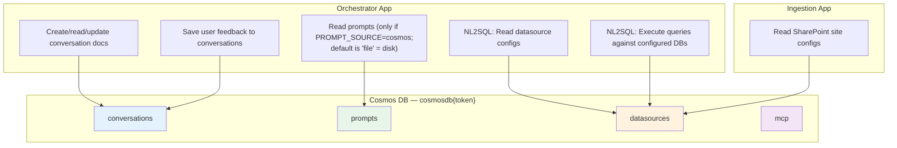

# Cosmos DB — GPT-RAG Component Reference

This note documents everything about the Cosmos DB component in the GPT-RAG Solution Accelerator: what the accelerator provisions, how each app uses it, what you need to configure manually after deployment, and where to find sample data.

---

## 1. What the Accelerator Provisions Automatically

When you run `azd up`, the Bicep templates create a Cosmos DB NoSQL account with a single database containing **4 empty containers**. Nothing is pre-populated — all containers start empty.

### 1.1 Account Configuration (from Bicep)

| Property | Value | Source |
|----------|-------|--------|
| Account name | `cosmos-{resourceToken}` | `main.bicep` param `dbAccountName` |
| Database name | `cosmosdb{resourceToken}` | `main.bicep` param `dbDatabaseName` |
| Consistency level | **Session** | Hardcoded in Bicep |
| Capacity mode | **Serverless** | `capabilitiesToAdd: ['EnableServerless']` |
| Analytical storage | Enabled | `enableAnalyticalStorage: true` |
| Free tier | Disabled | `enableFreeTier: false` |
| Failover | Single region, zone-redundant optional | `useZoneRedundancy` param |
| Public network | Disabled if `networkIsolation=true` | Otherwise Enabled |
| Auth | **RBAC only** (no access keys) | `CosmosDBBuiltInDataContributor` role |

### 1.2 Containers Created

| Container | Partition Key | TTL | Throughput | Created Empty |
|-----------|:------------:|:---:|:----------:|:-------------:|
| `conversations` | `/id` | -1 (none) | 400 RU | Yes |
| `datasources` | `/id` | -1 (none) | 400 RU | Yes |
| `prompts` | `/id` | -1 (none) | 400 RU | Yes |
| `mcp` | `/id` | -1 (none) | 400 RU | Yes |

### 1.3 RBAC Assignments

The Bicep templates assign the `CosmosDBBuiltInDataContributor` role (data-plane read/write) to:

- The **azd executor identity** (your deployer) — scoped to the database
- Each **Container App's managed identity** (orchestrator, ingestion, UI, MCP) — scoped to the database
- The **test VM** (if `deployVM=true` with network isolation)

This means all apps authenticate to Cosmos DB via managed identity — no connection strings or keys.

### 1.4 App Configuration Values

The following are written to Azure App Configuration during provisioning and consumed by the apps at runtime:

| Config Key | Value | Used By |
|------------|-------|---------|
| `DATABASE_ACCOUNT_NAME` | `cosmos-{token}` | All apps |
| `DATABASE_NAME` | `cosmosdb{token}` | All apps |
| `COSMOS_DB_ACCOUNT_RESOURCE_ID` | Full ARM resource ID | Infra reference |
| `COSMOS_DB_ENDPOINT` | `https://cosmos-{token}.documents.azure.com:443/` | Direct endpoint |
| `DEPLOY_COSMOS_DB` | `true` / `false` | Feature flag |

---

## 2. Container Purposes — Which App Uses What



**UI App and MCP Server** do not directly use Cosmos DB — the UI talks to the Orchestrator which handles persistence, and the MCP server has no Cosmos DB client in its code.

---

## 3. The `conversations` Container

### 3.1 Purpose

Stores chat conversation state for each user session. The Orchestrator creates, reads, and updates these documents throughout a conversation's lifecycle.

### 3.2 Who Populates It

**Automatic** — The Orchestrator creates documents at runtime. No manual setup needed.

### 3.3 Document Lifecycle

1. **New conversation:** User sends first message → Orchestrator generates a UUID → creates `{"id": "<uuid>"}` in the container
2. **Each question:** The question text and question_id are appended to a `questions` array
3. **After response:** The strategy updates the document (e.g., stores `thread_id` for Azure AI Agents) → Orchestrator persists asynchronously
4. **Feedback:** User thumbs up/down → feedback object appended to a `feedback` array

### 3.4 Document Schema

```json
{
  "id": "a1b2c3d4-...",
  "questions": [
    {
      "question_id": "q-001",
      "text": "What is our leave policy?"
    }
  ],
  "thread_id": "thread_abc123...",
  "feedback": [
    {
      "question_id": "q-001",
      "rating": "positive",
      "comment": "Helpful answer"
    }
  ]
}
```

### 3.5 What You Need to Configure

**Nothing.** This container is fully automated. Documents are created and updated by the Orchestrator at runtime.

**Considerations:** Over time this container will grow with every conversation. You may want to set up a TTL policy or a cleanup job for old conversations. The Bicep sets `defaultTtl: -1` (no expiration), so documents persist indefinitely.

---

## 4. The `datasources` Container

### 4.1 Purpose

Configuration store that defines external data sources. Used by two different apps for two different purposes:

| Consumer | Purpose | Document Types Used |
|----------|---------|---------------------|
| **Ingestion App** (SharePoint indexer) | Reads site configs to know which SharePoint sites/libraries to crawl | `type: "sharepoint_site"` |
| **Orchestrator** (NL2SQL plugin) | Reads connection configs for SQL databases and Fabric endpoints | `type: "sql_database"`, `"sql_endpoint"`, `"semantic_model"` |

### 4.2 Who Populates It

**You — manually, after deployment.** The accelerator creates the container empty. You must insert configuration documents yourself.

### 4.3 Document Schemas

#### SharePoint Site Configuration (for Ingestion)

```json
{
  "id": "hr-portal-sharepoint",
  "type": "sharepoint_site",
  "siteDomain": "contoso.sharepoint.com",
  "siteName": "HRPortal",
  "category": "HR Documents",
  "lists": [
    {
      "listId": "abc12345-def6-7890-abcd-ef1234567890",
      "listName": "Policy Documents",
      "listType": "documentLibrary",
      "filter": "fields/Status eq 'Published'",
      "includeFields": ["Title", "Department", "PolicyDate"],
      "excludeFields": ["InternalNotes"],
      "category": "Policies"
    },
    {
      "listId": "def67890-abc1-2345-defg-h12345678901",
      "listType": "genericList",
      "includeFields": ["Title", "Description", "FAQ_Answer"]
    }
  ]
}
```

**Key fields:**

| Field | Required | Notes |
|-------|----------|-------|
| `id` | Yes | Unique document ID (also the partition key) |
| `type` | Yes | Must be `"sharepoint_site"` for the ingestion app to pick it up |
| `siteDomain` | Yes | Your SharePoint tenant domain |
| `siteName` | Yes | The site name within the tenant |
| `lists[].listId` | Preferred | Direct GUID — avoids an extra Graph API lookup |
| `lists[].listName` | Fallback | Legacy: requires Graph API call to resolve the ID |
| `lists[].listType` | No | `"documentLibrary"` (downloads files) or `"genericList"` (indexes field text). Default: `"genericList"` |
| `lists[].filter` | No | OData filter for Graph API item queries |
| `lists[].includeFields` | No | Whitelist of item fields to include in content |
| `lists[].excludeFields` | No | Blacklist of fields to exclude |
| `lists[].category` | No | Category value stored in the AI Search `category` field |

#### SQL Database Configuration (for NL2SQL)

```json
{
  "id": "adventureworks",
  "description": "AdventureWorksLT database with customers, orders, products, and sales.",
  "type": "sql_database",
  "server": "sqlservername.database.windows.net",
  "database": "adventureworkslt"
}
```

#### SQL Endpoint / Fabric Configuration (for NL2SQL)

```json
{
  "id": "wwi-sales-star-schema",
  "description": "Star schema for sales data with fact and dimension tables.",
  "type": "sql_endpoint",
  "organization": "myorg",
  "server": "xpto.datawarehouse.fabric.microsoft.com",
  "database": "your_lakehouse_name",
  "tenant_id": "your_tenant_id",
  "client_id": "your_client_id"
}
```

#### Semantic Model Configuration (for NL2SQL DAX queries)

```json
{
  "id": "wwi-sales-aggregated",
  "description": "Aggregated sales semantic model for insights by employee or city.",
  "type": "semantic_model",
  "organization": "myorg",
  "dataset": "your_semantic_model_name",
  "workspace": "your_workspace_name",
  "tenant_id": "your_tenant_id",
  "client_id": "your_client_id"
}
```

### 4.4 Where to Find Sample Data

The accelerator ships sample datasource configs in the **ingestion repo**:

| Sample | Path | Content |
|--------|------|---------|
| Fabric (SQL Endpoint + Semantic Model) | `gpt-rag-ingestion/samples/fabric/datasources.json` | 2 datasource docs: one `sql_endpoint`, one `semantic_model` |
| SQL Database | `gpt-rag-ingestion/samples/sql_database/datasources.json` | 1 datasource doc: `sql_database` (AdventureWorks) |

**There is no SharePoint sample datasource config** — you need to create one yourself following the schema above.

### 4.5 How to Get Data Into Cosmos DB After Deployment

**Option 1: Azure Portal Data Explorer**

1. Go to the Azure Portal → your Cosmos DB account → Data Explorer
2. Select the database → `datasources` container
3. Click "New Item" and paste your JSON document
4. Click "Save"

**Option 2: Azure CLI**

```bash
# Create a datasource document
az cosmosdb sql container create-document \
  --account-name cosmos-{token} \
  --database-name cosmosdb{token} \
  --container-name datasources \
  --body @sharepoint-config.json
```

**Option 3: Python Script (adapting the existing upload_prompts.py pattern)**

```python
import asyncio
import json
from connectors import CosmosDBClient

async def upload_datasources():
    client = CosmosDBClient()

    with open("sharepoint-config.json", "r") as f:
        config = json.load(f)

    await client.create_document("datasources", config["id"], body=config)
    print(f"Created datasource: {config['id']}")

asyncio.run(upload_datasources())
```

**Option 4: REST API / SDK from any language** — use managed identity or the Azure CLI credential.

---

## 5. The `prompts` Container

### 5.1 Purpose

Optional alternative store for LLM system prompts. The accelerator **does not use this container by default** — it explicitly sets `PROMPT_SOURCE=file` in App Configuration during Bicep provisioning (line 2965 of `main.bicep`), which means prompts are read from `.txt` / `.jinja2` files baked into the orchestrator container image at `/prompts/{strategy_type}/`.

The `prompts` Cosmos container exists as a built-in capability for teams who want to edit prompts at runtime without redeploying the container image.

### 5.2 Who Populates It

**Nobody by default — this container stays empty out of the box.** You only need to populate it if you explicitly switch `PROMPT_SOURCE` to `cosmos` in App Configuration.

### 5.3 How It Works

The `BaseAgentStrategy._read_prompt()` method checks the `PROMPT_SOURCE` config value:

| PROMPT_SOURCE | Behavior |
|---------------|----------|
| `"file"` (default) | Reads from `prompts/{strategy_type}/{name}.txt` or `.jinja2` on disk |
| `"cosmos"` | Reads from the `prompts` container — document ID format: `{strategy}_{prompt_name}` |

When using Cosmos, the prompt document schema is:

```json
{
  "id": "single_agent_rag_main",
  "content": "You are an AI assistant that helps users find information..."
}
```

Placeholders (`{{placeholder_name}}`) in prompts are resolved by looking up `placeholder_{name}` documents in the same container.

### 5.4 Upload Script

The orchestrator repo includes a script for seeding prompts from files into Cosmos:

**File:** `gpt-rag-orchestrator/src/upload_prompts.py`

This script walks the `prompts/` directory and creates one Cosmos document per file:
- Document ID: `{directory}_{filename_without_extension}` (e.g., `single_agent_rag_main`)
- Document content: the file text

**To run it:** You'd need to set up the environment variables (`DATABASE_ACCOUNT_NAME`, `DATABASE_NAME`) and authenticate, then run `python upload_prompts.py` from the orchestrator's `src/` directory.

### 5.5 What You Need to Configure

**Nothing — the accelerator default (`PROMPT_SOURCE=file`) works out of the box.** Prompts are `.txt` and `.jinja2` files already on disk in the container image under `prompts/{strategy}/`. To customize them, you edit those files and redeploy the container.

**If you want runtime prompt editing without redeployment** (e.g., for A/B testing or rapid iteration):
1. Run `upload_prompts.py` to seed the `prompts` container with the current file-based prompts
2. Change `PROMPT_SOURCE=cosmos` in App Configuration
3. Edit prompts directly in Cosmos DB going forward — changes take effect on next request without redeployment

---

## 6. The `mcp` Container

### 6.1 Purpose

**Reserved / placeholder.** This container is created by the Bicep templates but is not actively used by any application code as of the current version.

### 6.2 What You Need to Configure

**Nothing for now.** It's likely intended for future use by the MCP strategy to store MCP server configurations or tool definitions. The MCP Server app (`gpt-rag-mcp`) currently has no Cosmos DB client in its source code.

---

## 7. Authentication and Access

### 7.1 How Apps Connect to Cosmos DB

Both the Orchestrator and Ingestion apps use the same pattern:

```python
# Orchestrator version (persistent connection)
from azure.cosmos.aio import CosmosClient

db_uri = f"https://{DATABASE_ACCOUNT_NAME}.documents.azure.com:443/"
client = CosmosClient(db_uri, credential=cfg.aiocredential)
```

```python
# Ingestion version (per-operation connection)
async with CosmosClient(db_uri, credential=cfg.aiocredential) as client:
    ...
```

The credential is a `ChainedTokenCredential` that tries:
1. `AzureCliCredential` (for local development)
2. `ManagedIdentityCredential` (for production in Container Apps)

**No connection strings or keys are used** — all access is via RBAC with the `CosmosDBBuiltInDataContributor` role.

### 7.2 Client Differences Between Apps

| Feature | Orchestrator | Ingestion |
|---------|-------------|-----------|
| Connection pattern | **Singleton** — one `CosmosClient` reused across all requests | **Per-operation** — new client per call |
| Operations | CRUD (create, read, update, list) | Read-only (list, get) |
| Error handling | Detailed `CosmosHttpResponseError` handling with 404 detection | Basic exception logging |

---

## 8. Network Configuration

### 8.1 With Network Isolation (`networkIsolation=true`)

- Public network access is **disabled**
- A **private endpoint** is created in the private endpoint subnet
- VNet rules allow access from the Container Apps subnet
- The test VM (if deployed) gets access via the PE subnet

### 8.2 Without Network Isolation

- Public network access is **enabled**
- No private endpoints
- RBAC still enforced (managed identity auth)

---

## 9. Post-Deployment Checklist

Here's what you need to do after `azd up` to get Cosmos DB working for your scenario:

### For RAG with SharePoint (most common)

- [ ] Create a `sharepoint_site` document in the `datasources` container with your site/library config
- [ ] Verify the ingestion app can read from Cosmos (check Container App logs for `Loaded N SharePoint site config(s)`)
- [ ] Run the ingestion job and confirm documents are indexed

### For NL2SQL Strategy

- [ ] Create one or more datasource documents in the `datasources` container (`sql_database`, `sql_endpoint`, or `semantic_model`)
- [ ] Upload table metadata to the `nl2sql-tables` AI Search index (from `samples/` or your own)
- [ ] Upload sample queries to the `nl2sql-queries` AI Search index
- [ ] Set `AGENT_STRATEGY=nl2sql` in App Configuration

### For Custom Prompts via Cosmos

- [ ] Run `upload_prompts.py` to seed the `prompts` container
- [ ] Set `PROMPT_SOURCE=cosmos` in App Configuration
- [ ] Verify prompts load correctly (check orchestrator logs)

### Nothing to Do

- [ ] `conversations` container — fully automated at runtime
- [ ] `mcp` container — not used yet

---

## 10. Monitoring and Troubleshooting

### Useful Queries

**Check datasource configs loaded by the ingestion app:**
Look in Container App logs for:
```
[sp-ingest] Loaded N SharePoint site config(s) from Cosmos container 'datasources'
```

**Check conversation persistence:**
```
[cosmosdb] document <conversation-id> created.
[cosmosdb] document updated.
```

**Common Issues:**

| Symptom | Cause | Fix |
|---------|-------|-----|
| `No sharepoint_site documents found` | Empty `datasources` container | Insert your SharePoint config document |
| `document does not exist` on conversation load | Conversation ID doesn't match any document | Check that the frontend is sending the correct ID |
| `Failed to load datasources from Cosmos` | Network/auth issue | Check managed identity has `CosmosDBBuiltInDataContributor` role |
| `could not update document` | Document was deleted or partition key mismatch | Check document exists; partition key is `/id` |
