# Detailed Ingestion Process — SharePoint & Blob Storage to Azure AI Search

This note documents the complete, step-by-step ingestion pipeline that the GPT-RAG Ingestion app uses to pull documents from **both** SharePoint Online and Azure Blob Storage, extract their content, chunk and embed them, and push them into the Azure AI Search index. Every stage is traced to specific source files in the `gpt-rag-ingestion` repository.

---

## 1. Code Map — Where to Find Each Step

Before diving into flows, here's a map of every file in the pipeline and what it does. Use this as your index when reading the source.

### 1.1 Entry Point & Scheduling

| File | What It Does |
|------|-------------|
| `main.py` | FastAPI app + lifespan hook. Registers all cron jobs via APScheduler. **This is where both indexers are started.** |
| `dependencies.py` | API key validation for HTTP endpoints (`/document-chunking`, `/text-embedding`) |

### 1.2 Indexer Jobs (`jobs/`)

| File | What It Does |
|------|-------------|
| `sharepoint_indexer.py` | **SharePoint → AI Search pipeline.** The `SharePointIndexer` class: `run()` → `_ensure_clients()` → `_process_collection()` → `_process_item()`. Contains freshness check, ACL extraction, body/attachment processing, embedding, upload. |
| `blob_storage_indexer.py` | **Blob Storage → AI Search pipeline.** The `BlobStorageIndexer` class: `run()` → `_ensure_clients()` → `_process_blob()`. Enumerates blobs in the `documents` container, reads metadata for ACLs, downloads content, chunks, embeds, uploads. |
| `sharepoint_purger.py` | Deletes index entries for SharePoint items that no longer exist at source. Compares indexed `parent_id` values against current Graph API item list. |
| `blob_storage_purger.py` | Deletes index entries for blobs that no longer exist in the container. Compares indexed `parent_id` values against current blob listing. |
| `nl2sql_indexer.py` | NL2SQL data indexing (separate pipeline, not covered here). |
| `nl2sql_purger.py` | NL2SQL cleanup. |
| `image_purger.py` | Removes orphaned extracted images from blob storage. |

### 1.3 Chunking Pipeline (`chunking/`)

| File | What It Does |
|------|-------------|
| `document_chunking.py` | **Main entry point:** `DocumentChunker.chunk_documents(data)`. Receives file bytes + metadata, delegates to the right chunker, returns list of chunk dicts. |
| `chunker_factory.py` | `ChunkerFactory.get_chunker(data)` — routes by file extension to the appropriate chunker class. |
| `base_chunker.py` | Base class: `_create_chunk()` (builds chunk dict with 14 fields), `_embed()` (calls AOAI), `_truncate_input()` (handles 8192 token limit). All chunkers inherit from this. |
| `doc_analysis_chunker.py` | `DocAnalysisChunker` — uses Document Intelligence API (`analyze_document_from_bytes`) for PDF, images, DOCX, PPTX. Includes `_analyze_document_with_retry` (3 retries), `_number_pagebreaks`, `_choose_splitter`. |
| `multimodal_chunker.py` | `MultimodalChunker` — extends DocAnalysisChunker with figure/image extraction alongside text. |
| `langchain_chunker.py` | `LangChainChunker` — generic text splitting using LangChain splitters for md, txt, html, py, csv, xml. |
| `spreadsheet_chunker.py` | `SpreadsheetChunker` — Excel via openpyxl, sheet-by-sheet or row-by-row. |
| `transcription_chunker.py` | `TranscriptionChunker` — WebVTT subtitle files, timestamp-aware. |
| `json_chunker.py` | `JSONChunker` — structure-aware JSON splitting. |

### 1.4 Service Clients (`tools/`)

| File | What It Does |
|------|-------------|
| `aisearch.py` | `AsyncSearchClient` wrapper: `upload_documents()`, `get_document()` (freshness check), `delete_documents()`, `search()`. All with `_with_backoff` retry. |
| `aoai.py` | `AzureOpenAIClient`: `get_embeddings()` with dual retry loops (rate-limit + transient), semaphore-gated concurrency, `_truncate_input()`. |
| `blob.py` | `BlobClient`: `list_blobs()`, `download_blob()`, `upload_blob()`, `get_blob_properties()`. Used by blob indexer for document access AND by both indexers for job logging. |
| `cosmosdb.py` | `CosmosDBClient`: `list_documents()` (reads datasource configs), `upsert_document()`. |
| `doc_intelligence.py` | `DocumentIntelligenceClient`: wraps Azure Form Recognizer `analyze_document_from_bytes` call. |
| `keyvault.py` | `KeyVaultClient`: `get_secret()` — retrieves Graph API client secret. |
| `sharepoint.py` | `SharePointGraphClient`: `get_site_id()`, `get_items()`, `get_drive_item()`, `download_drive_item()`, `get_item_permission_principal_ids()`, `get_lookup_columns()`, `get_list_navigation_base_url()`. Handles Graph API pagination, token management, OData filters. |

---

## 2. High-Level Architecture — Both Indexers

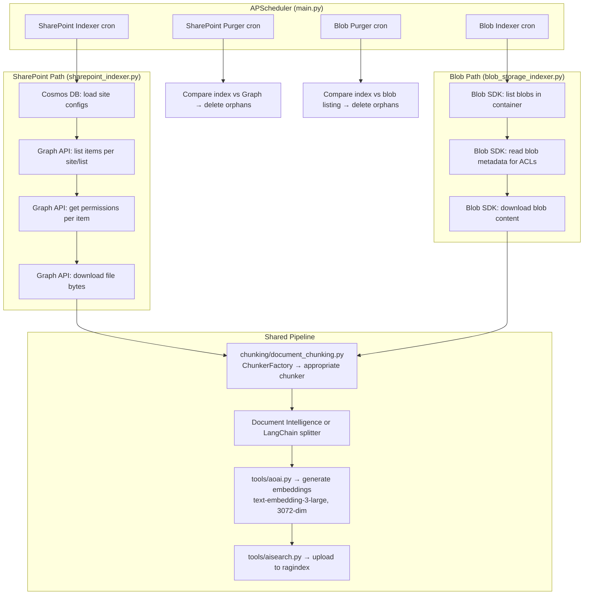

---

## 3. SharePoint Indexer — Complete Sequence

**Source:** `jobs/sharepoint_indexer.py` → class `SharePointIndexer`

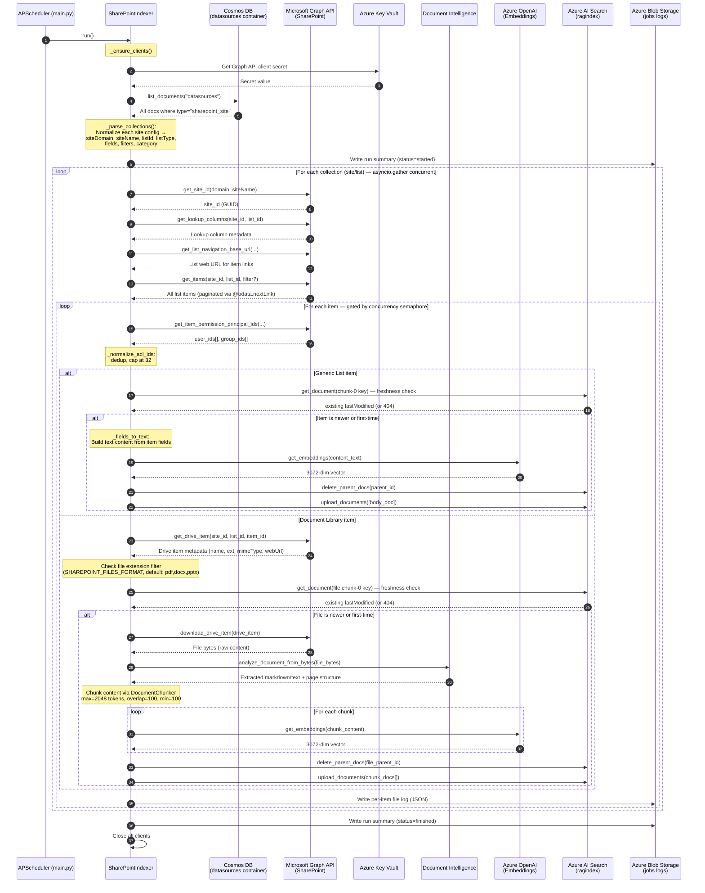

### 3.1 What Information Is Extracted from SharePoint

For **every item** (both generic list and document library), the SharePoint indexer extracts:

| Data | Source | Graph API Call | Code Location |
|------|--------|---------------|---------------|
| **Item fields** (Title, custom columns) | List item `fields` property | `get_items()` paginated response | `sharepoint_indexer.py` → `_process_item()` |
| **Last modified date** | `fields.Modified` or `lastModifiedDateTime` | Included in item response | `sharepoint_indexer.py` → `_process_item()` |
| **Lookup field values** | Cross-list lookups | `get_lookup_columns()` per list | `sharepoint_indexer.py` → `_resolve_lookups()` |
| **Item web URL** | Constructed from list navigation URL + item ID | `get_list_navigation_base_url()` | `sharepoint_indexer.py` → `_process_collection()` |
| **ACLs (user IDs)** | Item-level permissions | `get_item_permission_principal_ids()` → user principals | `sharepoint_indexer.py` → `_process_item()`, `tools/sharepoint.py` |
| **ACLs (group IDs)** | Item-level permissions | `get_item_permission_principal_ids()` → group principals | Same as above |
| **Category** | From Cosmos config or item fields | N/A (config-driven) | `sharepoint_indexer.py` → `_parse_collections()` |

For **document library items only**, additionally:

| Data | Source | Graph API Call | Code Location |
|------|--------|---------------|---------------|
| **File name** | `drive_item.name` or `fields.FileLeafRef` | `get_drive_item()` | `sharepoint_indexer.py` → `_process_attachment()` |
| **File extension** | Parsed from file name | N/A | `sharepoint_indexer.py` → `_process_attachment()` |
| **MIME type** | `drive_item.file.mimeType` | `get_drive_item()` | Same |
| **File web URL** | `drive_item.webUrl` | `get_drive_item()` | Same |
| **File last modified** | `drive_item.fileSystemInfo.lastModifiedDateTime` (preferred) or `drive_item.lastModifiedDateTime` | `get_drive_item()` | Same |
| **Raw file bytes** | Full download | `download_drive_item()` | Same, `tools/sharepoint.py` |

### 3.2 How SharePoint Changes Are Detected

**Source:** `sharepoint_indexer.py` → `_needs_reindex(parent_id, last_modified)` and `_is_strictly_newer()`

The SharePoint indexer does **not** use Graph API delta queries or change notifications. Instead, it uses a **full scan + freshness comparison** approach:

1. **List all items** — every run fetches all items from each configured list via `get_items()` (paginated via `@odata.nextLink`)
2. **Compute parent_id** — format: `{siteDomain}/{siteName}/{listId}/{itemId}` (for body) or `{siteDomain}/{siteName}/{listId}/{itemId}/{fileName}` (for attachments)
3. **Build chunk-0 key** — `_make_chunk_key(parent_id, 0)` produces the document ID for the first chunk
4. **Direct GET from AI Search** — `search_client.get_document(chunk_0_key)` — single O(1) lookup, not a search query
5. **Compare timestamps** — `_is_strictly_newer(incoming_lastModified, existing_lastModified)` returns True only if `incoming > existing` (strict inequality)
6. **Decision:** If document not found (404) → first-time indexing. If found and newer → re-index. If found and not newer → skip.

**Why not delta queries?** The current approach is simple and reliable but re-lists all items every run. For large SharePoint environments, this means every cron cycle re-fetches potentially thousands of items from Graph API, even if nothing changed. Only the freshness check prevents re-processing.

### 3.3 SharePoint Generic List Processing — Detail

**Source:** `sharepoint_indexer.py` → `_process_item_body()`

When `listType == "genericList"`:

1. **Field extraction** — `_fields_to_text(item.fields, include_fields, exclude_fields)` concatenates all item field values into a single text string. Fields are formatted as `FieldName: value\n`. The `includeFields` / `excludeFields` config controls which fields appear.
2. **Single embedding** — the concatenated text is embedded via `_embed()` → `tools/aoai.py` → `get_embeddings()` → text-embedding-3-large → 3072-dim vector
3. **One search document** — `_doc_for_item()` builds a single search document with `chunk_id=0`, `source="sharepoint-list"`, and all 22 index fields populated

### 3.4 SharePoint Document Library Processing — Detail

**Source:** `sharepoint_indexer.py` → `_process_attachment()`

When `listType == "documentLibrary"`:

1. **Get drive item metadata** — `get_drive_item(site_id, list_id, item_id)` returns file name, extension, MIME type, web URL, and last modified date
2. **Filter check** — extension must be in `SHAREPOINT_FILES_FORMAT` (default: `pdf,docx,pptx`). If not → skip with `stats.att_skipped_ext_not_allowed++`
3. **Is it a file?** — check `drive_item.file` exists (folders have no `file` key) → skip if folder
4. **Freshness check** — same `_needs_reindex()` mechanism, but parent_id includes filename: `{siteDomain}/{siteName}/{listId}/{itemId}/{fileName}`
5. **Download** — `download_drive_item(drive_item)` → raw bytes
6. **Chunk** — `DocumentChunker.chunk_documents(data)` where `data = { documentBytes, fileName, documentContentType, documentUrl }` → runs in thread pool via `asyncio.to_thread`
7. **Delete old + upload new** — delete all existing chunks for this file's parent_id, then upload new chunk documents via `_doc_for_attachment_chunk()` for each chunk

---

## 4. Blob Storage Indexer — Complete Sequence

**Source:** `jobs/blob_storage_indexer.py` → class `BlobStorageIndexer`

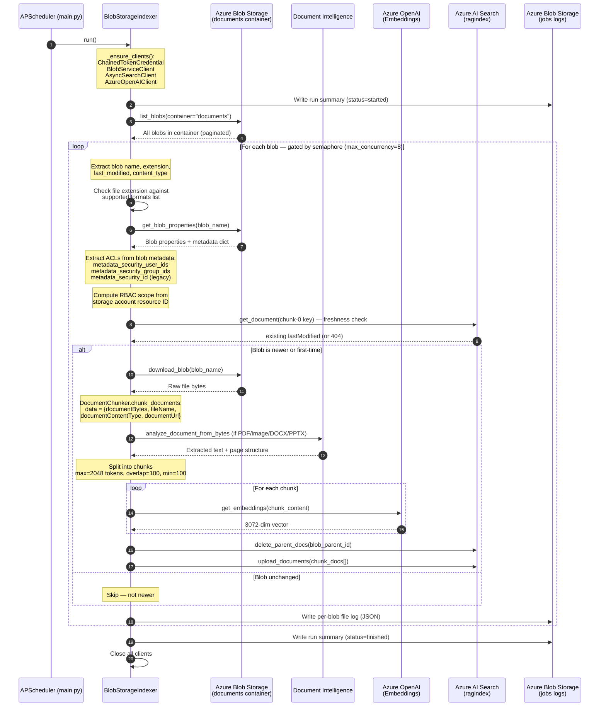

### 4.1 What Information Is Extracted from Blob Storage

For **every blob** in the `documents` container:

| Data | Source | How It's Read | Code Location |
|------|--------|--------------|---------------|
| **Blob name** (full path) | Blob listing | `list_blobs()` on the `documents` container | `blob_storage_indexer.py` → `run()` |
| **File extension** | Parsed from blob name | Python `os.path.splitext()` | `blob_storage_indexer.py` → `_process_blob()` |
| **Content type** | Blob properties | `blob.content_settings.content_type` | `blob_storage_indexer.py` → `_process_blob()` |
| **Last modified date** | Blob properties | `blob.last_modified` (Azure storage timestamp) | `blob_storage_indexer.py` → `_process_blob()` |
| **ACLs — user IDs** | Blob metadata dict | Keys: `metadata_security_user_ids` or `metadata-security-user-ids` | `blob_storage_indexer.py` → ACL extraction logic |
| **ACLs — group IDs** | Blob metadata dict | Keys: `metadata_security_group_ids` or `metadata-security-group-ids` | Same |
| **ACLs — legacy** | Blob metadata dict | Key: `metadata_security_id` → treated as user IDs | Same |
| **RBAC scope** | Computed from config | `DOCUMENTS_STORAGE_CONTAINER_RESOURCE_ID` or auto-computed ARM path | `blob_storage_indexer.py` → RBAC scope computation |
| **File URL** | Constructed | `{blob_endpoint}/{container}/{blob_name}` | `blob_storage_indexer.py` → `_process_blob()` |
| **Raw file bytes** | Blob download | `download_blob(blob_name)` | `tools/blob.py` |

### 4.2 How Blob Changes Are Detected

**Source:** `blob_storage_indexer.py` → `_needs_reindex()` (same shared base class method as SharePoint)

The blob indexer also uses **full scan + freshness comparison**, but against the blob container instead of Graph API:

1. **List all blobs** — `list_blobs(container_name="documents")` fetches the full blob listing every run. This returns blob name, last_modified, content_type, and metadata for each blob.
2. **Compute parent_id** — format: `{storage_account_name}/{container_name}/{blob_name}` (the blob's full path acts as the unique identifier)
3. **Build chunk-0 key** — same `_make_chunk_key(parent_id, 0)` as SharePoint
4. **Direct GET from AI Search** — `search_client.get_document(chunk_0_key)`
5. **Compare timestamps** — `blob.last_modified` (the Azure storage last-modified header) vs the `metadata_storage_last_modified` field in the index
6. **Decision:** Same logic — 404 → first-time, newer → re-index, not newer → skip

**Key difference from SharePoint:** Blob `last_modified` is set by Azure Storage automatically when a blob is created or overwritten. You **cannot** update blob metadata without also updating `last_modified` — so any metadata-only change (e.g., updating ACL metadata) will also trigger a re-index.

### 4.3 Blob ACL Metadata — Detailed Format

**Source:** `blob_storage_indexer.py` → ACL extraction section

The blob indexer reads ACL information from **blob metadata properties** (key-value pairs set on each blob). The uploader is responsible for stamping these:

**Supported metadata keys (case-insensitive):**

| Metadata Key | Field It Populates | Format |
|-------------|-------------------|--------|
| `metadata_security_user_ids` | `metadata_security_user_ids` | Comma-separated, JSON array, or semicolon-separated Entra user object IDs |
| `metadata-security-user-ids` | Same (alternate key format) | Same |
| `metadata_security_group_ids` | `metadata_security_group_ids` | Comma-separated, JSON array, or semicolon-separated Entra group object IDs |
| `metadata-security-group-ids` | Same (alternate key format) | Same |
| `metadata_security_id` | `metadata_security_user_ids` (legacy fallback) | Single ID or comma-separated list |

**Value parsing logic:**

1. Try JSON array parse: `["id1", "id2", "id3"]`
2. If that fails, try comma-separated: `id1,id2,id3`
3. If that fails, try semicolon-separated: `id1;id2;id3`
4. Normalize: remove empty values, deduplicate preserving order, cap at 32 values

**Example — uploading a blob with ACL metadata:**

```bash
# Using Azure CLI
az storage blob upload \
  --container-name documents \
  --file report.pdf \
  --name reports/Q4-2025.pdf \
  --metadata "metadata_security_group_ids=aaaaaaaa-bbbb-cccc-dddd-eeeeeeeeeeee,ffffffff-1111-2222-3333-444444444444" \
  --account-name <storage_account>

# Using Python SDK
blob_client.upload_blob(
    data=file_bytes,
    metadata={
        "metadata_security_group_ids": "group-id-1,group-id-2",
        "metadata_security_user_ids": "user-id-1"
    }
)
```

**If no ACL metadata is present:** The document is indexed with empty `metadata_security_user_ids` and `metadata_security_group_ids` fields. When `ALLOW_ANONYMOUS=false` at query time, these documents will be **invisible to all users** because no user's token will match empty ACL fields.

### 4.4 RBAC Scope Computation (Blob Only)

**Source:** `blob_storage_indexer.py` → RBAC scope logic

The `metadata_security_rbac_scope` index field is only populated by the blob indexer (SharePoint items don't use it). It's computed with this preference:

1. **Explicit config:** If `DOCUMENTS_STORAGE_CONTAINER_RESOURCE_ID` is set in App Configuration → use that value directly
2. **Auto-computed:** Build the ARM resource path: `/subscriptions/{AZURE_SUBSCRIPTION_ID}/resourceGroups/{RESOURCE_GROUP}/providers/Microsoft.Storage/storageAccounts/{account}/blobServices/default/containers/{container}`
3. **Empty string:** If neither is available → empty (non-RBAC scenario)

This field enables Azure RBAC-based permission trimming at query time as an **alternative** to explicit user/group ACLs. With RBAC scope, AI Search checks whether the querying user has Azure RBAC permissions on the storage container itself, rather than checking document-level ACL metadata.

### 4.5 Blob Indexer vs SharePoint Indexer — Side-by-Side

| Aspect | SharePoint Indexer | Blob Indexer |
|--------|-------------------|-------------|
| **Source file** | `sharepoint_indexer.py` | `blob_storage_indexer.py` |
| **Data source** | SharePoint sites via Graph API | `documents` blob container |
| **Configuration** | Cosmos DB `datasources` container (JSON docs) | App Config keys (container name, endpoint) |
| **Auth to source** | Client credentials (app registration + KV secret) | Managed identity (ChainedTokenCredential) |
| **Item discovery** | Graph API `get_items()` paginated | `list_blobs()` paginated |
| **ACL extraction** | Graph API per-item permission calls | Blob metadata properties (stamped by uploader) |
| **RBAC scope** | Not used (empty) | Computed from storage account resource ID |
| **Change detection** | `lastModifiedDateTime` from Graph item/drive_item | `last_modified` from blob properties |
| **Default concurrency** | 4 items | 8 blobs |
| **Default cron** | Configurable | `0 * * * *` (hourly) |
| **`source` field value** | `"sharepoint-list"` | Different value (blob-specific) |
| **parent_id format** | `{siteDomain}/{siteName}/{listId}/{itemId}[/{fileName}]` | `{storageAccount}/{container}/{blobName}` |
| **File extension filter** | `SHAREPOINT_FILES_FORMAT` (default: `pdf,docx,pptx`) | All supported formats (broader default) |
| **Requires manual config** | Yes — Cosmos DB site configs + Entra app registration | Minimal — just upload files to container |

---

## 5. The Chunking Pipeline — Shared Between Both Indexers

**Source:** `chunking/document_chunking.py` → `DocumentChunker.chunk_documents(data)`

Both indexers call the same chunking pipeline. The input `data` dict is identical in structure regardless of source:

```python
data = {
    "documentBytes": b"...",              # Raw file content
    "fileName": "report.pdf",             # Used by ChunkerFactory for routing
    "documentContentType": "application/pdf",  # MIME type
    "documentUrl": "https://..."          # Source URL (for the url index field)
}
```

### 5.1 ChunkerFactory Routing

**Source:** `chunking/chunker_factory.py` → `ChunkerFactory.get_chunker(data)`

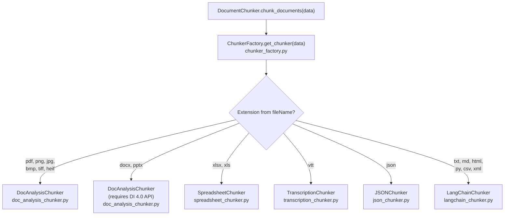

### 5.2 Document Intelligence Path

**Source:** `chunking/doc_analysis_chunker.py` → class `DocAnalysisChunker`

Used for: PDF, PNG, JPEG, BMP, TIFF, HEIF, DOCX, PPTX

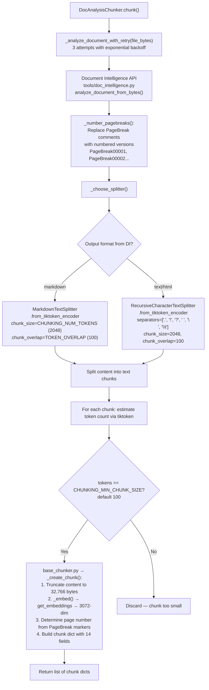

### 5.3 Non-DI Paths

**Source:** `chunking/langchain_chunker.py`, `spreadsheet_chunker.py`, etc.

Files that don't go through Document Intelligence are split using LangChain text splitters directly on the raw file content (decoded as UTF-8 text):

| Extension | Chunker File | Splitter | How It Works |
|-----------|-------------|----------|-------------|
| `.md` | `langchain_chunker.py` | `MarkdownTextSplitter` | Splits on markdown headers/sections |
| `.txt` | `langchain_chunker.py` | `RecursiveCharacterTextSplitter` | Splits on sentences, then whitespace |
| `.html` | `langchain_chunker.py` | HTML splitter | Splits on HTML tags |
| `.csv` | `langchain_chunker.py` | CSV splitter | Splits on delimiters |
| `.xml` | `langchain_chunker.py` | XML splitter | Splits on XML tags |
| `.py` | `langchain_chunker.py` | `PythonCodeTextSplitter` | Splits on functions/classes |
| `.json` | `json_chunker.py` | `JSONChunker` | Structure-aware splitting |
| `.vtt` | `transcription_chunker.py` | `TranscriptionChunker` | WebVTT timestamp-aware |
| `.xlsx/.xls` | `spreadsheet_chunker.py` | `SpreadsheetChunker` | Sheet-by-sheet or row-by-row (openpyxl) |

### 5.4 Document Intelligence API Versions

**Source:** `chunking/doc_analysis_chunker.py` — checks `DOC_INTELLIGENCE_API_VERSION` at init

| API Version | Output Format | Supports DOCX/PPTX | Figure Extraction |
|-------------|--------------|---------------------|-------------------|
| `2024-11-30` (default) | Plain text | No | No |
| `2023-10-31-preview` (4.0) | **Markdown** | **Yes** | **Yes** |

**Critical:** If you need to index Word and PowerPoint files, you **must** set `DOC_INTELLIGENCE_API_VERSION` to `2023-10-31-preview` or later. The default version silently skips DOCX/PPTX files.

---

## 6. Embedding Generation

**Source:** `tools/aoai.py` → class `AzureOpenAIClient`, and `chunking/base_chunker.py` → `_embed()`

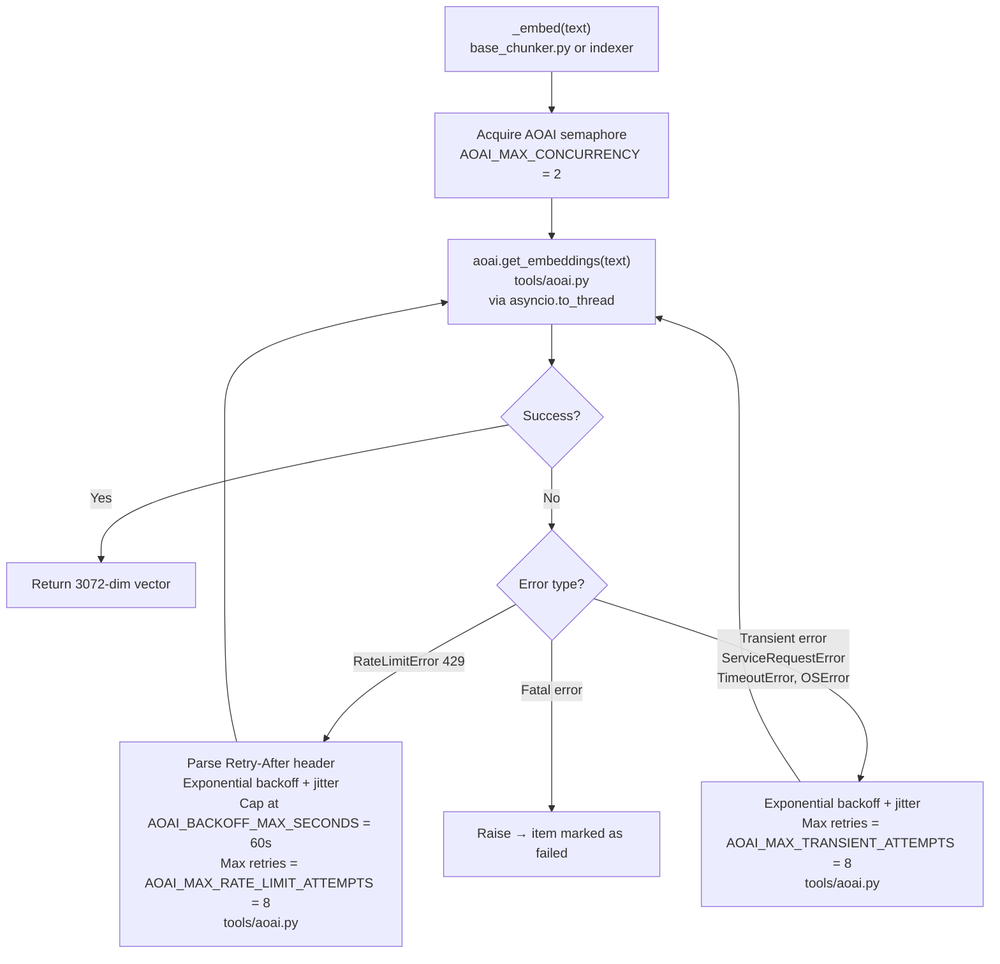

**Token truncation:** If input text exceeds 8,192 tokens (text-embedding-3-large limit), `_truncate_input()` in `tools/aoai.py` shortens it using an exponential step-size approach: removes 1 character at a time, doubles the step every 5 iterations, caps the step size at 100 characters. Token counting uses `tiktoken` with model-specific BPE encoding.

---

## 7. Search Document Schema — What Gets Uploaded

**Source:** `sharepoint_indexer.py` → `_doc_for_item()` and `_doc_for_attachment_chunk()`, `blob_storage_indexer.py` → equivalent methods

Each chunk uploaded to the `ragindex` contains these fields:

| Field | Type | SP Generic List | SP Doc Library | Blob |
|-------|------|----------------|----------------|------|
| `id` | String (key) | `{parent_id}__chunk_0` | `{parent_id}__chunk_{N}` | `{parent_id}__chunk_{N}` |
| `parent_id` | String | `{domain}/{site}/{listId}/{itemId}` | `{domain}/{site}/{listId}/{itemId}/{fileName}` | `{account}/{container}/{blobName}` |
| `metadata_storage_path` | String | = parent_id | = parent_id | = parent_id |
| `metadata_storage_name` | String | item_id | fileName | blob name |
| `metadata_storage_last_modified` | DateTimeOffset | Item lastModified | File lastModified | Blob last_modified |
| `metadata_security_user_ids` | Collection(String) | Graph API permissions | Graph API permissions | Blob metadata |
| `metadata_security_group_ids` | Collection(String) | Graph API permissions | Graph API permissions | Blob metadata |
| `metadata_security_rbac_scope` | String | Empty | Empty | Computed ARM path |
| `chunk_id` | Int32 | Always 0 | Sequential 0,1,2... | Sequential 0,1,2... |
| `content` | String | Concatenated fields text | Chunk text from DI | Chunk text from DI/splitter |
| `contentVector` | Collection(Single) | 3072-dim embedding | 3072-dim embedding | 3072-dim embedding |
| `page` | Int32 | 0 | From DI page breaks | From DI page breaks |
| `offset` | Int64 | 0 | Char offset in doc | Char offset in doc |
| `length` | Int32 | Content length | Chunk char length | Chunk char length |
| `title` | String | Item Title field | Item Title field | Blob name |
| `url` | String | SharePoint item URL | File webUrl | Blob URL |
| `category` | String | From config | From config | From config or empty |
| `source` | String | `"sharepoint-list"` | `"sharepoint-list"` | Blob-specific value |

---

## 8. Purger Jobs — Handling Deletions

### 8.1 SharePoint Purger

**Source:** `jobs/sharepoint_purger.py`

**Schedule:** Runs on a separate cron, typically 10 minutes after the indexer.

**How it works:**

1. Load site configs from Cosmos DB (same as indexer)
2. For each configured site/list, fetch the **current** list of item IDs from Graph API
3. Query AI Search for all indexed `parent_id` values that belong to this site/list
4. Compare: any `parent_id` in the index that does **not** have a corresponding item in SharePoint → delete from index
5. Delete all chunks for orphaned parent_ids

**What triggers deletion:** A document deleted from SharePoint, a list removed from the Cosmos config, or a site decommissioned.

### 8.2 Blob Purger

**Source:** `jobs/blob_storage_purger.py`

**Schedule:** `10 * * * *` (10 minutes past each hour, after the blob indexer at `0 * * * *`)

**How it works:**

1. List all blobs currently in the `documents` container
2. Query AI Search for all indexed `parent_id` values with blob-path format
3. Compare: any `parent_id` in the index whose blob no longer exists → delete from index
4. Delete all chunks for orphaned parent_ids

**What triggers deletion:** A blob deleted from the container, or moved/renamed (Azure Storage treats rename as delete + create).

### 8.3 Image Purger

**Source:** `jobs/image_purger.py`

Removes extracted images from the images blob container (`DOCUMENTS_IMAGES_STORAGE_CONTAINER`) that no longer have a corresponding parent document in the search index. This prevents orphaned images from accumulating when documents are re-indexed or deleted.

---

## 9. Freshness Check Mechanism — Shared

**Source:** Both indexers use `_needs_reindex(parent_id, last_modified)` and `_is_strictly_newer()`

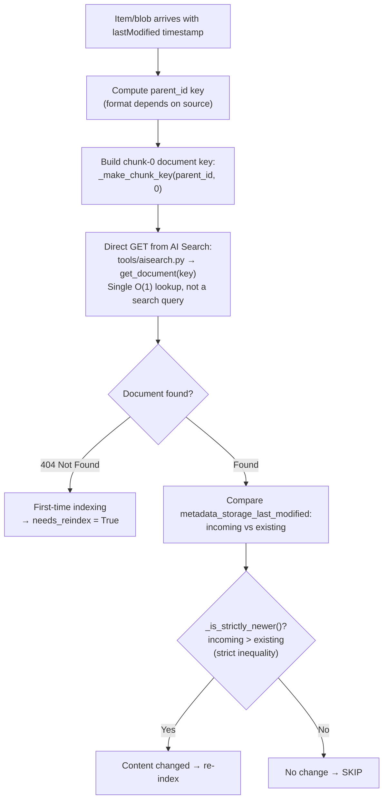

**Why direct lookup instead of search?** The previous implementation (pre-v2.2.4) used `search_text="*"` with a filter, which had a hard `top=1000` limit causing bugs with large lists (>1000 chunks for a single document). The direct `get_document(key)` approach is faster (single operation), cheaper (fewer RUs), and has no pagination limits.

---

## 10. ACL / Permission Extraction — Both Paths

### 10.1 SharePoint ACL Flow

**Source:** `sharepoint_indexer.py` → `_process_item()`, `tools/sharepoint.py` → `get_item_permission_principal_ids()`

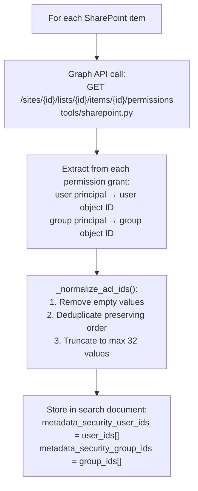

### 10.2 Blob ACL Flow

**Source:** `blob_storage_indexer.py` → ACL extraction section

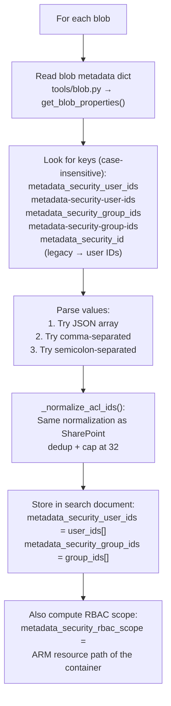

---

## 11. Concurrency and Rate Limiting Architecture

**Source:** All indexers share the same concurrency patterns defined in their base class and `tools/aoai.py`

| Layer | Control | Default | Code Location |
|-------|---------|---------|---------------|
| **Collection/container level** | `asyncio.gather` — all collections run concurrently | Unlimited | `sharepoint_indexer.py` → `run()` |
| **Item/blob level** | `asyncio.Semaphore(max_concurrency)` | SP: 4, Blob: 8 | Both indexers → `run()` loop |
| **Embedding level** | `asyncio.Semaphore(AOAI_MAX_CONCURRENCY)` | 2 | `tools/aoai.py` |
| **Per-item timeout** | `asyncio.wait_for(timeout=...)` | 600s (10 min) | Both indexers → worker function |
| **HTTP session timeout** | `aiohttp.ClientTimeout(total=...)` | 120s | `sharepoint_indexer.py` → `_ensure_clients()` |
| **Collection gather timeout** | `asyncio.wait_for(gather, timeout=...)` | 7200s (2 hours) | `sharepoint_indexer.py` → `run()` |
| **Blob operation timeout** | Per-blob logging timeout | 20s | Both indexers → logging calls |

### Retry strategies

| Target | Strategy | Max Retries | Backoff | Code Location |
|--------|----------|-------------|---------|---------------|
| **AOAI 429 (rate limit)** | Exponential + jitter, honors Retry-After | 8 | Cap 60s | `tools/aoai.py` |
| **AOAI transient errors** | Exponential + jitter | 8 | Cap 60s | `tools/aoai.py` |
| **AI Search uploads** | Exponential, honors Retry-After-ms | 8 | 1s → 30s | `tools/aisearch.py` → `_with_backoff()` |
| **Document Intelligence** | Simple retry | 3 | Fixed | `chunking/doc_analysis_chunker.py` → `_analyze_document_with_retry()` |
| **AOAI in chunker** | AOAI wrapper retries | 20 | Exponential, cap 60s | `chunking/base_chunker.py` via `OPENAI_RETRY_MAX_ATTEMPTS` |

---

## 12. Error Handling and Recovery

**Source:** Both indexers share identical patterns

**Item-level isolation:** Each item/blob is processed inside `asyncio.wait_for(_do(), timeout=self._item_timeout_s)`. If one fails or times out → error logged, stats.items_failed incremented, next item continues.

**Embedding resilience:** `_embed()` in `tools/aoai.py` has dual retry loops — one for 429s, one for transient network errors — each with independent counters. Only fatal (unknown) errors bubble up.

**Search upload resilience:** `_with_backoff()` in `tools/aisearch.py` retries 8 times with exponential backoff for `HttpResponseError` and `ServiceRequestError`.

**Run-level recovery:** `run()` wraps everything in try/except/finally. Even on total failure, a summary blob is written with `status: "failed"` + error message. Clients are always closed in the finally block.

**Storage logging safety:** Both indexers probe write permissions before logging with a zero-byte test blob. If storage is not writable → blob logging silently disabled, core indexing continues.

---

## 13. Logging and Observability

**Source:** Both indexers → `_log_event()`, blob writing methods

### 13.1 Three Types of Logs

**Structured App Insights logs** — JSON payloads with event names (`RUN-START`, `ITEM-COMPLETE`, `RUN-COMPLETE`) that include all counters. Queryable via KQL in Application Insights.

**Per-item file logs** — written to Azure Blob Storage in `{containerName}/jobs/{indexerName}/files/{sanitized_parent_id}.json`. Contains: item ID, parent ID, run ID, timestamps, freshness decision reason, chunk count, errors.

**Run summary blobs** — written at three lifecycle points:
- `status: "started"` — at run begin
- `status: "finishing"` — after all items processed
- `status: "finished"` — final with all counters

Plus a `{runId}.json` detailed file and `latest.json` pointer.

### 13.2 Run Summary Counters

| Counter | Meaning |
|---------|---------|
| `items_discovered` | Total items/blobs found in source |
| `items_indexed` | Items successfully processed and uploaded |
| `items_skipped_not_newer` | Items unchanged since last indexing |
| `items_failed` | Items that errored during processing |
| `att_candidates` | Document library files / blobs eligible for chunking |
| `att_uploaded_chunks` | Total chunks uploaded |
| `att_skipped_ext_not_allowed` | Files skipped due to extension filter |
| `att_skipped_not_newer` | Files unchanged since last indexing |

---

## 14. Configuration Reference

### 14.1 Core Settings

| Key | Default | Where Set | Purpose |
|-----|---------|-----------|---------|
| `SEARCH_RAG_INDEX_NAME` | `ragindex` | App Config / Bicep | Target AI Search index name |
| `EMBEDDING_DEPLOYMENT_NAME` | `text-embedding` | App Config / Bicep | OpenAI embedding model deployment |
| `EMBEDDINGS_VECTOR_DIMENSIONS` | `3072` | App Config | Must match model output |
| `DOC_INTELLIGENCE_API_VERSION` | `2024-11-30` | App Config | DI API version — set to `2023-10-31-preview` for DOCX/PPTX |

### 14.2 SharePoint Settings

| Key | Default | Purpose |
|-----|---------|---------|
| `SHAREPOINT_CLIENT_ID` | — | App registration client ID for Graph API |
| `authClientSecret` (Key Vault ref) | — | App registration client secret |
| `SHAREPOINT_FILES_FORMAT` | `pdf,docx,pptx` | Allowed file extensions for document libraries |

### 14.3 Storage Settings

| Key | Default | Purpose |
|-----|---------|---------|
| `STORAGE_ACCOUNT_NAME` | — | Storage account name |
| `STORAGE_BLOB_ENDPOINT` | — | Blob endpoint URL |
| `DOCUMENTS_STORAGE_CONTAINER` | `documents` | Container for document files (blob indexer source) |
| `DOCUMENTS_IMAGES_STORAGE_CONTAINER` | — | Container for extracted images |
| `DOCUMENTS_STORAGE_CONTAINER_RESOURCE_ID` | — | Full ARM resource ID (for RBAC scope) |

### 14.4 Chunking Settings

| Key | Default | Purpose |
|-----|---------|---------|
| `CHUNKING_NUM_TOKENS` | `2048` | Max tokens per chunk |
| `TOKEN_OVERLAP` | `100` | Overlap between chunks |
| `CHUNKING_MIN_CHUNK_SIZE` | `100` | Min tokens (smaller chunks discarded) |

### 14.5 Performance & Concurrency

| Key | Default | Purpose |
|-----|---------|---------|
| `INDEXER_MAX_CONCURRENCY` | 4 (SP) / 8 (blob) | Parallel items being processed |
| `INDEXER_BATCH_SIZE` | `500` | Documents per AI Search upload batch |
| `AOAI_MAX_CONCURRENCY` | `2` | Parallel embedding API calls |
| `AOAI_BACKOFF_MAX_SECONDS` | `60` | Max retry wait for rate limiting |
| `AOAI_MAX_RATE_LIMIT_ATTEMPTS` | `8` | Max retries for 429 responses |
| `AOAI_MAX_TRANSIENT_ATTEMPTS` | `8` | Max retries for network errors |
| `OPENAI_RETRY_MAX_ATTEMPTS` | `20` | AOAI wrapper retries (used by chunker) |
| `INDEXER_ITEM_TIMEOUT_SECONDS` | `600` | Per-item timeout (10 min) |
| `HTTP_TOTAL_TIMEOUT_SECONDS` | `120` | HTTP session timeout (Graph API) |
| `LIST_GATHER_TIMEOUT_SECONDS` | `7200` | Collection processing timeout (2 hours) |

---

## 15. Complete Data Lifecycle — Write + Read Paths

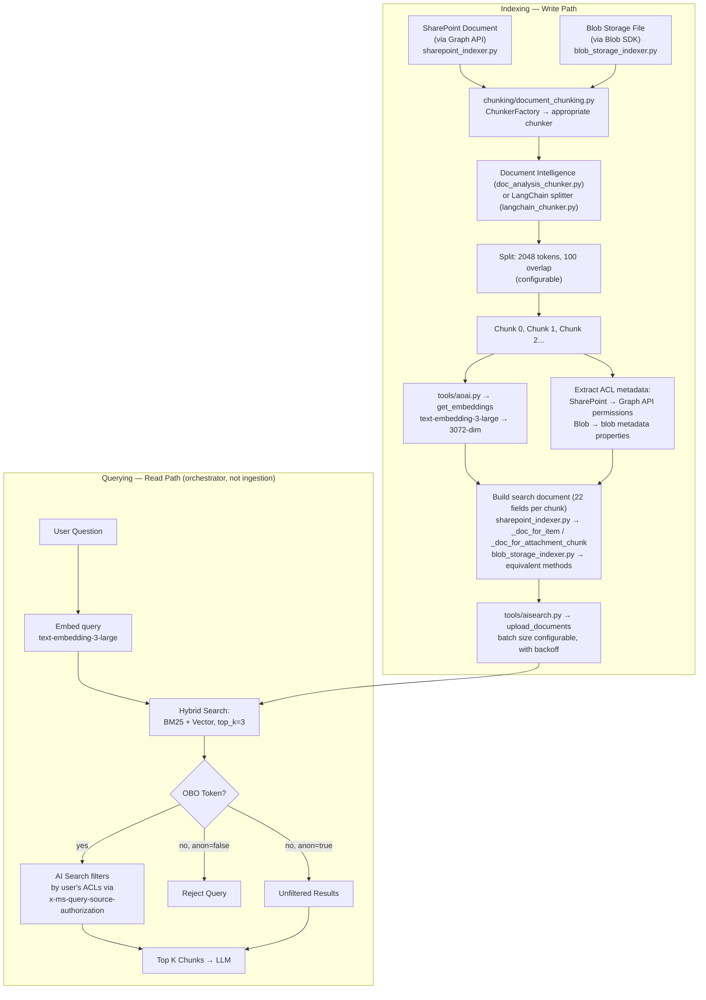

---

## 16. Authentication Chain

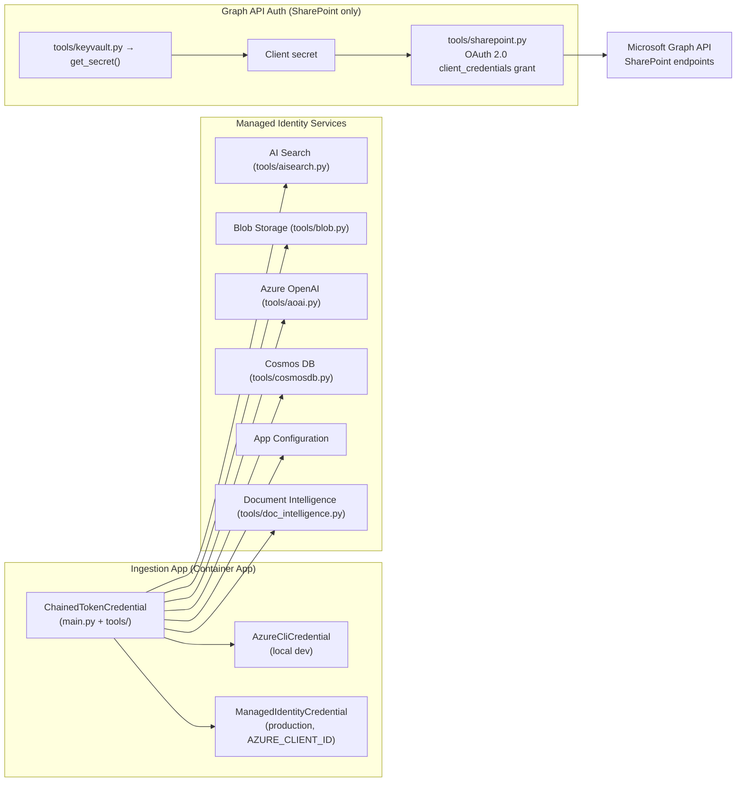

---

## 17. Cosmos DB Site Configuration Schema (SharePoint)

**Source:** `sharepoint_indexer.py` → `_parse_collections()`

```json
{
  "id": "<unique-id>",
  "type": "sharepoint_site",
  "siteDomain": "contoso.sharepoint.com",
  "siteName": "HRPortal",
  "category": "HR Documents",
  "lists": [
    {
      "listId": "abc12345-...",
      "listName": "Policy Documents",
      "listType": "documentLibrary",
      "filter": "fields/Status eq 'Published'",
      "includeFields": ["Title", "Department", "PolicyDate"],
      "excludeFields": ["InternalNotes"],
      "category": "Policies"
    },
    {
      "listId": "def67890-...",
      "listType": "genericList",
      "includeFields": ["Title", "Description", "FAQ_Answer"]
    }
  ]
}
```

| Field | Required | Purpose |
|-------|----------|---------|
| `siteDomain` | Yes | SharePoint tenant domain (e.g., `contoso.sharepoint.com`) |
| `siteName` | Yes | Site name within the tenant |
| `lists[].listId` | Preferred | Direct list GUID — avoids Graph API lookup |
| `lists[].listName` | Fallback | Legacy: requires Graph API call to resolve to ID |
| `lists[].listType` | No | `documentLibrary` or `genericList` (default) |
| `lists[].filter` | No | OData filter applied when fetching items from Graph API |
| `lists[].includeFields` | No | Whitelist of fields to include in content text |
| `lists[].excludeFields` | No | Blacklist of fields to exclude from content text |
| `lists[].category` | No | Category value written to the `category` index field |

---

## 18. Query-Time Retrieval (Orchestrator Side — for context)

### 18.1 How the Orchestrator Searches

**Source:** `gpt-rag-orchestrator/connectors/search.py`

The orchestrator's `SearchClient` executes searches against the same `ragindex` that both ingestion pipelines write to. At query time there is no distinction between documents ingested from SharePoint vs Blob — they're all in the same index with the same schema.

| Parameter | Config Key | Default | Impact |
|-----------|-----------|---------|--------|
| Top K results | `SEARCH_RAGINDEX_TOP_K` | **3** | Chunks returned to LLM |
| Search approach | `SEARCH_APPROACH` | `hybrid` | hybrid / vector / term |
| Semantic ranking | `SEARCH_USE_SEMANTIC` | `false` | Enables L2 reranking |
| Allow anonymous | `ALLOW_ANONYMOUS` | varies | If false, queries without user tokens rejected |

### 18.2 Permission Trimming — The OBO Flow

1. User authenticates to Frontend via Entra ID → gets JWT
2. Frontend forwards JWT to Orchestrator
3. Orchestrator exchanges JWT for Search-audience token (OBO flow)
4. Token sent as `x-ms-query-source-authorization: Bearer {token}` header
5. AI Search matches user's identity + groups against `metadata_security_user_ids` / `metadata_security_group_ids` / `metadata_security_rbac_scope`
6. Only matching documents returned

**Fail-closed:** When `ALLOW_ANONYMOUS=false`, missing or invalid tokens → query rejected with RuntimeError.
