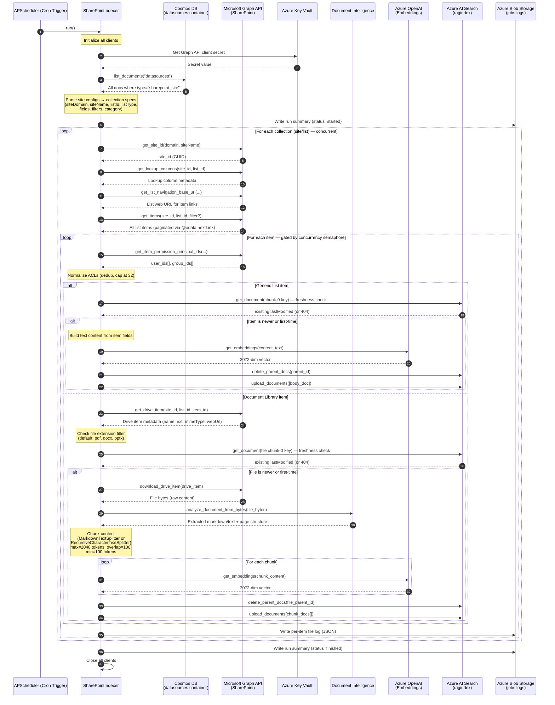
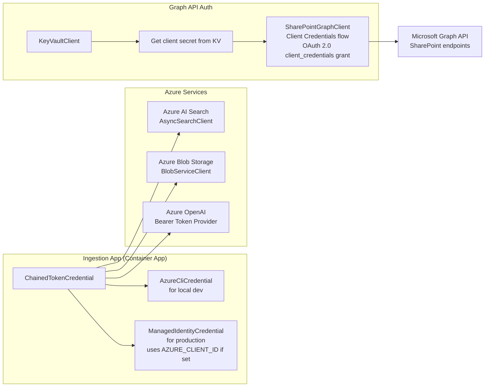
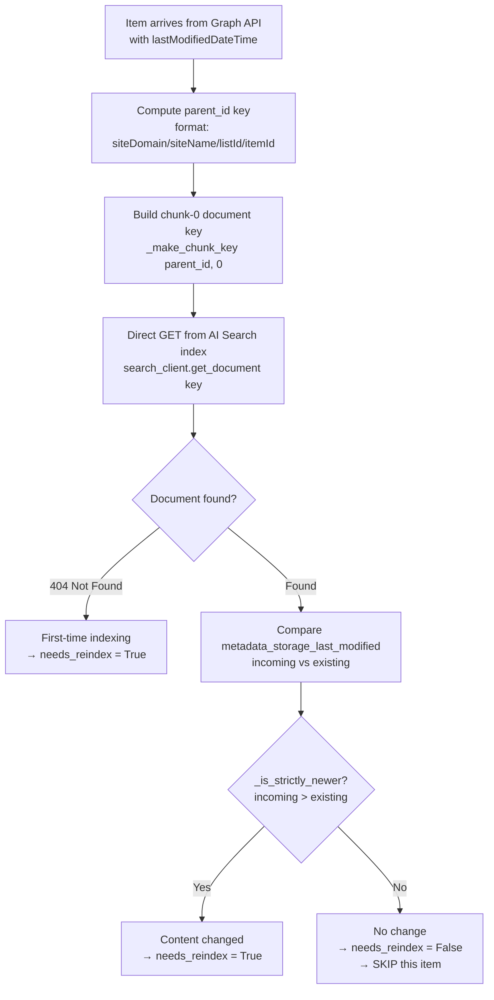
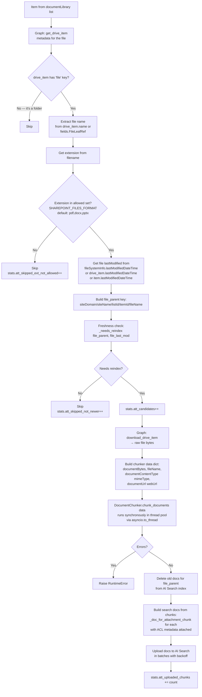
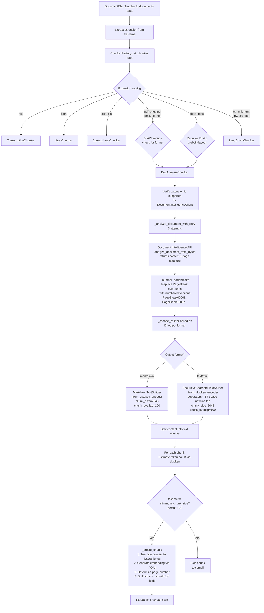
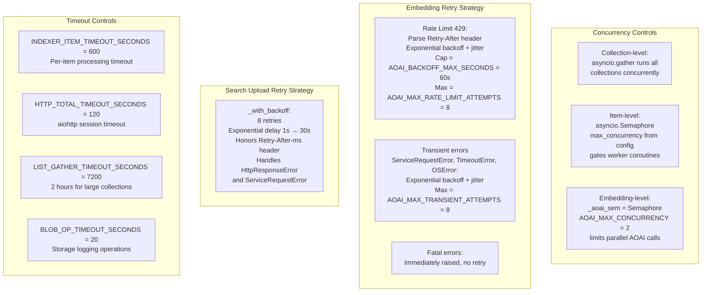
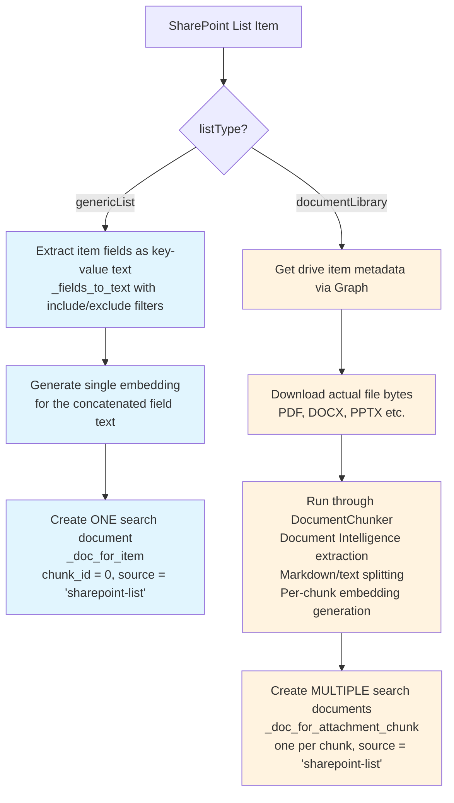
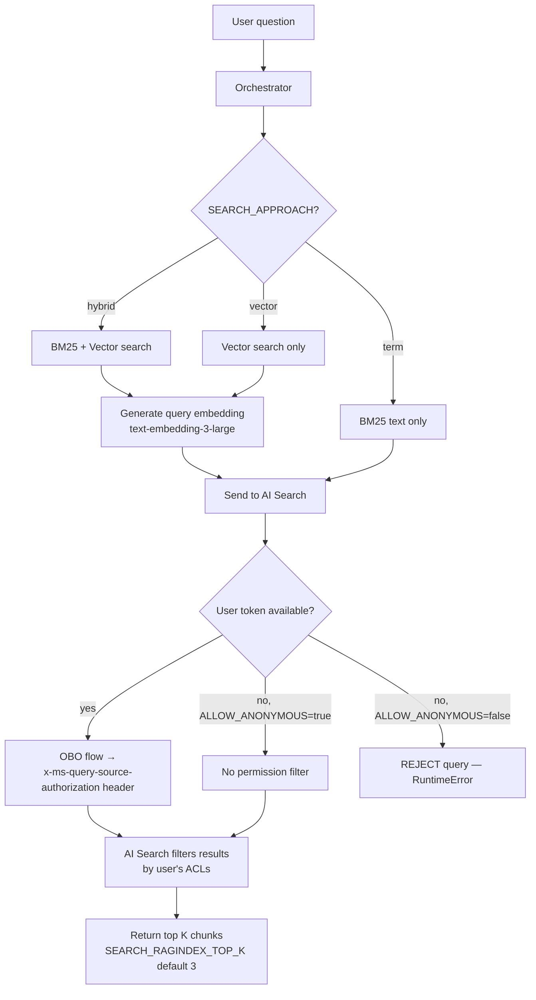
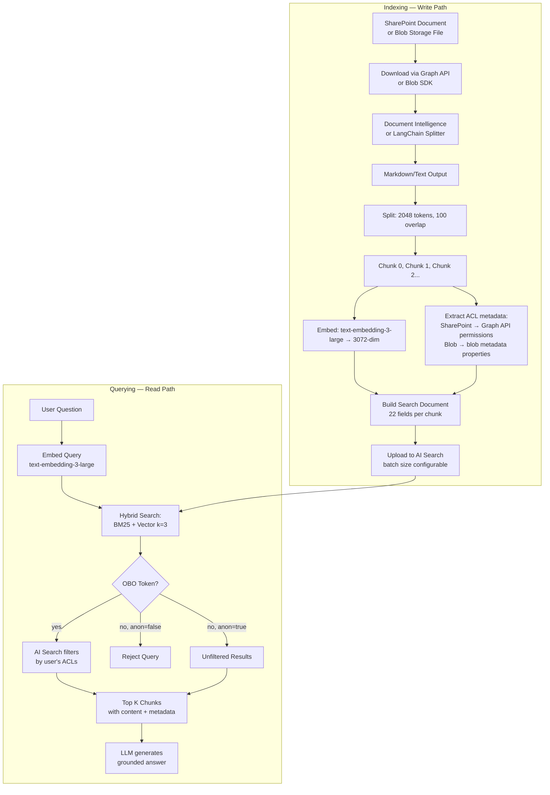

# Detailed Ingestion Process — SharePoint to Azure AI Search

This note documents the complete, step-by-step ingestion pipeline that the GPT-RAG Ingestion app uses to pull documents from SharePoint Online, extract their content, chunk and embed them, and push them into the Azure AI Search index. Every stage is traced directly from the `sharepoint_indexer.py` source code.

---

## 1. High-Level Sequence Diagram



---

## 2. Detailed Flow Diagram — Full Pipeline

```mermaid
flowchart TB
    subgraph TRIGGER["① Trigger"]
        A1[APScheduler fires cron job] --> A2[SharePointIndexer.run called]
    end

    subgraph INIT["② Client Initialization — _ensure_clients()"]
        B1[Create ChainedTokenCredential<br/>AzureCliCredential + ManagedIdentityCredential]
        B2[Init BlobServiceClient<br/>for job logging]
        B3[Init AsyncSearchClient<br/>endpoint + index name + credential]
        B4[Init KeyVaultClient]
        B5[Init SharePointGraphClient<br/>using KV secret for client credentials]
        B6[Init AzureOpenAIClient<br/>for embeddings]
        B7[Probe storage write permissions<br/>zero-byte write + delete test]
        B8[Ensure Graph token is fresh<br/>graph_client.ensure_token]

        B1 --> B2 --> B3 --> B4 --> B5 --> B6 --> B7 --> B8
    end

    subgraph CONFIG["③ Load Site Configurations"]
        C1[Cosmos DB: list_documents<br/>container = 'datasources']
        C2{Filter docs where<br/>type = 'sharepoint_site'}
        C3[Extract site configs:<br/>siteDomain, siteName,<br/>lists array]
        C4[_parse_collections:<br/>Normalize each list spec →<br/>listId, listType, filter,<br/>includeFields, excludeFields,<br/>category]

        C1 --> C2 --> C3 --> C4
    end

    subgraph RUN["④ Run Execution"]
        D1[Generate run_id = UTC timestamp]
        D2[Create RunStats counters]
        D3[Write initial run summary<br/>status = 'started' → Blob Storage]
        D4[Create aiohttp.ClientSession<br/>timeout = HTTP_TOTAL_TIMEOUT_SECONDS<br/>default 120s]

        D1 --> D2 --> D3 --> D4
    end

    subgraph COLLECTION["⑤ Process Each Collection — asyncio.gather concurrent"]
        E1[Graph: get_site_id<br/>domain + siteName → site GUID]
        E2[Resolve list_id:<br/>direct if provided,<br/>else legacy name lookup]
        E3[Load lookup column metadata<br/>for field enrichment]
        E4[Get list navigation URL<br/>for item web links]
        E5[Graph: get_items<br/>with optional OData filter<br/>paginated via @odata.nextLink]

        E1 --> E2 --> E3 --> E4 --> E5
    end

    subgraph ITEM["⑥ Process Each Item — worker() with semaphore"]
        F1[Increment items_discovered counter]
        F2[Extract item fields, title, lastModified]
        F3[Resolve lookup fields<br/>cross-list joins via Graph API]
        F4[Apply includeFields / excludeFields filters]
        F5[Graph: get_item_permission_principal_ids<br/>→ user_ids, group_ids]
        F6[Normalize ACLs:<br/>dedup + cap at 32 values each]

        F1 --> F2 --> F3 --> F4 --> F5 --> F6
    end

    subgraph BODY["⑦ Process Item Body"]
        G1[Search: get_document by chunk-0 key<br/>Direct lookup — no pagination needed]
        G2{_is_strictly_newer?<br/>incoming vs existing lastModified}
        G3[Build text content:<br/>_fields_to_text with field exclusions]
        G4[Generate embedding<br/>via _embed with semaphore gate]
        G5[Build body document:<br/>_doc_for_item → 22 index fields<br/>source = 'sharepoint-list']
        G6[Delete old parent docs from index]
        G7[Upload body doc to AI Search]
        G8[Skip — item not changed]

        G1 --> G2
        G2 -->|Yes| G3 --> G4 --> G5 --> G6 --> G7
        G2 -->|No| G8
    end

    subgraph DOCLIB["⑧ Process Document Library File"]
        H1[Graph: get_drive_item metadata]
        H2{Is it a file?<br/>not a folder}
        H3{Extension in allowed list?<br/>SHAREPOINT_FILES_FORMAT<br/>default: pdf,docx,pptx}
        H4[Get file lastModified from<br/>fileSystemInfo or item]
        H5[Search: freshness check<br/>get_document by file chunk-0 key]
        H6{_is_strictly_newer?}
        H7[Graph: download_drive_item<br/>→ raw file bytes]
        H8[DocumentChunker.chunk_documents<br/>data = bytes + fileName +<br/>mimeType + URL]
        H9[Delete old file docs from index]
        H10[Build chunk docs:<br/>_doc_for_attachment_chunk<br/>for each chunk]
        H11[Upload chunk docs to AI Search<br/>in batches]
        H12[Skip — file not changed]
        H13[Skip — extension not allowed]
        H14[Skip — not a file]

        H1 --> H2
        H2 -->|Yes| H3
        H2 -->|No| H14
        H3 -->|Yes| H4 --> H5 --> H6
        H3 -->|No| H13
        H6 -->|Yes| H7 --> H8 --> H9 --> H10 --> H11
        H6 -->|No| H12
    end

    subgraph CHUNKING["⑨ Inside DocumentChunker"]
        I1[ChunkerFactory selects chunker<br/>by file extension]
        I2{Extension?}
        I3[DocAnalysisChunker<br/>for pdf, png, jpg, bmp, tiff,<br/>docx, pptx]
        I4[SpreadsheetChunker<br/>for xlsx, xls]
        I5[TranscriptionChunker<br/>for vtt]
        I6[LangChainChunker<br/>for txt, md, html, etc.]
        I7[Document Intelligence API<br/>analyze_document_from_bytes<br/>with 3 retries]
        I8[Choose splitter:<br/>markdown output → MarkdownTextSplitter<br/>text output → RecursiveCharacterTextSplitter]
        I9[Split content into chunks<br/>max_chunk_size = CHUNKING_NUM_TOKENS = 2048<br/>overlap = TOKEN_OVERLAP = 100]
        I10[Filter by minimum size<br/>CHUNKING_MIN_CHUNK_SIZE = 100 tokens]
        I11[For each chunk:<br/>Generate embedding via AOAI<br/>Truncate content to 32,766 bytes<br/>Build chunk dict with 14 fields]

        I1 --> I2
        I2 -->|pdf/docx/pptx/images| I3 --> I7 --> I8 --> I9 --> I10 --> I11
        I2 -->|xlsx/xls| I4 --> I9
        I2 -->|vtt| I5 --> I9
        I2 -->|other text| I6 --> I9
    end

    subgraph EMBED["⑩ Embedding Generation — _embed()"]
        J1[Acquire AOAI semaphore<br/>AOAI_MAX_CONCURRENCY = 2]
        J2[Call aoai.get_embeddings text<br/>via asyncio.to_thread]
        J3{Success?}
        J4[Return 3072-dim vector]
        J5{RateLimitError 429?}
        J6[Parse Retry-After header<br/>Exponential backoff + jitter<br/>Cap at AOAI_BACKOFF_MAX_SECONDS = 60s<br/>Max retries = AOAI_MAX_RATE_LIMIT_ATTEMPTS = 8]
        J7{Transient error?<br/>ServiceRequestError<br/>TimeoutError, OSError}
        J8[Exponential backoff + jitter<br/>Max retries = AOAI_MAX_TRANSIENT_ATTEMPTS = 8]
        J9[Fatal error → raise]

        J1 --> J2 --> J3
        J3 -->|Yes| J4
        J3 -->|No| J5
        J5 -->|Yes| J6 --> J2
        J5 -->|No| J7
        J7 -->|Yes| J8 --> J2
        J7 -->|No| J9
    end

    subgraph UPLOAD["⑪ Index Upload — _upload_docs()"]
        K1[Split docs into batches<br/>batch_size from config]
        K2[For each batch:<br/>_with_backoff → upload_documents]
        K3[Backoff: 8 retries<br/>Exponential delay 1s→30s<br/>Honors Retry-After headers]

        K1 --> K2 --> K3
    end

    subgraph FINALIZE["⑫ Run Finalization"]
        L1[Aggregate stats from all collections]
        L2[Write run summary<br/>status = 'finishing' → Blob]
        L3[Write final run summary<br/>status = 'finished' → Blob<br/>+ pointer JSON + latest.json]
        L4[Structured log event:<br/>RUN-COMPLETE with all counters]
        L5[Close all async clients]

        L1 --> L2 --> L3 --> L4 --> L5
    end

    TRIGGER --> INIT --> CONFIG --> RUN --> COLLECTION --> ITEM
    ITEM --> BODY
    ITEM --> DOCLIB
    DOCLIB --> CHUNKING
    CHUNKING --> EMBED
    EMBED --> UPLOAD
    UPLOAD --> FINALIZE
```



---

## 3. Cosmos DB Site Configuration Schema

The SharePoint indexer reads its configuration from Cosmos DB. Each document in the `datasources` container that has `type: "sharepoint_site"` defines one SharePoint site with its lists to index.

**Document structure:**
```json
{
  "id": "<unique-id>",
  "type": "sharepoint_site",
  "siteDomain": "contoso.sharepoint.com",
  "siteName": "HRPortal",
  "category": "HR Documents",
  "lists": [
    {
      "listId": "abc12345-...",
      "listName": "Policy Documents",
      "listType": "documentLibrary",
      "filter": "fields/Status eq 'Published'",
      "includeFields": ["Title", "Department", "PolicyDate"],
      "excludeFields": ["InternalNotes"],
      "category": "Policies"
    },
    {
      "listId": "def67890-...",
      "listType": "genericList",
      "includeFields": ["Title", "Description", "FAQ_Answer"]
    }
  ]
}
```

**Key configuration fields:**

| Field | Required | Purpose |
|-------|----------|---------|
| `siteDomain` | Yes | SharePoint tenant domain (e.g., `contoso.sharepoint.com`) |
| `siteName` | Yes | Site name within the tenant |
| `lists[].listId` | Preferred | Direct list GUID — avoids Graph API lookup |
| `lists[].listName` | Fallback | Legacy: requires Graph API call to resolve to ID |
| `lists[].listType` | No | `documentLibrary` or `genericList` (default) |
| `lists[].filter` | No | OData filter applied when fetching items from Graph API |
| `lists[].includeFields` | No | Whitelist of fields to include in content text |
| `lists[].excludeFields` | No | Blacklist of fields to exclude from content text |
| `lists[].category` | No | Category value written to the `category` index field |

---

## 4. Authentication Chain



**Important:** The Graph API client uses a **separate** authentication path — it gets a client secret from Key Vault and uses the OAuth 2.0 client credentials grant (app-only permissions). This is different from the managed identity used for AI Search, Blob Storage, and Azure OpenAI.

---

## 5. Freshness Check Mechanism

The indexer avoids re-processing unchanged documents by comparing timestamps:



**Why direct lookup instead of search?** The previous implementation used `search_text="*"` with a filter, which had a hard `top=1000` limit causing bugs with large SharePoint lists. The direct `get_document(key)` approach is faster (single operation vs paginated search), cheaper (fewer RUs), and has no pagination limits.

---

## 6. ACL / Permission Extraction

```mermaid
flowchart TB
    A[For each SharePoint item] --> B[Graph API: get_item_permission_principal_ids<br/>GET /sites/{id}/lists/{id}/items/{id}/permissions]
    B --> C[Extract from each permission grant:<br/>user → user object ID<br/>group → group object ID]
    C --> D[_normalize_acl_ids:<br/>1. Remove empty values<br/>2. Deduplicate preserving order<br/>3. Truncate to max 32 values]
    D --> E[Store in search document:<br/>metadata_security_user_ids = user_ids<br/>metadata_security_group_ids = group_ids]
    E --> F[At query time:<br/>AI Search permissionFilter<br/>trims results based on<br/>the requesting user's<br/>OBO token identity]
```

**Cap of 32:** Azure AI Search has a limitation on the number of values in permission filter fields. The indexer enforces this with `_normalize_acl_ids(values, max_values=32)`. If an item has more than 32 unique user or group IDs, only the first 32 are kept (with a warning logged).

---

## 7. Document Library File Processing — Detailed



---

## 8. The Chunking Pipeline — Inside DocumentChunker



---

## 9. Search Document Schema — What Gets Uploaded

Each document uploaded to the AI Search `ragindex` contains these fields:

| Field | Type | Source | Notes |
|-------|------|--------|-------|
| `id` | String (key) | Generated | Format: `{parent_id}__chunk_{N}` |
| `parent_id` | String | Generated | `siteDomain/siteName/listId/itemId[/fileName]` |
| `metadata_storage_path` | String | = parent_id | Used for grouping |
| `metadata_storage_name` | String | item_id or fileName | Identifier within the source |
| `metadata_storage_last_modified` | DateTimeOffset | SharePoint lastModified | Used for freshness checks |
| `metadata_security_user_ids` | Collection(String) | Graph API permissions | ACL — user object IDs (max 32) |
| `metadata_security_group_ids` | Collection(String) | Graph API permissions | ACL — group object IDs (max 32) |
| `chunk_id` | Int32 | Sequential (0,1,2...) | 0 = body/first chunk |
| `content` | String | Extracted text | Truncated to 32,766 bytes; analyzed with `standard.lucene` |
| `contentVector` | Collection(Single) | Azure OpenAI | 3072 dimensions (text-embedding-3-large) |
| `captionVector` | Collection(Single) | — | Empty for SharePoint items |
| `page` | Int32 | DI page breaks | Page number within source document |
| `offset` | Int64 | Chunk position | Character offset in original content |
| `length` | Int32 | Chunk size | Character length of content |
| `title` | String | Item Title field | Filterable + searchable |
| `url` | String | SharePoint web URL | Link back to source item |
| `category` | String | Config or item | From Cosmos config `category` field |
| `filepath` | String | — | Empty for SharePoint items |
| `summary` | String | — | Empty for SharePoint items |
| `imageCaptions` | String | DI analysis | Image captions if extracted |
| `relatedFiles` | Collection(String) | — | Empty for SharePoint items |
| `relatedImages` | Collection(String) | — | Empty for SharePoint items |
| `source` | String | Hardcoded | Always `"sharepoint-list"` |

---

## 10. Concurrency and Rate Limiting Architecture



---

## 11. Key Configuration Parameters

| Parameter | Default | Where Used | Impact |
|-----------|---------|------------|--------|
| `SHAREPOINT_FILES_FORMAT` | `pdf,docx,pptx` | File extension filter | Controls which document library files get processed |
| `CHUNKING_NUM_TOKENS` | `2048` | Max chunk size | Larger = fewer chunks but may exceed context limits |
| `TOKEN_OVERLAP` | `100` | Token overlap between chunks | Ensures context continuity across chunk boundaries |
| `CHUNKING_MIN_CHUNK_SIZE` | `100` | Minimum chunk tokens | Chunks below this are discarded |
| `EMBEDDINGS_VECTOR_DIMENSIONS` | `3072` | Vector field dimensions | Must match embedding model output |
| `AOAI_MAX_CONCURRENCY` | `2` | Parallel embedding calls | Higher = faster but more 429s |
| `AOAI_BACKOFF_MAX_SECONDS` | `60` | Max retry wait | Upper bound for exponential backoff |
| `AOAI_MAX_RATE_LIMIT_ATTEMPTS` | `8` | Rate limit retry count | More retries = more resilient to TPM throttling |
| `AOAI_MAX_TRANSIENT_ATTEMPTS` | `8` | Network error retry count | Resilience to transient failures |
| `INDEXER_ITEM_TIMEOUT_SECONDS` | `600` | Per-item timeout | 10 minutes per item; prevents stuck items |
| `HTTP_TOTAL_TIMEOUT_SECONDS` | `120` | HTTP session timeout | Global timeout for Graph API calls |
| `LIST_GATHER_TIMEOUT_SECONDS` | `7200` | Collection processing timeout | 2 hours for very large lists |
| `OPENAI_RETRY_MAX_ATTEMPTS` | `20` | AOAI wrapper retries | Used by ingestion chunker's direct AOAI calls |
| `SEARCH_RAG_INDEX_NAME` | `ragindex-{token}` | Target index name | Must match the provisioned index |

---

## 12. Logging and Observability

The indexer produces three types of logs:

**Structured App Insights logs** via `_log_event()` — JSON payloads with event names like `RUN-START`, `ITEM-COMPLETE`, `RUN-COMPLETE` that include all counters and can be queried via KQL.

**Per-item file logs** written to Azure Blob Storage in the `jobs` container under `{indexerName}/files/{sanitized_parent_id}.json`. Each file log contains the item ID, parent ID, run ID, timestamps, freshness reason, and chunk count.

**Run summary blobs** written at three lifecycle points (started, finishing, finished) to `{indexerName}/runs/{runId}.json` plus a `latest.json` pointer. The summary includes aggregate counters for items discovered, indexed, skipped, failed, and document library statistics.

---

## 13. Generic List vs Document Library — Processing Differences



**Generic lists** produce exactly one search document per item (the body), containing all the item's field values as a text blob. **Document libraries** download the actual file, run it through Document Intelligence for content extraction, chunk the result, and produce multiple search documents per file — one per chunk.

---

## 14. Error Handling and Recovery

The indexer is designed for resilience at every level:

**Item-level isolation:** Each item is processed inside `asyncio.wait_for(_do(), timeout=self._item_timeout_s)`. If one item fails or times out, the error is logged and the next item continues. Failed items increment `stats.items_failed`.

**Embedding resilience:** The `_embed()` method has dual retry loops — one for rate limiting (429) and one for transient network errors — each with independent counters and configurable max attempts. Only truly fatal errors (unknown exceptions) bubble up.

**Search upload resilience:** The `_with_backoff()` wrapper retries 8 times with exponential backoff for both `HttpResponseError` and `ServiceRequestError`.

**Run-level recovery:** The `run()` method wraps everything in try/except/finally. Even if the entire run fails, a final summary is written with `status: "failed"` and the error message. Clients are always closed in the finally block.

**Storage logging safety:** Before any logging to Blob Storage, the indexer probes write permissions with a zero-byte test blob. If storage is not writable (wrong permissions, missing container, etc.), all blob logging is silently disabled without affecting the core indexing process.

---

## 15. Blob Storage Ingestion Path

While the SharePoint indexer is covered in detail above, the GPT-RAG pipeline also supports a **Blob Storage indexer** that runs as a separate cron job. The two indexers share the same AI Search index and chunking/embedding infrastructure but differ in how they acquire documents and extract ACLs.

### 15.1 Blob Acquisition

- **Scheduler:** Cron job (default: `0 * * * *` = hourly)
- **Source container:** `DOCUMENTS_STORAGE_CONTAINER` (default: `documents`)
- **Change detection:** Compares blob `metadata_storage_last_modified` against the search index to skip unchanged files
- **Auth:** Managed identity (ChainedTokenCredential)
- **Concurrency:** `INDEXER_MAX_CONCURRENCY` (default: 8 for blob)

### 15.2 Blob ACL Extraction

Unlike SharePoint (which calls Graph API for permissions), the blob indexer reads ACLs from **blob metadata properties**:

1. Look for keys: `metadata_security_user_ids`, `metadata-security-user-ids` (case-insensitive variants)
2. Look for keys: `metadata_security_group_ids`, `metadata-security-group-ids`
3. Legacy fallback: `metadata_security_id` → treated as user IDs
4. Parse values — supports comma-separated, JSON arrays, and semicolon-separated formats
5. Normalize: deduplicate, cap at 32 values per field, remove empties

### 15.3 RBAC Scope Computation (Blob Only)

The `metadata_security_rbac_scope` field is computed with this preference order:

1. **Explicit:** `DOCUMENTS_STORAGE_CONTAINER_RESOURCE_ID` config value (if set)
2. **Computed:** `/subscriptions/{SUB_ID}/resourceGroups/{RG}/providers/Microsoft.Storage/storageAccounts/{account}/blobServices/default/containers/{container}`
3. **Empty string** if neither available (non-RBAC scenarios)

This field enables Azure RBAC-based permission trimming at query time, as an alternative to explicit user/group ACLs.

### 15.4 Purging Deleted Documents

Separate purger jobs (`sharepoint_purger.py`, blob purger) run on a separate cron schedule (default: 10 minutes after the indexer). They compare currently indexed document IDs against the source and delete any documents from the index that no longer exist at the source.

---

## 16. Document Intelligence API Versions

The DI API version controls what file formats can be extracted and the quality of the output:

| API Version | Output Format | Supports DOCX/PPTX | Figure Extraction |
|-------------|--------------|---------------------|-------------------|
| `2024-11-30` (default) | Plain text | No | No |
| `2023-10-31-preview` (4.0) | **Markdown** | **Yes** | **Yes** |

**Critical setting:** `DOC_INTELLIGENCE_API_VERSION` — If you need to index Word and PowerPoint files from SharePoint, you **must** set this to `2023-10-31-preview` or later. The default version does not support DOCX/PPTX.

### Non-DI Format Splitters

Files that don't go through Document Intelligence use LangChain text splitters directly:

| Extension | Splitter | How it works |
|-----------|----------|-------------|
| `.md` | `MarkdownTextSplitter` | Splits on markdown headers/sections |
| `.txt` | `RecursiveCharacterTextSplitter` | Splits on sentences, then whitespace |
| `.html` | HTML splitter | Splits on HTML tags |
| `.csv` | CSV splitter | Splits on delimiters |
| `.xml` | XML splitter | Splits on XML tags |
| `.py` | `PythonCodeTextSplitter` | Splits on functions/classes |
| `.json` | JSONChunker | Structure-aware splitting |
| `.vtt` | TranscriptionChunker | WebVTT timestamp-aware |
| `.xlsx` | SpreadsheetChunker | Sheet-by-sheet or row-by-row (openpyxl) |

---

## 17. Embedding Token Truncation

If chunk text exceeds 8,192 tokens (the text-embedding-3-large model's limit), the `_truncate_input()` method in `AzureOpenAIClient` shortens it using an exponential step-size approach: it starts removing 1 character at a time, doubles the step every 5 iterations, and caps the step size at 100 characters. Token counting uses `tiktoken` with the model-specific BPE encoding for exact measurement rather than character approximation.

---

## 18. Query-Time Retrieval (Orchestrator Side)

### 18.1 How the Orchestrator Searches

The orchestrator's `SearchClient` (`connectors/search.py`) executes searches against the same AI Search index that the ingestion pipeline writes to:



### 18.2 Search Approaches

| Approach | Config Value | What Happens |
|----------|-------------|--------------|
| **Hybrid** (default) | `SEARCH_APPROACH=hybrid` | BM25 keyword search combined with vector similarity via RRF. Best accuracy. |
| **Vector** | `SEARCH_APPROACH=vector` | Vector similarity only. Good for semantic understanding, may miss exact keyword matches. |
| **Term** | `SEARCH_APPROACH=term` | BM25 keyword search only. Fastest, no embedding needed at query time. |

### 18.3 Permission Trimming — The OBO Flow

This is the most critical security mechanism in the entire pipeline:

1. User authenticates to Frontend via Entra ID → gets a JWT token
2. Frontend forwards the JWT to the Orchestrator in the `Authorization` header
3. Orchestrator exchanges the user's JWT for a **Search-audience token** using the On-Behalf-Of (OBO) flow:
   - Calls `https://login.microsoftonline.com/{tenant}/oauth2/v2.0/token`
   - Grant type: `urn:ietf:params:oauth:grant-type:jwt-bearer`
   - Scope: `https://search.azure.com/user_impersonation`
4. The Search-audience token is sent as `x-ms-query-source-authorization: Bearer {token}` header with the search request
5. AI Search uses this token to filter results — only returning chunks where the user's ID or groups match the `metadata_security_user_ids` / `metadata_security_group_ids` fields

**Fail-closed behavior:** When `ALLOW_ANONYMOUS=false` (recommended for production), if no user token is present or OBO fails, the query is rejected with a RuntimeError. This ensures no one can see documents they shouldn't have access to.

### 18.4 Orchestrator Search Settings

| Parameter | Config Key | Default | Impact |
|-----------|-----------|---------|--------|
| Top K results | `SEARCH_RAGINDEX_TOP_K` | **3** | Chunks returned to the LLM. More = more context but higher token cost |
| Search approach | `SEARCH_APPROACH` | `hybrid` | hybrid/vector/term |
| Use semantic ranking | `SEARCH_USE_SEMANTIC` | `false` | Enables L2 semantic reranking (improves quality, adds latency) |
| Index name | `SEARCH_RAG_INDEX_NAME` | `ragindex` | Must match the provisioned index |
| Allow anonymous | `ALLOW_ANONYMOUS` | varies | If false, queries without user tokens are rejected |

---

## 19. Tuning and Configuration Guide

### Must-Configure Before First Indexing

| Setting | Where | Why |
|---------|-------|-----|
| `DOC_INTELLIGENCE_API_VERSION` | App Configuration | Set to `2023-10-31-preview` if you need DOCX/PPTX support |
| SharePoint site config | Cosmos DB `datasources` container | Defines which sites/libraries to crawl |
| `SHAREPOINT_CLIENT_ID` + secret | App Config + Key Vault | Required for Graph API authentication |
| `EMBEDDING_DEPLOYMENT_NAME` | App Configuration | Must point to your text-embedding-3-large deployment |

### Tune for Quality

| Setting | Default | When to Change |
|---------|---------|---------------|
| `CHUNKING_NUM_TOKENS` | 2048 | Increase for dense documents (contracts, specs), decrease for short Q&A content |
| `TOKEN_OVERLAP` | 100 | Increase if chunks seem to miss context at boundaries |
| `SEARCH_RAGINDEX_TOP_K` | 3 | Increase to 5–10 if answers seem incomplete |
| `SEARCH_APPROACH` | hybrid | Keep hybrid — best balance of keyword and semantic retrieval |
| HNSW `efSearch` | 500 | Increase to 750+ if vector recall seems low |

### Tune for Performance

| Setting | Default | When to Change |
|---------|---------|---------------|
| `INDEXER_MAX_CONCURRENCY` | 4/8 | Increase for faster ingestion (watch TPM limits) |
| `INDEXER_BATCH_SIZE` | 500 | Decrease if getting timeout errors on large batches |
| `OPENAI_RETRY_MAX_ATTEMPTS` | 20 | Lower if you'd rather fail fast than wait |
| `AOAI_MAX_CONCURRENCY` | 2 | Increase if embedding TPM capacity allows |

### Security-Critical

| Setting | Recommended | Why |
|---------|------------|-----|
| `ALLOW_ANONYMOUS` | **false** | Enforces fail-closed permission trimming |
| `useCAppAPIKey` | **true** | API key auth between Container Apps |
| `networkIsolation` | **true** | VNet + private endpoints |
| Entra app permissions | Admin-consented | `Sites.Read.All`, `Files.Read.All`, `GroupMember.Read.All` |

---

## 20. Complete Data Lifecycle — Write + Read Paths


