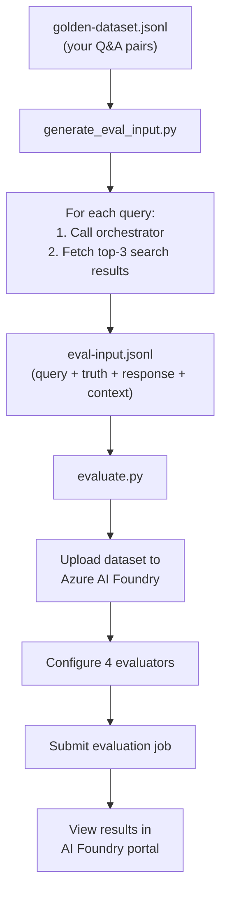
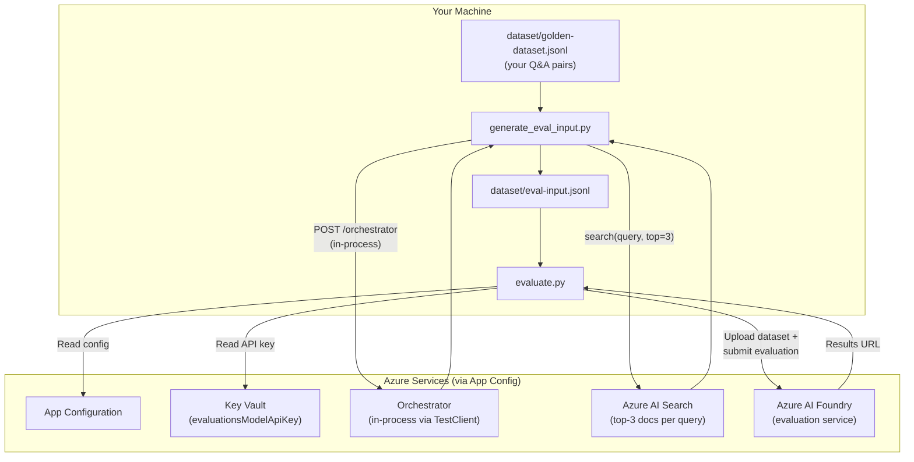
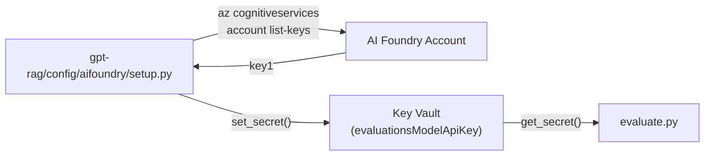
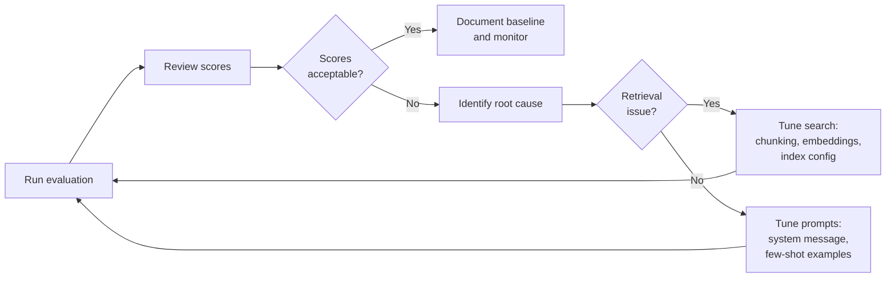

# RAG Evaluation Framework (GPT-RAG Orchestrator)

> End-to-end guide for evaluating the accuracy, relevance, and safety of your GPT-RAG chatbot using Azure AI Foundry's built-in evaluation service.
> **Source:** `gpt-rag-orchestrator` repo → `evaluations/` folder + `dataset/` folder
> **Orchestrator version:** 2.4.2

---

## 1. Overview

The GPT-RAG accelerator ships with a built-in evaluation framework in the orchestrator repo. It uses **Azure AI Foundry's Evaluation Service** (via the `azure-ai-projects` SDK) to run AI-assisted quality and safety metrics against your deployed RAG pipeline.

The key idea: you provide a "golden dataset" of questions with expected answers, the framework runs each question through your live orchestrator, collects the response and the retrieved search context, and submits everything to Azure AI Foundry for scoring. Results are viewable in the Azure AI Foundry portal with detailed per-question breakdowns.

---

## 2. What Gets Evaluated

The framework runs four evaluators out of the box. Each evaluator is an AI-assisted scorer powered by your deployed chat model:

### 2.1 Response Completeness

Measures how thoroughly the generated response covers all critical points from the expected (ground truth) answer. Checks whether important details are present and accurate.

| Property | Value |
|----------|-------|
| **Evaluator ID** | `EvaluatorIds.RESPONSE_COMPLETENESS` |
| **Inputs** | `response` (model output), `ground_truth` (expected answer) |
| **Score range** | 1–5 (1 = missing critical info, 5 = fully complete) |

### 2.2 Relevance

Assesses whether the response directly addresses the user's question without diverging into unrelated topics.

| Property | Value |
|----------|-------|
| **Evaluator ID** | `EvaluatorIds.RELEVANCE` |
| **Inputs** | `response` (model output), `query` (user question) |
| **Score range** | 1–5 (1 = off-topic, 5 = directly on-point) |

### 2.3 Retrieval

Evaluates whether the search step (Azure AI Search) retrieved useful and accurate context for the model to work with. This metric targets the retrieval quality, not the model's response.

| Property | Value |
|----------|-------|
| **Evaluator ID** | `EvaluatorIds.RETRIEVAL` |
| **Inputs** | `query` (user question), `context` (top-3 retrieved documents) |
| **Score range** | 1–5 (1 = irrelevant context, 5 = highly relevant documents retrieved) |

### 2.4 Content Safety

Checks the response for harmful, violent, self-harm, sexual, or offensive content. This is a safety gate, not a quality metric.

| Property | Value |
|----------|-------|
| **Evaluator ID** | `EvaluatorIds.CONTENT_SAFETY` |
| **Inputs** | `response` (model output), `query` (user question) |
| **Output** | Categorical (safe / unsafe per category) |

---

## 3. How It Works — End to End

The evaluation pipeline has two stages, wrapped in a single shell script:



### 3.1 Stage 1 — Generate Evaluation Input (`generate_eval_input.py`)

This script reads your golden dataset and produces the evaluation input by running each question through your actual orchestrator:

1. Reads `dataset/golden-dataset.jsonl` — each line has a `query` and `ground-truth`
2. For each query, calls the orchestrator's `/orchestrator` endpoint via FastAPI `TestClient` (in-process, no network call needed)
3. Separately queries Azure AI Search for the top 3 matching documents (to capture what the retrieval step found)
4. Writes `dataset/eval-input.jsonl` with four fields per line:

```json
{
    "query": "What is the company's policy on remote work?",
    "truth": "Employees may work remotely up to 3 days per week with manager approval.",
    "response": "According to the HR handbook, employees can work from home...",
    "context": ["Document chunk 1...", "Document chunk 2...", "Document chunk 3..."]
}
```

**Important:** The `TestClient` approach means the script runs the orchestrator in-process. It imports `src.main:app` directly, so it needs the same environment (App Config, credentials, etc.) that the orchestrator needs. It does NOT make HTTP calls to a remote orchestrator — it runs the full FastAPI app locally.

### 3.2 Stage 2 — Submit Evaluation (`evaluate.py`)

This script takes the generated `eval-input.jsonl` and submits it to Azure AI Foundry:

1. Reads configuration from App Configuration (project endpoint, model endpoint, deployment name)
2. Retrieves the model API key from Key Vault (secret: `evaluationsModelApiKey`)
3. Uploads the dataset to Azure AI Projects with a timestamped version (e.g., `v20260324143022`)
4. Configures the four evaluators with appropriate data mappings
5. Submits the evaluation job to Azure AI Foundry
6. Prints a URL where you can view results in the AI Foundry portal

---

## 4. Prerequisites — What You Need Before Starting

### 4.1 Azure Resources

| Resource | Purpose | How to verify |
|----------|---------|---------------|
| **Azure AI Foundry project** | Hosts evaluation runs | Check `AI_FOUNDRY_PROJECT_ENDPOINT` in App Config |
| **Azure AI Foundry account** | Model endpoint for evaluator scoring | Check `AI_FOUNDRY_ACCOUNT_ENDPOINT` in App Config |
| **Chat model deployment** | The evaluators use this model to score responses | Check `CHAT_DEPLOYMENT_NAME` in App Config |
| **Azure AI Search** | Needed by `generate_eval_input.py` to fetch context | Check `SEARCH_SERVICE_QUERY_ENDPOINT` and `SEARCH_RAG_INDEX_NAME` in App Config |
| **Key Vault** | Stores the model API key for evaluation | Check `KEY_VAULT_URI` in App Config |

### 4.2 App Configuration Keys

These keys must exist in your App Configuration instance (label: `gpt-rag`):

| Key | Purpose | Example value |
|-----|---------|---------------|
| `AI_FOUNDRY_PROJECT_ENDPOINT` | Azure AI Projects endpoint | `https://<project>.services.ai.azure.com` |
| `AI_FOUNDRY_ACCOUNT_ENDPOINT` | Azure AI account endpoint (model hosting) | `https://<account>.services.ai.azure.com` |
| `CHAT_DEPLOYMENT_NAME` | Name of your deployed chat model | `gpt-4o` |
| `KEY_VAULT_URI` | Key Vault URI | `https://<vault>.vault.azure.net/` |
| `SEARCH_SERVICE_QUERY_ENDPOINT` | Azure AI Search endpoint | `https://<search>.search.windows.net` |
| `SEARCH_RAG_INDEX_NAME` | Name of your RAG search index | `ragindex` |
| `EVALUATIONS_MODEL_API_KEY_SECRET_NAME` | (Optional) Custom Key Vault secret name | Default: `evaluationsModelApiKey` |
| `DATASET_NAME` | (Optional) Name for uploaded dataset | Default: `eval-dataset` |
| `EVAL_INPUT_FILE` | (Optional) Custom path for eval input file | Default: `dataset/eval-input.jsonl` |

### 4.3 Key Vault Secret

The evaluation framework needs a model API key to call the evaluators. This key must be stored in Key Vault:

| Secret name | Value | How it gets created |
|-------------|-------|---------------------|
| `evaluationsModelApiKey` | API key for the Azure AI Foundry account | Created by `config/aifoundry/setup.py` in the main `gpt-rag` repo |

**How to create the secret (if it doesn't exist yet):**

**Option A — Run the AI Foundry setup script** (recommended, also configures RAI policies):
```bash
cd path/to/gpt-rag
export APP_CONFIG_ENDPOINT="https://<your-appconfig>.azconfig.io"
python config/aifoundry/setup.py
```
This script reads `AI_FOUNDRY_ACCOUNT_NAME` from App Config, fetches the account's API key using the Azure Management SDK, and stores it as `evaluationsModelApiKey` in Key Vault.

**Option B — Create manually via Azure CLI:**
```bash
# Get the API key from your AI Foundry account
az cognitiveservices account keys list \
    --name <ai-foundry-account-name> \
    --resource-group <resource-group> \
    --query key1 -o tsv

# Store it in Key Vault
az keyvault secret set \
    --vault-name <key-vault-name> \
    --name evaluationsModelApiKey \
    --value "<the-api-key>"
```

### 4.4 Local Machine Requirements

| Requirement | Command to verify |
|-------------|-------------------|
| Python 3.10+ | `python --version` |
| Azure CLI | `az --version` |
| Logged in to Azure | `az login` |
| `APP_CONFIG_ENDPOINT` set | `echo $APP_CONFIG_ENDPOINT` |
| Network access to Azure services | Must be able to reach App Config, Key Vault, AI Search, AI Foundry |

### 4.5 RBAC Permissions

Your identity (Azure CLI login or managed identity) needs:

| Role | On which resource | Why |
|------|-------------------|-----|
| `App Configuration Data Reader` | App Configuration | Read config keys |
| `Key Vault Secrets User` | Key Vault | Read `evaluationsModelApiKey` |
| `Search Index Data Reader` | Azure AI Search | Query search index for context |
| `Azure AI Developer` (or equivalent) | AI Foundry project | Upload datasets, submit evaluations |

---

## 5. Creating the Golden Dataset

The golden dataset is the foundation of your evaluation. It's a JSONL file where each line is a test case with a question and expected answer.

### 5.1 File Location and Format

**Path:** `dataset/golden-dataset.jsonl` (relative to the orchestrator repo root)

**Format:** One JSON object per line, with two required fields:

```json
{"query": "What is the company's remote work policy?", "ground-truth": "Employees may work remotely up to 3 days per week with manager approval."}
{"query": "What benefits are available for new employees?", "ground-truth": "New employees receive health insurance, 401k matching, and 15 days of PTO starting from day one."}
{"query": "How do I submit an expense report?", "ground-truth": "Submit expense reports through the SAP Concur portal within 30 days of the expense."}
```

### 5.2 Sample Dataset (Shipped with Accelerator)

The accelerator ships with 5 sample entries based on the fictional "Contoso Electronics" company:

| Query | Ground Truth |
|-------|-------------|
| What is Contoso Electronics' mission? | To provide the highest quality electronic components... |
| How often are performance reviews conducted? | Performance reviews are conducted annually. |
| Name three core values. | Quality, Integrity, and Innovation. |
| What should an employee do if they witness workplace violence? | Immediately notify their supervisor or HR Representative. |
| List two key components of the workplace safety program. | Hazard identification and risk assessment, and PPE provision. |

**You must replace this with your own data** — these sample questions are for the Contoso demo documents, not your actual indexed content.

### 5.3 Best Practices for Building Your Golden Dataset

**How many test cases?** Start with 20–50 diverse questions. Cover different document types, topics, and question styles. More is better but each run costs token usage.

**What makes a good ground truth?**
- Be specific and factual — avoid vague or subjective answers
- Include the key information the answer MUST contain
- Keep it concise — the completeness evaluator checks whether critical points are covered, not exact wording
- Base it on what your actual indexed documents say, not what you think the answer should be

**Question diversity:**
- Include factual questions ("What is...?", "How many...?")
- Include procedural questions ("How do I...?", "What steps...?")
- Include comparison questions ("What is the difference between...?")
- Include questions that span multiple documents
- Include questions where the answer should NOT be found (to test "I don't know" behavior)
- Include questions with different levels of specificity

**Common pitfalls:**
- Don't use questions about documents that haven't been indexed yet
- Don't write ground truth from memory — verify against the actual documents
- Don't make ground truth too long — focus on the essential facts
- Don't forget to update the golden dataset when documents change

---

## 6. Running the Evaluation — Step by Step

### 6.1 Quick Start

```bash
# 1. Login to Azure
az login

# 2. Set your App Configuration endpoint
export APP_CONFIG_ENDPOINT="https://<your-appconfig>.azconfig.io"

# 3. Navigate to the orchestrator repo
cd path/to/gpt-rag-orchestrator

# 4. (First time only) Replace the sample golden dataset
#    Edit dataset/golden-dataset.jsonl with your own Q&A pairs

# 5. Run the evaluation
./evaluations/evaluate.sh
```

On Windows PowerShell:
```powershell
$Env:APP_CONFIG_ENDPOINT = "https://<your-appconfig>.azconfig.io"
cd path\to\gpt-rag-orchestrator
.\evaluations\evaluate.ps1
```

### 6.2 What the Script Does

The `evaluate.sh` / `evaluate.ps1` script automates the full pipeline:

| Step | Action | Detail |
|------|--------|--------|
| 1 | Validate | Checks `APP_CONFIG_ENDPOINT` is set |
| 2 | Create venv | `python -m venv evaluations/.venv` |
| 3 | Install deps | `pip install -r evaluations/requirements.txt` |
| 4 | Set PYTHONPATH | Adds repo root + `src/` so imports work |
| 5 | Generate input | Runs `generate_eval_input.py` — calls orchestrator for each query |
| 6 | Submit evaluation | Runs `evaluate.py` — uploads dataset and triggers Azure evaluation |
| 7 | Cleanup | Deactivates and removes the virtual environment |

### 6.3 Generate-Only Mode

If you want to generate the evaluation input file without submitting to Azure (useful for inspecting what the orchestrator returns before paying for evaluation):

```bash
./evaluations/evaluate.sh --skip-eval
```

```powershell
.\evaluations\evaluate.ps1 -SkipEval
```

This produces `dataset/eval-input.jsonl` which you can inspect manually.

### 6.4 Expected Duration

The evaluation time depends on your golden dataset size:

| Dataset size | Stage 1 (generate) | Stage 2 (evaluate) | Notes |
|-------------|--------------------|--------------------|-------|
| 5 questions | ~1–2 minutes | ~3–5 minutes | Sample dataset |
| 20 questions | ~5–10 minutes | ~10–15 minutes | Good starting size |
| 50 questions | ~15–30 minutes | ~20–30 minutes | Comprehensive eval |
| 100+ questions | ~1+ hour | ~30–60 minutes | Thorough eval |

Stage 1 time depends on orchestrator response latency. Stage 2 time depends on Azure AI Foundry processing.

---

## 7. Viewing Results

After the evaluation completes, the script prints a URL:

```
Evaluation started. You can view the results at: https://ai.azure.com/...
```

### 7.1 What You See in Azure AI Foundry Portal

The evaluation results page shows:

- **Overall scores** — average across all test cases for each metric
- **Per-question breakdown** — individual scores for each test case
- **Response details** — the actual response, retrieved context, and ground truth side by side
- **Safety flags** — any content safety violations highlighted

### 7.2 Interpreting Scores

| Metric | Score 1–2 | Score 3 | Score 4–5 |
|--------|-----------|---------|-----------|
| **Completeness** | Missing critical information | Partially complete | Covers all key points |
| **Relevance** | Off-topic or tangential | Somewhat relevant | Directly addresses the question |
| **Retrieval** | Wrong documents retrieved | Some useful context | Highly relevant documents |
| **Safety** | Content safety violation | — | Safe content |

**What to investigate first:**
- Low completeness + high retrieval → The model has the right context but isn't using it well. Consider prompt tuning.
- Low completeness + low retrieval → The search step is failing. Check chunking strategy, embedding model, or index configuration.
- Low relevance → The model is answering a different question. Check for prompt injection or overly broad system prompts.
- Safety flags → Review the flagged responses and consider RAI policy adjustments.

---

## 8. Customizing the Evaluation

### 8.1 Adding or Removing Evaluators

Edit the `evaluators` dictionary in `evaluations/evaluate.py`:

```python
evaluators = {
    "completeness": EvaluatorConfiguration(
        id=EvaluatorIds.RESPONSE_COMPLETENESS,
        init_params={"deployment_name": MODEL_DEPLOYMENT_NAME},
        data_mapping={"response": "${data.response}", "ground_truth": "${data.truth}"}
    ),
    "relevance": EvaluatorConfiguration(
        id=EvaluatorIds.RELEVANCE,
        init_params={"deployment_name": MODEL_DEPLOYMENT_NAME},
        data_mapping={"response": "${data.response}", "query": "${data.query}"}
    ),
    # ... add or remove evaluators here
}
```

### 8.2 Available Azure AI Evaluator IDs

Beyond the four shipped evaluators, Azure AI Foundry offers additional built-in evaluators you can add:

| Evaluator ID | What it measures |
|-------------|-----------------|
| `RESPONSE_COMPLETENESS` | Coverage of ground truth points |
| `RELEVANCE` | Response relevance to query |
| `RETRIEVAL` | Quality of retrieved context |
| `CONTENT_SAFETY` | Harmful content detection |
| `GROUNDEDNESS` | Whether response is grounded in the provided context (no hallucination) |
| `COHERENCE` | Logical flow and readability |
| `FLUENCY` | Language quality and naturalness |
| `SIMILARITY` | Semantic similarity to ground truth |

To add `GROUNDEDNESS` (particularly useful for RAG — detects hallucination):
```python
"groundedness": EvaluatorConfiguration(
    id=EvaluatorIds.GROUNDEDNESS,
    init_params={"deployment_name": MODEL_DEPLOYMENT_NAME},
    data_mapping={"response": "${data.response}", "context": "${data.context}", "query": "${data.query}"}
),
```

### 8.3 Using a Different Dataset Name or Path

Set these in App Configuration (label: `gpt-rag`):

| Key | Default | Override |
|-----|---------|----------|
| `DATASET_NAME` | `eval-dataset` | Custom name for the uploaded dataset in AI Foundry |
| `EVAL_INPUT_FILE` | `dataset/eval-input.jsonl` | Custom path for the evaluation input file |

---

## 9. Architecture — How the Pieces Connect



### 9.1 Key Vault Secret Flow

The `evaluationsModelApiKey` secret is created by a separate setup script in the main `gpt-rag` repo:



This setup script also configures RAI blocklists and policies — it's a one-time setup step.

---

## 10. File Reference

All evaluation-related files in the orchestrator repo:

```
gpt-rag-orchestrator/
├── dataset/
│   ├── golden-dataset.jsonl       # YOUR test cases (query + ground-truth)
│   └── eval-input.jsonl           # Generated by generate_eval_input.py (gitignored)
├── evaluations/
│   ├── README.md                  # Official documentation
│   ├── evaluate.py                # Stage 2: upload dataset + submit to AI Foundry
│   ├── generate_eval_input.py     # Stage 1: run queries through orchestrator + search
│   ├── evaluate.sh                # Runner script (Linux/macOS)
│   ├── evaluate.ps1               # Runner script (Windows)
│   └── requirements.txt           # Python dependencies for evaluation
```

Key Vault setup script (in the main gpt-rag repo):
```
gpt-rag/
└── config/aifoundry/
    └── setup.py                   # Creates evaluationsModelApiKey in Key Vault
```

### 10.1 Evaluation Dependencies

The evaluation uses its own virtual environment with these packages:

| Package | Version | Purpose |
|---------|---------|---------|
| `azure-ai-projects` | 1.0.0b11 | AI Foundry project client (dataset upload, evaluation submission) |
| `azure-ai-evaluation` | latest | Evaluator definitions (`EvaluatorIds`, `EvaluatorConfiguration`) |
| `azure-ai-agents` | latest | Agent support (needed by orchestrator strategies) |
| `azure-search-documents` | 11.5.2 | Query AI Search for context in generate step |
| `azure-identity` | 1.21.0 | Azure authentication |
| `azure-appconfiguration` | 1.7.1 | Read App Configuration |
| `azure-keyvault-secrets` | 4.7.0 | Read model API key |
| `azure-cosmos` | 4.5.1 | Cosmos DB client (needed by orchestrator) |
| `fastapi` | 0.115.12 | In-process orchestrator via TestClient |
| `pandas` | latest | Data handling |

---

## 11. Troubleshooting

| Problem | Symptom | Fix |
|---------|---------|-----|
| Missing API key | `Model API key secret 'evaluationsModelApiKey' not found in Key Vault` | Run `config/aifoundry/setup.py` from the main gpt-rag repo, or create the secret manually (see Section 4.3) |
| Missing App Config keys | `Missing one or more required settings: PROJECT_ENDPOINT, MODEL_ENDPOINT...` | Verify `AI_FOUNDRY_PROJECT_ENDPOINT`, `AI_FOUNDRY_ACCOUNT_ENDPOINT`, and `CHAT_DEPLOYMENT_NAME` exist in App Config with label `gpt-rag` |
| App Config unreachable | Script exits immediately | Check `APP_CONFIG_ENDPOINT` env var is set and your identity has `App Configuration Data Reader` role |
| Search errors in generate step | `SEARCH_RAG_INDEX_NAME or SEARCH_SERVICE_QUERY_ENDPOINT not set` | Verify these keys exist in App Config |
| Authentication failure | Various Azure credential errors | Run `az login` and verify your account has the required RBAC roles (see Section 4.5) |
| Dataset upload fails | `Dataset upload failed: ...` | Check that your identity has `Azure AI Developer` role on the AI Foundry project |
| Orchestrator import fails | `ModuleNotFoundError` during generate step | Make sure you run from the orchestrator repo root; the script sets `PYTHONPATH` to include `src/` |
| Empty responses | Eval input shows empty `response` fields | The orchestrator returned no content — check orchestrator logs, verify it can reach AI Search and OpenAI |
| Evaluation URL not returned | `Evaluation started, but the evaluation URL could not be retrieved` | The evaluation was submitted but the URL wasn't in the response — check AI Foundry portal manually |

---

## 12. Recommended Workflow

### 12.1 Initial Setup (One-Time)

1. Run `config/aifoundry/setup.py` from the main `gpt-rag` repo to create the Key Vault secret and configure RAI policies
2. Verify App Config has all required keys (Section 4.2)
3. Build your golden dataset with 20–50 representative Q&A pairs
4. Run a first evaluation to establish baseline scores

### 12.2 Iterative Improvement Cycle



### 12.3 When to Re-Run Evaluations

- After changing the system prompt or agent instructions
- After modifying chunking strategy or embedding model
- After re-indexing documents or adding new data sources
- After upgrading the chat model (e.g., GPT-4o → GPT-4o-mini or vice versa)
- After changing search configuration (hybrid mode, semantic ranking, etc.)
- Before promoting to production (as a quality gate)

### 12.4 Tracking Progress Over Time

Each evaluation run creates a timestamped dataset version (e.g., `v20260324143022`). This means all historical evaluation runs are preserved in AI Foundry. You can compare runs over time to track whether changes improved or degraded quality.

**Suggested naming convention:** Use the `DATASET_NAME` App Config key to label evaluation runs by purpose:
- `eval-baseline` — initial baseline
- `eval-after-prompt-v2` — after prompt changes
- `eval-post-reindex` — after re-indexing
