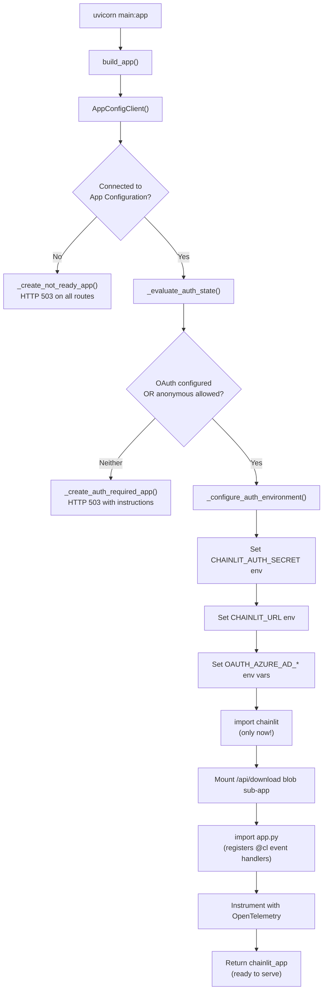
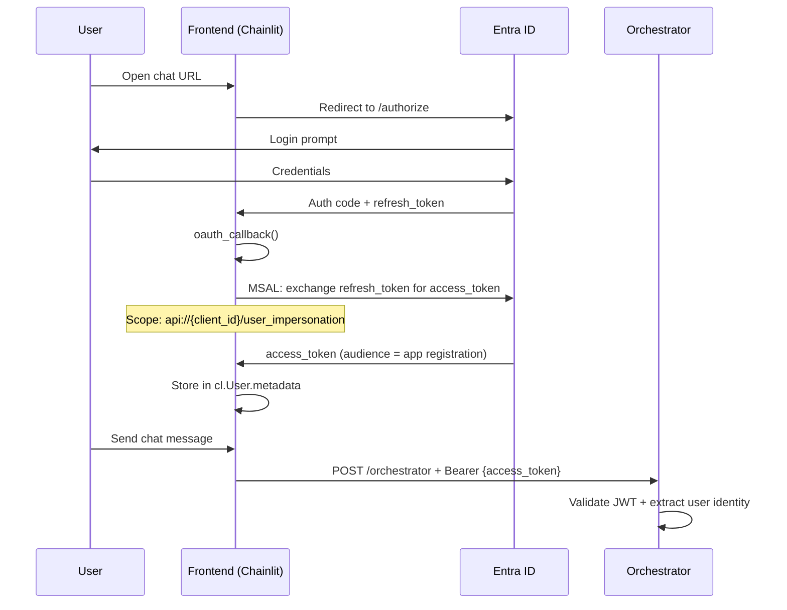
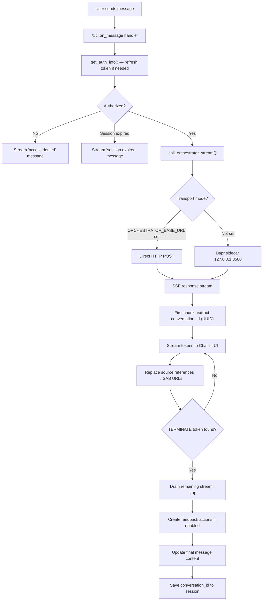
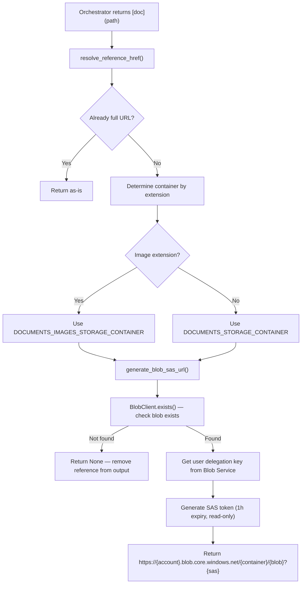
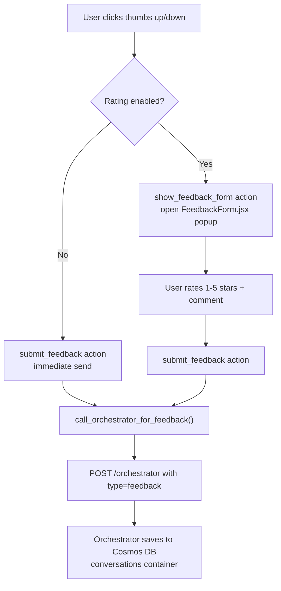
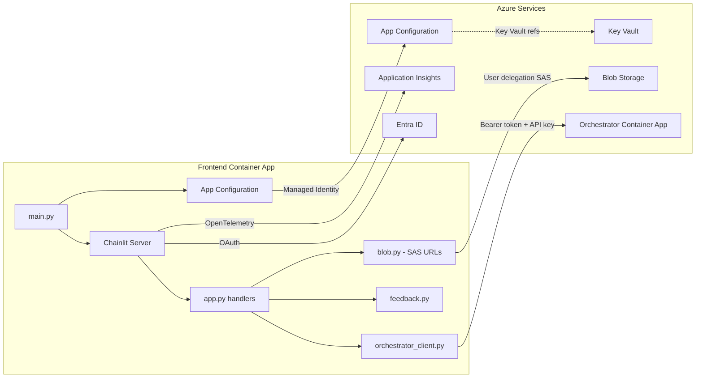
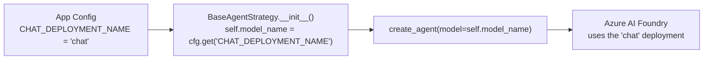
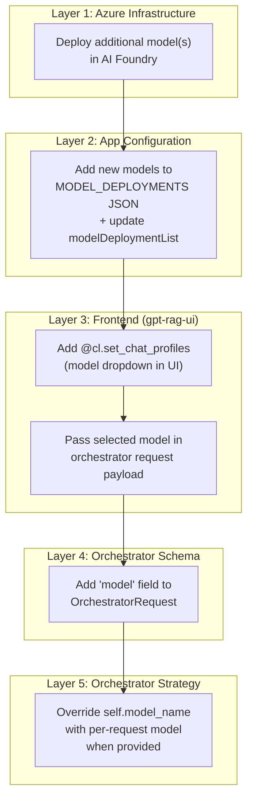

# Frontend Web App (gpt-rag-ui)

> Everything about the GPT-RAG chat frontend: what the accelerator provisions, how it works internally, what you need to configure, and how to customize it.
> **Repository:** github.com/Azure/gpt-rag-ui
> **Version:** 2.2.2

---

## 1. What the Accelerator Provisions

### 1.1 Container App

| Property | Value |
|----------|-------|
| **Service name** | `frontend` |
| **Canonical name** | `FRONTEND_APP` |
| **Ingress** | External (HTTPS, TLS enforced) |
| **Replicas** | min: 1, max: 1 |
| **Resources** | 0.5 vCPU, 1 GiB RAM |
| **Workload profile** | `main` (D4 SKU) |
| **Dapr** | Enabled (appId: `frontend`, port 80, HTTP) |
| **Target port** | 80 (mapped to 8080 internally by Uvicorn) |
| **Initial image** | `mcr.microsoft.com/azuredocs/containerapps-helloworld:latest` (replaced at `azd deploy`) |

### 1.2 Environment Variables Injected by Bicep

Every Container App (including Frontend) gets these three env vars at creation:

| Variable | Value | Purpose |
|----------|-------|---------|
| `APP_CONFIG_ENDPOINT` | `https://{appConfigName}.azconfig.io` | Discover all other services |
| `AZURE_TENANT_ID` | Subscription tenant ID | For `DefaultAzureCredential` |
| `AZURE_CLIENT_ID` | Frontend's UAI client ID | For `DefaultAzureCredential` |

All other configuration (orchestrator URL, storage account name, OAuth settings, feature flags) is read from **App Configuration** at runtime, not from environment variables.

### 1.3 Managed Identity

| Property | Value |
|----------|-------|
| **Identity name pattern** | `id-ca-{token}-frontend` |
| **Type** | User-assigned (UAI) |
| **Injected as** | `AZURE_CLIENT_ID` env var |

### 1.4 RBAC Roles (Bicep-assigned)

| RBAC Role | Purpose |
|-----------|---------|
| `AppConfigurationDataReader` | Read App Configuration keys at startup |
| `StorageBlobDataReader` | Read document blobs from storage |
| `StorageBlobDelegator` | Generate user-delegation SAS tokens for secure blob download links |
| `KeyVaultSecretsUser` | Read secrets (e.g. client secret, Chainlit auth secret) |
| `AcrPull` | Pull container images from the Container Registry |

**What Frontend does NOT have:** No `CognitiveServicesUser`, no `CosmosDBBuiltInDataContributor`, no `SearchIndexDataReader`. The Frontend has zero direct access to OpenAI, AI Search, or Cosmos DB — it only talks to the Orchestrator.

---

## 2. Runtime Architecture

### 2.1 Technology Stack

| Property | Value |
|----------|-------|
| **Language** | Python 3.12 (backend) + React/JSX (frontend components) |
| **Framework** | FastAPI + **Chainlit 2.9.4** |
| **Docker base** | `mcr.microsoft.com/devcontainers/python:3.12-bookworm` |
| **Entry point** | `uvicorn main:app --host 0.0.0.0 --port 8080` |
| **Package manager** | pip |
| **Key deps** | `chainlit==2.9.4`, `msal==1.32.3`, `httpx==0.28.1`, `azure-storage-blob==12.25.1`, `azure-identity==1.23.0` |

### 2.2 What Is Chainlit?

Chainlit is an open-source Python framework that provides a full-featured chat UI out of the box. It handles WebSocket communication, message streaming, session management, OAuth integration, theming, and custom React components — so the Frontend app does not need a separate frontend build step. You just write Python event handlers (`@cl.on_message`, `@cl.on_chat_start`, etc.) and Chainlit renders the chat interface.

### 2.3 Module Structure

```
gpt-rag-ui/
├── main.py                  # App initialization, auth state evaluation, ASGI entry point
├── app.py                   # Chainlit event handlers (@cl.on_message, @cl.on_chat_start)
├── auth_oauth.py            # MSAL token exchange, JWT inspection, token refresh
├── orchestrator_client.py   # Async HTTP client for orchestrator (SSE streaming + feedback)
├── feedback.py              # Feedback actions (thumbs up/down, star rating, custom React form)
├── dependencies.py          # Singleton AppConfigClient injection
├── constants.py             # UUID regex, reference regex, supported extensions, TERMINATE token
├── telemetry.py             # Application Insights + OpenTelemetry tracing
├── connectors/
│   ├── appconfig.py         # Azure App Configuration client (label precedence: gpt-rag-ui > gpt-rag > <none>)
│   └── blob.py              # Blob Storage client (download, SAS URL generation, user delegation key)
├── .chainlit/
│   └── config.toml          # Chainlit config: theme, features, session timeout
├── public/
│   ├── theme.json           # CSS variables (light/dark mode, colors, fonts)
│   ├── custom.css           # Hide watermark, customize login page
│   ├── elements/
│   │   └── FeedbackForm.jsx # React component: 5-star rating dialog + comments
│   ├── logo_light.png       # Light mode logo
│   ├── logo_dark.png        # Dark mode logo
│   └── favicon.ico          # Browser tab icon
├── scripts/
│   ├── deploy.sh            # Deployment helper (Linux/Mac)
│   └── deploy.ps1           # Deployment helper (Windows)
└── Dockerfile               # Container image definition
```

---

## 3. Startup Flow

The startup sequence in `main.py` is carefully ordered because Chainlit must not be imported until environment variables are set:



**Key detail:** Chainlit reads its configuration from environment variables at import time. That's why `main.py` must compute auth state and populate `OAUTH_AZURE_AD_*`, `CHAINLIT_AUTH_SECRET`, and `CHAINLIT_URL` before the `from chainlit.server import app` import on line 442.

### 3.1 Three Possible Startup Modes

| Mode | Condition | Behavior |
|------|-----------|----------|
| **Normal (Chainlit)** | App Config connected AND (OAuth configured OR anonymous allowed) | Full chat UI |
| **Auth Required** | App Config connected BUT OAuth not configured AND anonymous disabled | HTTP 503 with setup instructions |
| **Not Ready** | App Config unreachable | HTTP 503 with login/config instructions |

---

## 4. Authentication

### 4.1 OAuth Flow (Entra ID)

The Frontend uses **Chainlit's built-in Azure AD OAuth provider** + **MSAL** for token exchange.



### 4.2 "Single Token" Mode

The Frontend operates in what the codebase calls "single token" mode:

- The OAuth scope is `api://{client_id}/user_impersonation` (NOT Microsoft Graph scopes like `User.Read`)
- This produces an access token whose audience (`aud`) is the app registration itself
- The same token is forwarded to the Orchestrator via the `Authorization: Bearer` header
- The Orchestrator uses it for JWT validation AND for OBO (on-behalf-of) token exchange to call AI Search with user permissions

**Guard rail:** The `auth_oauth.py` module explicitly rejects Graph scopes (`User.Read`, `graph.microsoft.com`, etc.) and raises a `RuntimeError` if detected. This prevents a common misconfiguration where the token audience would be Microsoft Graph instead of the app registration.

### 4.3 Token Refresh

| Behavior | Detail |
|----------|--------|
| **Trigger** | Before each message, if token expires within 120 seconds |
| **Method** | MSAL `acquire_token_by_refresh_token()` in a background thread |
| **On success** | Updates `cl.User.metadata` with new access + refresh tokens |
| **On failure** | Clears user session, returns `auth_error: session_expired` message |

### 4.4 Anonymous Mode

| Config key | Default | Effect |
|------------|---------|--------|
| `ALLOW_ANONYMOUS` | `true` if running locally, `false` if in Azure + OAuth configured | Skip authentication entirely |

When anonymous mode is active, no `Authorization` header is sent to the Orchestrator. The Orchestrator must also be configured to accept anonymous requests for this to work.

### 4.5 User Authorization (Allow-List)

Optional fine-grained access control beyond Entra ID authentication:

| Config key | Purpose |
|------------|---------|
| `ALLOWED_USER_NAMES` | Comma-separated list of allowed UPNs (e.g. `user@contoso.com`) |
| `ALLOWED_USER_PRINCIPALS` | Comma-separated list of allowed Entra object IDs |

If both lists are empty, all authenticated users are authorized. If either list is populated, the user must appear in at least one.

### 4.6 Required OAuth Configuration Keys

| Key | Source | Required? |
|-----|--------|-----------|
| `OAUTH_AZURE_AD_CLIENT_ID` (or `CLIENT_ID`) | App Config or env var | Yes (for OAuth) |
| `OAUTH_AZURE_AD_TENANT_ID` | App Config or env var | Yes (for OAuth) |
| `OAUTH_AZURE_AD_CLIENT_SECRET` (or `authClientSecret`) | App Config (Key Vault ref) or env var | Yes (for OAuth) |
| `OAUTH_AZURE_AD_SCOPES` | App Config or env var | Optional (auto-derived from client_id) |
| `OAUTH_AZURE_AD_ENABLE_SINGLE_TENANT` | App Config or env var | Optional (defaults to `true`) |
| `CHAINLIT_AUTH_SECRET` | App Config (Key Vault ref) or auto-generated | Recommended (prevents session loss on restart) |
| `CHAINLIT_URL` | App Config or env var | Recommended (sets OAuth callback URL) |

---

## 5. Chat Message Flow

### 5.1 Detailed Request Processing



### 5.2 Orchestrator Communication

The `orchestrator_client.py` module handles all communication with the Orchestrator:

**Request payload:**
```json
{
    "conversation_id": "existing-uuid-or-empty",
    "question": "user message text",
    "ask": "user message text",
    "question_id": "message-uuid"
}
```

**Headers sent:**

| Header | Value | When |
|--------|-------|------|
| `Authorization` | `Bearer {access_token}` | OAuth mode |
| `dapr-api-token` | Dapr sidecar token | If `DAPR_API_TOKEN` is set |
| `X-API-KEY` | API key | If `ORCHESTRATOR_APP_APIKEY` is set |
| `Content-Type` | `application/json` | Always |

**Timeout configuration:**

| Phase | Timeout |
|-------|---------|
| Connect | 10 seconds |
| Write | 30 seconds |
| Read | Unlimited (streaming) |
| Pool | 10 seconds |

**Transport priority:**
1. If `ORCHESTRATOR_BASE_URL` is set → direct HTTP to that URL + `/orchestrator`
2. If not set → Dapr sidecar at `http://127.0.0.1:{DAPR_HTTP_PORT}/v1.0/invoke/orchestrator/method/orchestrator`

### 5.3 HTML Payload Detection

The Frontend includes a safety check for cases where the Container Apps default placeholder page is returned instead of actual orchestrator output. If the first content chunk contains `<!doctype`, `<html`, or `azure container apps`, the Frontend raises a `RuntimeError("orchestrator returned html placeholder")` and shows an error to the user.

---

## 6. Source Reference Resolution

When the Orchestrator returns document references (e.g. `[document.pdf](documents/file.pdf)`), the Frontend resolves them to time-limited SAS URLs for direct blob download:



**Key behaviors:**
- References to non-existent blobs are silently removed from the output (not shown to users)
- SAS tokens expire after 1 hour by default
- Uses user delegation keys (works with managed identity, no storage account keys needed)
- The `StorageBlobDelegator` RBAC role is required for this feature

### 6.1 Blob Download Endpoint

In addition to SAS URLs, the Frontend also mounts a blob download sub-app at `/api/download/{container}/{path}`. This serves as a fallback for direct blob access through the Container App.

---

## 7. Feedback System

### 7.1 Configuration

| Config key | Default | Effect |
|------------|---------|--------|
| `ENABLE_USER_FEEDBACK` | `false` | Show thumbs up/down buttons on responses |
| `USER_FEEDBACK_RATING` | `false` | Show 5-star rating popup (requires `ENABLE_USER_FEEDBACK=true`) |

### 7.2 Two Feedback Modes

**Quick feedback** (`ENABLE_USER_FEEDBACK=true`, `USER_FEEDBACK_RATING=false`):
- Thumbs up/down buttons appear on each response
- Clicking immediately sends feedback to the Orchestrator (no popup)

**Detailed feedback** (`ENABLE_USER_FEEDBACK=true`, `USER_FEEDBACK_RATING=true`):
- Thumbs up/down buttons open a popup dialog
- `FeedbackForm.jsx` renders a 5-star rating + text comment field
- Submission sends all data to the Orchestrator

### 7.3 Feedback Data Flow



**Feedback payload sent to Orchestrator:**
```json
{
    "type": "feedback",
    "conversation_id": "uuid",
    "question_id": "uuid",
    "is_positive": true,
    "stars_rating": 4,
    "feedback_text": "Great answer!"
}
```

---

## 8. App Configuration Keys

The Frontend reads configuration from Azure App Configuration with the following label precedence (highest to lowest):

1. `gpt-rag-ui` — UI-specific overrides
2. `gpt-rag` — Shared across all GPT-RAG apps
3. `<no label>` — Global defaults

### 8.1 Keys Used by the Frontend

| Key | Type | Default | Purpose |
|-----|------|---------|---------|
| `ORCHESTRATOR_BASE_URL` | string | (none — uses Dapr) | Direct HTTP URL to orchestrator |
| `ORCHESTRATOR_APP_APIKEY` | string | (none) | API key for orchestrator auth |
| `DAPR_API_TOKEN` | string | (none) | Dapr sidecar shared secret |
| `DAPR_HTTP_PORT` | string | `3500` | Dapr sidecar HTTP port |
| `STORAGE_ACCOUNT_NAME` | string | — | Storage account for blob downloads |
| `DOCUMENTS_STORAGE_CONTAINER` | string | — | Container for extracted documents |
| `DOCUMENTS_IMAGES_STORAGE_CONTAINER` | string | — | Container for extracted images |
| `ALLOW_ANONYMOUS` | bool | (computed) | Allow unauthenticated access |
| `ENABLE_USER_FEEDBACK` | bool | `false` | Show feedback buttons |
| `USER_FEEDBACK_RATING` | bool | `false` | Enable 5-star rating popup |
| `ALLOWED_USER_NAMES` | string | (none) | Comma-separated UPN allow-list |
| `ALLOWED_USER_PRINCIPALS` | string | (none) | Comma-separated OID allow-list |
| `LOG_LEVEL` | string | `Information` | Logging verbosity |
| `ENABLE_CONSOLE_LOGGING` | bool | `true` | Console log output |
| `APPLICATIONINSIGHTS_CONNECTION_STRING` | string | (none) | Application Insights telemetry |
| `OAUTH_AZURE_AD_CLIENT_ID` | string | — | Entra app registration client ID |
| `OAUTH_AZURE_AD_TENANT_ID` | string | — | Entra tenant ID |
| `OAUTH_AZURE_AD_CLIENT_SECRET` | string | — | Client secret (Key Vault reference) |
| `OAUTH_AZURE_AD_SCOPES` | string | auto-derived | OAuth scopes |
| `OAUTH_AZURE_AD_ENABLE_SINGLE_TENANT` | string | `true` | Single-tenant OAuth |
| `CHAINLIT_AUTH_SECRET` | string | auto-generated | JWT signing secret for Chainlit sessions |
| `CHAINLIT_URL` | string | (none) | Public URL for OAuth callback |

---

## 9. Chainlit Configuration

The `.chainlit/config.toml` defines UI behavior. Key settings as shipped by the accelerator:

### 9.1 Project Settings

| Setting | Value | Notes |
|---------|-------|-------|
| `session_timeout` | 3600 (1 hour) | WebSocket disconnect grace period |
| `user_session_timeout` | 1296000 (15 days) | How long user sessions persist |
| `cache` | `false` | No LangChain-style caching |
| `allow_origins` | `["*"]` | CORS: all origins allowed |

### 9.2 Feature Flags

| Feature | Value | Notes |
|---------|-------|-------|
| `unsafe_allow_html` | `false` | HTML in messages is escaped (security) |
| `latex` | `false` | Math expressions disabled |
| `edit_message` | `true` | Users can edit their messages |
| `spontaneous_file_upload.enabled` | `false` | File upload disabled |
| `cot` (Chain of Thought) | `full` | Show full reasoning chain |

### 9.3 UI Settings

| Setting | Value |
|---------|-------|
| `name` | `GPT-RAG` |
| `default_theme` | `light` |
| `custom_css` | `/public/custom.css` |

---

## 10. Theming and Branding

### 10.1 Theme Variables (`public/theme.json`)

The theme defines CSS custom properties for light and dark modes:

| Variable | Light | Dark |
|----------|-------|------|
| `--primary` | Blue (206 100% 42%) | Blue (206 100% 42%) |
| `--secondary` | Green (120 77% 27%) | Green (120 77% 27%) |
| `--background` | White | Dark gray (13%) |
| `--font-sans` | Inter | Inter |
| `--font-mono` | Source Code Pro | Source Code Pro |

### 10.2 Custom CSS (`public/custom.css`)

The shipped CSS makes three modifications:
1. **Hides the Chainlit watermark** (`.watermark { display: none !important; }`)
2. **Hides the README button** (`#readme-button { display: none; }`)
3. **Hides the empty right pane on the login page** (collapses the layout)

### 10.3 How to Customize Branding

| What to change | File | Notes |
|----------------|------|-------|
| App name | `.chainlit/config.toml` → `[UI] name` | Displayed in header |
| Logo | `public/logo_light.png`, `public/logo_dark.png` | Replace with your logo (keep same filenames) |
| Favicon | `public/favicon.ico` | Browser tab icon |
| Colors | `public/theme.json` → `variables.light` / `variables.dark` | HSL values |
| Fonts | `public/theme.json` → `--font-sans`, `--font-mono` | Web-safe or load via `custom_fonts` |
| Additional CSS | `public/custom.css` | Any Chainlit element overrides |
| Default theme | `.chainlit/config.toml` → `default_theme` | `"light"` or `"dark"` |

---

## 11. Telemetry, Logging, and Observability

### 11.1 How Logging Works — The Full Picture

The Frontend logging has two outputs that go to different places:

```
Frontend (gpt-rag-ui)
    │
    ├── Console logs (stdout)
    │   └── Captured by Container Apps → Log Analytics workspace
    │       └── Query via: Azure portal → Container App → "Log stream" (real-time)
    │                      Azure portal → Container App → "Logs" (KQL against ContainerAppConsoleLogs_CL)
    │
    └── OpenTelemetry (traces, requests, dependencies, exceptions)
        └── Sent to Application Insights via APPLICATIONINSIGHTS_CONNECTION_STRING
            └── Query via: Azure portal → Application Insights → "Transaction search"
                           Azure portal → Application Insights → "Logs" (KQL)
                           Azure portal → Application Insights → "Application map" (service dependencies)
                           Azure portal → Application Insights → "Failures" (error breakdown)
                           Azure portal → Application Insights → "Performance" (request latency)
```

**Two configuration keys control logging:**

| Key | Default | What It Does |
|-----|---------|-------------|
| `LOG_LEVEL` | `Information` | Verbosity level: `Debug`, `Information`, `Warning`, `Error` |
| `ENABLE_CONSOLE_LOGGING` | `true` | Whether to emit logs to stdout (Container Apps captures this) |

**Connection to Application Insights:**

| Key | Source | Required? |
|-----|--------|-----------|
| `APPLICATIONINSIGHTS_CONNECTION_STRING` | App Configuration (set by Bicep during provisioning) | Yes — without this, no telemetry reaches App Insights |

The Bicep templates provision Application Insights automatically (`deployAppInsights=true` in `main.parameters.json`), create a Log Analytics workspace behind it, and inject the connection string into App Configuration. All three Container Apps (Frontend, Orchestrator, Ingestion) share the **same** Application Insights instance.

### 11.2 Application Insights Integration (OpenTelemetry)

The `telemetry.py` module configures Azure Monitor OpenTelemetry at startup:

| Component | Library | What It Auto-Instruments |
|-----------|---------|------------------------|
| Azure Monitor SDK | `azure-monitor-opentelemetry==1.6.10` | Core telemetry pipeline |
| FastAPI instrumentation | `opentelemetry-instrumentation-fastapi` (via azure-monitor) | Every HTTP request to the Frontend (routes, status codes, latency) |
| HTTPX instrumentation | `opentelemetry-instrumentation-httpx==0.52b1` | Every outgoing HTTP call to the Orchestrator (dependencies) |

**What's automatically traced:**
- Every `handle_message` call (via `tracer.start_as_current_span("handle_message")`)
- Span attributes: `question_id`, `conversation_id`, `user_id`
- All outgoing HTTPX requests to the Orchestrator (auto-instrumented as dependencies)
- Custom resource labels: `SERVICE_NAME=gpt-rag-ui`, node hostname

**Distributed tracing:** Because both the Frontend and Orchestrator use OpenTelemetry, trace context is propagated automatically via HTTP headers. This means a single user query generates a trace that spans both services — you can follow a request from the Frontend through the Orchestrator and into AI Search/OpenAI calls in the Application Insights "Transaction search" or "End-to-end transaction details" view.

### 11.3 Structured Log Events

Key log events emitted at INFO level:

| Event | What It Logs | Why It Matters |
|-------|-------------|---------------|
| `User request received` | conversation_id, question_id, user principal, message preview | Audit: who asked what |
| `Forwarding request to orchestrator` | conversation_id, user, authorized status, group count | Debug: auth + routing |
| `Orchestrator request auth health` | mode (dapr/direct), has_access_token, token length | Debug: token issues |
| `Streaming response references detected` | Resolved blob references | Debug: source citation resolution |
| `Response delivered` | conversation_id, chunk count, character count, preview | Performance: response metrics |
| `Auth decision` | running_in_azure, oauth_configured, allow_anonymous, source | Debug: why auth mode was chosen |
| `User authenticated` | name, principal, authorized status | Audit: login events |

### 11.4 Where to See Logs — Practical Guide

**Real-time console logs (for debugging):**
Azure portal → Container Apps → `frontend` → **Log stream** (sidebar)
Shows stdout in real-time. Useful during deployments or to watch live traffic.

**Historical console logs (KQL):**
Azure portal → Container Apps → `frontend` → **Logs** (sidebar)
```kql
ContainerAppConsoleLogs_CL
| where ContainerAppName_s == "frontend"
| where TimeGenerated > ago(1h)
| project TimeGenerated, Log_s
| order by TimeGenerated desc
```

**Application Insights — Requests (user interactions):**
Azure portal → Application Insights → **Transaction search** or **Performance**
```kql
requests
| where cloud_RoleName == "gpt-rag-ui"
| where timestamp > ago(24h)
| summarize count(), avg(duration), percentile(duration, 95) by bin(timestamp, 1h)
| render timechart
```

**Application Insights — Dependencies (calls to Orchestrator):**
```kql
dependencies
| where cloud_RoleName == "gpt-rag-ui"
| where target contains "orchestrator"
| where timestamp > ago(24h)
| summarize count(), avg(duration), countif(success == false) by bin(timestamp, 1h)
| render timechart
```

**Application Insights — Errors and exceptions:**
```kql
exceptions
| where cloud_RoleName == "gpt-rag-ui"
| where timestamp > ago(24h)
| summarize count() by outerMessage, bin(timestamp, 1h)
| order by count_ desc
```

**Application Insights — Auth failures:**
```kql
traces
| where cloud_RoleName == "gpt-rag-ui"
| where message contains "auth" or message contains "session_expired"
| where timestamp > ago(24h)
| project timestamp, message, severityLevel
| order by timestamp desc
```

**Application Map (service topology):**
Azure portal → Application Insights → **Application map**
Shows the Frontend → Orchestrator → AI Search / OpenAI / Cosmos DB dependency chain visually, with success rates and latency on each edge.

### 11.5 How Frontend Logging Compares to Other Components

All three GPT-RAG apps send telemetry to the **same** Application Insights instance, but each has different logging patterns:

| Component | SERVICE_NAME | Console Logs | App Insights | Blob Logs | Feedback Events |
|-----------|-------------|-------------|-------------|-----------|----------------|
| **Frontend** | `gpt-rag-ui` | Yes | Yes (requests, dependencies, traces) | No | Yes (sends to Orchestrator) |
| **Orchestrator** | `gpt-rag-orchestrator` | Yes | Yes (requests, dependencies, traces, custom events) | No | Yes (writes to Cosmos DB + App Insights) |
| **Ingestion** | `gpt-rag-ingestion` | Yes | Yes (custom events: RUN-START, ITEM-COMPLETE, RUN-COMPLETE) | Yes (`jobs/` container in Blob Storage) | No |

**Key difference:** The Ingestion app is the only component that writes logs to Blob Storage (in the `jobs` container). The Frontend and Orchestrator rely entirely on console logs + Application Insights.

### 11.6 What You Can NOT See from the Frontend Alone

The Frontend only logs its own request/response cycle. To get the full picture of what happened with a user query, you need to look across components:

| Question | Where to Look |
|----------|--------------|
| What search results were returned? | Orchestrator logs in App Insights (`cloud_RoleName == "gpt-rag-orchestrator"`) |
| Why did the model give a bad answer? | Orchestrator: search execution logs + LLM token counts |
| Was content blocked by RAI filters? | Orchestrator: content safety violation events |
| Did a user get permission-filtered results? | Orchestrator: OBO token exchange logs |
| Why is ingestion not picking up new documents? | Ingestion: `RUN-COMPLETE` events in App Insights or `jobs/` blob container |

**To correlate across all three:** Use the `operation_id` field in Application Insights KQL queries — it's the distributed trace ID that links Frontend request → Orchestrator processing → downstream service calls.

---

## 12. Connections and Dependencies



| Service | How | Why |
|---------|-----|-----|
| App Configuration | Managed Identity (label: `gpt-rag-ui` > `gpt-rag` > none) | All runtime config |
| Key Vault | Via App Config Key Vault references | Client secret, Chainlit auth secret |
| Orchestrator | HTTPS (Dapr sidecar or direct) | Forward user queries, send feedback |
| Blob Storage | Managed Identity + user delegation key | Read blobs, generate SAS download URLs |
| Application Insights | Connection string from App Config | Traces, logs, metrics |
| Entra ID | OAuth2 (MSAL ConfidentialClientApplication) | User authentication |

---

## 13. What You Need to Configure After Deployment

### 13.1 Required (for OAuth to work)

These must be set in App Configuration (label `gpt-rag` or `gpt-rag-ui`) or as container env vars:

| Key | How to get it |
|-----|---------------|
| `OAUTH_AZURE_AD_CLIENT_ID` | From your Entra app registration |
| `OAUTH_AZURE_AD_TENANT_ID` | Your Azure AD tenant ID |
| `OAUTH_AZURE_AD_CLIENT_SECRET` | App registration client secret (store as Key Vault reference) |
| `CHAINLIT_URL` | Public URL of the Frontend Container App (e.g. `https://frontend.{env}.{region}.azurecontainerapps.io`) |

### 13.2 Recommended

| Key | Why |
|-----|-----|
| `CHAINLIT_AUTH_SECRET` | Persistent session signing key. Without it, a random secret is generated on each restart, invalidating all active sessions |
| `ALLOW_ANONYMOUS=false` | Explicitly disable anonymous access in production |

### 13.3 Optional Customizations

| What | How |
|------|-----|
| Enable feedback | Set `ENABLE_USER_FEEDBACK=true` in App Config |
| Enable star ratings | Set `USER_FEEDBACK_RATING=true` in App Config |
| Restrict users | Set `ALLOWED_USER_NAMES` and/or `ALLOWED_USER_PRINCIPALS` |
| Custom branding | Replace logo files, edit `theme.json` and `custom.css`, redeploy |
| Multi-tenant | Set `OAUTH_AZURE_AD_ENABLE_SINGLE_TENANT=false` |
| Direct orchestrator URL | Set `ORCHESTRATOR_BASE_URL` to skip Dapr sidecar |

---

## 14. Entra ID App Registration (shared with Ingestion)

The Frontend shares the same Entra app registration that the Ingestion component uses for SharePoint access. For the Frontend specifically:

### 14.1 Required Configuration

| Property | Value |
|----------|-------|
| **Redirect URI** | `https://{frontend-url}/auth/oauth/azure-ad/callback` |
| **Expose an API** | App ID URI: `api://{client_id}`, Scope: `user_impersonation` |
| **Delegated permissions** | (none needed — uses custom API scope) |

### 14.2 Common OAuth Misconfiguration Issues

| Problem | Symptom | Fix |
|---------|---------|-----|
| Graph scopes in `OAUTH_AZURE_AD_SCOPES` | `RuntimeError: Invalid OAUTH_AZURE_AD_SCOPES` | Remove `User.Read` and similar; use `api://{client_id}/user_impersonation` |
| Missing admin consent | `AADSTS65001` error | Grant admin consent in Entra portal |
| Missing `offline_access` scope | No refresh token → immediate session expiry | Ensure scopes include `offline_access` |
| Wrong redirect URI | OAuth callback fails | Must match exactly including path |
| Missing "Expose an API" | Token audience mismatch | Configure `user_impersonation` scope in app registration |

---

## 15. Local Development

### 15.1 Prerequisites

| Requirement | Command |
|-------------|---------|
| Python 3.12 | `python --version` |
| Azure CLI logged in | `az login` |
| App Config endpoint | Set `APP_CONFIG_ENDPOINT` env var |

### 15.2 Running Locally

```bash
# Install dependencies
pip install -r requirements.txt

# Set minimum config
export APP_CONFIG_ENDPOINT="https://{your-appconfig}.azconfig.io"

# Option A: Anonymous mode (no OAuth needed)
export ALLOW_ANONYMOUS=true

# Option B: OAuth mode
export OAUTH_AZURE_AD_CLIENT_ID="your-client-id"
export OAUTH_AZURE_AD_TENANT_ID="your-tenant-id"
export OAUTH_AZURE_AD_CLIENT_SECRET="your-client-secret"
export CHAINLIT_URL="http://localhost:8080"

# Run (without Dapr — set orchestrator URL directly)
export ORCHESTRATOR_BASE_URL="https://your-orchestrator-url"
uvicorn main:app --host 0.0.0.0 --port 8080
```

### 15.3 Without App Configuration

If `APP_CONFIG_ENDPOINT` is not set, the app runs in env-var-only mode. All configuration keys must be provided as environment variables.

---

## 16. Deployment

### 16.1 Via azd (standard)

```bash
# From the gpt-rag root repo
azd deploy frontend
```

This builds the Docker image from the Dockerfile, pushes to ACR, and updates the Container App.

### 16.2 Docker Image

The Dockerfile is minimal:
1. Base: `mcr.microsoft.com/devcontainers/python:3.12-bookworm`
2. Copy `requirements.txt`, run `pip install`
3. Copy all app code
4. Expose port 8080
5. CMD: `uvicorn main:app --host 0.0.0.0 --port 8080`

---

## 17. Dependency Versions (pinned)

| Package | Version |
|---------|---------|
| chainlit | 2.9.4 |
| fastapi | >=0.116.1 |
| httpx | 0.28.1 |
| msal | 1.32.3 |
| azure-identity | 1.23.0 |
| azure-appconfiguration | 1.7.1 |
| azure-storage-blob | 12.25.1 |
| azure-monitor-opentelemetry | 1.6.10 |
| uvicorn | 0.35.0 |
| tenacity | 9.1.2 |
| starlette | (latest) |
| aiohttp | 3.13.3 |

---

## 18. Troubleshooting

| Symptom | Likely Cause | Fix |
|---------|-------------|-----|
| HTTP 503 "GPT-RAG UI is not ready" | App Configuration unreachable | Verify `APP_CONFIG_ENDPOINT`, check managed identity, run `az login` locally |
| HTTP 503 "authentication required" | OAuth not configured + `ALLOW_ANONYMOUS=false` | Set `OAUTH_AZURE_AD_*` keys in App Config |
| "orchestrator returned html placeholder" | Orchestrator Container App not deployed yet | Run `azd deploy orchestrator` |
| "session expired" on every message | `CHAINLIT_AUTH_SECRET` not persisted | Store a stable secret in App Config / Key Vault |
| Token refresh fails | Client secret expired or wrong scopes | Rotate secret in Entra, verify `OAUTH_AZURE_AD_SCOPES` |
| Blob references show as broken links | SAS generation fails | Verify `StorageBlobDelegator` role is assigned to Frontend identity |
| Blob references silently disappear | Blob does not exist in storage | Run ingestion to populate documents; check container names match |
| Feedback buttons missing | Feature not enabled | Set `ENABLE_USER_FEEDBACK=true` in App Config |
| "Invalid OAUTH_AZURE_AD_SCOPES" error | Graph scopes detected | Remove `User.Read`; use `api://{client_id}/user_impersonation,openid,profile,offline_access` |
| CORS errors in browser | Redirect URI mismatch | Update `CHAINLIT_URL` and Entra redirect URI to match |

---

## 19. What the Implementation Team Should Focus On

1. **Branding:** Replace logos, edit `theme.json` colors, update `config.toml` app name — no code changes needed
2. **OAuth setup:** Ensure the Entra app registration has "Expose an API" with `user_impersonation` scope, correct redirect URI, and admin consent granted
3. **Feedback:** Enable via App Config if you want user feedback collection (stored in Cosmos DB `conversations` container via the Orchestrator)
4. **Monitoring:** Verify Application Insights connection string is set — all traces flow through OpenTelemetry
5. **Session stability:** Set `CHAINLIT_AUTH_SECRET` in Key Vault to prevent session loss on container restarts
6. **Access control:** Use `ALLOWED_USER_NAMES` / `ALLOWED_USER_PRINCIPALS` to restrict access beyond Entra authentication

---

## 20. Quick Wins and Improvement Opportunities

These are low-effort, high-impact improvements identified by reviewing the full source code of `gpt-rag-ui` v2.2.2. They are ordered by effort level and grouped by category.

### 20.1 UX Improvements (Configuration Only — No Code Changes)

#### 20.1.1 Add a Welcome Message

**Current state:** The `@cl.on_chat_start` handler in `app.py` is literally `pass` — users see an empty chat with no guidance.

**Quick win:** Add a configurable greeting that tells users what the chatbot can do, what data it has access to, and any limitations. This can be driven entirely from App Configuration:

```python
@cl.on_chat_start
async def on_chat_start():
    welcome = config.get("WELCOME_MESSAGE", "Hello! I'm your AI assistant. Ask me anything about our documents.", str)
    await cl.Message(content=welcome).send()
```

**New App Config key:**

| Key | Label | Suggested Value |
|-----|-------|-----------------|
| `WELCOME_MESSAGE` | `gpt-rag-ui` | Your custom welcome text |

**Effort:** ~5 minutes. **Impact:** High — first-use experience is dramatically better.

#### 20.1.2 Add Conversation Starters

**Current state:** The empty chat screen shows nothing — users must think of a question from scratch.

**Quick win:** Chainlit supports `@cl.set_starters` which renders clickable example question buttons on the empty chat screen. This helps users discover what the chatbot can answer:

```python
@cl.set_starters
async def set_starters():
    return [
        cl.Starter(label="Summarize a topic", message="Can you summarize the key points about ...?"),
        cl.Starter(label="Find a document", message="What documents do we have about ...?"),
        cl.Starter(label="Compare policies", message="What are the differences between ...?"),
        cl.Starter(label="Get a quick answer", message="What is our policy on ...?"),
    ]
```

For maximum flexibility, read the starters from App Configuration as a JSON array so they can be updated without redeployment.

**Effort:** ~10 minutes. **Impact:** High — dramatically reduces the "blank page" problem.

#### 20.1.3 Enable File Upload

**Current state:** `spontaneous_file_upload.enabled = false` in `.chainlit/config.toml`. The `accept` list, `max_files` (20), and `max_size_mb` (500) are already configured — only the enable flag is off.

**When to enable:** If the orchestrator can handle file attachments, or if you plan to add ad-hoc document upload for indexing. This is a one-line change in config.toml:

```toml
[features.spontaneous_file_upload]
    enabled = true
```

**Effort:** 1 line. **Impact:** Medium — depends on orchestrator support.

#### 20.1.4 Enable HTML Rendering

**Current state:** `unsafe_allow_html = false` in config.toml. All HTML in responses is escaped.

**When to enable:** If the orchestrator returns structured content with tables, formatted HTML, or rich formatting. Since the orchestrator is your own trusted backend (not user-generated content), the security risk is low:

```toml
[features]
unsafe_allow_html = true
```

**Effort:** 1 line. **Impact:** Medium — enables richer response formatting.

#### 20.1.5 Enable LaTeX / Math Rendering

**Current state:** `latex = false` in config.toml.

**When to enable:** If any indexed documents contain mathematical formulas, financial equations, or quantitative data that the model might format with LaTeX notation:

```toml
[features]
latex = true
```

**Note:** This can clash with `$` characters in regular text (e.g., currency). Test with your actual content before enabling in production.

**Effort:** 1 line. **Impact:** Low to medium — depends on content.

#### 20.1.6 Tune Session Timeout

**Current state:** `user_session_timeout = 1296000` (15 days) in config.toml.

**Recommendation:** For an enterprise app with OAuth, 15 days is long. Consider reducing to 1–3 days (86400–259200 seconds) to align with typical enterprise session policies. The token refresh logic will handle re-authentication gracefully.

**Effort:** 1 line. **Impact:** Low (security posture improvement).

### 20.2 UX Improvements (Code Changes Required)

#### 20.2.1 Add Chat Profiles for Agent Strategy Selection

**Current state:** All users get the same global agent strategy (`AGENT_STRATEGY` in App Config). There is no `@cl.set_chat_profiles` in the codebase, no dropdown, and no strategy field in the `OrchestratorRequest` schema.

**What it would take:** Three changes across two repos:

1. **Frontend (`app.py`)** — Add Chainlit chat profiles:

```python
@cl.set_chat_profiles
async def chat_profile():
    return [
        cl.ChatProfile(name="General Assistant", markdown_description="Default RAG agent for document Q&A"),
        cl.ChatProfile(name="SQL Analytics", markdown_description="Query structured data with natural language"),
    ]
```

2. **Frontend (`orchestrator_client.py`)** — Include the selected profile in the request payload:

```python
payload["strategy"] = cl.user_session.get("chat_profile", "single_agent_rag")
```

3. **Orchestrator (`orchestrator.py`)** — Accept an optional `strategy` field in the request and override the global `AGENT_STRATEGY` when present.

**Effort:** ~1 hour across both repos. **Impact:** High — enables multi-agent deployments.

#### 20.2.2 Extend SAS URL Expiry

**Current state:** SAS tokens for blob download links are hardcoded to 1 hour expiry (line 75 in `app.py`).

**Problem:** In long conversations, users may click a source reference link after the 1-hour window has passed, getting an `AuthenticationFailed` error from Blob Storage.

**Quick win:** Make the expiry configurable via App Config:

```python
sas_expiry_hours = int(config.get("REFERENCE_SAS_EXPIRY_HOURS", "4", str))
expiry = datetime.now(timezone.utc) + timedelta(hours=sas_expiry_hours)
```

**New App Config key:**

| Key | Label | Default | Recommended |
|-----|-------|---------|-------------|
| `REFERENCE_SAS_EXPIRY_HOURS` | `gpt-rag-ui` | `1` (current) | `4` to `8` |

**Effort:** ~15 minutes. **Impact:** Medium — eliminates broken reference links in longer sessions.

### 20.3 Code Quality Improvements

#### 20.3.1 Deduplicate JWT Helper Functions

**Current state:** The following functions are copy-pasted identically across three files:

| Function | `app.py` | `auth_oauth.py` | `orchestrator_client.py` |
|----------|----------|-----------------|-------------------------|
| `_decode_jwt_unverified()` | Line 266 | Line 22 | Line 100 |
| `_access_token_debug_summary()` | Line 281 | Line 41 | — |
| `_jwt_exp_unverified()` | Line 303 | Line 73 | — |
| `_access_token_ttl_seconds()` | Line 311 | Line 82 | — |
| `_is_access_token_expiring()` | Line 319 | Line 90 | — |

**Quick win:** Extract these into a shared `jwt_utils.py` module and import from all three files. This reduces maintenance burden and prevents the copies from drifting apart.

**Effort:** ~20 minutes. **Impact:** Low (maintainability).

#### 20.3.2 Fix Mixed-Language Error Messages

**Current state:** Most error messages are in English, but two are in Spanish:

- Line 432: `"Error de Servicio: {raw_chunk.strip()}"` — should be `"Service Error: ..."`
- Line 433: Check for `"[ERROR en MAF Streaming]:"` — likely a legacy orchestrator error pattern

**Quick win:** Standardize to English. Also verify whether the `[ERROR en MAF Streaming]` pattern is still emitted by the current orchestrator version (v2.4.2) — if not, the check can be removed entirely.

**Effort:** ~5 minutes. **Impact:** Low (consistency).

#### 20.3.3 Remove the Leading Space Token Hack

**Current state:** Line 393 in `app.py` sends `await response_msg.stream_token(" ")` — a blank space — before any real content arrives. This is a workaround to force Chainlit to render the message bubble immediately.

**Check needed:** Test whether Chainlit 2.9.4 still requires this hack. If not, removing it eliminates the leading space that appears in every response.

**Effort:** ~10 minutes (including testing). **Impact:** Low (visual polish).

#### 20.3.4 Simplify TERMINATE Buffer Logic

**Current state:** The TERMINATE token detection in the streaming loop (around lines 480–510 in `app.py`) has a redundant second `if token_index != -1` check after the `break` that handles the same condition. The `else` branch is the only one that can execute at that point.

**Quick win:** Simplify to just use `safe_flush_length = len(buffer)` after the loop exits normally, since the TERMINATE case is already handled inside the loop before the break.

**Effort:** ~10 minutes. **Impact:** Low (readability).

### 20.4 Infrastructure / Monitoring

#### 20.4.1 Add Health Check to Chainlit App

**Current state:** The "not ready" and "auth required" fallback apps both have `/healthz` endpoints, but the main Chainlit app does not.

**Problem:** Container Apps health probes can't distinguish between "app is running" and "app is healthy" for the main application.

**Quick win:** Add a lightweight health endpoint to the Chainlit app in `main.py`:

```python
@chainlit_app.get("/healthz")
async def healthz():
    return {"status": "ok", "mode": "chainlit"}
```

**Effort:** ~5 minutes. **Impact:** Medium — enables proper Container Apps health probes and monitoring.

### 20.5 Summary — Priority Matrix

| # | Improvement | Effort | Impact | Category |
|---|------------|--------|--------|----------|
| 1 | Welcome message | 5 min | High | UX — config |
| 2 | Conversation starters | 10 min | High | UX — config |
| 3 | Health check endpoint | 5 min | Medium | Infrastructure |
| 4 | SAS URL expiry configurable | 15 min | Medium | UX — code |
| 5 | Enable HTML rendering | 1 min | Medium | UX — config |
| 6 | Enable file upload | 1 min | Medium | UX — config |
| 7 | Chat profiles (agent selection) | 1 hour | High | UX — code (2 repos) |
| 8 | Deduplicate JWT helpers | 20 min | Low | Code quality |
| 9 | Fix Spanish error messages | 5 min | Low | Code quality |
| 10 | Remove leading space hack | 10 min | Low | Code quality |
| 11 | Simplify TERMINATE logic | 10 min | Low | Code quality |
| 12 | Enable LaTeX rendering | 1 min | Low–Med | UX — config |
| 13 | Tune session timeout | 1 min | Low | Security |

---

## 21. Deep Dive: Enabling User Model Selection

This section documents the full analysis of what is needed to let users choose between different AI models (e.g., GPT-4o vs GPT-4o-mini vs GPT-5-mini) from the chat UI. It traces the model selection chain from the Chainlit frontend through the orchestrator to the Azure AI Foundry deployment, identifies every component that needs changes, and provides implementation guidance.

### 21.1 Current State — How Model Selection Works Today

**Today, the model is a global setting.** There is no per-user, per-conversation, or per-request model selection. The entire chain uses a single model configured in App Configuration:



**Key code locations:**

| Component | File | Line | What it does |
|-----------|------|------|--------------|
| **Base strategy** | `orchestrator/src/strategies/base_agent_strategy.py` | 34 | `self.model_name = self.cfg.get("CHAT_DEPLOYMENT_NAME")` |
| **Single agent v2** | `orchestrator/src/strategies/single_agent_rag_strategy_v2.py` | 124, 459 | `create_agent(model=model_name)` using the global config |
| **NL2SQL strategy** | `orchestrator/src/strategies/nl2sql_strategy.py` | 60 | `model_deployment_name=self.model_name` |
| **MCP strategy** | `orchestrator/src/strategies/mcp_strategy.py` | 109 | `instance.model = instance._get_model()` — uses `MODEL_DEPLOYMENTS` JSON |

### 21.2 The MODEL_DEPLOYMENTS Infrastructure (Already Exists)

The accelerator already has infrastructure for **multiple model deployments**. The Bicep deployment creates a `MODEL_DEPLOYMENTS` key in App Configuration that is a JSON array of all deployed models:

**Defined in:** `gpt-rag/main.parameters.json` → `modelDeploymentList`

**Current default deployment (2 models):**

```json
[
    {
        "canonical_name": "CHAT_DEPLOYMENT_NAME",
        "name": "chat",
        "model": "gpt-5-mini",
        "modelFormat": "OpenAI",
        "version": "2025-08-07",
        "capacity": 40,
        "apiVersion": "2025-01-01-preview",
        "endpoint": "https://<account>.openai.azure.com/"
    },
    {
        "canonical_name": "EMBEDDING_DEPLOYMENT_NAME",
        "name": "text-embedding",
        "model": "text-embedding-3-large",
        "modelFormat": "OpenAI",
        "version": "1",
        "capacity": 40,
        "apiVersion": "2025-01-01-preview",
        "endpoint": "https://<account>.openai.azure.com/"
    }
]
```

**The `_get_model()` method already exists** in `BaseAgentStrategy` to look up a model by its `canonical_name`:

```python
def _get_model(self, model_name: str = 'CHAT_DEPLOYMENT_NAME') -> Dict:
    model_deployments = self.cfg.get("MODEL_DEPLOYMENTS", default='[]')
    json_model_deployments = json.loads(model_deployments)
    for deployment in json_model_deployments:
        if deployment.get("canonical_name") == model_name:
            return deployment
    return None
```

This means the orchestrator can already resolve different models by canonical name — but only the MCP strategy actually uses `_get_model()`. The single agent strategy and NL2SQL strategy hardcode `CHAT_DEPLOYMENT_NAME`.

### 21.3 What Needs to Change — End to End

There are **5 layers** of changes needed, spanning 3 repos:



### 21.4 Layer 1 — Deploy Additional Models in Azure AI Foundry

You need at least two chat model deployments in your AI Foundry account. Add entries to `modelDeploymentList` in `main.parameters.json`:

```json
{
    "modelDeploymentList": {
        "value": [
            {
                "name": "chat",
                "model": { "format": "OpenAI", "name": "gpt-5-mini", "version": "2025-08-07" },
                "sku": { "name": "GlobalStandard", "capacity": 40 },
                "canonical_name": "CHAT_DEPLOYMENT_NAME",
                "apiVersion": "2025-01-01-preview"
            },
            {
                "name": "chat-gpt4o",
                "model": { "format": "OpenAI", "name": "gpt-4o", "version": "2024-11-20" },
                "sku": { "name": "GlobalStandard", "capacity": 30 },
                "canonical_name": "CHAT_GPT4O_DEPLOYMENT",
                "apiVersion": "2025-01-01-preview"
            },
            {
                "name": "text-embedding",
                "model": { "format": "OpenAI", "name": "text-embedding-3-large", "version": "1" },
                "sku": { "name": "Standard", "capacity": 40 },
                "canonical_name": "EMBEDDING_DEPLOYMENT_NAME",
                "apiVersion": "2025-01-01-preview"
            }
        ]
    }
}
```

Then run `azd provision` to deploy the new model. The Bicep template automatically writes the full list as `MODEL_DEPLOYMENTS` JSON in App Configuration.

**Alternatively**, if you don't want to redeploy infrastructure, you can:
1. Deploy the model manually in Azure AI Foundry portal
2. Update the `MODEL_DEPLOYMENTS` JSON value directly in App Configuration (add the new entry to the existing JSON array)

### 21.5 Layer 2 — App Configuration

After Layer 1, verify that `MODEL_DEPLOYMENTS` in App Config contains all your models. Also add individual keys for easy reference:

| Key | Label | Value | Purpose |
|-----|-------|-------|---------|
| `MODEL_DEPLOYMENTS` | `gpt-rag` | JSON array (auto-set by Bicep) | Full model registry |
| `CHAT_DEPLOYMENT_NAME` | `gpt-rag` | `chat` | Default model deployment name |
| `CHAT_GPT4O_DEPLOYMENT` | `gpt-rag` | `chat-gpt4o` | Additional model deployment name |

The individual keys (`CHAT_DEPLOYMENT_NAME`, `CHAT_GPT4O_DEPLOYMENT`) are created by Bicep from the `canonical_name` values in `modelDeploymentList`. They map canonical names to actual deployment names.

### 21.6 Layer 3 — Frontend Changes (gpt-rag-ui)

Two files need changes:

#### 21.6.1 Add Chat Profiles (`app.py`)

Add a `@cl.set_chat_profiles` decorator to define the model options. The profiles appear as a dropdown at the top of the chat. Each new conversation starts with the selected profile.

```python
@cl.set_chat_profiles
async def chat_profile(current_user: cl.User = None):
    """Define available model profiles for the user to choose from."""
    return [
        cl.ChatProfile(
            name="GPT-5 Mini",
            markdown_description="Fast and cost-effective. Best for straightforward Q&A.",
            icon="https://cdn-icons-png.flaticon.com/512/4712/4712109.png",
        ),
        cl.ChatProfile(
            name="GPT-4o",
            markdown_description="Most capable model. Best for complex reasoning and analysis.",
            icon="https://cdn-icons-png.flaticon.com/512/4712/4712035.png",
        ),
    ]
```

**Making it configurable via App Config** (recommended — avoids redeployment when models change):

```python
import json

@cl.set_chat_profiles
async def chat_profile(current_user: cl.User = None):
    """Load model profiles from App Configuration."""
    profiles_json = config.get("CHAT_PROFILES", "[]", str)
    try:
        profiles = json.loads(profiles_json)
    except json.JSONDecodeError:
        profiles = []

    if not profiles:
        # Fallback: single default profile (no dropdown shown)
        return [
            cl.ChatProfile(
                name="Default",
                markdown_description="Default AI assistant",
            )
        ]

    return [
        cl.ChatProfile(
            name=p["name"],
            markdown_description=p.get("description", ""),
            icon=p.get("icon"),
        )
        for p in profiles
    ]
```

**New App Config key:**

| Key | Label | Content Type | Value |
|-----|-------|-------------|-------|
| `CHAT_PROFILES` | `gpt-rag-ui` | `application/json` | See example below |

```json
[
    {
        "name": "GPT-5 Mini",
        "description": "Fast and cost-effective. Best for straightforward Q&A.",
        "model_canonical_name": "CHAT_DEPLOYMENT_NAME",
        "icon": null
    },
    {
        "name": "GPT-4o",
        "description": "Most capable model. Best for complex reasoning and analysis.",
        "model_canonical_name": "CHAT_GPT4O_DEPLOYMENT",
        "icon": null
    }
]
```

#### 21.6.2 Update on_chat_start (`app.py`)

Read the selected profile and store the model mapping in the session:

```python
@cl.on_chat_start
async def on_chat_start():
    chat_profile = cl.user_session.get("chat_profile")

    # Resolve profile name to model canonical_name
    profiles_json = config.get("CHAT_PROFILES", "[]", str)
    try:
        profiles = json.loads(profiles_json)
    except json.JSONDecodeError:
        profiles = []

    model_canonical_name = None
    for p in profiles:
        if p["name"] == chat_profile:
            model_canonical_name = p.get("model_canonical_name")
            break

    if model_canonical_name:
        cl.user_session.set("model_canonical_name", model_canonical_name)
```

#### 21.6.3 Pass Model in Request Payload (`orchestrator_client.py`)

Modify `call_orchestrator_stream()` to include the selected model:

**Current code (line 276–283):**
```python
payload = {
    "conversation_id": conversation_id,
    "question": question,
    "ask": question,
}
if question_id:
    payload["question_id"] = question_id
```

**Modified code:**
```python
payload = {
    "conversation_id": conversation_id,
    "question": question,
    "ask": question,
}
if question_id:
    payload["question_id"] = question_id
if model_canonical_name:
    payload["model"] = model_canonical_name
```

The `model_canonical_name` needs to be passed as a parameter to `call_orchestrator_stream()`. In `app.py`'s `handle_message`, retrieve it from the session:

```python
model_canonical_name = cl.user_session.get("model_canonical_name")
generator = call_orchestrator_stream(
    conversation_id, message.content, auth_info, message.id,
    model_canonical_name=model_canonical_name
)
```

### 21.7 Layer 4 — Orchestrator Schema Changes (gpt-rag-orchestrator)

Add a `model` field to `OrchestratorRequest` in `src/schemas.py`:

```python
class OrchestratorRequest(BaseModel):
    # ... existing fields ...

    model: Optional[str] = Field(
        None,
        description="Optional model canonical name override (e.g., 'CHAT_DEPLOYMENT_NAME', 'CHAT_GPT4O_DEPLOYMENT'). "
                    "When provided, the orchestrator uses this model instead of the global CHAT_DEPLOYMENT_NAME.",
        example="CHAT_GPT4O_DEPLOYMENT",
    )
```

### 21.8 Layer 5 — Orchestrator Strategy Changes (gpt-rag-orchestrator)

Two approaches are possible. Choose one:

#### Option A — Override at Orchestrator Level (Recommended)

Pass the model override from the request into the strategy. In `orchestrator.py`, modify `Orchestrator.create()`:

```python
@classmethod
async def create(
    cls,
    conversation_id: str = None,
    user_context: Dict = {},
    request_access_token: Optional[str] = None,
    model_override: Optional[str] = None,  # NEW
):
    instance = cls(conversation_id=conversation_id)
    # ... existing code ...

    instance.agentic_strategy = await AgentStrategyFactory.get_strategy(agentic_strategy_name)

    # Apply model override if provided
    if model_override:
        model_info = instance.agentic_strategy._get_model(model_override)
        if model_info:
            instance.agentic_strategy.model_name = model_info.get("name")
            logging.info(f"Model override applied: {model_override} -> {model_info.get('name')}")
        else:
            logging.warning(f"Model override '{model_override}' not found in MODEL_DEPLOYMENTS; using default")

    return instance
```

And in `main.py`, pass the model from the request:

```python
orchestrator = await Orchestrator.create(
    conversation_id=body.conversation_id,
    user_context=user_context,
    request_access_token=access_token if authorization else None,
    model_override=getattr(body, "model", None),  # NEW
)
```

#### Option B — Override at Strategy Level

Each strategy reads `self.model_name` set in `BaseAgentStrategy.__init__()`. An alternative is to make each strategy accept an optional model override in its `initiate_agent_flow()` method. This is more invasive (changes every strategy) and less recommended.

#### Important: Strategy-Specific Considerations

The model override interacts differently with each strategy:

| Strategy | How model_name is used | Override complexity |
|----------|----------------------|-------------------|
| **single_agent_rag (v2)** | `create_agent(model=model_name)` — creates an Azure AI Agent with this model. If using a cached/pre-warmed agent, the override won't work because the agent was already created with the global model. | **Medium** — need to skip the agent cache when a non-default model is requested |
| **single_agent_rag (v1)** | Similar pattern, creates agent per-request | **Low** — straightforward override |
| **MCP** | Uses `_get_model()` to get the full model info dict, then creates a Semantic Kernel `AzureChatCompletion` service | **Low** — just call `_get_model(model_override)` instead |
| **NL2SQL** | Creates 3 agents (Triage, SQLQuery, Syntetizer), all using `self.model_name` | **Low** — override applies to all 3 agents |

**The agent caching issue (single_agent_rag v2):** The v2 strategy pre-warms a single agent at startup and reuses it for all requests. If a user selects a different model, the pre-warmed agent uses the wrong model. You'd need to either:
- Maintain a cache per model (e.g., `_cached_agents = {"chat": agent1, "chat-gpt4o": agent2}`)
- Or fall back to per-request agent creation when a non-default model is selected (3-second latency penalty)

### 21.9 Security Considerations

**Model allow-listing:** Don't blindly trust the model name from the frontend. Validate it against `MODEL_DEPLOYMENTS` in the orchestrator:

```python
if model_override:
    model_info = instance.agentic_strategy._get_model(model_override)
    if not model_info:
        logging.warning(f"Rejected unknown model: {model_override}")
        model_override = None  # Fall back to default
```

**Cost control:** Different models have different costs. Consider:
- Per-user model restrictions (some users only get the cheaper model)
- Rate limiting per model
- Logging which model was used for each conversation (for cost allocation)

**Token limits:** Different models have different context windows. Ensure your system prompt and retrieval context don't exceed the model's limit.

### 21.10 Full Change Summary

| # | Component | File | Change | Effort |
|---|-----------|------|--------|--------|
| 1 | **Infrastructure** | `main.parameters.json` | Add new model to `modelDeploymentList` | 5 min |
| 2 | **Infrastructure** | Azure AI Foundry | Deploy the model (via `azd provision` or portal) | 10 min |
| 3 | **App Config** | Azure portal | Verify `MODEL_DEPLOYMENTS` updated; add `CHAT_PROFILES` JSON | 10 min |
| 4 | **Frontend** | `app.py` | Add `@cl.set_chat_profiles` + update `on_chat_start` | 30 min |
| 5 | **Frontend** | `orchestrator_client.py` | Add `model_canonical_name` param to `call_orchestrator_stream()` | 15 min |
| 6 | **Orchestrator** | `schemas.py` | Add `model: Optional[str]` field to `OrchestratorRequest` | 5 min |
| 7 | **Orchestrator** | `orchestrator.py` | Add `model_override` param to `Orchestrator.create()` | 15 min |
| 8 | **Orchestrator** | `main.py` | Pass `body.model` to `Orchestrator.create()` | 5 min |
| 9 | **Orchestrator** | Strategy files | Handle agent cache bypass for non-default models (v2 only) | 30 min |
| | | | **Total estimated effort** | **~2 hours** |

### 21.11 Testing Checklist

After implementing, verify these scenarios:

- [ ] Default model works when no profile is selected (backward compatible)
- [ ] User can select a different model from the dropdown
- [ ] Selected model persists across messages in the same conversation
- [ ] New conversation resets to the selected profile's model
- [ ] Invalid model names in the request are rejected gracefully
- [ ] The agent cache (v2) correctly serves different models
- [ ] Conversation history tracks which model was used
- [ ] The `MODEL_DEPLOYMENTS` JSON is correctly parsed with multiple entries
- [ ] OAuth token refresh doesn't reset the selected profile
