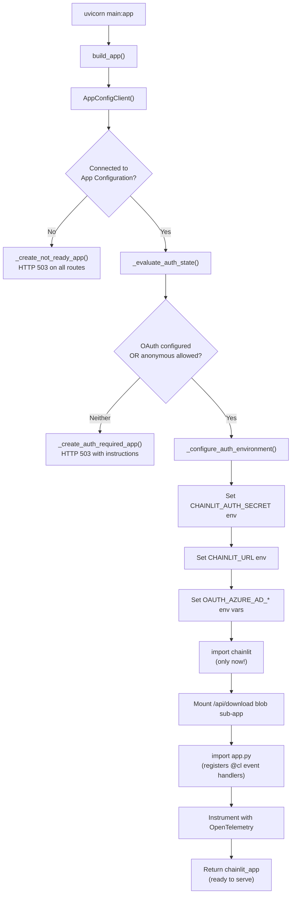
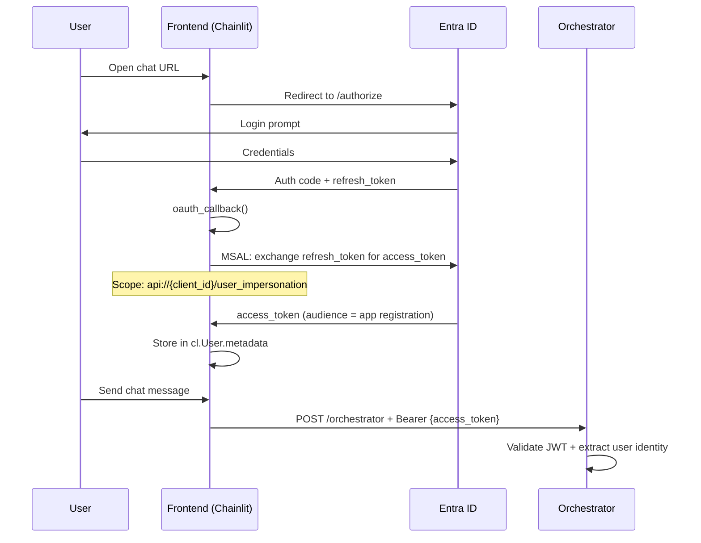
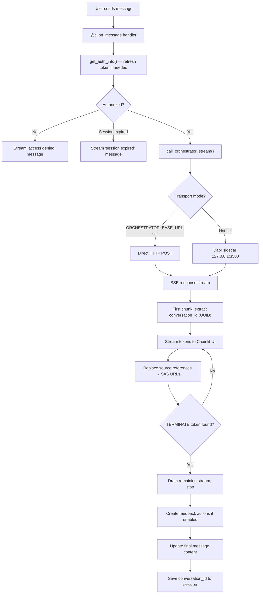
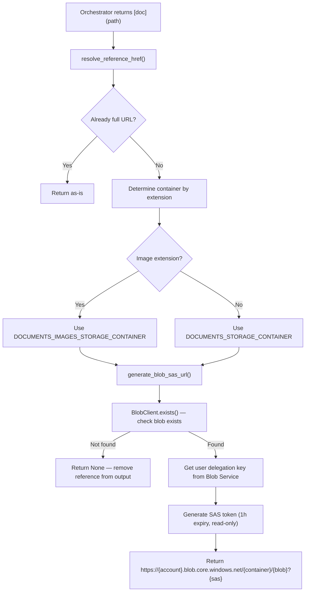
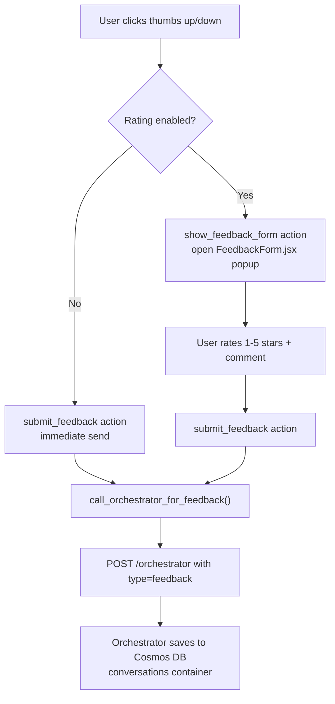
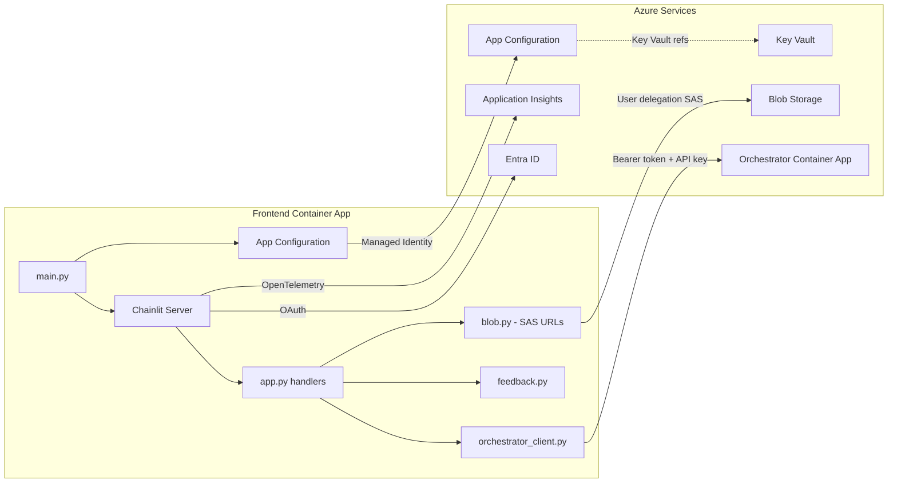

# Frontend Web App (gpt-rag-ui)

> Everything about the GPT-RAG chat frontend: what the accelerator provisions, how it works internally, what you need to configure, and how to customize it.
> **Repository:** github.com/Azure/gpt-rag-ui
> **Version:** 2.2.2

---

## 1. What the Accelerator Provisions

### 1.1 Container App

| Property | Value |
|----------|-------|
| **Service name** | `frontend` |
| **Canonical name** | `FRONTEND_APP` |
| **Ingress** | External (HTTPS, TLS enforced) |
| **Replicas** | min: 1, max: 1 |
| **Resources** | 0.5 vCPU, 1 GiB RAM |
| **Workload profile** | `main` (D4 SKU) |
| **Dapr** | Enabled (appId: `frontend`, port 80, HTTP) |
| **Target port** | 80 (mapped to 8080 internally by Uvicorn) |
| **Initial image** | `mcr.microsoft.com/azuredocs/containerapps-helloworld:latest` (replaced at `azd deploy`) |

### 1.2 Environment Variables Injected by Bicep

Every Container App (including Frontend) gets these three env vars at creation:

| Variable | Value | Purpose |
|----------|-------|---------|
| `APP_CONFIG_ENDPOINT` | `https://{appConfigName}.azconfig.io` | Discover all other services |
| `AZURE_TENANT_ID` | Subscription tenant ID | For `DefaultAzureCredential` |
| `AZURE_CLIENT_ID` | Frontend's UAI client ID | For `DefaultAzureCredential` |

All other configuration (orchestrator URL, storage account name, OAuth settings, feature flags) is read from **App Configuration** at runtime, not from environment variables.

### 1.3 Managed Identity

| Property | Value |
|----------|-------|
| **Identity name pattern** | `id-ca-{token}-frontend` |
| **Type** | User-assigned (UAI) |
| **Injected as** | `AZURE_CLIENT_ID` env var |

### 1.4 RBAC Roles (Bicep-assigned)

| RBAC Role | Purpose |
|-----------|---------|
| `AppConfigurationDataReader` | Read App Configuration keys at startup |
| `StorageBlobDataReader` | Read document blobs from storage |
| `StorageBlobDelegator` | Generate user-delegation SAS tokens for secure blob download links |
| `KeyVaultSecretsUser` | Read secrets (e.g. client secret, Chainlit auth secret) |
| `AcrPull` | Pull container images from the Container Registry |

**What Frontend does NOT have:** No `CognitiveServicesUser`, no `CosmosDBBuiltInDataContributor`, no `SearchIndexDataReader`. The Frontend has zero direct access to OpenAI, AI Search, or Cosmos DB — it only talks to the Orchestrator.

---

## 2. Runtime Architecture

### 2.1 Technology Stack

| Property | Value |
|----------|-------|
| **Language** | Python 3.12 (backend) + React/JSX (frontend components) |
| **Framework** | FastAPI + **Chainlit 2.9.4** |
| **Docker base** | `mcr.microsoft.com/devcontainers/python:3.12-bookworm` |
| **Entry point** | `uvicorn main:app --host 0.0.0.0 --port 8080` |
| **Package manager** | pip |
| **Key deps** | `chainlit==2.9.4`, `msal==1.32.3`, `httpx==0.28.1`, `azure-storage-blob==12.25.1`, `azure-identity==1.23.0` |

### 2.2 What Is Chainlit?

Chainlit is an open-source Python framework that provides a full-featured chat UI out of the box. It handles WebSocket communication, message streaming, session management, OAuth integration, theming, and custom React components — so the Frontend app does not need a separate frontend build step. You just write Python event handlers (`@cl.on_message`, `@cl.on_chat_start`, etc.) and Chainlit renders the chat interface.

### 2.3 Module Structure

```
gpt-rag-ui/
├── main.py                  # App initialization, auth state evaluation, ASGI entry point
├── app.py                   # Chainlit event handlers (@cl.on_message, @cl.on_chat_start)
├── auth_oauth.py            # MSAL token exchange, JWT inspection, token refresh
├── orchestrator_client.py   # Async HTTP client for orchestrator (SSE streaming + feedback)
├── feedback.py              # Feedback actions (thumbs up/down, star rating, custom React form)
├── dependencies.py          # Singleton AppConfigClient injection
├── constants.py             # UUID regex, reference regex, supported extensions, TERMINATE token
├── telemetry.py             # Application Insights + OpenTelemetry tracing
├── connectors/
│   ├── appconfig.py         # Azure App Configuration client (label precedence: gpt-rag-ui > gpt-rag > <none>)
│   └── blob.py              # Blob Storage client (download, SAS URL generation, user delegation key)
├── .chainlit/
│   └── config.toml          # Chainlit config: theme, features, session timeout
├── public/
│   ├── theme.json           # CSS variables (light/dark mode, colors, fonts)
│   ├── custom.css           # Hide watermark, customize login page
│   ├── elements/
│   │   └── FeedbackForm.jsx # React component: 5-star rating dialog + comments
│   ├── logo_light.png       # Light mode logo
│   ├── logo_dark.png        # Dark mode logo
│   └── favicon.ico          # Browser tab icon
├── scripts/
│   ├── deploy.sh            # Deployment helper (Linux/Mac)
│   └── deploy.ps1           # Deployment helper (Windows)
└── Dockerfile               # Container image definition
```

---

## 3. Startup Flow

The startup sequence in `main.py` is carefully ordered because Chainlit must not be imported until environment variables are set:



**Key detail:** Chainlit reads its configuration from environment variables at import time. That's why `main.py` must compute auth state and populate `OAUTH_AZURE_AD_*`, `CHAINLIT_AUTH_SECRET`, and `CHAINLIT_URL` before the `from chainlit.server import app` import on line 442.

### 3.1 Three Possible Startup Modes

| Mode | Condition | Behavior |
|------|-----------|----------|
| **Normal (Chainlit)** | App Config connected AND (OAuth configured OR anonymous allowed) | Full chat UI |
| **Auth Required** | App Config connected BUT OAuth not configured AND anonymous disabled | HTTP 503 with setup instructions |
| **Not Ready** | App Config unreachable | HTTP 503 with login/config instructions |

---

## 4. Authentication

### 4.1 OAuth Flow (Entra ID)

The Frontend uses **Chainlit's built-in Azure AD OAuth provider** + **MSAL** for token exchange.



### 4.2 "Single Token" Mode

The Frontend operates in what the codebase calls "single token" mode:

- The OAuth scope is `api://{client_id}/user_impersonation` (NOT Microsoft Graph scopes like `User.Read`)
- This produces an access token whose audience (`aud`) is the app registration itself
- The same token is forwarded to the Orchestrator via the `Authorization: Bearer` header
- The Orchestrator uses it for JWT validation AND for OBO (on-behalf-of) token exchange to call AI Search with user permissions

**Guard rail:** The `auth_oauth.py` module explicitly rejects Graph scopes (`User.Read`, `graph.microsoft.com`, etc.) and raises a `RuntimeError` if detected. This prevents a common misconfiguration where the token audience would be Microsoft Graph instead of the app registration.

### 4.3 Token Refresh

| Behavior | Detail |
|----------|--------|
| **Trigger** | Before each message, if token expires within 120 seconds |
| **Method** | MSAL `acquire_token_by_refresh_token()` in a background thread |
| **On success** | Updates `cl.User.metadata` with new access + refresh tokens |
| **On failure** | Clears user session, returns `auth_error: session_expired` message |

### 4.4 Anonymous Mode

| Config key | Default | Effect |
|------------|---------|--------|
| `ALLOW_ANONYMOUS` | `true` if running locally, `false` if in Azure + OAuth configured | Skip authentication entirely |

When anonymous mode is active, no `Authorization` header is sent to the Orchestrator. The Orchestrator must also be configured to accept anonymous requests for this to work.

### 4.5 User Authorization (Allow-List)

Optional fine-grained access control beyond Entra ID authentication:

| Config key | Purpose |
|------------|---------|
| `ALLOWED_USER_NAMES` | Comma-separated list of allowed UPNs (e.g. `user@contoso.com`) |
| `ALLOWED_USER_PRINCIPALS` | Comma-separated list of allowed Entra object IDs |

If both lists are empty, all authenticated users are authorized. If either list is populated, the user must appear in at least one.

### 4.6 Required OAuth Configuration Keys

| Key | Source | Required? |
|-----|--------|-----------|
| `OAUTH_AZURE_AD_CLIENT_ID` (or `CLIENT_ID`) | App Config or env var | Yes (for OAuth) |
| `OAUTH_AZURE_AD_TENANT_ID` | App Config or env var | Yes (for OAuth) |
| `OAUTH_AZURE_AD_CLIENT_SECRET` (or `authClientSecret`) | App Config (Key Vault ref) or env var | Yes (for OAuth) |
| `OAUTH_AZURE_AD_SCOPES` | App Config or env var | Optional (auto-derived from client_id) |
| `OAUTH_AZURE_AD_ENABLE_SINGLE_TENANT` | App Config or env var | Optional (defaults to `true`) |
| `CHAINLIT_AUTH_SECRET` | App Config (Key Vault ref) or auto-generated | Recommended (prevents session loss on restart) |
| `CHAINLIT_URL` | App Config or env var | Recommended (sets OAuth callback URL) |

---

## 5. Chat Message Flow

### 5.1 Detailed Request Processing



### 5.2 Orchestrator Communication

The `orchestrator_client.py` module handles all communication with the Orchestrator:

**Request payload:**
```json
{
    "conversation_id": "existing-uuid-or-empty",
    "question": "user message text",
    "ask": "user message text",
    "question_id": "message-uuid"
}
```

**Headers sent:**

| Header | Value | When |
|--------|-------|------|
| `Authorization` | `Bearer {access_token}` | OAuth mode |
| `dapr-api-token` | Dapr sidecar token | If `DAPR_API_TOKEN` is set |
| `X-API-KEY` | API key | If `ORCHESTRATOR_APP_APIKEY` is set |
| `Content-Type` | `application/json` | Always |

**Timeout configuration:**

| Phase | Timeout |
|-------|---------|
| Connect | 10 seconds |
| Write | 30 seconds |
| Read | Unlimited (streaming) |
| Pool | 10 seconds |

**Transport priority:**
1. If `ORCHESTRATOR_BASE_URL` is set → direct HTTP to that URL + `/orchestrator`
2. If not set → Dapr sidecar at `http://127.0.0.1:{DAPR_HTTP_PORT}/v1.0/invoke/orchestrator/method/orchestrator`

### 5.3 HTML Payload Detection

The Frontend includes a safety check for cases where the Container Apps default placeholder page is returned instead of actual orchestrator output. If the first content chunk contains `<!doctype`, `<html`, or `azure container apps`, the Frontend raises a `RuntimeError("orchestrator returned html placeholder")` and shows an error to the user.

---

## 6. Source Reference Resolution

When the Orchestrator returns document references (e.g. `[document.pdf](documents/file.pdf)`), the Frontend resolves them to time-limited SAS URLs for direct blob download:



**Key behaviors:**
- References to non-existent blobs are silently removed from the output (not shown to users)
- SAS tokens expire after 1 hour by default
- Uses user delegation keys (works with managed identity, no storage account keys needed)
- The `StorageBlobDelegator` RBAC role is required for this feature

### 6.1 Blob Download Endpoint

In addition to SAS URLs, the Frontend also mounts a blob download sub-app at `/api/download/{container}/{path}`. This serves as a fallback for direct blob access through the Container App.

---

## 7. Feedback System

### 7.1 Configuration

| Config key | Default | Effect |
|------------|---------|--------|
| `ENABLE_USER_FEEDBACK` | `false` | Show thumbs up/down buttons on responses |
| `USER_FEEDBACK_RATING` | `false` | Show 5-star rating popup (requires `ENABLE_USER_FEEDBACK=true`) |

### 7.2 Two Feedback Modes

**Quick feedback** (`ENABLE_USER_FEEDBACK=true`, `USER_FEEDBACK_RATING=false`):
- Thumbs up/down buttons appear on each response
- Clicking immediately sends feedback to the Orchestrator (no popup)

**Detailed feedback** (`ENABLE_USER_FEEDBACK=true`, `USER_FEEDBACK_RATING=true`):
- Thumbs up/down buttons open a popup dialog
- `FeedbackForm.jsx` renders a 5-star rating + text comment field
- Submission sends all data to the Orchestrator

### 7.3 Feedback Data Flow



**Feedback payload sent to Orchestrator:**
```json
{
    "type": "feedback",
    "conversation_id": "uuid",
    "question_id": "uuid",
    "is_positive": true,
    "stars_rating": 4,
    "feedback_text": "Great answer!"
}
```

---

## 8. App Configuration Keys

The Frontend reads configuration from Azure App Configuration with the following label precedence (highest to lowest):

1. `gpt-rag-ui` — UI-specific overrides
2. `gpt-rag` — Shared across all GPT-RAG apps
3. `<no label>` — Global defaults

### 8.1 Keys Used by the Frontend

| Key | Type | Default | Purpose |
|-----|------|---------|---------|
| `ORCHESTRATOR_BASE_URL` | string | (none — uses Dapr) | Direct HTTP URL to orchestrator |
| `ORCHESTRATOR_APP_APIKEY` | string | (none) | API key for orchestrator auth |
| `DAPR_API_TOKEN` | string | (none) | Dapr sidecar shared secret |
| `DAPR_HTTP_PORT` | string | `3500` | Dapr sidecar HTTP port |
| `STORAGE_ACCOUNT_NAME` | string | — | Storage account for blob downloads |
| `DOCUMENTS_STORAGE_CONTAINER` | string | — | Container for extracted documents |
| `DOCUMENTS_IMAGES_STORAGE_CONTAINER` | string | — | Container for extracted images |
| `ALLOW_ANONYMOUS` | bool | (computed) | Allow unauthenticated access |
| `ENABLE_USER_FEEDBACK` | bool | `false` | Show feedback buttons |
| `USER_FEEDBACK_RATING` | bool | `false` | Enable 5-star rating popup |
| `ALLOWED_USER_NAMES` | string | (none) | Comma-separated UPN allow-list |
| `ALLOWED_USER_PRINCIPALS` | string | (none) | Comma-separated OID allow-list |
| `LOG_LEVEL` | string | `Information` | Logging verbosity |
| `ENABLE_CONSOLE_LOGGING` | bool | `true` | Console log output |
| `APPLICATIONINSIGHTS_CONNECTION_STRING` | string | (none) | Application Insights telemetry |
| `OAUTH_AZURE_AD_CLIENT_ID` | string | — | Entra app registration client ID |
| `OAUTH_AZURE_AD_TENANT_ID` | string | — | Entra tenant ID |
| `OAUTH_AZURE_AD_CLIENT_SECRET` | string | — | Client secret (Key Vault reference) |
| `OAUTH_AZURE_AD_SCOPES` | string | auto-derived | OAuth scopes |
| `OAUTH_AZURE_AD_ENABLE_SINGLE_TENANT` | string | `true` | Single-tenant OAuth |
| `CHAINLIT_AUTH_SECRET` | string | auto-generated | JWT signing secret for Chainlit sessions |
| `CHAINLIT_URL` | string | (none) | Public URL for OAuth callback |

---

## 9. Chainlit Configuration

The `.chainlit/config.toml` defines UI behavior. Key settings as shipped by the accelerator:

### 9.1 Project Settings

| Setting | Value | Notes |
|---------|-------|-------|
| `session_timeout` | 3600 (1 hour) | WebSocket disconnect grace period |
| `user_session_timeout` | 1296000 (15 days) | How long user sessions persist |
| `cache` | `false` | No LangChain-style caching |
| `allow_origins` | `["*"]` | CORS: all origins allowed |

### 9.2 Feature Flags

| Feature | Value | Notes |
|---------|-------|-------|
| `unsafe_allow_html` | `false` | HTML in messages is escaped (security) |
| `latex` | `false` | Math expressions disabled |
| `edit_message` | `true` | Users can edit their messages |
| `spontaneous_file_upload.enabled` | `false` | File upload disabled |
| `cot` (Chain of Thought) | `full` | Show full reasoning chain |

### 9.3 UI Settings

| Setting | Value |
|---------|-------|
| `name` | `GPT-RAG` |
| `default_theme` | `light` |
| `custom_css` | `/public/custom.css` |

---

## 10. Theming and Branding

### 10.1 Theme Variables (`public/theme.json`)

The theme defines CSS custom properties for light and dark modes:

| Variable | Light | Dark |
|----------|-------|------|
| `--primary` | Blue (206 100% 42%) | Blue (206 100% 42%) |
| `--secondary` | Green (120 77% 27%) | Green (120 77% 27%) |
| `--background` | White | Dark gray (13%) |
| `--font-sans` | Inter | Inter |
| `--font-mono` | Source Code Pro | Source Code Pro |

### 10.2 Custom CSS (`public/custom.css`)

The shipped CSS makes three modifications:
1. **Hides the Chainlit watermark** (`.watermark { display: none !important; }`)
2. **Hides the README button** (`#readme-button { display: none; }`)
3. **Hides the empty right pane on the login page** (collapses the layout)

### 10.3 How to Customize Branding

| What to change | File | Notes |
|----------------|------|-------|
| App name | `.chainlit/config.toml` → `[UI] name` | Displayed in header |
| Logo | `public/logo_light.png`, `public/logo_dark.png` | Replace with your logo (keep same filenames) |
| Favicon | `public/favicon.ico` | Browser tab icon |
| Colors | `public/theme.json` → `variables.light` / `variables.dark` | HSL values |
| Fonts | `public/theme.json` → `--font-sans`, `--font-mono` | Web-safe or load via `custom_fonts` |
| Additional CSS | `public/custom.css` | Any Chainlit element overrides |
| Default theme | `.chainlit/config.toml` → `default_theme` | `"light"` or `"dark"` |

---

## 11. Telemetry and Observability

### 11.1 Application Insights Integration

The Frontend uses Azure Monitor OpenTelemetry for tracing:

| Component | Library |
|-----------|---------|
| Azure Monitor SDK | `azure-monitor-opentelemetry==1.6.10` |
| FastAPI instrumentation | `opentelemetry-instrumentation-fastapi` (via azure-monitor) |
| HTTPX instrumentation | `opentelemetry-instrumentation-httpx==0.52b1` |

**What's traced:**
- Every `handle_message` call (via `tracer.start_as_current_span`)
- Span attributes: `question_id`, `conversation_id`, `user_id`
- All outgoing HTTPX requests to the Orchestrator (auto-instrumented)
- Custom resource labels: `SERVICE_NAME=gpt-rag-ui`, node hostname

### 11.2 Structured Logging

Key log events emitted at INFO level:

| Event | What it logs |
|-------|-------------|
| `User request received` | conversation_id, question_id, user principal, message preview |
| `Forwarding request to orchestrator` | conversation_id, user, authorized status, group count |
| `Orchestrator request auth health` | mode (dapr/direct), has_access_token, token length |
| `Streaming response references detected` | Resolved blob references |
| `Response delivered` | conversation_id, chunk count, character count, preview |
| `Auth decision` | running_in_azure, oauth_configured, allow_anonymous, source |
| `User authenticated` | name, principal, authorized status |

---

## 12. Connections and Dependencies



| Service | How | Why |
|---------|-----|-----|
| App Configuration | Managed Identity (label: `gpt-rag-ui` > `gpt-rag` > none) | All runtime config |
| Key Vault | Via App Config Key Vault references | Client secret, Chainlit auth secret |
| Orchestrator | HTTPS (Dapr sidecar or direct) | Forward user queries, send feedback |
| Blob Storage | Managed Identity + user delegation key | Read blobs, generate SAS download URLs |
| Application Insights | Connection string from App Config | Traces, logs, metrics |
| Entra ID | OAuth2 (MSAL ConfidentialClientApplication) | User authentication |

---

## 13. What You Need to Configure After Deployment

### 13.1 Required (for OAuth to work)

These must be set in App Configuration (label `gpt-rag` or `gpt-rag-ui`) or as container env vars:

| Key | How to get it |
|-----|---------------|
| `OAUTH_AZURE_AD_CLIENT_ID` | From your Entra app registration |
| `OAUTH_AZURE_AD_TENANT_ID` | Your Azure AD tenant ID |
| `OAUTH_AZURE_AD_CLIENT_SECRET` | App registration client secret (store as Key Vault reference) |
| `CHAINLIT_URL` | Public URL of the Frontend Container App (e.g. `https://frontend.{env}.{region}.azurecontainerapps.io`) |

### 13.2 Recommended

| Key | Why |
|-----|-----|
| `CHAINLIT_AUTH_SECRET` | Persistent session signing key. Without it, a random secret is generated on each restart, invalidating all active sessions |
| `ALLOW_ANONYMOUS=false` | Explicitly disable anonymous access in production |

### 13.3 Optional Customizations

| What | How |
|------|-----|
| Enable feedback | Set `ENABLE_USER_FEEDBACK=true` in App Config |
| Enable star ratings | Set `USER_FEEDBACK_RATING=true` in App Config |
| Restrict users | Set `ALLOWED_USER_NAMES` and/or `ALLOWED_USER_PRINCIPALS` |
| Custom branding | Replace logo files, edit `theme.json` and `custom.css`, redeploy |
| Multi-tenant | Set `OAUTH_AZURE_AD_ENABLE_SINGLE_TENANT=false` |
| Direct orchestrator URL | Set `ORCHESTRATOR_BASE_URL` to skip Dapr sidecar |

---

## 14. Entra ID App Registration (shared with Ingestion)

The Frontend shares the same Entra app registration that the Ingestion component uses for SharePoint access. For the Frontend specifically:

### 14.1 Required Configuration

| Property | Value |
|----------|-------|
| **Redirect URI** | `https://{frontend-url}/auth/oauth/azure-ad/callback` |
| **Expose an API** | App ID URI: `api://{client_id}`, Scope: `user_impersonation` |
| **Delegated permissions** | (none needed — uses custom API scope) |

### 14.2 Common OAuth Misconfiguration Issues

| Problem | Symptom | Fix |
|---------|---------|-----|
| Graph scopes in `OAUTH_AZURE_AD_SCOPES` | `RuntimeError: Invalid OAUTH_AZURE_AD_SCOPES` | Remove `User.Read` and similar; use `api://{client_id}/user_impersonation` |
| Missing admin consent | `AADSTS65001` error | Grant admin consent in Entra portal |
| Missing `offline_access` scope | No refresh token → immediate session expiry | Ensure scopes include `offline_access` |
| Wrong redirect URI | OAuth callback fails | Must match exactly including path |
| Missing "Expose an API" | Token audience mismatch | Configure `user_impersonation` scope in app registration |

---

## 15. Local Development

### 15.1 Prerequisites

| Requirement | Command |
|-------------|---------|
| Python 3.12 | `python --version` |
| Azure CLI logged in | `az login` |
| App Config endpoint | Set `APP_CONFIG_ENDPOINT` env var |

### 15.2 Running Locally

```bash
# Install dependencies
pip install -r requirements.txt

# Set minimum config
export APP_CONFIG_ENDPOINT="https://{your-appconfig}.azconfig.io"

# Option A: Anonymous mode (no OAuth needed)
export ALLOW_ANONYMOUS=true

# Option B: OAuth mode
export OAUTH_AZURE_AD_CLIENT_ID="your-client-id"
export OAUTH_AZURE_AD_TENANT_ID="your-tenant-id"
export OAUTH_AZURE_AD_CLIENT_SECRET="your-client-secret"
export CHAINLIT_URL="http://localhost:8080"

# Run (without Dapr — set orchestrator URL directly)
export ORCHESTRATOR_BASE_URL="https://your-orchestrator-url"
uvicorn main:app --host 0.0.0.0 --port 8080
```

### 15.3 Without App Configuration

If `APP_CONFIG_ENDPOINT` is not set, the app runs in env-var-only mode. All configuration keys must be provided as environment variables.

---

## 16. Deployment

### 16.1 Via azd (standard)

```bash
# From the gpt-rag root repo
azd deploy frontend
```

This builds the Docker image from the Dockerfile, pushes to ACR, and updates the Container App.

### 16.2 Docker Image

The Dockerfile is minimal:
1. Base: `mcr.microsoft.com/devcontainers/python:3.12-bookworm`
2. Copy `requirements.txt`, run `pip install`
3. Copy all app code
4. Expose port 8080
5. CMD: `uvicorn main:app --host 0.0.0.0 --port 8080`

---

## 17. Dependency Versions (pinned)

| Package | Version |
|---------|---------|
| chainlit | 2.9.4 |
| fastapi | >=0.116.1 |
| httpx | 0.28.1 |
| msal | 1.32.3 |
| azure-identity | 1.23.0 |
| azure-appconfiguration | 1.7.1 |
| azure-storage-blob | 12.25.1 |
| azure-monitor-opentelemetry | 1.6.10 |
| uvicorn | 0.35.0 |
| tenacity | 9.1.2 |
| starlette | (latest) |
| aiohttp | 3.13.3 |

---

## 18. Troubleshooting

| Symptom | Likely Cause | Fix |
|---------|-------------|-----|
| HTTP 503 "GPT-RAG UI is not ready" | App Configuration unreachable | Verify `APP_CONFIG_ENDPOINT`, check managed identity, run `az login` locally |
| HTTP 503 "authentication required" | OAuth not configured + `ALLOW_ANONYMOUS=false` | Set `OAUTH_AZURE_AD_*` keys in App Config |
| "orchestrator returned html placeholder" | Orchestrator Container App not deployed yet | Run `azd deploy orchestrator` |
| "session expired" on every message | `CHAINLIT_AUTH_SECRET` not persisted | Store a stable secret in App Config / Key Vault |
| Token refresh fails | Client secret expired or wrong scopes | Rotate secret in Entra, verify `OAUTH_AZURE_AD_SCOPES` |
| Blob references show as broken links | SAS generation fails | Verify `StorageBlobDelegator` role is assigned to Frontend identity |
| Blob references silently disappear | Blob does not exist in storage | Run ingestion to populate documents; check container names match |
| Feedback buttons missing | Feature not enabled | Set `ENABLE_USER_FEEDBACK=true` in App Config |
| "Invalid OAUTH_AZURE_AD_SCOPES" error | Graph scopes detected | Remove `User.Read`; use `api://{client_id}/user_impersonation,openid,profile,offline_access` |
| CORS errors in browser | Redirect URI mismatch | Update `CHAINLIT_URL` and Entra redirect URI to match |

---

## 19. What the Implementation Team Should Focus On

1. **Branding:** Replace logos, edit `theme.json` colors, update `config.toml` app name — no code changes needed
2. **OAuth setup:** Ensure the Entra app registration has "Expose an API" with `user_impersonation` scope, correct redirect URI, and admin consent granted
3. **Feedback:** Enable via App Config if you want user feedback collection (stored in Cosmos DB `conversations` container via the Orchestrator)
4. **Monitoring:** Verify Application Insights connection string is set — all traces flow through OpenTelemetry
5. **Session stability:** Set `CHAINLIT_AUTH_SECRET` in Key Vault to prevent session loss on container restarts
6. **Access control:** Use `ALLOWED_USER_NAMES` / `ALLOWED_USER_PRINCIPALS` to restrict access beyond Entra authentication
