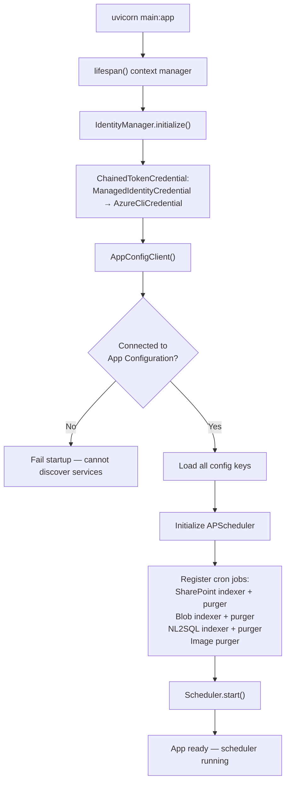
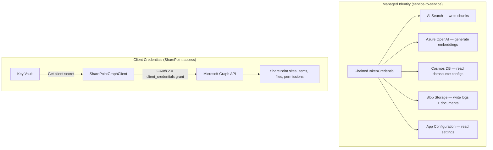
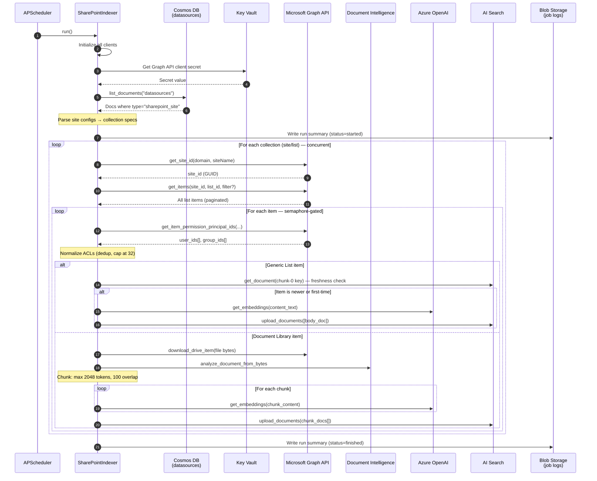
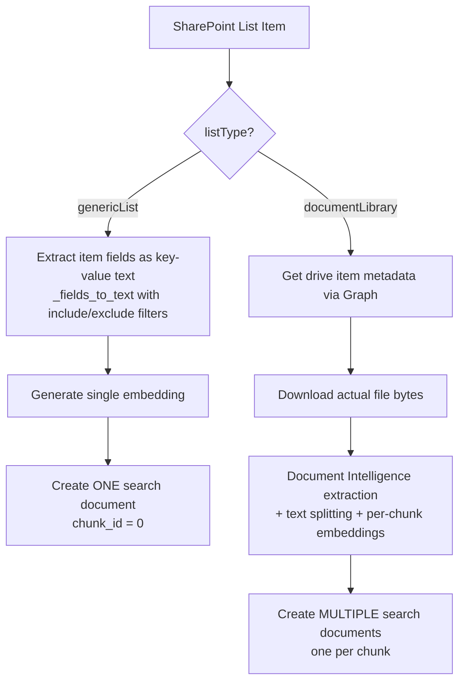
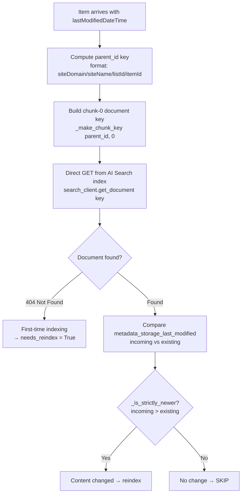
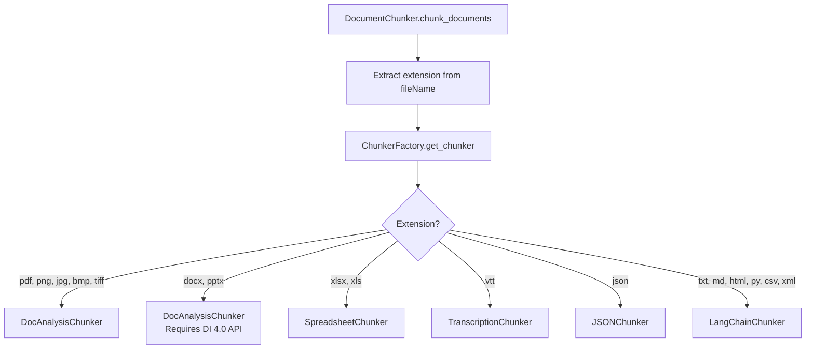
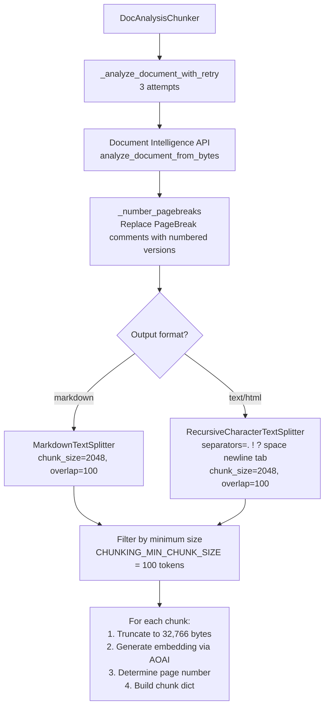
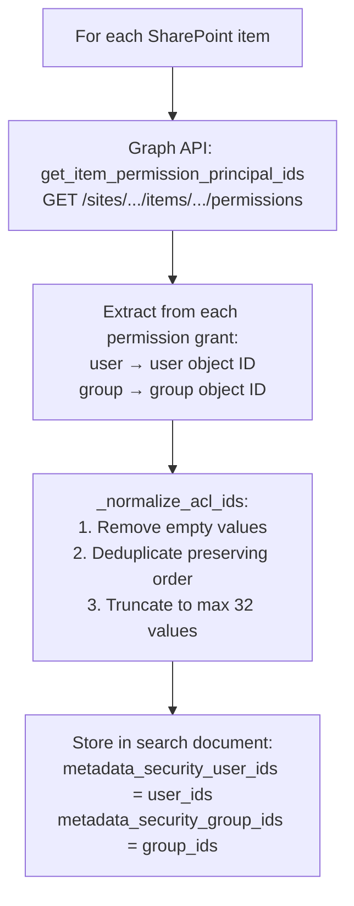
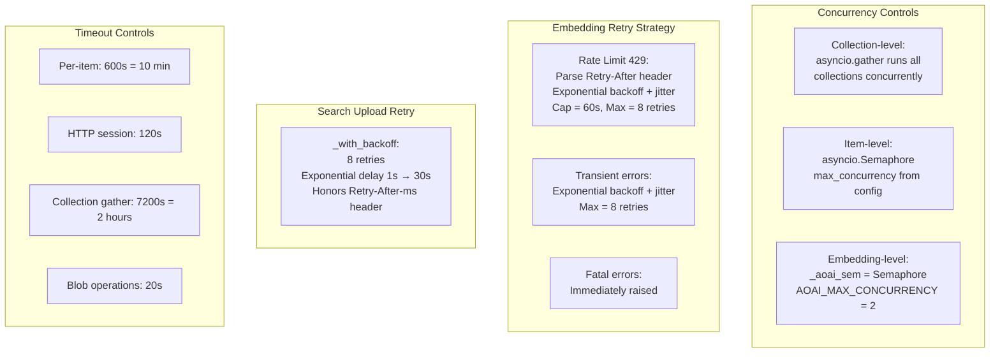
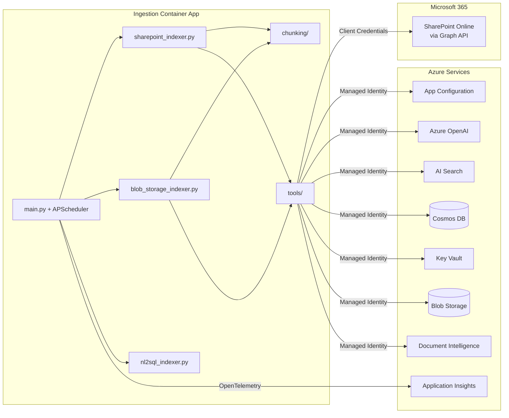

# Ingestion App (gpt-rag-ingestion)

> Everything about the GPT-RAG ingestion pipeline: what the accelerator provisions, how it works internally, what you need to configure, and how to customize it.
> **Repository:** github.com/Azure/gpt-rag-ingestion
> **Version:** 2.2.3 (updated March 6, 2026 — added cron fallback defaults for blob jobs)

---

## 1. What the Accelerator Provisions

### 1.1 Container App

| Property | Value |
|----------|-------|
| **Service name** | `dataingest` |
| **Canonical name** | `DATA_INGEST_APP` |
| **Ingress** | External (HTTPS, TLS enforced) |
| **Replicas** | min: 1, max: 1 |
| **Resources** | 0.5 vCPU, 1 GiB RAM |
| **Workload profile** | `main` (D4 SKU) |
| **Dapr** | Enabled (appId: `dataingest`, port 80, HTTP) |
| **Target port** | 80 (mapped to 8080 internally by Uvicorn) |
| **Initial image** | `mcr.microsoft.com/azuredocs/containerapps-helloworld:latest` (replaced at `azd deploy`) |

### 1.2 Environment Variables Injected by Bicep

Every Container App (including Ingestion) gets these three env vars at creation:

| Variable | Value | Purpose |
|----------|-------|---------|
| `APP_CONFIG_ENDPOINT` | `https://{appConfigName}.azconfig.io` | Discover all other services |
| `AZURE_TENANT_ID` | Subscription tenant ID | For `DefaultAzureCredential` |
| `AZURE_CLIENT_ID` | Ingestion's UAI client ID | For `DefaultAzureCredential` |

All other configuration (storage endpoints, embedding models, SharePoint settings, cron schedules) is read from **App Configuration** at runtime, not from environment variables.

### 1.3 Managed Identity

| Property | Value |
|----------|-------|
| **Identity name pattern** | `id-ca-{token}-dataingest` |
| **Type** | User-assigned (UAI) |
| **Injected as** | `AZURE_CLIENT_ID` env var |

### 1.4 RBAC Roles (Bicep-assigned)

| RBAC Role | Purpose |
|-----------|---------|
| `AppConfigurationDataReader` | Read App Configuration keys at startup |
| `CognitiveServicesUser` | AI Foundry services access (Document Intelligence) |
| `CognitiveServicesOpenAIUser` | OpenAI embedding model calls |
| `CosmosDBBuiltInDataContributor` | Read datasource configs, read/write job state |
| `SearchIndexDataContributor` | Write chunks + vectors + ACLs to the search index |
| `StorageBlobDataContributor` | Write extracted documents and images to blob, write job logs |
| `KeyVaultSecretsUser` | Read secrets (Graph API client secret) |
| `AcrPull` | Pull container images from the Container Registry |

**What Ingestion does NOT have:** No `SearchIndexDataReader` (doesn't query the index for search results — only writes and does direct document lookups for freshness checks), no `StorageBlobDelegator` (no SAS URL generation), no `StorageQueueDataContributor`. The Ingestion app has **write** access to the search index — the Orchestrator only has read access. This is the key RBAC distinction between the two.

---

## 2. Runtime Architecture

### 2.1 Technology Stack

| Property | Value |
|----------|-------|
| **Language** | Python 3.12 |
| **Framework** | FastAPI 0.115.12 + Uvicorn |
| **Scheduler** | APScheduler 3.11.0 (cron-based background jobs) |
| **Docker base** | `mcr.microsoft.com/devcontainers/python:3.12-bookworm` |
| **Entry point** | `uvicorn main:app --host 0.0.0.0 --port 8080` |
| **Package manager** | pip |
| **Key deps** | `msgraph-sdk 1.5.4`, `langchain-text-splitters`, `openpyxl`, `Pillow`, `webvtt-py`, `tiktoken 0.7.0`, `azure-ai-formrecognizer`, `azure-search-documents` |

### 2.2 What Is APScheduler?

APScheduler (Advanced Python Scheduler) is the library that drives all ingestion jobs. It runs cron-triggered background tasks inside the same process as the FastAPI web server. Each indexer and purger is a separate cron job with a configurable schedule. The scheduler starts when the FastAPI app starts and stops when it shuts down — there's no external scheduler or message queue.

### 2.3 Module Structure

```
gpt-rag-ingestion/
├── main.py                  # FastAPI app + APScheduler setup + cron job registration
├── dependencies.py          # API key validation for HTTP endpoints
├── chunking/
│   ├── document_chunking.py       # Main entry: DocumentChunker.chunk_documents()
│   ├── chunker_factory.py         # Selects chunker by file extension
│   ├── base_chunker.py            # Base: create_chunk(), embeddings, truncation
│   ├── doc_analysis_chunker.py    # Document Intelligence (PDF, images, DOCX, PPTX)
│   ├── multimodal_chunker.py      # Text + figure extraction
│   ├── langchain_chunker.py       # Generic: markdown, text, html, python, csv, xml
│   ├── spreadsheet_chunker.py     # Excel via openpyxl
│   ├── transcription_chunker.py   # WebVTT files
│   ├── json_chunker.py            # JSON documents
│   └── nl2sql_chunker.py          # SQL query/result pairs
├── jobs/
│   ├── sharepoint_indexer.py      # SharePoint → AI Search pipeline
│   ├── sharepoint_purger.py       # Remove deleted SP items from index
│   ├── blob_storage_indexer.py    # Blob Storage → AI Search pipeline
│   ├── blob_storage_purger.py     # Remove deleted blobs from index
│   ├── nl2sql_indexer.py          # NL2SQL data indexing
│   ├── nl2sql_purger.py           # NL2SQL cleanup
│   └── image_purger.py            # Remove orphaned images
└── tools/
    ├── aisearch.py          # AI Search async client (upload, get_document, delete)
    ├── aoai.py              # Azure OpenAI embeddings (with retry/backoff)
    ├── blob.py              # Blob Storage client (read, write, list)
    ├── cosmosdb.py          # Cosmos DB client (datasource configs)
    ├── doc_intelligence.py  # Document Intelligence (Form Recognizer)
    ├── keyvault.py          # Key Vault secrets
    └── sharepoint.py        # SharePoint Graph API client (sites, items, permissions, downloads)
```

---

## 3. Startup Flow

The startup sequence uses FastAPI's lifespan hook to initialize the scheduler and register all cron jobs:



**Key detail:** All indexers and purgers are registered as cron jobs at startup. They run on their configured schedules regardless of whether there's data to process — if there's nothing to index, they complete in seconds and exit cleanly. The scheduler runs inside the same process as the web server; no external job scheduler is needed.

### 3.1 Registered Cron Jobs

All cron jobs are registered in `main.py` (lines 145–151) using APScheduler's `CronTrigger.from_crontab()`. The App Configuration key is read via `app_config_client.get(key)` during the `lifespan()` startup. If the key doesn't exist and there's no hardcoded default, the job is **skipped entirely** (not registered with the scheduler).

| Job | App Config Key | Hardcoded Default | Deployed by Bicep? | What It Does |
|-----|---------------|-------------------|---------------------|--------------|
| **SharePoint indexer** | `CRON_RUN_SHAREPOINT_INDEX` | *(none — skipped if key missing)* | **No** — must be created manually | Crawl SharePoint sites defined in Cosmos DB `datasources` |
| **SharePoint purger** | `CRON_RUN_SHAREPOINT_PURGE` | *(none — skipped if key missing)* | **No** — must be created manually | Remove index entries for deleted SharePoint items |
| **Blob indexer** | `CRON_RUN_BLOB_INDEX` | `0 * * * *` (hourly) | **No** — runs on hardcoded default | Crawl the `documents` blob container |
| **Blob purger** | `CRON_RUN_BLOB_PURGE` | `10 * * * *` (10 past the hour) | **No** — runs on hardcoded default | Remove index entries for deleted blobs |
| **NL2SQL indexer** | `CRON_RUN_NL2SQL_INDEX` | *(none — skipped if key missing)* | **No** — must be created manually | Index SQL table schemas and sample queries |
| **NL2SQL purger** | `CRON_RUN_NL2SQL_PURGE` | *(none — skipped if key missing)* | **No** — must be created manually | Clean up stale NL2SQL entries |
| **Image purger** | `CRON_RUN_IMAGES_PURGE` | *(none — skipped if key missing)* | **No** — must be created manually | Remove orphaned extracted images (requires `MULTIMODAL=true`) |

**Additional scheduling controls:**

| Key | Source | Default | Purpose |
|-----|--------|---------|---------|
| `RUN_JOBS_ON_STARTUP` | App Configuration | `true` | Run all registered jobs immediately at container start, before waiting for the first cron trigger |
| `SCHEDULER_TIMEZONE` | Environment variable (`os.getenv`) | Machine timezone via `get_localzone()` | Timezone for evaluating cron expressions (e.g. `UTC`, `Europe/Amsterdam`) |

**IMPORTANT — These keys are NOT automatically created by the deployment:**
The accelerator's Bicep/azd deployment does **not** create any `CRON_RUN_*` keys in App Configuration. You will not find them after a fresh `azd provision`. The blob indexer and purger work out of the box only because they have hardcoded defaults in the Python code (`main.py`). All other jobs (SharePoint, NL2SQL, Images) require the infrastructure team to **manually create** the keys in App Configuration following the feature-specific setup guides:

| Feature | Setup Guide (where key creation is documented) | Keys to Create |
|---------|------------------------------------------------|----------------|
| SharePoint connector | [Sharepoint Connector - GPT-RAG](https://azure.github.io/GPT-RAG/howto_sharepoint_connector/) | `CRON_RUN_SHAREPOINT_INDEX`, `CRON_RUN_SHAREPOINT_PURGE` |
| NL2SQL | NL2SQL setup guide in the orchestrator repo | `CRON_RUN_NL2SQL_INDEX`, `CRON_RUN_NL2SQL_PURGE` |
| Multimodal images | Multimodal setup guide | `CRON_RUN_IMAGES_PURGE` (also requires `MULTIMODAL=true`) |
| Blob indexer override | *(only needed if you want to change the hourly default)* | `CRON_RUN_BLOB_INDEX`, `CRON_RUN_BLOB_PURGE` |

**Cron format — watch out for a documentation discrepancy:**
The GPT-RAG docs site shows **6-field** cron values with a seconds field (e.g. `0 0 * * * *`). However, the actual code uses APScheduler's `CronTrigger.from_crontab()`, which only accepts the **standard 5-field** format: `minute hour day-of-month month day-of-week`. If your App Config contains 6-field values (from following the docs literally), APScheduler will raise a `ValueError` at startup and the job won't register. Check your values and convert if needed:

| Docs value (6-field, with seconds) | Correct value (5-field, no seconds) | Meaning |
|-------------------------------------|--------------------------------------|---------|
| `0 0 * * * *` | `0 * * * *` | Every hour at :00 |
| `0 0 */6 * * *` | `0 */6 * * *` | Every 6 hours at :00 |
| `0 */30 * * * *` | `*/30 * * * *` | Every 30 minutes |

**Other key facts:**
- Changes to App Config keys require a **container restart** to take effect — the scheduler reads keys only at startup.
- To verify which jobs are actually running, check console logs for `Scheduled @ <cron>` (registered) or `not set — skipping job` (skipped).
- If a cron value is invalid, the app raises a `RuntimeError` at startup — the container will fail to start and enter a restart loop.

**Where to check and change (Azure portal):**
Azure portal → App Configuration → **Configuration explorer** → filter by key prefix `CRON_RUN_` with label `gpt-rag`. To add a missing key: click **+ Create** → **Key-value** → enter the key name, cron value, and label `gpt-rag`.

**Where to check and change (CLI):**
```bash
# List all cron keys
az appconfig kv list \
  --endpoint "https://{your-appconfig}.azconfig.io" \
  --label "gpt-rag" --auth-mode login \
  --query "[?starts_with(key, 'CRON_RUN_') || key == 'RUN_JOBS_ON_STARTUP']" \
  --output table

# Create or update a key
az appconfig kv set \
  --endpoint "https://{your-appconfig}.azconfig.io" \
  --key "CRON_RUN_SHAREPOINT_INDEX" \
  --label "gpt-rag" \
  --value "0 * * * *" \
  --auth-mode login

# Restart the container to pick up the change
az containerapp revision restart \
  --name {dataingest-app-name} \
  --resource-group {rg} \
  --revision {active-revision-name}
```

### 3.2 What You Should Expect in a Default Deployment

On a fresh `azd provision` + `azd deploy` with no manual changes:

| Key | Exists in App Config? | Job runs? | Why |
|-----|----------------------|-----------|-----|
| `CRON_RUN_BLOB_INDEX` | **No** | **Yes** — on hardcoded default `0 * * * *` | Code fallback: runs hourly even without the key |
| `CRON_RUN_BLOB_PURGE` | **No** | **Yes** — on hardcoded default `10 * * * *` | Code fallback: runs at :10 even without the key |
| `CRON_RUN_SHAREPOINT_INDEX` | **No** | **No** — skipped | No default, no key → job not registered |
| `CRON_RUN_SHAREPOINT_PURGE` | **No** | **No** — skipped | No default, no key → job not registered |
| `CRON_RUN_NL2SQL_INDEX` | **No** | **No** — skipped | No default, no key → job not registered |
| `CRON_RUN_NL2SQL_PURGE` | **No** | **No** — skipped | No default, no key → job not registered |
| `CRON_RUN_IMAGES_PURGE` | **No** | **No** — skipped | No default, no key → job not registered |
| `RUN_JOBS_ON_STARTUP` | **No** | N/A — defaults to `true` | Jobs fire immediately at container start |

If the infrastructure team has enabled the SharePoint connector, they must manually create `CRON_RUN_SHAREPOINT_INDEX` and `CRON_RUN_SHAREPOINT_PURGE` in App Configuration with label `gpt-rag`. Same applies to NL2SQL and image purging if those features are needed.

### 3.3 Important: Both Indexers Are Always Active (When Scheduled)

Both the SharePoint indexer and Blob indexer run on their configured schedules regardless of whether there's data to process — if there's nothing to index, they complete in seconds and exit cleanly:

- **SharePoint indexer** checks the Cosmos DB `datasources` container for documents with `type: "sharepoint_site"`. On a fresh deployment, that container has no site configs — so the indexer runs, finds nothing, and exits.
- **Blob indexer** scans the `documents` blob container. On a fresh deployment, it's empty — same result.

There is no `USE_SHAREPOINT=true` or `ENABLE_BLOB_INDEXER=false` flag. If the job is registered (key exists or has a default), it runs. It just silently exits if there's nothing to process.

---

## 4. Authentication

### 4.1 Dual Authentication Model

The Ingestion app uses **two separate authentication mechanisms** for different purposes:



### 4.2 Managed Identity (Default Path)

All Azure service-to-service calls use the app's user-assigned managed identity via `DefaultAzureCredential`. This includes AI Search, OpenAI, Cosmos DB, Blob Storage, App Configuration, and Key Vault. No API keys, no rotation needed.

### 4.3 Client Credentials (SharePoint Path)

SharePoint access is different — it uses the **Entra ID app registration** (the same one the Frontend uses for OAuth login):

| Step | Detail |
|------|--------|
| **1. Get secret** | Key Vault → client secret for the app registration |
| **2. Authenticate** | OAuth 2.0 `client_credentials` grant against `https://graph.microsoft.com/.default` |
| **3. Call Graph** | Bearer token → Graph API endpoints for sites, lists, items, permissions, file downloads |

**Why not managed identity for SharePoint?** SharePoint/Graph API requires Application-type permissions (`Sites.Read.All`, `Files.Read.All`, `GroupMember.Read.All`) which are granted to the app registration, not to managed identities. The client credentials flow is the standard pattern for daemon/service applications accessing Microsoft 365 data.

### 4.4 Required Entra App Registration Permissions

| API | Permission | Type | Purpose |
|-----|-----------|------|---------|
| Microsoft Graph | `Sites.Read.All` | Application | Read SharePoint site content |
| Microsoft Graph | `Files.Read.All` | Application | Read/download files from document libraries |
| Microsoft Graph | `GroupMember.Read.All` | Application | Read group memberships for ACL extraction |

**Admin consent required** for all three Application-level permissions.

### 4.5 HTTP Endpoint Authentication

The Ingestion app also exposes REST endpoints (`/document-chunking`, `/text-embedding`) for on-demand use. These are protected by API key validation (same `dapr-api-token` or `X-API-KEY` pattern as the Orchestrator).

---

## 5. SharePoint Indexing Pipeline

### 5.1 End-to-End Flow



### 5.2 Client Initialization

The `_ensure_clients()` method initializes all clients in a specific order:

1. `ChainedTokenCredential` (AzureCliCredential + ManagedIdentityCredential)
2. `BlobServiceClient` (for job logging)
3. `AsyncSearchClient` (endpoint + index name + credential)
4. `KeyVaultClient`
5. `SharePointGraphClient` (using KV secret for client credentials)
6. `AzureOpenAIClient` (for embeddings)
7. Probe storage write permissions (zero-byte write + delete test)
8. Ensure Graph token is fresh

### 5.3 Site Configuration from Cosmos DB

The SharePoint indexer reads its configuration from the `datasources` container. Each document defines one SharePoint site:

```json
{
  "id": "unique-id",
  "type": "sharepoint_site",
  "siteDomain": "contoso.sharepoint.com",
  "siteName": "HRPortal",
  "category": "HR Documents",
  "lists": [
    {
      "listId": "abc12345-...",
      "listType": "documentLibrary",
      "filter": "fields/Status eq 'Published'",
      "includeFields": ["Title", "Department"],
      "excludeFields": ["InternalNotes"],
      "category": "Policies"
    },
    {
      "listId": "def67890-...",
      "listType": "genericList",
      "includeFields": ["Title", "Description", "FAQ_Answer"]
    }
  ]
}
```

| Field | Required | Purpose |
|-------|----------|---------|
| `siteDomain` | Yes | SharePoint tenant domain (e.g. `contoso.sharepoint.com`) |
| `siteName` | Yes | Site name within the tenant |
| `lists[].listId` | Preferred | Direct list GUID — avoids extra Graph API lookup |
| `lists[].listName` | Fallback | Legacy: requires Graph API call to resolve to ID |
| `lists[].listType` | No | `documentLibrary` or `genericList` (default) |
| `lists[].filter` | No | OData filter applied when fetching items from Graph API |
| `lists[].includeFields` | No | Whitelist of fields to include in content text |
| `lists[].excludeFields` | No | Blacklist of fields to exclude from content text |
| `lists[].category` | No | Category value written to the index `category` field |

### 5.4 Generic List vs Document Library Processing



**Generic lists** produce exactly one search document per item — all field values concatenated as text. **Document libraries** download the actual file, extract content via Document Intelligence, chunk it, and produce multiple documents per file.

---

## 6. Blob Storage Indexing Pipeline

### 6.1 How It Differs from SharePoint

| Aspect | SharePoint Indexer | Blob Indexer |
|--------|-------------------|-------------|
| **Source** | SharePoint sites via Graph API | `documents` blob container |
| **Config** | Cosmos DB `datasources` container | App Config keys (container name, endpoint) |
| **ACL source** | Graph API permission calls per item | Blob metadata properties |
| **Auth** | Client credentials (app registration) | Managed identity |
| **Default concurrency** | 4 | 8 |
| **Default schedule** | Configurable | `0 * * * *` (hourly) |

### 6.2 Blob ACL Extraction

Unlike SharePoint (which calls Graph API for permissions), the blob indexer reads ACLs from **blob metadata properties**:

1. Look for keys: `metadata_security_user_ids`, `metadata-security-user-ids` (case-insensitive variants)
2. Look for keys: `metadata_security_group_ids`, `metadata-security-group-ids`
3. Legacy fallback: `metadata_security_id` → treated as user IDs
4. Parse values — supports comma-separated, JSON arrays, and semicolon-separated formats
5. Normalize: deduplicate, cap at 32 values per field, remove empties

**This means:** whoever uploads documents to the blob container is responsible for stamping ACL metadata onto the blobs. Without metadata, the documents are indexed with empty ACL fields — and when `ALLOW_ANONYMOUS=false`, they'll be invisible to all users.

### 6.3 RBAC Scope Computation (Blob Only)

The `metadata_security_rbac_scope` field is computed with this preference order:

1. **Explicit:** `DOCUMENTS_STORAGE_CONTAINER_RESOURCE_ID` config value (if set)
2. **Computed:** `/subscriptions/{SUB_ID}/resourceGroups/{RG}/providers/Microsoft.Storage/storageAccounts/{account}/blobServices/default/containers/{container}`
3. **Empty string** if neither available

This enables Azure RBAC-based permission trimming at query time, as an alternative to explicit user/group ACLs.

---

## 7. Freshness Check Mechanism

The indexer avoids re-processing unchanged documents by comparing timestamps:



**Why direct lookup instead of search?** The previous implementation used `search_text="*"` with a filter, which had a hard `top=1000` limit causing bugs with large SharePoint lists. The direct `get_document(key)` approach is faster (single operation), cheaper (fewer RUs), and has no pagination limits.

---

## 8. Chunking Pipeline

### 8.1 ChunkerFactory Routing



### 8.2 Document Intelligence Path (PDF, Images, DOCX, PPTX)



### 8.3 Document Intelligence API Versions

| API Version | Output Format | Supports DOCX/PPTX | Figure Extraction |
|-------------|--------------|---------------------|-------------------|
| `2024-11-30` (default) | Plain text | No | No |
| `2023-10-31-preview` (4.0) | **Markdown** | **Yes** | **Yes** |

**Critical:** If you need to index Word and PowerPoint files from SharePoint, you **must** set `DOC_INTELLIGENCE_API_VERSION` to `2023-10-31-preview` or later. The default version does not support DOCX/PPTX.

### 8.4 Non-DI Format Splitters

| Extension | Splitter | How It Works |
|-----------|----------|-------------|
| `.md` | `MarkdownTextSplitter` | Splits on markdown headers/sections |
| `.txt` | `RecursiveCharacterTextSplitter` | Splits on sentences, then whitespace |
| `.html` | HTML splitter | Splits on HTML tags |
| `.csv` | CSV splitter | Splits on delimiters |
| `.xml` | XML splitter | Splits on XML tags |
| `.py` | `PythonCodeTextSplitter` | Splits on functions/classes |
| `.json` | JSONChunker | Structure-aware splitting |
| `.vtt` | TranscriptionChunker | WebVTT timestamp-aware |
| `.xlsx/.xls` | SpreadsheetChunker | Sheet-by-sheet or row-by-row (openpyxl) |

### 8.5 Chunking Defaults

| Parameter | Default | Purpose |
|-----------|---------|---------|
| `CHUNKING_NUM_TOKENS` | 2048 | Maximum tokens per chunk |
| `TOKEN_OVERLAP` | 100 | Token overlap between chunks |
| `CHUNKING_MIN_CHUNK_SIZE` | 100 | Minimum tokens — smaller chunks are discarded |
| `EMBEDDINGS_VECTOR_DIMENSIONS` | 3072 | Must match embedding model output (text-embedding-3-large) |
| Content truncation | 32,766 bytes | Hard limit per chunk content field |

---

## 9. ACL / Permission Extraction

### 9.1 SharePoint ACLs



**Cap of 32:** Azure AI Search has a limitation on the number of values in permission filter fields. The indexer enforces this with `_normalize_acl_ids(values, max_values=32)`. If an item has more than 32 unique user or group IDs, only the first 32 are kept (with a warning logged).

### 9.2 Blob ACLs

Read from blob metadata properties (see Section 6.2). Whoever uploads blobs must stamp the ACL metadata.

### 9.3 How ACLs Are Used at Query Time

At query time, the Orchestrator's OBO flow provides the user's identity to AI Search via the `x-ms-query-source-authorization` header. AI Search matches the user's object ID and group memberships against the `metadata_security_user_ids` and `metadata_security_group_ids` fields to filter results. Users only see documents they have permission to access.

---

## 10. Search Document Schema

Each document uploaded to the AI Search `ragindex` contains these fields:

| Field | Type | Source | Notes |
|-------|------|--------|-------|
| `id` | String (key) | Generated | Format: `{parent_id}__chunk_{N}` |
| `parent_id` | String | Generated | `siteDomain/siteName/listId/itemId[/fileName]` |
| `metadata_storage_path` | String | = parent_id | Used for grouping |
| `metadata_storage_name` | String | item_id or fileName | Identifier within the source |
| `metadata_storage_last_modified` | DateTimeOffset | Source lastModified | Used for freshness checks |
| `metadata_security_user_ids` | Collection(String) | Permissions | ACL — user object IDs (max 32) |
| `metadata_security_group_ids` | Collection(String) | Permissions | ACL — group object IDs (max 32) |
| `metadata_security_rbac_scope` | String | Computed | RBAC scope for blob-level access control |
| `chunk_id` | Int32 | Sequential (0,1,2...) | 0 = body/first chunk |
| `content` | String | Extracted text | Truncated to 32,766 bytes; `standard.lucene` analyzer |
| `contentVector` | Collection(Single) | Azure OpenAI | 3072 dimensions (text-embedding-3-large) |
| `captionVector` | Collection(Single) | — | Empty for SharePoint items |
| `page` | Int32 | DI page breaks | Page number within source document |
| `offset` | Int64 | Chunk position | Character offset in original content |
| `length` | Int32 | Chunk size | Character length of content |
| `title` | String | Item Title field | Filterable + searchable |
| `url` | String | SharePoint/blob URL | Link back to source item |
| `category` | String | Config or item | From Cosmos config `category` field |
| `filepath` | String | — | Empty for SharePoint items |
| `summary` | String | — | Empty for SharePoint items |
| `imageCaptions` | String | DI analysis | Image captions if extracted |
| `relatedFiles` | Collection(String) | — | Empty for SharePoint items |
| `relatedImages` | Collection(String) | — | Empty for SharePoint items |
| `source` | String | Hardcoded | `"sharepoint-list"` for SP, different for blob |

---

## 11. Concurrency and Rate Limiting



### 11.1 Key Concurrency Parameters

| Parameter | Default | Purpose |
|-----------|---------|---------|
| `INDEXER_MAX_CONCURRENCY` | 4 (SP) / 8 (blob) | Parallel items being processed |
| `AOAI_MAX_CONCURRENCY` | 2 | Parallel embedding API calls |
| `INDEXER_BATCH_SIZE` | 500 | Documents per AI Search upload batch |

### 11.2 Timeout Parameters

| Parameter | Default | Purpose |
|-----------|---------|---------|
| `INDEXER_ITEM_TIMEOUT_SECONDS` | 600 (10 min) | Per-item processing timeout |
| `HTTP_TOTAL_TIMEOUT_SECONDS` | 120 | aiohttp session timeout (Graph API) |
| `LIST_GATHER_TIMEOUT_SECONDS` | 7200 (2 hours) | Timeout for processing an entire collection |
| `BLOB_OP_TIMEOUT_SECONDS` | 20 | Storage logging operations |

### 11.3 Embedding Retry Parameters

| Parameter | Default | Purpose |
|-----------|---------|---------|
| `AOAI_BACKOFF_MAX_SECONDS` | 60 | Max retry wait for rate limiting |
| `AOAI_MAX_RATE_LIMIT_ATTEMPTS` | 8 | Max retries for 429 responses |
| `AOAI_MAX_TRANSIENT_ATTEMPTS` | 8 | Max retries for network errors |
| `OPENAI_RETRY_MAX_ATTEMPTS` | 20 | AOAI wrapper retries (used by chunker) |

### 11.4 Embedding Token Truncation

If chunk text exceeds 8,192 tokens (the text-embedding-3-large model's limit), the `_truncate_input()` method shortens it using an exponential step-size approach: starts removing 1 character at a time, doubles the step every 5 iterations, caps the step size at 100 characters. Token counting uses `tiktoken` with the model-specific BPE encoding.

---

## 12. App Configuration Keys

The Ingestion app reads configuration from Azure App Configuration. Label precedence follows the same pattern as other apps.

### 12.1 Core Settings

| Key | Type | Default | Purpose |
|-----|------|---------|---------|
| `SEARCH_RAG_INDEX_NAME` | string | `ragindex` | Target AI Search index |
| `EMBEDDING_DEPLOYMENT_NAME` | string | `text-embedding` | OpenAI embedding model deployment |
| `EMBEDDINGS_VECTOR_DIMENSIONS` | int | `3072` | Must match model output |
| `DOC_INTELLIGENCE_API_VERSION` | string | `2024-11-30` | DI API version (set to `2023-10-31-preview` for DOCX/PPTX) |

### 12.2 SharePoint Settings

| Key | Type | Purpose |
|-----|------|---------|
| `SHAREPOINT_CLIENT_ID` | string | App registration client ID for Graph API |
| `authClientSecret` (Key Vault ref) | string | App registration client secret |
| `SHAREPOINT_FILES_FORMAT` | string | Allowed file extensions (default: `pdf,docx,pptx`) |

### 12.3 Storage Settings

| Key | Type | Purpose |
|-----|------|---------|
| `STORAGE_ACCOUNT_NAME` | string | Storage account for blobs |
| `STORAGE_BLOB_ENDPOINT` | string | Blob endpoint URL |
| `DOCUMENTS_STORAGE_CONTAINER` | string | Container for document files (default: `documents`) |
| `DOCUMENTS_IMAGES_STORAGE_CONTAINER` | string | Container for extracted images |
| `DOCUMENTS_STORAGE_CONTAINER_RESOURCE_ID` | string | Full ARM resource ID (for RBAC scope computation) |

### 12.4 Chunking Settings

| Key | Type | Default | Purpose |
|-----|------|---------|---------|
| `CHUNKING_NUM_TOKENS` | int | `2048` | Max tokens per chunk |
| `TOKEN_OVERLAP` | int | `100` | Overlap between chunks |
| `CHUNKING_MIN_CHUNK_SIZE` | int | `100` | Min tokens (smaller chunks discarded) |

### 12.5 Concurrency and Performance

| Key | Type | Default | Purpose |
|-----|------|---------|---------|
| `INDEXER_MAX_CONCURRENCY` | int | 4/8 | Parallel items |
| `INDEXER_BATCH_SIZE` | int | `500` | Docs per upload batch |
| `AOAI_MAX_CONCURRENCY` | int | `2` | Parallel embedding calls |
| `OPENAI_RETRY_MAX_ATTEMPTS` | int | `20` | Embedding retry count |

### 12.6 Service Endpoints (populated by Bicep)

| Key | Type | Purpose |
|-----|------|---------|
| `AI_FOUNDRY_ACCOUNT_ENDPOINT` | string | Azure OpenAI / AI Foundry endpoint |
| `COSMOS_DB_ENDPOINT` | string | Cosmos DB account URI |
| `SEARCH_SERVICE_QUERY_ENDPOINT` | string | AI Search endpoint |
| `KEY_VAULT_URI` | string | Key Vault URL |
| `APPLICATIONINSIGHTS_CONNECTION_STRING` | string | Application Insights telemetry |

### 12.7 Scheduling (Cron Jobs)

These keys control the APScheduler cron jobs registered at startup. See **Section 3.1** for the full behavior matrix.

| Key | Type | Source | Default | Purpose |
|-----|------|--------|---------|---------|
| `CRON_RUN_SHAREPOINT_INDEX` | string (cron) | App Config (manual) | *(none — job skipped)* | SharePoint indexer schedule |
| `CRON_RUN_SHAREPOINT_PURGE` | string (cron) | App Config (manual) | *(none — job skipped)* | SharePoint purger schedule |
| `CRON_RUN_BLOB_INDEX` | string (cron) | App Config (manual) | `0 * * * *` (hardcoded) | Blob indexer schedule |
| `CRON_RUN_BLOB_PURGE` | string (cron) | App Config (manual) | `10 * * * *` (hardcoded) | Blob purger schedule |
| `CRON_RUN_NL2SQL_INDEX` | string (cron) | App Config (manual) | *(none — job skipped)* | NL2SQL indexer schedule |
| `CRON_RUN_NL2SQL_PURGE` | string (cron) | App Config (manual) | *(none — job skipped)* | NL2SQL purger schedule |
| `CRON_RUN_IMAGES_PURGE` | string (cron) | App Config (manual) | *(none — job skipped)* | Image purger schedule (requires `MULTIMODAL=true`) |
| `RUN_JOBS_ON_STARTUP` | bool-string | App Config (manual) | `true` | Run all registered jobs immediately at container start |
| `SCHEDULER_TIMEZONE` | string | Env var (`os.getenv`) | Machine timezone | Timezone for cron evaluation (e.g. `UTC`) |

**Important:** None of these keys are created by Bicep/azd. The blob indexer and purger work without keys (hardcoded defaults). All others must be created manually by the infrastructure team in App Configuration with label `gpt-rag`.

### 12.8 Logging

| Key | Type | Default | Purpose |
|-----|------|---------|---------|
| `LOG_LEVEL` | string | `Information` | Logging verbosity |
| `ENABLE_CONSOLE_LOGGING` | bool | `true` | Console log output |

---

## 13. Telemetry, Logging, and Observability

### 13.1 How Logging Works — The Full Picture

The Ingestion app is **unique** among the three GPT-RAG components because it writes logs to **three different destinations**:

```
Ingestion (gpt-rag-ingestion)
    │
    ├── 1. Console logs (stdout)
    │   └── Captured by Container Apps → Log Analytics workspace
    │       └── Query via: Azure portal → Container App → "Log stream" (real-time)
    │                      Azure portal → Container App → "Logs" (KQL against ContainerAppConsoleLogs_CL)
    │
    ├── 2. Structured events via OpenTelemetry → Application Insights
    │   └── Custom events: RUN-START, ITEM-COMPLETE, RUN-COMPLETE, EMBED-RETRY, UPLOAD-BATCH
    │       └── Query via: Azure portal → Application Insights → "Logs" (KQL against customEvents)
    │                      Azure portal → Application Insights → "Transaction search"
    │
    └── 3. Per-item file logs + run summaries → Azure Blob Storage
        └── Written to `jobs` container under {indexerName}/ path
            └── View via: Azure portal → Storage Account → Containers → "jobs"
                          Azure Storage Explorer
                          az storage blob list --container-name jobs
```

**Two configuration keys control logging:**

| Key | Default | What It Does |
|-----|---------|-------------|
| `LOG_LEVEL` | `Information` | Verbosity level: `Debug`, `Information`, `Warning`, `Error` |
| `ENABLE_CONSOLE_LOGGING` | `true` | Whether to emit logs to stdout (Container Apps captures this) |

**Connection to Application Insights:**

| Key | Source | Required? |
|-----|--------|-----------|
| `APPLICATIONINSIGHTS_CONNECTION_STRING` | App Configuration (set by Bicep during provisioning) | Yes — without this, custom events won't reach App Insights |

All three Container Apps (Frontend, Orchestrator, Ingestion) share the **same** Application Insights instance, provisioned automatically by Bicep (`deployAppInsights=true`).

### 13.2 Destination 1 — Console Logs (Container Apps → Log Analytics)

Standard Python logging output to stdout. Container Apps automatically captures this into the Log Analytics workspace.

**Where to see it:**

**Real-time (for debugging active indexing runs):**
Azure portal → Container Apps → `ingestion` → **Log stream** (sidebar)

**Historical (KQL):**
Azure portal → Container Apps → `ingestion` → **Logs** (sidebar)
```kql
ContainerAppConsoleLogs_CL
| where ContainerAppName_s == "ingestion"
| where TimeGenerated > ago(6h)
| project TimeGenerated, Log_s
| order by TimeGenerated desc
```

**Useful for:** Watching indexer startup, cron schedule triggers, Python stack traces on unexpected failures, APScheduler job logging.

### 13.3 Destination 2 — Application Insights (Custom Events via `_log_event()`)

The ingestion pipeline emits structured custom events via the `_log_event()` method. These are JSON payloads with named event types and key-value attributes that land in Application Insights' `customEvents` table.

**Key log events:**

| Event | What It Logs | When It Fires |
|-------|-------------|--------------|
| `RUN-START` | Indexer name, run ID, start timestamp, site configs | Beginning of each indexer run |
| `ITEM-COMPLETE` | Item ID, parent_id, freshness decision, chunk count, duration | After each item is processed |
| `RUN-COMPLETE` | All aggregate counters (discovered, indexed, skipped, failed) | End of each indexer run |
| `EMBED-RETRY` | Rate limit or transient error, retry count, wait time | When embedding call is retried (429 or transient) |
| `UPLOAD-BATCH` | Batch size, success/failure count | After each batch upload to AI Search |

**Where to see it:**

**Application Insights — Run completion summary:**
Azure portal → Application Insights → **Logs**
```kql
customEvents
| where name == "RUN-COMPLETE"
| where timestamp > ago(24h)
| extend
    indexer = tostring(customDimensions["indexer_name"]),
    discovered = toint(customDimensions["items_discovered"]),
    indexed = toint(customDimensions["items_indexed"]),
    skipped = toint(customDimensions["items_skipped_not_newer"]),
    failed = toint(customDimensions["items_failed"]),
    duration_min = todouble(customDimensions["duration_seconds"]) / 60
| project timestamp, indexer, discovered, indexed, skipped, failed, duration_min
| order by timestamp desc
```

**Application Insights — Failed items detail:**
```kql
customEvents
| where name == "ITEM-COMPLETE"
| where timestamp > ago(24h)
| extend
    indexer = tostring(customDimensions["indexer_name"]),
    item_id = tostring(customDimensions["item_id"]),
    status = tostring(customDimensions["status"]),
    error = tostring(customDimensions["error"])
| where status == "failed"
| project timestamp, indexer, item_id, error
| order by timestamp desc
```

**Application Insights — Embedding rate limit tracking:**
```kql
customEvents
| where name == "EMBED-RETRY"
| where timestamp > ago(24h)
| extend
    retry_count = toint(customDimensions["retry_count"]),
    wait_seconds = todouble(customDimensions["wait_seconds"]),
    reason = tostring(customDimensions["reason"])
| summarize count(), avg(wait_seconds) by reason, bin(timestamp, 1h)
| render timechart
```

**Application Insights — Indexing throughput over time:**
```kql
customEvents
| where name == "RUN-COMPLETE"
| where timestamp > ago(7d)
| extend
    indexer = tostring(customDimensions["indexer_name"]),
    indexed = toint(customDimensions["items_indexed"]),
    chunks = toint(customDimensions["att_uploaded_chunks"])
| summarize sum(indexed), sum(chunks) by indexer, bin(timestamp, 1d)
| render timechart
```

### 13.4 Destination 3 — Blob Storage (Per-Item File Logs + Run Summaries)

This is the **most detailed** logging destination and is unique to the Ingestion app. The indexer writes structured JSON logs to Azure Blob Storage in the `jobs` container. This provides a permanent, browsable audit trail of every indexing run.

**Blob path structure:**

```
jobs/
├── sharepoint_indexer/
│   ├── latest.json                          ← pointer to most recent run
│   ├── runs/
│   │   ├── {runId}.json                     ← full run summary with all counters
│   │   └── ...
│   └── files/
│       ├── {sanitized_parent_id}.json       ← per-item detail
│       └── ...
├── blob_storage_indexer/
│   ├── latest.json
│   ├── runs/
│   │   └── {runId}.json
│   └── files/
│       └── {sanitized_blob_name}.json
└── nl2sql_indexer/
    └── ...
```

**Per-item file log** (`files/{sanitized_parent_id}.json`) contains:
- Item ID and parent ID
- Run ID (links to the run summary)
- Timestamps (start, end, duration)
- Freshness decision (why the item was indexed or skipped)
- Chunk count (how many chunks were created)
- Error details (if the item failed)

**Run summary blob** (`runs/{runId}.json`) is written at three lifecycle points:
- `status: "started"` — at run begin
- `status: "finishing"` — after all items processed
- `status: "finished"` — final summary with all counters

Plus a `latest.json` pointer that always references the most recent run.

**Where to see it:**

**Azure Portal:**
Azure portal → Storage account → **Containers** → `jobs` → browse the folder structure

**Azure Storage Explorer:**
Connect to the storage account → navigate to `jobs` container

**Azure CLI:**
```bash
# List recent runs for SharePoint indexer
az storage blob list \
  --container-name jobs \
  --prefix "sharepoint_indexer/runs/" \
  --account-name {storage_account_name} \
  --auth-mode login \
  --output table

# Download the latest run summary
az storage blob download \
  --container-name jobs \
  --name "sharepoint_indexer/latest.json" \
  --account-name {storage_account_name} \
  --auth-mode login \
  --file latest.json

# List per-item logs
az storage blob list \
  --container-name jobs \
  --prefix "sharepoint_indexer/files/" \
  --account-name {storage_account_name} \
  --auth-mode login \
  --output table
```

**Safety mechanism:** Before writing any blob logs, the indexer probes write permissions by creating a zero-byte test blob. If storage is not writable (e.g., missing `StorageBlobDataContributor` role), all blob logging is **silently disabled** — the core indexing process continues unaffected. This means you can have a working ingestion pipeline with no blob logs if RBAC is misconfigured — check App Insights events as a fallback.

### 13.5 Run Summary Counters (All Three Destinations)

These counters appear in both the Application Insights `RUN-COMPLETE` event and the blob run summary JSON:

| Counter | Meaning |
|---------|---------|
| `items_discovered` | Total items found in source (SharePoint lists/libraries or blob container) |
| `items_indexed` | Items that were processed and uploaded to AI Search |
| `items_skipped_not_newer` | Items unchanged since last indexing (freshness check passed) |
| `items_failed` | Items that errored during processing |
| `att_candidates` | Document library files eligible for indexing |
| `att_uploaded_chunks` | Total chunks uploaded for document library files |
| `att_skipped_ext_not_allowed` | Files skipped due to extension filter (`SHAREPOINT_FILES_FORMAT`) |
| `att_skipped_not_newer` | Files unchanged since last indexing |

### 13.6 How Ingestion Logging Compares to Other Components

All three GPT-RAG apps send telemetry to the **same** Application Insights instance, but the Ingestion app is the only one that writes to Blob Storage:

| Component | SERVICE_NAME | Console Logs | App Insights | Blob Logs | What's Unique |
|-----------|-------------|-------------|-------------|-----------|--------------|
| **Frontend** | `gpt-rag-ui` | Yes | Yes (requests, dependencies, traces) | No | User interaction tracing, auth events |
| **Orchestrator** | `gpt-rag-orchestrator` | Yes | Yes (requests, dependencies, traces, custom events) | No | Search execution, OBO token, LLM token counts |
| **Ingestion** | `gpt-rag-ingestion` | Yes | Yes (custom events: RUN-START, ITEM-COMPLETE, RUN-COMPLETE) | **Yes** (`jobs/` container) | Per-item audit trail, run summaries, freshness decisions |

**Key differences from Frontend/Orchestrator:**
- Ingestion uses `_log_event()` for structured custom events rather than OpenTelemetry request/dependency tracing (there are no HTTP requests to trace — it's a batch job)
- Blob logs provide a **permanent audit trail** that survives Application Insights retention limits (default 90 days)
- The `latest.json` pointer gives you instant access to the most recent run without querying anything

### 13.7 What You Can See from Each Destination

| Question | Where to Look |
|----------|--------------|
| Is the indexer running right now? | Console logs → Log stream (real-time) |
| Did the last run succeed? | Blob Storage → `jobs/{indexer}/latest.json` |
| How many items were indexed in the last 24h? | App Insights → `customEvents` KQL (RUN-COMPLETE) |
| Why was a specific document skipped? | Blob Storage → `jobs/{indexer}/files/{item}.json` (freshness reason) |
| Why did a specific document fail? | App Insights → `customEvents` KQL (ITEM-COMPLETE where status=failed) |
| Are we hitting embedding rate limits? | App Insights → `customEvents` KQL (EMBED-RETRY) |
| What's the indexing trend over the last week? | App Insights → KQL timechart on RUN-COMPLETE events |
| Is the cron schedule firing? | Console logs → KQL (look for APScheduler job execution messages) |
| Are blob logs working? | Check if `StorageBlobDataContributor` role is assigned; if missing, blob logs silently disabled |

### 13.8 Setting Up Monitoring Alerts

**Alert: Indexing failures:**
Azure portal → Application Insights → **Alerts** → New alert rule
```kql
customEvents
| where name == "RUN-COMPLETE"
| extend failed = toint(customDimensions["items_failed"])
| where failed > 0
| summarize total_failed = sum(failed) by bin(timestamp, 1h)
| where total_failed > 10
```
Condition: Greater than 0 results → Fire alert

**Alert: Indexer not running (missed schedule):**
```kql
customEvents
| where name == "RUN-START"
| where timestamp > ago(6h)
| summarize count()
| where count_ == 0
```
Condition: Returns 0 results → Fire alert (indexer hasn't started in 6 hours)

**Alert: Excessive embedding retries (TPM exhaustion):**
```kql
customEvents
| where name == "EMBED-RETRY"
| where timestamp > ago(1h)
| summarize retry_count = count()
| where retry_count > 50
```
Condition: Greater than 0 results → Fire alert (consider increasing TPM capacity in `main.parameters.json`)

---

## 14. Connections and Dependencies



| Service | How | Why |
|---------|-----|-----|
| App Configuration | Managed Identity | All runtime config, service discovery |
| SharePoint Online | Client credentials (app registration + KV secret) | Read sites, items, files, permissions via Graph API |
| Azure OpenAI | Managed Identity | Generate embeddings (text-embedding-3-large, 3072d) |
| AI Search | Managed Identity | Write chunks + vectors + ACLs, freshness checks |
| Cosmos DB | Managed Identity | Read datasource configs from `datasources` container |
| Blob Storage | Managed Identity | Write extracted docs/images, write job logs |
| Document Intelligence | Managed Identity | Extract text from PDF, images, DOCX, PPTX |
| Key Vault | Managed Identity | Read Graph API client secret |
| Application Insights | Connection string | Traces, logs, metrics |

**Important:** The Ingestion app has the broadest service access of the three core apps. It's the only one that talks to SharePoint, Document Intelligence, and writes to both AI Search and Blob Storage.

---

## 15. Error Handling and Recovery

The ingestion pipeline is designed for resilience at every level:

**Item-level isolation:** Each item is processed inside `asyncio.wait_for(_do(), timeout=self._item_timeout_s)`. If one item fails or times out, the error is logged and the next item continues. Failed items increment `stats.items_failed`.

**Embedding resilience:** The `_embed()` method has dual retry loops — one for rate limiting (429) and one for transient network errors — each with independent counters and configurable max attempts. Only truly fatal errors bubble up.

**Search upload resilience:** The `_with_backoff()` wrapper retries 8 times with exponential backoff for both `HttpResponseError` and `ServiceRequestError`.

**Run-level recovery:** The `run()` method wraps everything in try/except/finally. Even if the entire run fails, a final summary is written with `status: "failed"` and the error message. Clients are always closed in the finally block.

**Storage logging safety:** Before any logging to Blob Storage, the indexer probes write permissions with a zero-byte test blob. If storage is not writable, all blob logging is silently disabled without affecting the core indexing process.

**Purger safety:** Purger jobs run on a separate schedule after the indexer. They compare currently indexed document IDs against the source and delete any documents from the index that no longer exist at the source. This handles document deletions in SharePoint or blob container.

---

## 16. What You Need to Configure After Deployment

### 16.1 Required (for SharePoint indexing)

| What | Where | How |
|------|-------|-----|
| SharePoint site configs | Cosmos DB `datasources` container | Add JSON documents with `type: "sharepoint_site"` |
| Entra app registration | Azure Portal | `Sites.Read.All`, `Files.Read.All`, `GroupMember.Read.All` + admin consent |
| Client secret | Key Vault | Store the app registration secret |
| `SHAREPOINT_CLIENT_ID` | App Configuration | Point to your app registration |

### 16.2 Recommended

| Key | Why |
|-----|-----|
| `DOC_INTELLIGENCE_API_VERSION=2023-10-31-preview` | Required if you need DOCX/PPTX support |
| `SHAREPOINT_FILES_FORMAT` | Expand beyond default `pdf,docx,pptx` if needed |

### 16.3 Optional Customizations

| What | How |
|------|-----|
| Tune chunk size | Adjust `CHUNKING_NUM_TOKENS` (increase for dense docs, decrease for short Q&A) |
| Tune overlap | Adjust `TOKEN_OVERLAP` (increase if chunks miss context at boundaries) |
| Adjust concurrency | Increase `INDEXER_MAX_CONCURRENCY` for faster ingestion (watch TPM limits) |
| Change cron schedule | Modify APScheduler cron expressions in the config |
| Add blob ingestion | Drop files with ACL metadata into the `documents` container |
| Enable NL2SQL | Add SQL datasource configs to Cosmos DB, populate NL2SQL indexes |

---

## 17. HTTP Endpoints

Besides the scheduled background jobs, the Ingestion app exposes these HTTP endpoints:

| Endpoint | Method | Auth | Purpose |
|----------|--------|------|---------|
| `/` | GET | None | Health check |
| `/healthz` | GET | None | Liveness probe |
| `/readyz` | GET | None | Readiness probe (checks App Config connectivity) |
| `/document-chunking` | POST | API key | On-demand document chunking (bypass scheduler) |
| `/text-embedding` | POST | API key | On-demand embedding generation |

The `/document-chunking` and `/text-embedding` endpoints allow external systems to use the ingestion infrastructure without waiting for the next cron cycle.

---

## 18. Local Development

### 18.1 Prerequisites

| Requirement | Command |
|-------------|---------|
| Python 3.12 | `python --version` |
| Azure CLI logged in | `az login` |
| App Config endpoint | Set `APP_CONFIG_ENDPOINT` env var |

### 18.2 Running Locally

```bash
# Install dependencies
cd components/gpt-rag-ingestion
pip install -r requirements.txt

# Set minimum config
export APP_CONFIG_ENDPOINT="https://{your-appconfig}.azconfig.io"

# Run
uvicorn main:app --host 0.0.0.0 --port 8080
```

The scheduler starts automatically and runs jobs on configured schedules. For local testing, you may want to adjust cron expressions to trigger more frequently, or use the `/document-chunking` endpoint for on-demand processing.

### 18.3 Without App Configuration

All configuration keys must be provided as environment variables:

```bash
export AI_FOUNDRY_ACCOUNT_ENDPOINT="https://{your-openai}.openai.azure.com/"
export EMBEDDING_DEPLOYMENT_NAME="text-embedding"
export SEARCH_SERVICE_QUERY_ENDPOINT="https://{your-search}.search.windows.net"
export SEARCH_RAG_INDEX_NAME="ragindex"
export DATABASE_ACCOUNT_NAME="cosmos-{token}"
export DATABASE_NAME="cosmosdb{token}"
export STORAGE_BLOB_ENDPOINT="https://{your-storage}.blob.core.windows.net"
export DOCUMENTS_STORAGE_CONTAINER="documents"
```

---

## 19. Deployment

### 19.1 Via azd (standard)

```bash
# From the gpt-rag root repo
azd deploy ingestion
```

This builds the Docker image from the Dockerfile, pushes to ACR, and updates the Container App.

### 19.2 Docker Image

The Dockerfile:
1. Base: `mcr.microsoft.com/devcontainers/python:3.12-bookworm`
2. Copy `requirements.txt`, run `pip install`
3. Copy all app code
4. Expose port 8080
5. CMD: `uvicorn main:app --host 0.0.0.0 --port 8080`

**Note:** The Ingestion app uses the heavier `devcontainers` base image (same as Frontend) which includes more system libraries for document processing dependencies like Pillow, openpyxl, etc.

---

## 20. Dependency Versions (pinned)

| Package | Version |
|---------|---------|
| fastapi | 0.115.12 |
| uvicorn | (latest) |
| APScheduler | 3.11.0 |
| msgraph-sdk | 1.5.4 |
| langchain-text-splitters | (latest) |
| azure-identity | 1.19.0 |
| azure-appconfiguration | 1.7.1 |
| azure-cosmos | 4.5.1 |
| azure-storage-blob | 12.24.1 |
| azure-search-documents | (latest) |
| azure-ai-formrecognizer | (latest) |
| openpyxl | (latest) |
| Pillow | (latest) |
| webvtt-py | (latest) |
| tiktoken | 0.7.0 |
| aiohttp | 3.13.3 |
| tenacity | (latest) |

---

## 21. Troubleshooting

| Symptom | Likely Cause | Fix |
|---------|-------------|-----|
| Container keeps restarting | App Configuration unreachable | Verify `APP_CONFIG_ENDPOINT`, check managed identity, verify `AppConfigurationDataReader` role |
| SharePoint indexer runs but indexes nothing | No site configs in Cosmos DB | Add `type: "sharepoint_site"` documents to the `datasources` container |
| Blob indexer runs but indexes nothing | `documents` container is empty | Upload files to the container (with ACL metadata if security is needed) |
| Graph API 401 / 403 | Client secret expired or wrong permissions | Rotate secret in Key Vault; verify `Sites.Read.All`, `Files.Read.All`, `GroupMember.Read.All` with admin consent |
| DOCX/PPTX files skipped | Wrong DI API version | Set `DOC_INTELLIGENCE_API_VERSION=2023-10-31-preview` |
| Files skipped as "ext not allowed" | Extension not in allowed list | Expand `SHAREPOINT_FILES_FORMAT` (default: `pdf,docx,pptx`) |
| Embedding 429 errors (rate limiting) | TPM quota exhausted | Increase TPM quota in Azure Portal; reduce `AOAI_MAX_CONCURRENCY` |
| Search upload timeouts | Batch too large or search tier too low | Decrease `INDEXER_BATCH_SIZE`; upgrade AI Search tier |
| Items timing out (600s) | Large files or slow DI processing | Increase `INDEXER_ITEM_TIMEOUT_SECONDS`; check DI service health |
| ACL fields empty on indexed documents | Missing permissions in Graph API or missing blob metadata | Verify `GroupMember.Read.All` permission; for blobs, stamp `metadata_security_user_ids` metadata |
| Purger deleting too much | Source temporarily unreachable | Check Graph API connectivity; purger compares against current source state |
| Cosmos DB read failures | Missing `CosmosDBBuiltInDataContributor` role | Check managed identity RBAC assignment |
| Storage logging disabled silently | Missing write permissions on blob | Check `StorageBlobDataContributor` role; core indexing still works |

---

## 22. What the Implementation Team Should Focus On

1. **SharePoint site configuration:** This is the first thing to do after deployment. Add site configs to the Cosmos DB `datasources` container — define which SharePoint sites, document libraries, and lists to crawl. Use `listId` (GUID) instead of `listName` for reliability.
2. **Document Intelligence version:** Set `DOC_INTELLIGENCE_API_VERSION=2023-10-31-preview` if you need Word/PowerPoint support. This is easy to miss and causes silent failures.
3. **File format allowlist:** Review `SHAREPOINT_FILES_FORMAT` — default is `pdf,docx,pptx`. Add more extensions if your SharePoint has other document types.
4. **Chunking parameters:** Start with defaults (2048 tokens, 100 overlap). Monitor search result quality. Increase `CHUNKING_NUM_TOKENS` for dense technical documents, decrease for short FAQ-style content.
5. **ACL verification:** After first indexing, spot-check documents in AI Search to verify `metadata_security_user_ids` and `metadata_security_group_ids` are populated. Test with users who have different permissions to confirm they see different results.
6. **Monitoring:** Check Application Insights for `RUN-COMPLETE` events. Monitor items_failed counts. Set up alerts for indexing failures. Review the `jobs/` blob container for detailed per-item logs.
7. **Cron schedules:** Adjust indexing frequency based on how often SharePoint content changes. More frequent = fresher data but higher API costs.
8. **Blob ingestion decision:** Decide if you need the blob path. If not, you can ignore it — it runs harmlessly against an empty container. If you do need it, plan how ACL metadata will be stamped on blobs.
