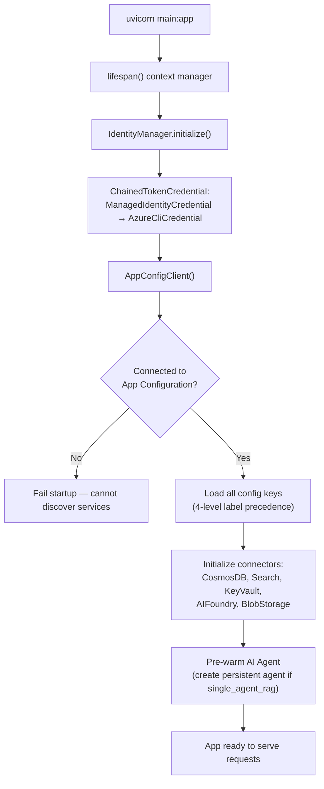
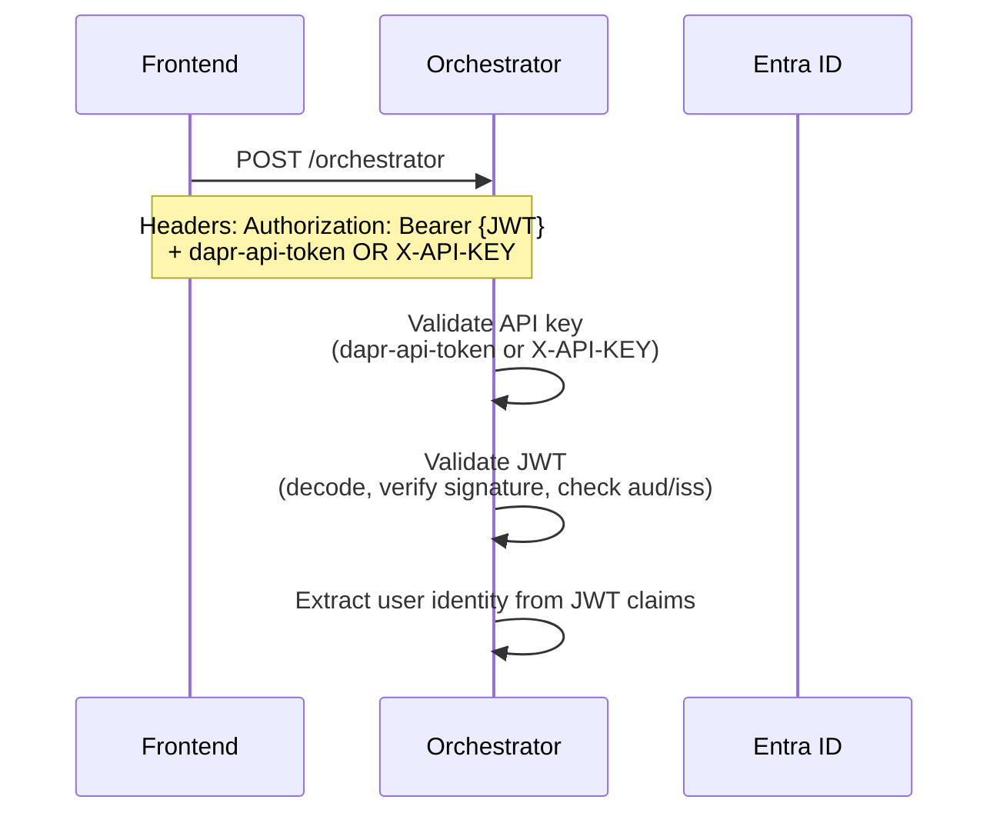
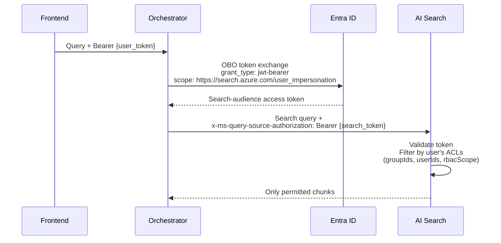
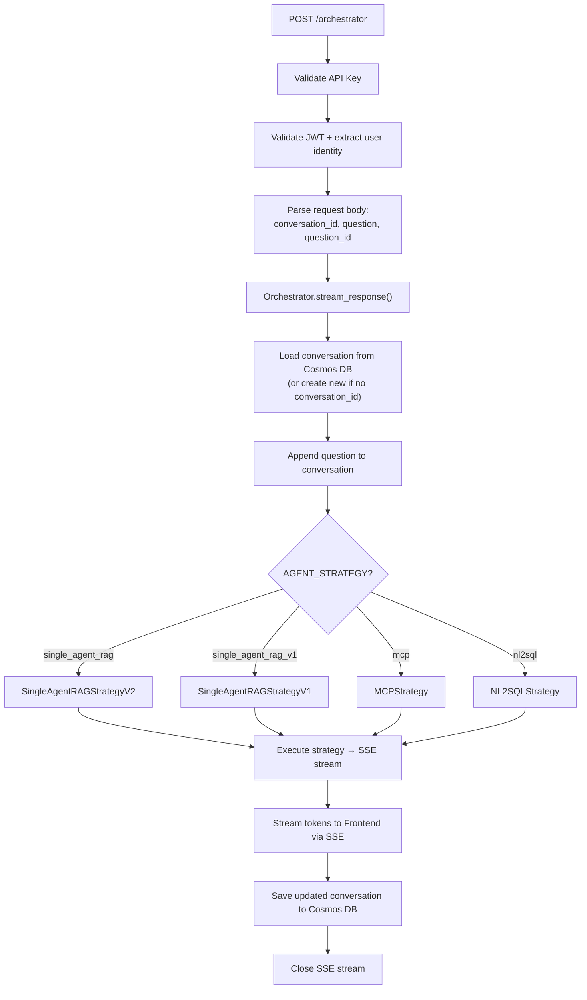
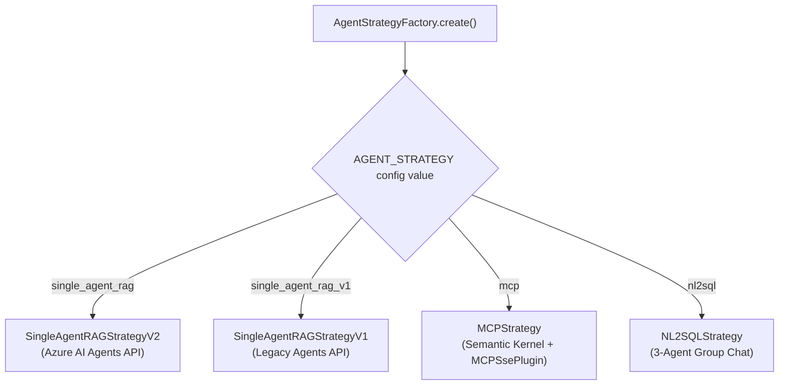
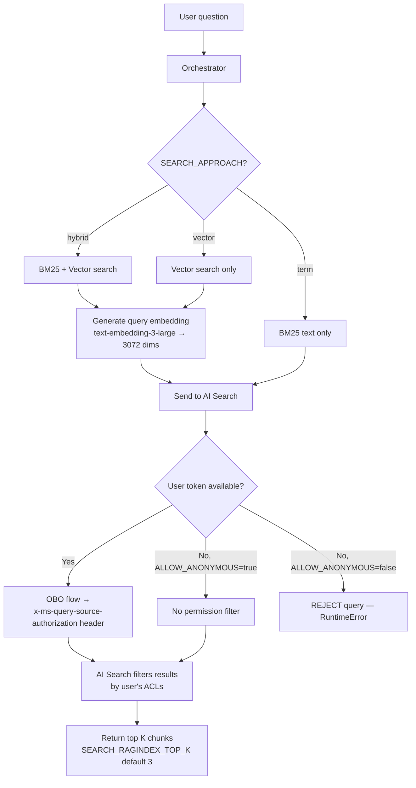
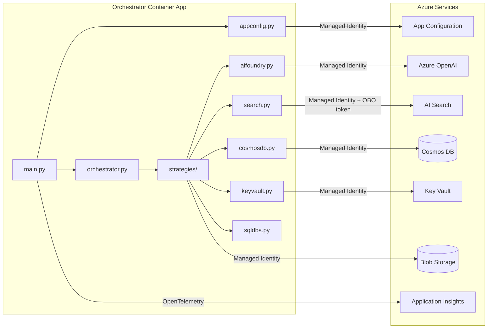

# Orchestrator App (gpt-rag-orchestrator)

> Everything about the GPT-RAG orchestrator: what the accelerator provisions, how it works internally, what you need to configure, and how to customize it.
> **Repository:** github.com/Azure/gpt-rag-orchestrator
> **Version:** 2.4.2

---

## 1. What the Accelerator Provisions

### 1.1 Container App

| Property | Value |
|----------|-------|
| **Service name** | `orchestrator` |
| **Canonical name** | `ORCHESTRATOR_APP` |
| **Ingress** | External (HTTPS, TLS enforced) |
| **Replicas** | min: 1, max: 1 |
| **Resources** | 0.5 vCPU, 1 GiB RAM |
| **Workload profile** | `main` (D4 SKU) |
| **Dapr** | Enabled (appId: `orchestrator`, port 80, HTTP) |
| **Target port** | 80 (mapped to 8080 internally by Uvicorn) |
| **Initial image** | `mcr.microsoft.com/azuredocs/containerapps-helloworld:latest` (replaced at `azd deploy`) |

### 1.2 Environment Variables Injected by Bicep

Every Container App (including Orchestrator) gets these three env vars at creation:

| Variable | Value | Purpose |
|----------|-------|---------|
| `APP_CONFIG_ENDPOINT` | `https://{appConfigName}.azconfig.io` | Discover all other services |
| `AZURE_TENANT_ID` | Subscription tenant ID | For `DefaultAzureCredential` |
| `AZURE_CLIENT_ID` | Orchestrator's UAI client ID | For `DefaultAzureCredential` |

All other configuration (model endpoints, search settings, agent strategy, feature flags) is read from **App Configuration** at runtime, not from environment variables.

### 1.3 Managed Identity

| Property | Value |
|----------|-------|
| **Identity name pattern** | `id-ca-{token}-orchestrator` |
| **Type** | User-assigned (UAI) |
| **Injected as** | `AZURE_CLIENT_ID` env var |

### 1.4 RBAC Roles (Bicep-assigned)

| RBAC Role | Purpose |
|-----------|---------|
| `AppConfigurationDataReader` | Read App Configuration keys at startup |
| `CognitiveServicesUser` | AI Foundry services access |
| `CognitiveServicesOpenAIUser` | OpenAI model calls (chat completions) |
| `CosmosDBBuiltInDataContributor` | Read/write conversations and prompts in Cosmos DB |
| `SearchIndexDataReader` | Query the AI Search index (read-only) |
| `StorageBlobDataReader` | Read document blobs from storage |
| `KeyVaultSecretsUser` | Read secrets (e.g. client secrets, API keys) |
| `AcrPull` | Pull container images from the Container Registry |

**What Orchestrator does NOT have:** No `SearchIndexDataContributor` (cannot write to the index), no `StorageBlobDataContributor` (cannot write blobs), no `StorageBlobDelegator` (cannot generate SAS tokens), no `StorageQueueDataContributor`. The Orchestrator has **read-only** access to the search index — only the Ingestion app can write to it.

---

## 2. Runtime Architecture

### 2.1 Technology Stack

| Property | Value |
|----------|-------|
| **Language** | Python 3.12 |
| **Framework** | FastAPI 0.115.12 + Uvicorn |
| **AI Framework** | Semantic Kernel 1.34.0 (with MCP support) |
| **Docker base** | `python:3.12-slim` (includes ODBC Driver 18 for SQL Server) |
| **Entry point** | `uvicorn main:app --host 0.0.0.0 --port 8080` |
| **Package manager** | pip |
| **Key deps** | `azure-ai-agents`, `azure-ai-projects`, `openai`, `tiktoken`, `pydantic`, `PyJWT`, `Jinja2`, `pyodbc`, `semantic-kernel` |

### 2.2 What Is Semantic Kernel?

Semantic Kernel is Microsoft's open-source SDK for building AI agents and integrating LLMs into applications. In the Orchestrator, it provides the agent runtime for the MCP and NL2SQL strategies — handling tool calling, plugin registration, multi-agent group chat, and MCP protocol integration. For the default Single Agent RAG strategy (v2), the Orchestrator uses the Azure AI Agents API directly instead of Semantic Kernel.

### 2.3 Module Structure

```
gpt-rag-orchestrator/src/
├── main.py                  # FastAPI app, POST /orchestrator (SSE streaming)
├── orchestration/
│   └── orchestrator.py      # Conversation lifecycle, Cosmos DB persistence
├── strategies/
│   ├── agent_strategy_factory.py   # Factory: selects strategy from AGENT_STRATEGY
│   ├── base_agent_strategy.py      # Abstract base: credentials, prompt loading
│   ├── single_agent_rag_strategy_v2.py  # Azure AI Agents API (default)
│   ├── single_agent_rag_strategy_v1.py  # Legacy implementation
│   ├── mcp_strategy.py             # Semantic Kernel + MCPSsePlugin
│   └── nl2sql_strategy.py          # 3-agent group: Triage → SQL → Synthesizer
├── connectors/
│   ├── appconfig.py         # App Configuration (4-level label precedence)
│   ├── aifoundry.py         # GenAI client (chat + embeddings)
│   ├── search.py            # Azure AI Search (hybrid/vector/BM25)
│   ├── cosmosdb.py          # Cosmos DB client (conversations, prompts)
│   ├── keyvault.py          # Key Vault secrets
│   ├── sqldbs.py            # SQL DB for NL2SQL (pyodbc)
│   └── identity_manager.py  # Singleton: ChainedTokenCredential
├── plugins/
│   ├── retrieval/plugin.py  # SK tool: vector/hybrid search
│   ├── nl2sql/plugin.py     # SK tools: GetAllTables, ExecuteQuery, etc.
│   └── common/plugin.py     # Shared utilities
└── prompts/
    ├── single_agent_rag/    # System prompts for default strategy
    ├── mcp/main.txt         # MCP strategy prompt
    └── nl2sql/              # triage_agent.txt, sqlquery_agent.txt, syntetizer_agent.txt
```

---

## 3. Startup Flow

The startup sequence uses FastAPI's lifespan hook to pre-warm all Azure clients before accepting requests:



**Key detail:** The lifespan hook pre-warms the Azure AI Agents API client, creating a persistent agent instance that is reused across requests. This avoids cold-start latency on the first user query. The identity manager is a singleton — one `ChainedTokenCredential` shared across all connectors.

### 3.1 Two Possible Startup Modes

| Mode | Condition | Behavior |
|------|-----------|----------|
| **Normal** | App Config connected, all connectors initialized | Full orchestrator ready |
| **Failed** | App Config unreachable or critical connector missing | Startup fails — container restarts |

Unlike the Frontend (which has graceful degradation modes), the Orchestrator fails hard if it cannot connect to App Configuration at startup. This is by design — the Orchestrator cannot serve any useful requests without its service registry.

---

## 4. Authentication

### 4.1 Dual Auth Model

The Orchestrator uses a **dual authentication** scheme: every incoming request must pass both checks.



### 4.2 API Key Validation

| Header | Source | Purpose |
|--------|--------|---------|
| `dapr-api-token` | Dapr sidecar shared secret | Service-to-service auth when Dapr is enabled |
| `X-API-KEY` | App Configuration (`ORCHESTRATOR_APP_APIKEY`) | Direct HTTP auth when Dapr is not used |

The API key ensures that only authorized callers (the Frontend, or Dapr sidecar) can invoke the Orchestrator. If `useCAppAPIKey=true` in the deployment config, both the Frontend and Orchestrator share a generated API key stored in App Configuration.

### 4.3 JWT Validation

The Orchestrator validates the user's Entra ID JWT token from the `Authorization: Bearer` header:

| Check | Detail |
|-------|--------|
| **Decode** | `PyJWT` decodes the token (RS256) |
| **Audience** | Must match the Entra app registration's client ID (`api://{client_id}`) |
| **Issuer** | Must be the expected Entra ID tenant |
| **Expiry** | Token must not be expired |
| **Claims extracted** | `oid` (user object ID), `upn` (user principal name), `groups` (group memberships) |

### 4.4 On-Behalf-Of (OBO) Token Exchange

The most critical auth mechanism is the OBO flow for document-level security:



**Why OBO matters:** The user's original token has the app registration as its audience (`api://{client_id}`). AI Search requires a token with its own audience (`https://search.azure.com`). The OBO flow exchanges one for the other while preserving the user's identity — so AI Search knows *which user* is querying and can filter results by their SharePoint permissions.

### 4.5 Anonymous Mode

| Config key | Default | Effect |
|------------|---------|--------|
| `ALLOW_ANONYMOUS` | `false` (recommended) | Skip JWT validation and OBO flow |

When anonymous mode is active, no permission filtering occurs at AI Search — all indexed documents are returned regardless of ACLs. **This should only be used for development/testing.**

**Fail-closed behavior:** When `ALLOW_ANONYMOUS=false` and no valid user token is present (or OBO fails), the Orchestrator raises a `RuntimeError` and returns an error to the Frontend. No search results are returned. This ensures users never see documents they shouldn't have access to.

### 4.6 Orchestrator Does NOT Use the Entra App Registration Directly

Unlike the Frontend (which uses the app registration for OAuth login) and Ingestion (which uses it for Graph API client credentials), the Orchestrator does **not** authenticate using the Entra app registration. It uses:

- **Managed identity** for all service-to-service calls (OpenAI, Cosmos DB, Key Vault, Blob Storage)
- **User's forwarded JWT** for the OBO flow to AI Search

The app registration's client ID is only used to validate the JWT audience claim.

---

## 5. Request Flow

### 5.1 Detailed Request Processing



### 5.2 Request Payload

**Incoming from Frontend:**
```json
{
    "conversation_id": "existing-uuid-or-empty",
    "question": "What is our leave policy?",
    "ask": "What is our leave policy?",
    "question_id": "message-uuid"
}
```

**Feedback payload (also sent to same endpoint):**
```json
{
    "type": "feedback",
    "conversation_id": "uuid",
    "question_id": "uuid",
    "is_positive": true,
    "stars_rating": 4,
    "feedback_text": "Great answer!"
}
```

### 5.3 SSE Response Format

The Orchestrator returns a `text/event-stream` response. The first chunk is the `conversation_id` (UUID), followed by streamed answer tokens, and terminated by a `TERMINATE` token:

```
data: a1b2c3d4-e5f6-7890-abcd-ef1234567890

data: Based on
data:  the company
data:  leave policy
data: ...
data: [doc1.pdf](documents/doc1.pdf)
data: TERMINATE
```

The Frontend extracts the conversation ID from the first chunk, streams tokens to the UI, resolves document references to SAS URLs, and stops when it encounters `TERMINATE`.

---

## 6. Agent Strategies

The Orchestrator implements a **strategy pattern** — a factory selects the active strategy based on the `AGENT_STRATEGY` value in App Configuration. You can switch strategies at runtime without redeploying.

### 6.1 Strategy Factory



### 6.2 Single Agent RAG (Default — v2)

| Property | Value |
|----------|-------|
| **Config value** | `single_agent_rag` |
| **API** | Azure AI Agents API (`azure-ai-agents` SDK) |
| **Agents** | 1 persistent agent (reused across requests) |
| **Tools** | Search plugin (hybrid/vector/BM25), optional Bing grounding |
| **Use case** | Standard RAG chatbot over SharePoint/blob documents |

**How it works:**
1. The lifespan hook creates a persistent AI Agent with the system prompt and search tool
2. On each request, the agent receives the user question + conversation history
3. The agent calls the search tool which executes hybrid search against AI Search
4. AI Search returns permission-filtered chunks (via OBO token)
5. The agent generates a grounded answer with citations
6. Response streams back to the Frontend via SSE

**Key implementation detail:** The agent is created once at startup and reused. Each conversation gets a new thread within the same agent. This means prompt changes require a container restart (or switch to `PROMPT_SOURCE=cosmos` for runtime editing).

### 6.3 Single Agent RAG (Legacy — v1)

| Property | Value |
|----------|-------|
| **Config value** | `single_agent_rag_v1` |
| **API** | Legacy Azure AI Agents (older SDK) |
| **Agents** | 1 |
| **Tools** | Search |
| **Use case** | Backward compatibility only |

Functionally identical to v2 but uses the older agents SDK. Maintained for environments that haven't upgraded.

### 6.4 MCP Strategy

| Property | Value |
|----------|-------|
| **Config value** | `mcp` |
| **API** | Semantic Kernel + MCPSsePlugin |
| **Agents** | 1 SK agent + remote MCP tools |
| **Tools** | Whatever the MCP server exposes |
| **Use case** | External tool integration (APIs, databases, custom tools) |

**How it works:**
1. Semantic Kernel creates an agent with the MCP prompt template
2. The agent connects to the MCP Server Container App via SSE transport
3. MCP tools (registered with `@mcp.tool()` on the server) are automatically discovered
4. The agent can call any registered MCP tool during reasoning
5. Default MCP server ships with demo tools (`add`, `wikipedia_search`) — you extend it

**Required config:**
- `AGENT_STRATEGY=mcp` in App Configuration
- `MCP_SERVER_URL=https://{mcp-container-app-url}/mcp` in App Configuration

### 6.5 NL2SQL Strategy

| Property | Value |
|----------|-------|
| **Config value** | `nl2sql` |
| **API** | Semantic Kernel Group Chat |
| **Agents** | 3 (Triage → SQL Query → Synthesizer) |
| **Tools** | `GetAllTables`, `ExecuteQuery`, `SearchTables`, `SearchQueries` |
| **Use case** | Natural language to SQL queries against databases |

**How it works:**
1. **Triage Agent** — Analyzes the user's question, determines if it's a SQL question or a document question. Routes accordingly.
2. **SQL Query Agent** — Searches the NL2SQL index for relevant tables and sample queries, constructs a SQL query, executes it against the configured SQL database (via pyodbc), returns results.
3. **Synthesizer Agent** — Takes the SQL results and formats a natural language answer for the user.

**Required config:**
- `AGENT_STRATEGY=nl2sql` in App Configuration
- SQL datasource documents in Cosmos DB `datasources` container (`sql_database`, `sql_endpoint`, or `semantic_model` types)
- NL2SQL indexes populated in AI Search (`nl2sql-tables`, `nl2sql-queries`)
- ODBC Driver 18 (pre-installed in the Docker image)

### 6.6 Strategy Comparison

| | Single Agent v2 | Single Agent v1 | MCP | NL2SQL |
|--|:-:|:-:|:-:|:-:|
| **API** | Azure AI Agents | Legacy Agents | Semantic Kernel | Semantic Kernel |
| **Agents** | 1 persistent | 1 | 1 + MCP tools | 3 (group chat) |
| **Tools** | Search, Bing | Search | Via MCP server | SQL, table/query search |
| **Prompt source** | File or Cosmos | File or Cosmos | File or Cosmos | File or Cosmos |
| **OBO search** | Yes | Yes | Depends on tools | No (SQL auth separate) |
| **Best for** | Standard RAG | Legacy compat | Tool extensibility | Database Q&A |

---

## 7. Search and Retrieval

### 7.1 Search Connector

The `connectors/search.py` module handles all communication with Azure AI Search:



### 7.2 Search Approaches

| Approach | Config Value | What Happens | When to Use |
|----------|-------------|--------------|-------------|
| **Hybrid** (default) | `SEARCH_APPROACH=hybrid` | BM25 keyword search combined with vector similarity via Reciprocal Rank Fusion (RRF) | Best accuracy — recommended for production |
| **Vector** | `SEARCH_APPROACH=vector` | Vector similarity only | Good for semantic understanding, may miss exact keyword matches |
| **Term** | `SEARCH_APPROACH=term` | BM25 keyword search only | Fastest, no embedding needed at query time |

### 7.3 Permission Trimming at Query Time

This is the most critical security mechanism in the entire pipeline:

1. User authenticates to Frontend via Entra ID → gets a JWT
2. Frontend forwards the JWT to the Orchestrator in the `Authorization` header
3. Orchestrator exchanges the user's JWT for a **Search-audience token** using OBO:
   - Calls `https://login.microsoftonline.com/{tenant}/oauth2/v2.0/token`
   - Grant type: `urn:ietf:params:oauth:grant-type:jwt-bearer`
   - Scope: `https://search.azure.com/user_impersonation`
4. The Search-audience token is sent as `x-ms-query-source-authorization: Bearer {token}` with the search request
5. AI Search validates the token and filters results — only returning chunks where the user's ID or groups match the `metadata_security_user_ids` / `metadata_security_group_ids` / `metadata_security_rbac_scope` fields

**Fail-closed:** No valid user token = no search results. This is intentional.

### 7.4 Search Configuration Keys

| Parameter | Config Key | Default | Impact |
|-----------|-----------|---------|--------|
| Top K results | `SEARCH_RAGINDEX_TOP_K` | **3** | Chunks returned to the LLM. More = more context but higher token cost |
| Search approach | `SEARCH_APPROACH` | `hybrid` | hybrid/vector/term |
| Use semantic ranking | `SEARCH_USE_SEMANTIC` | `false` | Enables L2 semantic reranking (improves quality, adds latency + cost) |
| Index name | `SEARCH_RAG_INDEX_NAME` | `ragindex` | Must match the provisioned index |
| Allow anonymous | `ALLOW_ANONYMOUS` | varies | If false, queries without user tokens are rejected |

---

## 8. Prompt System

### 8.1 Prompt Source Configuration

| PROMPT_SOURCE | Behavior | Default? |
|---------------|----------|----------|
| `file` | Reads from `prompts/{strategy_type}/{name}.txt` or `.jinja2` on disk | **Yes** (set by Bicep) |
| `cosmos` | Reads from the `prompts` Cosmos DB container — document ID format: `{strategy}_{prompt_name}` | No — opt-in |

### 8.2 File-Based Prompts (Default)

Prompts are stored as text files in the container image under `prompts/`:

```
prompts/
├── single_agent_rag/
│   ├── main.txt           # Primary system prompt
│   └── *.jinja2           # Dynamic prompts with variables
├── mcp/
│   └── main.txt           # MCP strategy prompt
└── nl2sql/
    ├── triage_agent.txt       # Routes questions to SQL or docs
    ├── sqlquery_agent.txt     # Generates and executes SQL
    └── syntetizer_agent.txt   # Formats SQL results as natural language
```

**Jinja2 templates:** Some prompts use Jinja2 syntax (`{{ variable_name }}`) for dynamic content injection at runtime. The `BaseAgentStrategy._read_prompt()` method renders templates with context variables like the current date, user info, and configuration values.

### 8.3 Cosmos DB Prompts (Optional)

When `PROMPT_SOURCE=cosmos`, prompts are read from the `prompts` container in Cosmos DB:

```json
{
  "id": "single_agent_rag_main",
  "content": "You are an AI assistant that helps users find information..."
}
```

Placeholders (`{{placeholder_name}}`) in prompts are resolved by looking up `placeholder_{name}` documents in the same container.

**Upload script:** The orchestrator repo includes `src/upload_prompts.py` to seed Cosmos with the file-based prompts — creating one document per file.

### 8.4 Prompt Customization Workflow

**For file-based prompts (default):**
1. Edit `.txt` or `.jinja2` files in `prompts/{strategy}/`
2. Rebuild and redeploy the container: `azd deploy orchestrator`

**For Cosmos-based prompts (runtime editing):**
1. Run `upload_prompts.py` to seed the `prompts` container initially
2. Set `PROMPT_SOURCE=cosmos` in App Configuration
3. Edit prompts directly in Cosmos DB Data Explorer or via API
4. Changes take effect on the next request — no redeployment needed

---

## 9. Conversation Persistence

### 9.1 Cosmos DB Conversations Container

The Orchestrator manages the full lifecycle of conversation documents in the `conversations` container:

| Operation | When | What |
|-----------|------|------|
| **Create** | First message with no `conversation_id` | New document with generated UUID |
| **Read** | Every subsequent message | Load conversation by ID |
| **Update** | After each response | Append question, update thread_id |
| **Feedback** | User clicks thumbs up/down | Append feedback object |

### 9.2 Conversation Document Schema

```json
{
  "id": "a1b2c3d4-e5f6-7890-abcd-ef1234567890",
  "questions": [
    {
      "question_id": "q-001",
      "text": "What is our leave policy?"
    }
  ],
  "thread_id": "thread_abc123...",
  "feedback": [
    {
      "question_id": "q-001",
      "rating": "positive",
      "stars_rating": 4,
      "comment": "Helpful answer"
    }
  ]
}
```

### 9.3 Thread Management

For the Single Agent RAG v2 strategy, the Orchestrator uses Azure AI Agents persistent threads:

- **First message:** Creates a new thread in the AI Agents service, stores `thread_id` in the Cosmos conversation document
- **Follow-up messages:** Reuses the existing `thread_id` for multi-turn conversation continuity
- **The agent itself is persistent** (created at startup), but threads are per-conversation

---

## 10. App Configuration Keys

The Orchestrator reads configuration from Azure App Configuration with the following label precedence (highest to lowest):

1. `orchestrator` — Orchestrator-specific overrides
2. `gpt-rag-orchestrator` — Orchestrator-specific (legacy label)
3. `gpt-rag` — Shared across all GPT-RAG apps
4. `<no label>` — Global defaults

### 10.1 Keys Used by the Orchestrator

**Core Settings:**

| Key | Type | Default | Purpose |
|-----|------|---------|---------|
| `AGENT_STRATEGY` | string | `single_agent_rag` | Which strategy to use |
| `PROMPT_SOURCE` | string | `file` | `file` or `cosmos` |
| `ALLOW_ANONYMOUS` | bool | `false` | Allow queries without user tokens |
| `ORCHESTRATOR_APP_APIKEY` | string | (generated) | API key for incoming requests |

**Search Settings:**

| Key | Type | Default | Purpose |
|-----|------|---------|---------|
| `SEARCH_RAG_INDEX_NAME` | string | `ragindex` | AI Search index name |
| `SEARCH_APPROACH` | string | `hybrid` | `hybrid`, `vector`, or `term` |
| `SEARCH_RAGINDEX_TOP_K` | int | `3` | Number of chunks to return |
| `SEARCH_USE_SEMANTIC` | bool | `false` | Enable semantic reranking |
| `ENABLE_AGENTIC_RETRIEVAL` | bool | varies | AI Search agentic retrieval |

**Model Settings:**

| Key | Type | Default | Purpose |
|-----|------|---------|---------|
| `CHAT_DEPLOYMENT_NAME` | string | `chat` | OpenAI chat model deployment name |
| `EMBEDDING_DEPLOYMENT_NAME` | string | `text-embedding` | Embedding model deployment (for query-time embeddings) |
| `TEMPERATURE` | float | (model default) | Chat completion temperature |
| `TOP_P` | float | (model default) | Chat completion nucleus sampling |

**Service Endpoints (populated by Bicep):**

| Key | Type | Purpose |
|-----|------|---------|
| `AI_FOUNDRY_ACCOUNT_ENDPOINT` | string | Azure OpenAI / AI Foundry endpoint |
| `COSMOS_DB_ENDPOINT` | string | Cosmos DB account URI |
| `SEARCH_SERVICE_QUERY_ENDPOINT` | string | AI Search endpoint |
| `KEY_VAULT_URI` | string | Key Vault URL |
| `STORAGE_BLOB_ENDPOINT` | string | Blob Storage endpoint |
| `APPLICATIONINSIGHTS_CONNECTION_STRING` | string | Application Insights telemetry |

**Dapr / Communication:**

| Key | Type | Default | Purpose |
|-----|------|---------|---------|
| `DAPR_API_TOKEN` | string | (none) | Dapr sidecar shared secret |
| `DAPR_HTTP_PORT` | string | `3500` | Dapr sidecar HTTP port |

**MCP Strategy (only when AGENT_STRATEGY=mcp):**

| Key              | Type   | Purpose                                                   |
| ---------------- | ------ | --------------------------------------------------------- |
| `MCP_SERVER_URL` | string | URL of the MCP Server Container App (`https://{url}/mcp`) |

**NL2SQL Strategy (only when AGENT_STRATEGY=nl2sql):**

| Key | Type | Purpose |
|-----|------|---------|
| `DATABASE_ACCOUNT_NAME` | string | Cosmos DB account for datasource configs |
| `DATABASE_NAME` | string | Cosmos DB database name |
| `DATASOURCES_DATABASE_CONTAINER` | string | Container name for SQL datasource configs |

**Logging:**

| Key | Type | Default | Purpose |
|-----|------|---------|---------|
| `LOG_LEVEL` | string | `Information` | Logging verbosity |
| `ENABLE_CONSOLE_LOGGING` | bool | `true` | Console log output |

---

## 11. Token Management

### 11.1 Context Window Management

The Orchestrator uses `tiktoken` to count tokens and manage the context window:

| Property | Value |
|----------|-------|
| **Encoding** | Model-specific BPE via tiktoken |
| **Max context** | 128K tokens (gpt-4o) |
| **Truncation** | Conversation history is truncated to fit within model limits |

### 11.2 Token Counting

Before sending the prompt + context + conversation history to the LLM, the Orchestrator:

1. Counts the system prompt tokens
2. Counts the retrieved search chunks tokens
3. Counts the conversation history tokens
4. If total exceeds the model limit, truncates conversation history (oldest messages first)
5. Ensures the user's current question is always included

### 11.3 Embedding at Query Time

For hybrid and vector search approaches, the Orchestrator generates an embedding of the user's question at query time using the same embedding model as ingestion (`text-embedding-3-large`, 3072 dimensions). This query embedding is sent to AI Search alongside the text query for vector similarity matching.

---

## 12. Telemetry and Observability

### 12.1 Application Insights Integration

| Component | Library |
|-----------|---------|
| Azure Monitor SDK | `azure-monitor-opentelemetry` |
| FastAPI instrumentation | via azure-monitor |
| OpenTelemetry | Distributed tracing across services |

**What's traced:**
- Every `/orchestrator` request (via OpenTelemetry spans)
- Span attributes: `conversation_id`, `question_id`, `user_id`, `strategy`
- All outgoing calls to AI Search, OpenAI, Cosmos DB (auto-instrumented)
- Custom resource labels: `SERVICE_NAME=gpt-rag-orchestrator`, node hostname

### 12.2 Structured Logging

Key log events emitted:

| Event | What it logs |
|-------|-------------|
| Strategy initialization | Which `AGENT_STRATEGY` was selected, agent created |
| Request received | conversation_id, question preview, user principal |
| Search execution | search approach, top_k, has_user_token, results count |
| OBO token exchange | success/failure, token audience |
| LLM call | model, token count (prompt + completion) |
| Response complete | conversation_id, chunk count, total tokens used |
| Error events | Strategy failures, auth failures, search failures |

---

## 13. Connections and Dependencies



| Service | How | Why |
|---------|-----|-----|
| App Configuration | Managed Identity (labels: `orchestrator` > `gpt-rag-orchestrator` > `gpt-rag` > none) | All runtime config, service discovery |
| Azure OpenAI | Managed Identity | Chat completions (gpt-4o / gpt-5-mini), query-time embeddings |
| AI Search | Managed Identity + user OBO token | Hybrid search with permission filtering |
| Cosmos DB | Managed Identity | Read/write conversations, read prompts, read datasource configs |
| Key Vault | Managed Identity | Read secrets (client secrets, API keys) |
| Blob Storage | Managed Identity | Read document blobs (for context enrichment) |
| Application Insights | Connection string from App Config | Traces, logs, metrics |
| MCP Server | HTTPS (when `AGENT_STRATEGY=mcp`) | Remote tool calling via MCP protocol |

**Important:** The Orchestrator has **no direct access** to SharePoint, Document Intelligence, or the Container Registry at runtime. It only reads pre-indexed data from AI Search and raw blobs from Storage.

---

## 14. What You Need to Configure After Deployment

### 14.1 Nothing Required for Basic RAG

The default deployment (`AGENT_STRATEGY=single_agent_rag`, `PROMPT_SOURCE=file`) works out of the box with no Orchestrator-specific configuration. The Bicep templates set all required values.

### 14.2 Recommended

| Key | Why |
|-----|-----|
| `ALLOW_ANONYMOUS=false` | Explicitly enforce document-level security in production |
| `SEARCH_RAGINDEX_TOP_K=5` | Consider increasing from 3 for more comprehensive answers |

### 14.3 Optional Customizations

| What | How |
|------|-----|
| Custom system prompt | Edit files in `prompts/single_agent_rag/` and redeploy, OR switch to `PROMPT_SOURCE=cosmos` for runtime editing |
| Switch agent strategy | Set `AGENT_STRATEGY` in App Config to `mcp` or `nl2sql` |
| Tune search | Adjust `SEARCH_APPROACH`, `SEARCH_RAGINDEX_TOP_K`, `SEARCH_USE_SEMANTIC` |
| Tune LLM | Adjust `TEMPERATURE`, `TOP_P` in App Config |
| Enable agentic retrieval | Set `ENABLE_AGENTIC_RETRIEVAL=true` (requires AI Search KB setup in postprovision) |
| Enable Bing grounding | Configure Bing API key in the agent tools |
| Use NL2SQL | Set `AGENT_STRATEGY=nl2sql`, populate datasource configs in Cosmos DB, create NL2SQL indexes |
| Use MCP tools | Set `AGENT_STRATEGY=mcp`, set `MCP_SERVER_URL`, customize MCP server with new tools |

---

## 15. Local Development

### 15.1 Prerequisites

| Requirement | Command |
|-------------|---------|
| Python 3.12 | `python --version` |
| Azure CLI logged in | `az login` |
| App Config endpoint | Set `APP_CONFIG_ENDPOINT` env var |
| ODBC Driver 18 | Required for NL2SQL strategy only |

### 15.2 Running Locally

```bash
# Install dependencies
cd components/gpt-rag-orchestrator
pip install -r requirements.txt

# Set minimum config
export APP_CONFIG_ENDPOINT="https://{your-appconfig}.azconfig.io"

# Option A: Anonymous mode (no auth needed)
export ALLOW_ANONYMOUS=true

# Option B: With auth (need Frontend sending real tokens)
# Set ORCHESTRATOR_APP_APIKEY to match Frontend config

# Run
cd src
uvicorn main:app --host 0.0.0.0 --port 8080
```

### 15.3 Without App Configuration

If `APP_CONFIG_ENDPOINT` is not set, you must provide all configuration as environment variables. Key variables needed:

```bash
export AI_FOUNDRY_ACCOUNT_ENDPOINT="https://{your-openai}.openai.azure.com/"
export CHAT_DEPLOYMENT_NAME="chat"
export EMBEDDING_DEPLOYMENT_NAME="text-embedding"
export SEARCH_SERVICE_QUERY_ENDPOINT="https://{your-search}.search.windows.net"
export SEARCH_RAG_INDEX_NAME="ragindex"
export DATABASE_ACCOUNT_NAME="cosmos-{token}"
export DATABASE_NAME="cosmosdb{token}"
export AGENT_STRATEGY="single_agent_rag"
export PROMPT_SOURCE="file"
```

### 15.4 Testing with curl

```bash
# Basic test (anonymous mode)
curl -X POST http://localhost:8080/orchestrator \
  -H "Content-Type: application/json" \
  -H "X-API-KEY: your-api-key" \
  -d '{"question": "What is our leave policy?", "conversation_id": ""}'
```

The response is an SSE stream — use `curl -N` for streaming output.

---

## 16. Deployment

### 16.1 Via azd (standard)

```bash
# From the gpt-rag root repo
azd deploy orchestrator
```

This builds the Docker image from the Dockerfile, pushes to ACR, and updates the Container App.

### 16.2 Docker Image

The Dockerfile:
1. Base: `python:3.12-slim`
2. Install ODBC Driver 18 (for NL2SQL SQL Server connectivity)
3. Copy `requirements.txt`, run `pip install`
4. Copy all app code
5. Expose port 8080
6. CMD: `uvicorn main:app --host 0.0.0.0 --port 8080`

**Note:** The Orchestrator uses a slimmer base image (`python:3.12-slim`) compared to the Frontend and Ingestion (`devcontainers/python:3.12-bookworm`), but adds ODBC drivers on top.

---

## 17. Dependency Versions (pinned)

| Package | Version |
|---------|---------|
| fastapi | 0.115.12 |
| uvicorn | (latest) |
| semantic-kernel | 1.34.0 |
| azure-ai-agents | (latest) |
| azure-ai-projects | (latest) |
| azure-identity | 1.21.0 |
| azure-appconfiguration | 1.7.1 |
| azure-cosmos | 4.5.1 |
| azure-storage-blob | 12.25.1 |
| azure-search-documents | (latest) |
| openai | (latest) |
| tiktoken | 0.8.0 |
| pydantic | (latest) |
| PyJWT | (latest) |
| Jinja2 | (latest) |
| pyodbc | (latest) |
| aiohttp | 3.13.3 |
| tenacity | (latest) |

---

## 18. Troubleshooting

| Symptom | Likely Cause | Fix |
|---------|-------------|-----|
| Container keeps restarting | App Configuration unreachable | Verify `APP_CONFIG_ENDPOINT`, check managed identity, verify `AppConfigurationDataReader` role |
| "orchestrator returned html placeholder" (at Frontend) | Orchestrator Container App not deployed yet | Run `azd deploy orchestrator` |
| Search returns zero results | OBO token exchange failing | Check Entra app registration has "Expose an API" with `user_impersonation` scope; verify `ALLOW_ANONYMOUS=false` and user is authenticated |
| Search returns zero results (anonymous mode) | No documents indexed | Run ingestion first; check `SEARCH_RAG_INDEX_NAME` matches the provisioned index |
| "Invalid API key" error | API key mismatch between Frontend and Orchestrator | Verify `ORCHESTRATOR_APP_APIKEY` matches in App Config |
| JWT validation fails | Token audience mismatch | Ensure Frontend OAuth scope is `api://{client_id}/user_impersonation`, not Graph scopes |
| OBO flow fails with AADSTS error | Missing admin consent or wrong scopes | Grant admin consent on the Entra app registration; verify `user_impersonation` scope exists |
| NL2SQL strategy fails to connect | ODBC Driver 18 not installed or SQL endpoint unreachable | Verify Docker image includes ODBC driver; check SQL datasource config in Cosmos DB `datasources` |
| MCP strategy can't reach MCP server | Wrong `MCP_SERVER_URL` or MCP server not deployed | Verify `MCP_SERVER_URL` in App Config; run `azd deploy mcp` |
| Slow first response | Cold start — agent/client initialization | Expected behavior; the lifespan hook pre-warms but first request may still take 5-10s |
| Token limit exceeded errors | Conversation too long | Increase model context window or clear conversation; tiktoken truncation should handle this automatically |
| Cosmos DB write failures | Missing `CosmosDBBuiltInDataContributor` role | Check managed identity RBAC assignment on Cosmos DB |

---

## 19. What the Implementation Team Should Focus On

1. **Prompt customization:** Edit system prompts in `prompts/single_agent_rag/` files for your organization's tone, persona, citation rules, and domain guardrails. Consider switching to `PROMPT_SOURCE=cosmos` if you want runtime editing without redeployment.
2. **Search tuning:** Start with defaults (`hybrid`, `TOP_K=3`) and adjust based on answer quality. Increase `TOP_K` to 5–10 if answers seem incomplete. Enable `SEARCH_USE_SEMANTIC=true` for better ranking (adds latency).
3. **Security verification:** Ensure `ALLOW_ANONYMOUS=false` in production. Verify OBO flow works end-to-end by testing with users who have different SharePoint permissions — they should see different search results.
4. **Strategy selection:** Start with `single_agent_rag` (default). Evaluate `mcp` if you need external tool integration, or `nl2sql` if you need database querying alongside document RAG.
5. **Monitoring:** Verify Application Insights connection string is set. Monitor token usage, search latency, and OBO success rates. Set up alerts for auth failures.
6. **Conversation cleanup:** The `conversations` container grows indefinitely. Plan a TTL policy or cleanup job for old conversations.
7. **Model selection:** The default `chat` deployment uses `gpt-5-mini`. Evaluate whether your use case needs a more capable model (gpt-4o) or a cheaper one.
